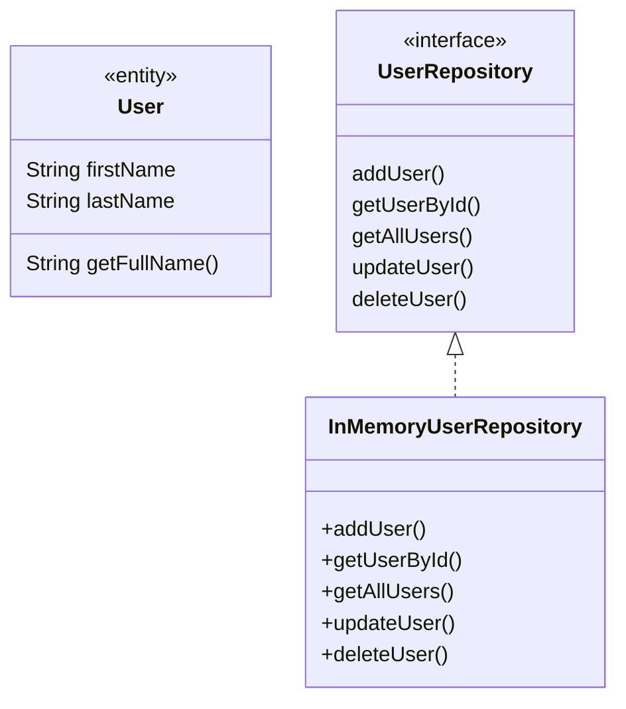

# Проектирование паттерна Repository для управления данными пользователей

## 1. Описание задачи
Спроектировать репозиторий для управления объектами User (CRUD-операции), изолируя слой работы с данными от бизнес-логики.

## 2. Общая архитектура
Паттерн Repository предназначен для абстрагирования доступа к данным, давая единую точку взаимодействия для бизнес-логики и закрывая детали хранения (БД, сеть, in-memory и т.д.).

## 3. Интерфейс репозитория пользователей
```dart
abstract class UserRepository {
  Future<void> addUser(User user);
  Future<User?> getUserById(String id);
  Future<List<User>> getAllUsers();
  Future<void> updateUser(String id, User user);
  Future<void> deleteUser(String id);
}
```

## 4. Пример in-memory реализации
```dart
class InMemoryUserRepository implements UserRepository {
  final Map<String, User> _users = {};

  @override
  Future<void> addUser(User user) async {
    // Для примера — id = user.firstName + user.lastName
    final id = user.firstName + user.lastName;
    _users[id] = user;
  }

  @override
  Future<User?> getUserById(String id) async => _users[id];

  @override
  Future<List<User>> getAllUsers() async => _users.values.toList();

  @override
  Future<void> updateUser(String id, User user) async { _users[id] = user; }

  @override
  Future<void> deleteUser(String id) async { _users.remove(id); }
}
```

## 5. Диаграмма классов (Mermaid)


## 6. Пример использования
```dart
final repository = InMemoryUserRepository();
await repository.addUser(User(firstName: 'Ivan', lastName: 'Ivanov'));
final users = await repository.getAllUsers();
print(users.map((u) => u.getFullName()));
```

## 7. Рекомендации по развитию
- Для хранения id пользователя рекомендуется добавить поле `id` в класс User.
- Реализовать дополнительные реализации UserRepository (REST, SQLite и пр.) при необходимости.
- Покрыть методы репозитория юнит-тестами.

---
**Этот документ фиксирует рекомендуемую архитектуру Repository для пользовательских данных в вашем проекте.**
