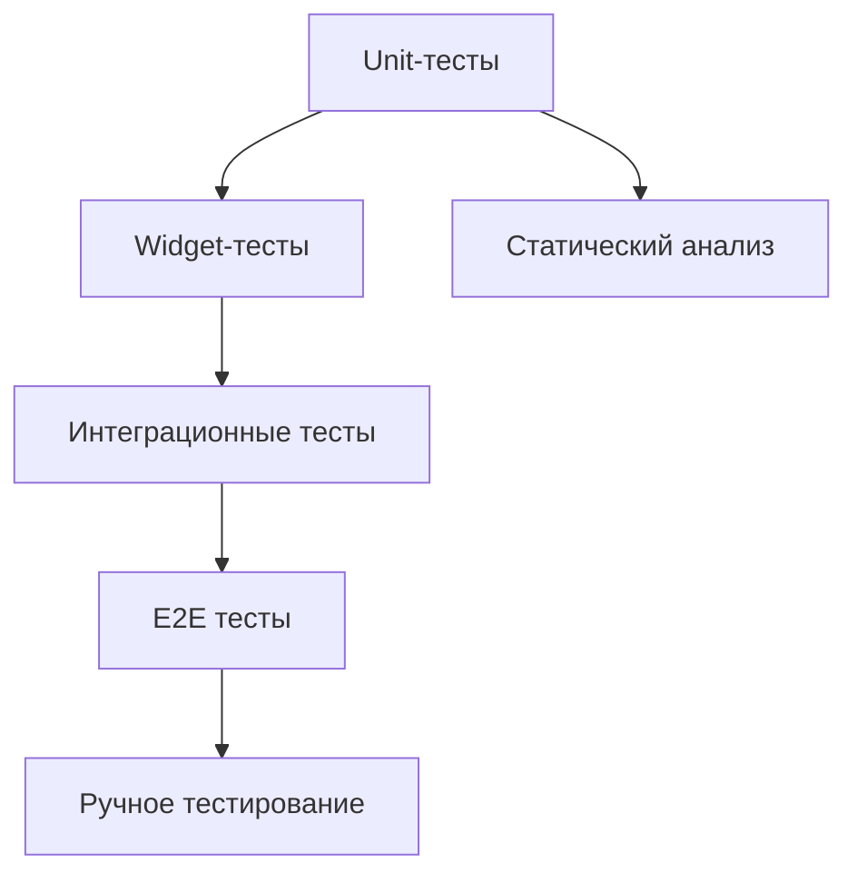

# Комплексная стратегия тестирования

Документ определяет стратегию тестирования для проекта на Flutter. Цель — обеспечить высокое качество, надежность и поддерживаемость кода посредством структурированного и комплексного подхода к тестированию.

---

## 1. Подход к тестированию

- Интеграция тестирования на всех этапах разработки
- Автоматизация большинства тестов
- Внедрение CI/CD для запуска тестов на каждом коммите/мерже
- Требование по покрытия кода тестами (рекомендуется ≥80%)

## 2. Типы тестирования

### 2.1 Unit-тестирование
- **Что тестировать:** Логика, отдельные функции, бизнес-правила в lib/
- **Инструменты:** `flutter_test`, `test`, `mockito`
- **Где располагать:** test/unit/
- **Практики:** Изоляция зависимостей, использование mock-объектов

### 2.2 Widget/компонентное тестирование
- **Что тестировать:** Внешний вид и поведение виджетов
- **Инструменты:** `flutter_test`, `golden_toolkit`
- **Где располагать:** test/widgets/
- **Практики:** Golden-тесты для внешнего вида, тестирование интеракций

### 2.3 Интеграционное тестирование
- **Что тестировать:** Взаимодействие между модулями, сервисами, сторонними API
- **Инструменты:** `integration_test`, `mockito`, эмуляторы и фейки
- **Где располагать:** test/integration/
- **Практики:** Использование реальных/эмулированных сред для проверки сценариев

### 2.4 End-to-End тестирование
- **Что тестировать:** Полные пользовательские сценарии от начала до конца
- **Инструменты:** `integration_test`, инструменты типа Appium, скрипты эмуляции поведения пользователя
- **Где располагать:** test/e2e/
- **Практики:** Максимально отражать реальные пользовательские сценарии

### 2.5 Статический анализ и покрытие
- **Что тестировать:** Соответствие синтаксису, стилю, отсутствие дефектов
- **Инструменты:** `dart analyze`, `flutter analyze`, `dart coverage`
- **Где запускать:** После каждого коммита и перед мержем
- **Практики:** Непрерывная поддержка высокого уровня покрытия и качества

### 2.6 Ручное тестирование (exploratory)
- **Что тестировать:** Аспекты, слабо покрываемые автотестами: UX, edge-case
- **Инструменты:** Чек-листы, сценарии воспроизведения багов
- **Где фиксировать:** В документации и баг-трекинге

---

## 3. Общая структура / организация тестов

- **test/unit/**: Unit-тесты
- **test/widgets/**: Widget-тесты
- **test/integration/**: Интеграционные тесты
- **test/e2e/**: E2E сценарии
- **test/**: Корневой — точка входа для тест-раннеров

## 4. Технологии и инструменты

- **Автотесты:** `flutter_test`, `test`, `integration_test`
- **Моки и фейки:** `mockito`, ручные реализации
- **Анализ качества:** `dart analyze`, Coverage Tools
- **CI/CD:** GitHub Actions, GitLab CI, другие

## 5. Внедрение в процесс

- Все тесты запускаются автоматически через CI/CD
- Любой новый код сопровождается тестами
- Проверка покрытия — обязательный этап Code Review
- Статический анализ — обязательный перед мержем в основную ветку

## 6. Best practices

- Писать независимые, быстрые, читаемые тесты
- Следить за актуальностью тестов и покрытием
- Документировать ручные сценарии и edge cases
- Использовать TDD/BDD подходы при возможности

---

## 7. Диаграмма типов тестов

---

## 8. Заключение

Стратегия предполагает комплексный, многослойный подход к тестированию. Каждый слой обеспечивает защиту от различных типов ошибок и гарантирует качество разработки.
