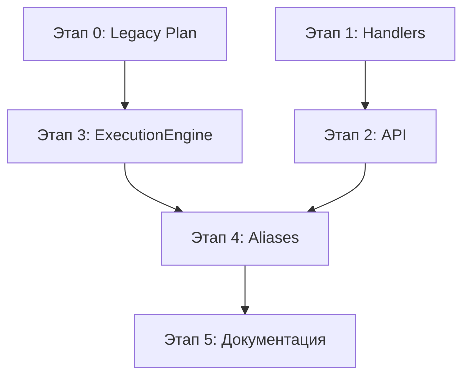

# Итоговый отчет: Анализ и план очистки Legacy кода в Agent Runtime

**Дата:** 2026-02-09  
**Статус:** ✅ Анализ завершен, готов к выполнению  
**Исполнитель:** Roo Code AI

---

## 🎯 Главный вывод

В agent-runtime **присутствует legacy код** в объеме **~5-7%** от кодовой базы. Найдено **43 упоминания** deprecated/legacy компонентов. Основной legacy код был удален ранее, но остались критические компоненты для обратной совместимости.

### 🔴 КРИТИЧЕСКОЕ ОТКРЫТИЕ: Legacy Plan Entity

Обнаружена **критическая legacy сущность**, которая блокирует полную очистку:

- **Legacy:** [`app/domain/entities/plan.py`](../codelab-ai-service/agent-runtime/app/domain/entities/plan.py) - 483 строки
- **New DDD:** [`app/domain/execution_context/entities/execution_plan.py`](../codelab-ai-service/agent-runtime/app/domain/execution_context/entities/execution_plan.py) - 391 строка
- **Использование:** 7 файлов, включая критические компоненты

Это **блокирует удаление ExecutionEngine** и требует приоритетной миграции.

---

## 📊 Статистика Legacy кода

### Найденные категории:

| Категория | Файлов | Критичность | Оценка времени |
|-----------|--------|-------------|----------------|
| **Legacy Plan Entity** | **8** | **🔴 Очень высокая** | **3-5 дней** |
| Global ApprovalManager | 6 | 🔴 Высокая | 2-3 дня |
| Legacy ExecutionEngine | 4 | 🔴 Высокая | 1-2 дня |
| Deprecated Aliases | 4 | ⚠️ Средняя | 1 день |
| Docstrings | 11 | 🟡 Низкая | 1 день |
| **ИТОГО** | **33** | - | **9-13 дней** |

### Распределение по приоритетам:

```
🔴 Критический:  18 файлов (55%)
⚠️ Высокий:       6 файлов (18%)
🟡 Средний:      11 файлов (27%)
```

---

## 🗂️ Созданные документы

### 1. [AGENT_RUNTIME_LEGACY_CODE_ANALYSIS.md](./AGENT_RUNTIME_LEGACY_CODE_ANALYSIS.md)
**Полный анализ legacy кода**

Содержит:
- 6 категорий legacy кода с примерами
- Статистику использования (43 упоминания)
- Историю миграции (коммит dc645e6)
- Текущую DDD архитектуру
- Риски и рекомендации

**Ключевые находки:**
- ✅ Основной legacy код удален
- ⚠️ Остались элементы совместимости
- 🔄 Активная миграция на DDD

### 2. [AGENT_RUNTIME_LEGACY_CLEANUP_EXECUTION_PLAN.md](./AGENT_RUNTIME_LEGACY_CLEANUP_EXECUTION_PLAN.md)
**Детальный план выполнения рефакторинга**

Содержит:
- 5 этапов с конкретными задачами
- Примеры кода для каждой миграции
- Команды для проверки
- Критерии успеха

**Режим работы:** Автоматический рефакторинг

### 3. [LEGACY_DEPENDENCIES_REPORT.md](./LEGACY_DEPENDENCIES_REPORT.md)
**Отчет о зависимостях с конкретными строками кода**

Содержит:
- 33 файла требующих изменений
- Конкретные строки для рефакторинга
- Оценка сложности миграции
- Порядок выполнения

**Детализация:** До уровня строк кода

---

## 🔴 Критические компоненты Legacy кода

### 1. Legacy Plan Entity (НОВОЕ!)

**Проблема:**
- Существует две версии: `Plan` (legacy) и `ExecutionPlan` (DDD)
- Legacy Plan используется в 7 критических файлах
- Блокирует удаление ExecutionEngine

**Использование:**
```python
# Legacy (УДАЛИТЬ):
from app.domain.entities.plan import Plan, Subtask, PlanStatus

# New DDD (ИСПОЛЬЗОВАТЬ):
from app.domain.execution_context.entities.execution_plan import ExecutionPlan
from app.domain.execution_context.entities.subtask import Subtask
from app.domain.execution_context.value_objects import PlanStatus
```

**Файлы для миграции:**
1. `architect_agent.py` - создает планы
2. `execution_coordinator.py` - координирует выполнение
3. `process_tool_result_use_case.py` - обрабатывает результаты
4. `plan_mapper.py` - persistence mapper
5. `execution_engine.py` - legacy engine (удалить)
6. `dependency_resolver.py` - разрешает зависимости
7. `subtask_executor.py` - выполняет подзадачи

**Оценка:** 3-5 дней, риск очень высокий

### 2. Global ApprovalManager Singleton

**Проблема:**
- Глобальный singleton нарушает DI
- Управляет собственными DB сессиями
- Используется в 6 файлах

**Использование:**
```python
# Legacy (УДАЛИТЬ):
from app.domain.services.approval_management import approval_manager
await approval_manager.create_approval(...)

# New DDD (ИСПОЛЬЗОВАТЬ):
@inject
async def handler(
    approval_manager: ApprovalManager = Provide[Container.approval_manager]
):
    await approval_manager.create_approval(...)
```

**Файлы для миграции:**
1. `stream_llm_response_handler.py`
2. `tool_result_handler.py`
3. `plan_approval_handler.py`
4. `hitl_decision_handler.py`
5. `sessions_router.py`
6. `orchestrator_agent.py`

**Оценка:** 2-3 дня, риск высокий

### 3. Legacy ExecutionEngine

**Проблема:**
- Старый execution engine без DDD
- Зависит от Legacy Plan
- Должен быть заменен на PlanExecutionService

**Использование:**
```python
# Legacy (УДАЛИТЬ):
from app.domain.services.execution_engine import ExecutionEngine
await execution_engine.execute_plan(plan_id)

# New DDD (ИСПОЛЬЗОВАТЬ):
from app.domain.execution_context.services.plan_execution_service import PlanExecutionService
context = ExecutionContext(...)
await plan_execution_service.execute_plan(plan_id, context)
```

**Файлы для миграции:**
1. `execution_module.py` - DI provider
2. `domain/services/__init__.py` - экспорт
3. `orchestrator_agent.py` - использование ExecutionResult
4. `execution_engine.py` - **УДАЛИТЬ ФАЙЛ**

**Оценка:** 1-2 дня, риск средний (зависит от миграции Plan)

---

## 📋 Обновленный план миграции

### Этап 0: Legacy Plan Entity (3-5 дней) 🔴 **КРИТИЧЕСКИЙ!**

**Новый этап, добавленный после анализа**

1. Создать `ExecutionPlanMapper` для persistence
2. Обновить `plan_mapper.py` на использование `ExecutionPlan`
3. Мигрировать `dependency_resolver.py`
4. Мигрировать `subtask_executor.py`
5. Обновить `execution_coordinator.py`
6. Обновить `process_tool_result_use_case.py`
7. Мигрировать `architect_agent.py` (критический!)
8. **УДАЛИТЬ** `app/domain/entities/plan.py`

**Блокирует:** Этап 3 (ExecutionEngine)

### Этап 1: Handlers на DI (2-3 дня) 🔴

1. Мигрировать `stream_llm_response_handler.py`
2. Мигрировать `tool_result_handler.py`
3. Мигрировать `plan_approval_handler.py`
4. Мигрировать `hitl_decision_handler.py`

### Этап 2: API и агенты (1 день) ⚠️

1. Обновить `sessions_router.py`
2. Обновить `orchestrator_agent.py`

### Этап 3: ExecutionEngine (1-2 дня) 🔴

**Зависит от:** Этап 0 (Legacy Plan)

1. Обновить `execution_module.py`
2. Удалить импорт из `domain/services/__init__.py`
3. Заменить `ExecutionResult` в `orchestrator_agent.py`
4. **УДАЛИТЬ** `execution_engine.py`

### Этап 4: Aliases (1 день) 🟡

1. Обновить `main.py`
2. Удалить алиасы из `infrastructure/persistence/repositories/__init__.py`
3. Удалить алиасы из `domain/repositories/__init__.py`
4. Удалить `__getattr__` из `domain/entities/__init__.py`

### Этап 5: Документация (1 день) 📝

1. Обновить docstrings в агентах
2. Проверить DTO и mappers
3. Создать Migration Guide
4. Обновить CHANGELOG

---

## ⚠️ Критические зависимости



**Ключевые зависимости:**
- **Этап 0 блокирует Этап 3** - нельзя удалить ExecutionEngine без миграции Plan
- Этапы 1-2 можно выполнять параллельно с Этапом 0
- Этап 4 требует завершения всех предыдущих

---

## 🎯 Метрики успеха

### Количественные:
- ✅ **0** использований `from app.domain.entities.plan import Plan`
- ✅ **0** использований global `approval_manager`
- ✅ **0** использований `ExecutionEngine`
- ✅ **0** deprecated aliases
- ✅ **>80%** покрытие тестами
- ✅ **<5** упоминаний legacy (только необходимые)

### Качественные:
- ✅ 100% DDD compliance
- ✅ Все зависимости через DI
- ✅ Чистая архитектура
- ✅ Актуальная документация
- ✅ Migration guide создан

---

## 🚨 Риски

### Риск 1: Поломка критических компонентов
**Вероятность:** Высокая  
**Влияние:** Критическое

**Компоненты:**
- Architect Agent (создание планов)
- Plan Execution (выполнение задач)
- HITL workflow (human-in-the-loop)

**Митигация:**
- Тщательное тестирование после каждого изменения
- Feature branch для всех изменений
- Постепенный rollout
- Возможность быстрого rollback

### Риск 2: Несовместимость API Legacy Plan и ExecutionPlan
**Вероятность:** Средняя  
**Влияние:** Высокое

**Проблема:**
- Разные методы и свойства
- Разные value objects
- Разная бизнес-логика

**Митигация:**
- Создать адаптер для переходного периода
- Детальное сравнение API
- Обновить все использования одновременно

### Риск 3: Пропущенные зависимости
**Вероятность:** Средняя  
**Влияние:** Среднее

**Митигация:**
- Автоматический поиск через grep
- Статический анализ кода
- Проверка всех импортов
- Запуск тестов после каждого этапа

---

## 📈 Обновленная оценка времени

| Этап | Файлов | Дней | Риск | Блокирует |
|------|--------|------|------|-----------|
| **0. Legacy Plan** | **8** | **3-5** | **🔴 Очень высокий** | **Этап 3** |
| 1. Handlers | 4 | 2-3 | 🔴 Высокий | - |
| 2. API и агенты | 2 | 1 | ⚠️ Средний | - |
| 3. ExecutionEngine | 4 | 1-2 | ⚠️ Средний | Этап 4 |
| 4. Aliases | 4 | 1 | 🟡 Низкий | Этап 5 |
| 5. Документация | 11 | 1 | 🟢 Минимальный | - |
| **ИТОГО** | **33** | **9-13** | - | - |

**Критический путь:** Этап 0 → Этап 3 → Этап 4 → Этап 5 = **6-9 дней**

**Параллельно:** Этапы 1-2 можно выполнять одновременно с Этапом 0

---

## ✅ Что сохраняется (не legacy)

### 1. Legacy Database Fields
**Файл:** `app/infrastructure/persistence/models/hitl.py`

```python
# Сохраняются для API backward compatibility:
call_id: Mapped[Optional[str]]      # Legacy tool call ID
tool_name: Mapped[Optional[str]]    # Legacy tool name
arguments: Mapped[Optional[dict]]   # Legacy arguments
```

**Причина:** API совместимость с клиентами

### 2. Legacy OpenAI Parser
**Файл:** `app/infrastructure/llm/tool_parser.py`

```python
def _parse_function_call(self, fc: Any) -> Optional[ToolCall]:
    """Parse legacy function_call format"""
```

**Причина:** Совместимость с разными версиями LLM API

---

## 🚀 Следующие шаги

### Немедленно:
1. 🔴 **Начать Этап 0** - миграция Legacy Plan (критический блокер)
2. 🔄 **Параллельно Этап 1** - миграция handlers на DI
3. ✅ **Подготовить тесты** - для каждого этапа

### После завершения:
1. **Code Review** - детальный review всех изменений
2. **Staging Deployment** - тестирование в staging
3. **Performance Testing** - проверка производительности
4. **Production Deployment** - постепенный rollout
5. **Monitoring** - мониторинг метрик
6. **Retrospective** - анализ процесса

---

## 📚 Ссылки на документы

### Созданные отчеты:
- [AGENT_RUNTIME_LEGACY_CODE_ANALYSIS.md](./AGENT_RUNTIME_LEGACY_CODE_ANALYSIS.md) - Полный анализ
- [AGENT_RUNTIME_LEGACY_CLEANUP_EXECUTION_PLAN.md](./AGENT_RUNTIME_LEGACY_CLEANUP_EXECUTION_PLAN.md) - План выполнения
- [LEGACY_DEPENDENCIES_REPORT.md](./LEGACY_DEPENDENCIES_REPORT.md) - Детальные зависимости

### Ключевые файлы для миграции:
- [`app/domain/entities/plan.py`](../codelab-ai-service/agent-runtime/app/domain/entities/plan.py) - **УДАЛИТЬ**
- [`app/domain/execution_context/entities/execution_plan.py`](../codelab-ai-service/agent-runtime/app/domain/execution_context/entities/execution_plan.py) - Использовать
- [`app/domain/services/execution_engine.py`](../codelab-ai-service/agent-runtime/app/domain/services/execution_engine.py) - **УДАЛИТЬ**
- [`app/domain/services/approval_management.py`](../codelab-ai-service/agent-runtime/app/domain/services/approval_management.py) - Удалить singleton

---

## 🎓 Выводы

### Главные находки:

1. **Legacy Plan Entity** - критический блокер, требует немедленной миграции
2. **Global ApprovalManager** - нарушает DI, используется в 6 файлах
3. **Legacy ExecutionEngine** - зависит от Legacy Plan, требует координированной миграции
4. **Deprecated Aliases** - низкий риск, можно мигрировать постепенно

### Рекомендации:

1. **Приоритет 1:** Начать с Этапа 0 (Legacy Plan) - это критический блокер
2. **Параллельно:** Выполнять Этап 1 (Handlers) для ускорения
3. **Тестирование:** После каждого файла запускать тесты
4. **Документация:** Обновлять по мере миграции

### Оценка:

- **Общее время:** 9-13 дней
- **Критический путь:** 6-9 дней
- **Файлов к изменению:** 33
- **Риск:** Высокий (критические компоненты)
- **Готовность:** ✅ План готов к выполнению

---

**Автор:** Roo Code AI  
**Дата:** 2026-02-09  
**Версия:** 1.0  
**Статус:** ✅ Анализ завершен, готов к выполнению
