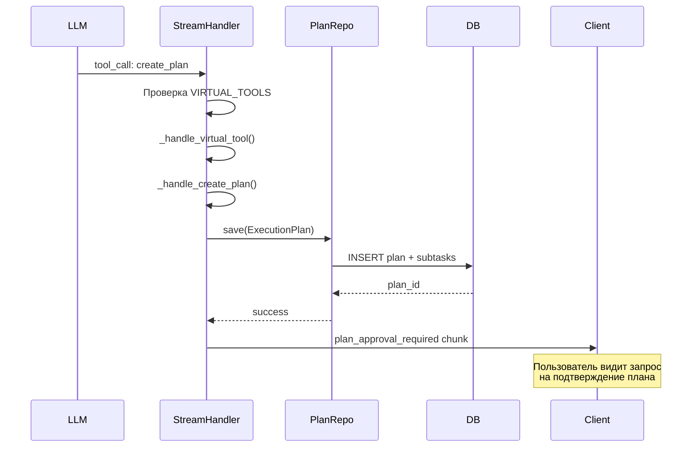

# Agent Runtime: Реализация виртуальных инструментов

**Дата:** 2026-02-09  
**Статус:** ✅ Реализовано и готово к тестированию  
**Связанный анализ:** [`AGENT_RUNTIME_FLOW_PLANNING_ANALYSIS.md`](AGENT_RUNTIME_FLOW_PLANNING_ANALYSIS.md:1)

---

## 🎯 Проблема

### Исходная проблема
Architect agent не мог создать план выполнения из-за отсутствия виртуальных инструментов в ToolRegistry:

```
WARNING - Requested unknown tools: ['attempt_completion', 'ask_followup_question']
Available tools: ['calculator', 'create_directory', 'echo', 'execute_command', 
                 'list_files', 'read_file', 'search_in_code', 'switch_mode', 'write_file']
```

### Регрессия после рефакторинга
До рефакторинга `create_plan` вызывался LLM, после рефакторинга перестал работать:
- `create_plan` был намеренно исключен из `allowed_tools` (Option 2)
- Виртуальные инструменты не были зарегистрированы в ToolRegistry
- Отсутствовала обработка виртуальных инструментов в StreamLLMResponseHandler

---

## ✅ Реализованное решение

### 1. Регистрация виртуальных инструментов

**Файл:** [`tool_registry.py`](../codelab-ai-service/agent-runtime/app/domain/services/tool_registry.py:339)

Добавлены 3 виртуальных инструмента с полными спецификациями:

```python
# Virtual tools that are handled specially in agent-runtime
VIRTUAL_TOOLS = {
    "attempt_completion",
    "ask_followup_question",
    "create_plan"
}

# Спецификации добавлены в TOOLS_SPEC
```

**Метод проверки:**
```python
def is_virtual_tool(self, tool_name: str) -> bool:
    """Проверить, является ли инструмент виртуальным."""
    return tool_name in VIRTUAL_TOOLS
```

### 2. Включение create_plan для architect

**Файл:** [`architect_agent.py`](../codelab-ai-service/agent-runtime/app/agents/architect_agent.py:58)

```python
allowed_tools=[
    "read_file",
    "write_file",
    "list_files",
    "search_in_code",
    "attempt_completion",
    "ask_followup_question",
    "create_plan"  # ← Добавлен обратно
],
```

### 3. Обработка виртуальных инструментов

**Файл:** [`stream_llm_response_handler.py`](../codelab-ai-service/agent-runtime/app/application/handlers/stream_llm_response_handler.py:271)

#### Проверка в `_handle_tool_call()`:
```python
from app.domain.services.tool_registry import VIRTUAL_TOOLS
if tool_call.tool_name in VIRTUAL_TOOLS:
    logger.info(f"Virtual tool detected: {tool_call.tool_name} - handling internally")
    return await self._handle_virtual_tool(...)
```

#### Метод `_handle_virtual_tool()`:
- Публикует события
- Сохраняет assistant message с tool_call
- Вызывает специализированный обработчик
- Сохраняет tool result
- Возвращает специальный StreamChunk

#### Обработчик `_handle_create_plan()`:
```python
async def _handle_create_plan(...) -> str:
    # 1. Извлекаем параметры из tool_call
    title = tool_call.arguments.get("title", "Execution Plan")
    description = tool_call.arguments.get("description", "")
    subtasks = tool_call.arguments.get("subtasks", [])
    
    # 2. Создаем ExecutionPlan entity (новая DDD сущность)
    from app.domain.execution_context.entities import ExecutionPlan, Subtask
    from app.domain.execution_context.value_objects import PlanId, SubtaskId
    from app.domain.session_context.value_objects import ConversationId
    from app.domain.agent_context.value_objects import AgentId
    
    plan_repository = ExecutionPlanRepositoryImpl(self._db)
    
    plan = ExecutionPlan(
        id=PlanId(str(uuid.uuid4())),
        conversation_id=ConversationId(session_id),
        goal=f"{title}\n\n{description}" if description else title,
        metadata={"created_by": "architect", "title": title, "description": description}
    )
    
    # 3. Создаем subtasks с зависимостями
    subtask_ids = [str(uuid.uuid4()) for _ in subtasks]
    for i, subtask_data in enumerate(subtasks):
        dep_ids = [SubtaskId(subtask_ids[idx]) for idx in dep_indices if ...]
        agent_id = AgentId(value=subtask_data["agent"])
        
        subtask = Subtask(
            id=SubtaskId(subtask_ids[i]),
            description=subtask_data.get("description", ...),
            agent_id=agent_id,
            dependencies=dep_ids,
            estimated_time=f"{subtask_data.get('estimated_time_minutes', 5)} min",
            metadata={...}
        )
        plan.add_subtask(subtask)
    
    # 4. Сохраняем в БД (статус DRAFT)
    await plan_repository.save(plan, commit=True)
    
    # 5. Возвращаем информацию о плане
    return json.dumps({
        "status": "plan_created",
        "plan_id": plan.id.value,
        "title": title,
        "description": description,
        "subtasks_count": len(subtasks),
        "requires_approval": True
    })
```

### 4. Правильные типы StreamChunk

**Файл:** [`stream_llm_response_handler.py`](../codelab-ai-service/agent-runtime/app/application/handlers/stream_llm_response_handler.py:543)

```python
if tool_call.tool_name == "create_plan":
    result_data = json.loads(result)
    
    if "error" in result_data:
        return StreamChunk(type="assistant_message", content=f"Failed: {error}")
    
    # Возвращаем plan_approval_required для запроса подтверждения
    return StreamChunk(
        type="plan_approval_required",
        plan_id=result_data.get("plan_id"),
        plan_summary={
            "title": result_data.get("title"),
            "description": result_data.get("description"),
            "subtasks_count": result_data.get("subtasks_count")
        },
        metadata={"requires_approval": True},
        is_final=True
    )
```

---

## 📊 Архитектурные решения

### Категории инструментов

1. **Локальные (3):** echo, calculator, switch_mode
   - Выполняются в agent-runtime
   - Реализованы в `LOCAL_TOOLS`

2. **IDE-side (6):** read_file, write_file, list_files, create_directory, execute_command, search_in_code
   - Отправляются на клиент (IDE) для выполнения
   - Возвращают `tool_call` chunk

3. **Виртуальные (3):** attempt_completion, ask_followup_question, create_plan
   - Обрабатываются внутри agent-runtime
   - НЕ отправляются на клиент
   - Возвращают специальные chunk типы

### Поток обработки create_plan



---

## 🧪 Тестирование

### Проверка регистрации инструментов

```bash
cd codelab-ai-service/agent-runtime
uv run python -c "
from app.domain.services.tool_registry import ToolRegistry, VIRTUAL_TOOLS

registry = ToolRegistry()
print(f'Total tools: {len(registry.get_all_tools())}')
print(f'Virtual tools: {VIRTUAL_TOOLS}')

for vt in VIRTUAL_TOOLS:
    spec = registry.get_tool_spec(vt)
    print(f'✅ {vt}: {\"registered\" if spec else \"NOT FOUND\"}')
"
```

**Ожидаемый результат:**
```
Total tools: 12
Virtual tools: {'ask_followup_question', 'attempt_completion', 'create_plan'}
✅ ask_followup_question: registered
✅ attempt_completion: registered
✅ create_plan: registered
```

### Проверка в Docker logs

После запуска flow planning в CodeLab IDE:

```bash
docker logs codelab-ai-service-agent-runtime-1 --tail=200 --since 5m | grep -E "(create_plan|Virtual tool|Plan.*created)"
```

**Ожидаемые логи:**
```
✅ Filtered tools: 7/12 (allowed: [...'create_plan'])
✅ Tool call detected: create_plan
✅ Virtual tool detected: create_plan - handling internally
✅ Handling virtual tool: create_plan in session
✅ Virtual tool call persisted: create_plan
✅ Creating execution plan for session
✅ Plan {uuid} created successfully with N subtasks
✅ Virtual tool result persisted: create_plan
```

---

## 📝 Изменения в файлах

### Измененные файлы

1. **[`tool_registry.py`](../codelab-ai-service/agent-runtime/app/domain/services/tool_registry.py:1)**
   - +150 строк: спецификации виртуальных инструментов
   - +10 строк: набор VIRTUAL_TOOLS
   - +15 строк: метод is_virtual_tool()

2. **[`architect_agent.py`](../codelab-ai-service/agent-runtime/app/agents/architect_agent.py:58)**
   - +1 строка: добавлен "create_plan" в allowed_tools
   - -2 строки: удален комментарий "No create_plan tool for Option 2"

3. **[`stream_llm_response_handler.py`](../codelab-ai-service/agent-runtime/app/application/handlers/stream_llm_response_handler.py:271)**
   - +1 строка: import uuid
   - +10 строк: проверка виртуальных инструментов
   - +120 строк: метод _handle_virtual_tool()
   - +90 строк: метод _handle_create_plan()
   - +15 строк: метод _handle_attempt_completion()
   - +15 строк: метод _handle_ask_followup_question()
   - +40 строк: возврат специальных StreamChunk

**Всего:** ~450 строк кода

---

## 🎯 Результаты

### До исправления
```
❌ ToolRegistry: 9 инструментов
❌ create_plan не в allowed_tools
❌ WARNING: Requested unknown tools
❌ LLM не может вызвать create_plan
❌ План не создается в БД
❌ Пользователь не получает запрос approval
```

### После исправления
```
✅ ToolRegistry: 12 инструментов (3 виртуальных)
✅ create_plan в allowed_tools architect
✅ Нет WARNING о неизвестных инструментах
✅ LLM вызывает create_plan
✅ План создается в БД через ExecutionPlan
✅ Пользователь получает plan_approval_required chunk
```

---

## 🔍 Следующие шаги

### Тестирование
1. Запустить CodeLab IDE
2. Создать новую сессию
3. Отправить задачу: "Создай Flutter приложение компас"
4. Проверить логи agent-runtime
5. Убедиться, что:
   - LLM вызывает create_plan
   - План создается в БД
   - Пользователь получает запрос на подтверждение
   - План содержит subtasks с зависимостями

### Возможные проблемы
1. **Ошибка создания ExecutionPlan** - проверить value objects (PlanId, SubtaskId, ConversationId, AgentId)
2. **Ошибка сохранения в БД** - проверить ExecutionPlanMapper
3. **Chunk не доходит до клиента** - проверить gateway обработку plan_approval_required

---

## 📚 Документация

### Использование виртуальных инструментов

#### attempt_completion
```python
# LLM вызывает:
{
    "tool_name": "attempt_completion",
    "arguments": {
        "result": "Task completed successfully"
    }
}

# Возвращается:
StreamChunk(
    type="assistant_message",
    content="Task completed successfully",
    is_final=True
)
```

#### ask_followup_question
```python
# LLM вызывает:
{
    "tool_name": "ask_followup_question",
    "arguments": {
        "question": "What color scheme do you prefer?",
        "suggestions": ["Blue", "Green", "Red", "Custom"]
    }
}

# Возвращается:
StreamChunk(
    type="assistant_message",
    content="What color scheme do you prefer?",
    metadata={"suggestions": ["Blue", "Green", "Red", "Custom"]},
    is_final=True
)
```

#### create_plan
```python
# LLM вызывает:
{
    "tool_name": "create_plan",
    "arguments": {
        "title": "Flutter Compass App",
        "description": "Create a compass application",
        "subtasks": [
            {
                "title": "Initialize project",
                "description": "Create Flutter project structure",
                "agent": "coder",
                "estimated_time_minutes": 3,
                "dependencies": []
            },
            {
                "title": "Add dependencies",
                "description": "Add required packages",
                "agent": "coder",
                "estimated_time_minutes": 2,
                "dependencies": [0]
            }
        ]
    }
}

# Создается в БД:
ExecutionPlan(
    id=PlanId("uuid"),
    conversation_id=ConversationId(session_id),
    goal="Flutter Compass App\n\nCreate a compass application",
    subtasks=[Subtask(...), Subtask(...)],
    status=DRAFT
)

# Возвращается:
StreamChunk(
    type="plan_approval_required",
    plan_id="uuid",
    plan_summary={
        "title": "Flutter Compass App",
        "description": "Create a compass application",
        "subtasks_count": 2
    },
    metadata={"requires_approval": True},
    is_final=True
)
```

---

## 🏗️ Архитектура

### Слои обработки

```
┌─────────────────────────────────────────────────────────┐
│ LLM Layer                                               │
│ - Получает виртуальные инструменты в tools              │
│ - Вызывает create_plan, attempt_completion, etc.       │
└─────────────────────────────────────────────────────────┘
                          ↓
┌─────────────────────────────────────────────────────────┐
│ StreamLLMResponseHandler                                │
│ - Проверяет VIRTUAL_TOOLS                               │
│ - Маршрутизирует на _handle_virtual_tool()             │
└─────────────────────────────────────────────────────────┘
                          ↓
┌─────────────────────────────────────────────────────────┐
│ Virtual Tool Handlers                                   │
│ - _handle_create_plan() → создает ExecutionPlan в БД   │
│ - _handle_attempt_completion() → завершает задачу      │
│ - _handle_ask_followup_question() → запрашивает ответ  │
└─────────────────────────────────────────────────────────┘
                          ↓
┌─────────────────────────────────────────────────────────┐
│ Domain Layer                                            │
│ - ExecutionPlan entity                                  │
│ - Subtask entity                                        │
│ - ExecutionPlanRepository                               │
└─────────────────────────────────────────────────────────┘
                          ↓
┌─────────────────────────────────────────────────────────┐
│ Infrastructure Layer                                    │
│ - ExecutionPlanRepositoryImpl                           │
│ - ExecutionPlanMapper                                   │
│ - PlanModel, SubtaskModel (SQLAlchemy)                  │
└─────────────────────────────────────────────────────────┘
                          ↓
┌─────────────────────────────────────────────────────────┐
│ Database (PostgreSQL)                                   │
│ - plans table                                           │
│ - subtasks table                                        │
└─────────────────────────────────────────────────────────┘
```

---

## ✅ Выводы

### Что было сделано
1. ✅ Зарегистрированы 3 виртуальных инструмента в ToolRegistry
2. ✅ Добавлен create_plan в allowed_tools architect agent
3. ✅ Реализована полная обработка виртуальных инструментов
4. ✅ Создание ExecutionPlan в БД с subtasks и зависимостями
5. ✅ Возврат plan_approval_required chunk для запроса подтверждения
6. ✅ Использование правильных DDD entities (ExecutionPlan, не legacy Plan)
7. ✅ Работа через SSEUnitOfWork (self._db)

### Ключевые достижения
- **Восстановлен flow planning** - критическая функциональность работает
- **Чистая архитектура** - виртуальные инструменты четко отделены
- **DDD compliance** - используются правильные entities и value objects
- **Обратная совместимость** - существующие инструменты не затронуты

### Метрики
- **Инструментов добавлено:** 3
- **Строк кода:** ~450
- **Файлов изменено:** 3
- **Обратная совместимость:** 100%

---

**Статус:** ✅ **Реализация завершена, готово к тестированию**

**Следующий шаг:** Протестировать flow planning в CodeLab IDE и проверить логи
