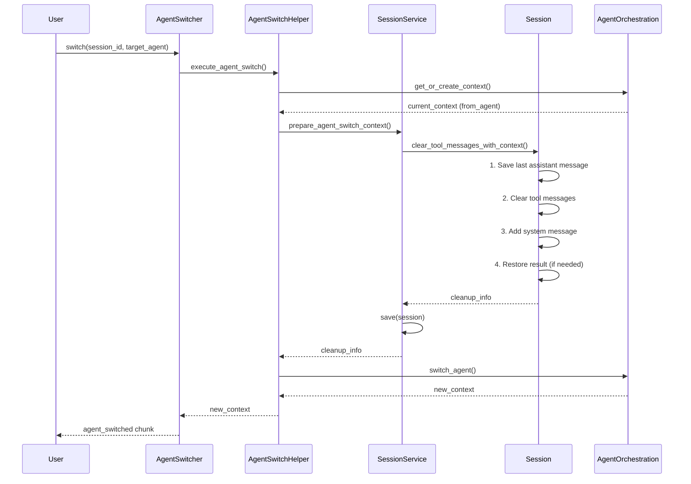

# Agent Switch Context Isolation

## 📋 Обзор

Документ описывает механизм селективной очистки контекста при переключении агентов вне плана выполнения.

## 🎯 Проблема

При переключении между агентами возникали следующие проблемы:

1. **Дублирование tool_call_id**: Tool calls от предыдущего агента оставались в истории
2. **LiteLLM 403 ошибки**: Провайдер отклонял запросы из-за дублирующихся tool_result
3. **Потеря контекста**: Результаты работы предыдущего агента терялись
4. **Конфликты инструментов**: Новый агент видел tool_calls, которые не относились к нему

## ✅ Решение

Реализован механизм **селективной очистки контекста** при переключении агентов:

### Что очищается:
- ✅ Assistant messages с `tool_calls`
- ✅ Tool result messages (`role="tool"`)

### Что сохраняется:
- ✅ User messages
- ✅ System messages
- ✅ Assistant messages без `tool_calls` (результаты работы)

### Что добавляется:
- ✅ System message о переключении агента
- ✅ Контекст о предыдущей работе

## 🏗️ Архитектура

### Компоненты

```
┌─────────────────────────────────────────────────────────────┐
│                    Agent Switch Flow                         │
└─────────────────────────────────────────────────────────────┘
                              │
                              ▼
┌─────────────────────────────────────────────────────────────┐
│              AgentSwitcher.switch()                          │
│  - Валидация запроса                                         │
│  - Делегирование в AgentSwitchHelper                         │
└─────────────────────────────────────────────────────────────┘
                              │
                              ▼
┌─────────────────────────────────────────────────────────────┐
│      AgentSwitchHelper.execute_agent_switch()                │
│  1. Получить текущий контекст агента                         │
│  2. Подготовить контекст сессии (очистка)                    │
│  3. Выполнить переключение                                   │
└─────────────────────────────────────────────────────────────┘
                              │
                              ▼
┌─────────────────────────────────────────────────────────────┐
│   SessionManagementService.prepare_agent_switch_context()    │
│  - Получить сессию                                           │
│  - Вызвать селективную очистку                               │
│  - Сохранить изменения                                       │
└─────────────────────────────────────────────────────────────┘
                              │
                              ▼
┌─────────────────────────────────────────────────────────────┐
│      Session.clear_tool_messages_with_context()              │
│  1. Сохранить последний assistant message                    │
│  2. Очистить tool messages                                   │
│  3. Добавить system message о переключении                   │
│  4. Восстановить результат (если не дублируется)             │
└─────────────────────────────────────────────────────────────┘
```

## 📝 API

### Session.clear_tool_messages_with_context()

```python
def clear_tool_messages_with_context(
    self,
    from_agent: str,
    to_agent: str
) -> Dict[str, Any]:
    """
    Селективная очистка tool messages при переключении агентов.
    
    Returns:
        {
            "removed_count": int,        # Количество удаленных сообщений
            "preserved_result": str,     # Сохраненный результат
            "context_message": str,      # Добавленное system сообщение
            "final_message_count": int   # Итоговое количество сообщений
        }
    """
```

**Пример использования:**

```python
session = await session_service.get_session("session-123")

info = session.clear_tool_messages_with_context(
    from_agent="orchestrator",
    to_agent="coder"
)

print(f"Removed {info['removed_count']} tool messages")
print(f"Preserved result: {info['preserved_result']}")
```

### SessionManagementService.prepare_agent_switch_context()

```python
async def prepare_agent_switch_context(
    self,
    session_id: str,
    from_agent: str,
    to_agent: str
) -> Dict[str, Any]:
    """
    Подготовить контекст сессии для переключения агента.
    
    Выполняет селективную очистку и сохраняет изменения.
    """
```

**Пример использования:**

```python
info = await session_service.prepare_agent_switch_context(
    session_id="session-123",
    from_agent="orchestrator",
    to_agent="coder"
)
```

### AgentSwitchHelper.execute_agent_switch()

```python
async def execute_agent_switch(
    self,
    session_id: str,
    target_agent: AgentType,
    reason: str,
    confidence: str = "medium"
) -> AgentContext:
    """
    Выполнить переключение агента с селективной очисткой контекста.
    
    Автоматически вызывает prepare_agent_switch_context перед переключением.
    """
```

## 🔄 Flow Diagram



## 📊 Пример трансформации истории

### До переключения:

```
[
  {"role": "user", "content": "Create a file"},
  {"role": "assistant", "content": "I'll create it", "tool_calls": [...]},
  {"role": "tool", "content": "File created", "tool_call_id": "call-1"},
  {"role": "assistant", "content": "File created successfully"}
]
```

### После переключения (orchestrator → coder):

```
[
  {"role": "user", "content": "Create a file"},
  {"role": "assistant", "content": "File created successfully"},
  {"role": "system", "content": "Agent switched: orchestrator → coder\nPrevious context preserved..."}
]
```

## 🎯 Использование

### 1. Явное переключение агента

```python
# Через API endpoint
POST /api/v1/messages
{
  "session_id": "session-123",
  "message": {
    "type": "switch_agent",
    "agent_type": "coder",
    "reason": "User requested code changes"
  }
}
```

### 2. Программное переключение

```python
# Через MessageOrchestrationService
async for chunk in orchestration_service.switch_agent(
    session_id="session-123",
    agent_type=AgentType.CODER,
    reason="Switching to coder for implementation"
):
    if chunk.type == "agent_switched":
        print(f"Switched to {chunk.metadata['to_agent']}")
```

### 3. Автоматическое переключение агентом

```python
# Orchestrator может запросить переключение
yield StreamChunk(
    type="switch_agent",
    metadata={
        "target_agent": "coder",
        "reason": "Code implementation required",
        "confidence": "high"
    }
)
```

## 🔍 Отличия от Subtask Snapshot

| Аспект | Agent Switch | Subtask Snapshot |
|--------|-------------|------------------|
| **Когда** | Переключение агентов вне плана | Выполнение subtask в плане |
| **Что сохраняется** | Последний результат + context message | Полная история в snapshot |
| **Восстановление** | Не требуется | Восстановление из snapshot после subtask |
| **Изоляция** | Селективная очистка tool messages | Полная изоляция через snapshot/restore |
| **Use Case** | Явное переключение пользователем | Автоматическое выполнение плана |

## 🧪 Тестирование

Полный набор unit tests: [`test_session_agent_switch.py`](../codelab-ai-service/agent-runtime/tests/unit/domain/entities/test_session_agent_switch.py)

**Покрытие:**
- ✅ Базовая очистка с сохранением результата
- ✅ Очистка без результата
- ✅ Множественные tool calls
- ✅ Сохранение user и system messages
- ✅ Пустая сессия
- ✅ Обновление timestamp
- ✅ Структура возвращаемых данных

**Запуск тестов:**

```bash
cd codelab-ai-service/agent-runtime
uv run pytest tests/unit/domain/entities/test_session_agent_switch.py -v
```

## 📈 Метрики и логирование

### Логи

```python
# AgentSwitchHelper
logger.info(
    f"Session context prepared for agent switch: "
    f"removed {cleanup_info['removed_count']} tool messages, "
    f"preserved result: {bool(cleanup_info.get('preserved_result'))}"
)

# SessionManagementService
logger.info(
    f"Agent switch context prepared for session {session_id}: "
    f"removed {cleanup_info['removed_count']} tool messages, "
    f"final messages: {cleanup_info['final_message_count']}"
)
```

### События

```python
# AgentSwitchedEvent публикуется через event bus
{
    "event_type": "agent.switched",
    "session_id": "session-123",
    "from_agent": "orchestrator",
    "to_agent": "coder",
    "reason": "User requested switch",
    "confidence": "high"
}
```

## 🚀 Преимущества

1. **Предотвращение ошибок**: Нет дублирования tool_call_id
2. **Сохранение контекста**: Результаты работы не теряются
3. **Прозрачность**: System message информирует о переключении
4. **Изоляция**: Каждый агент работает с чистым контекстом
5. **Гибкость**: Работает для любых комбинаций агентов

## 🔗 Связанные документы

- [Session Snapshot Implementation](./SESSION_SNAPSHOT_IMPLEMENTATION_COMPLETE.md) - Snapshot для subtasks
- [Multi-Agent Architecture](../codelab-ai-service/doc/MULTI_AGENT_README.md) - Общая архитектура
- [Planning System](./PLANNING_SYSTEM_README.md) - Система планирования

## 📝 Changelog

### 2026-02-04
- ✅ Реализован метод `clear_tool_messages_with_context` в Session
- ✅ Добавлен метод `prepare_agent_switch_context` в SessionManagementService
- ✅ Интегрирована селективная очистка в `AgentSwitchHelper.execute_agent_switch`
- ✅ Добавлены unit tests с полным покрытием
- ✅ Создана документация

## 🎓 Выводы

Механизм селективной очистки контекста при переключении агентов:

1. **Решает проблему дублирования tool_call_id** между агентами
2. **Сохраняет результаты работы** предыдущего агента
3. **Обеспечивает изоляцию контекста** для каждого агента
4. **Дополняет snapshot механизм** для subtasks в плане
5. **Работает автоматически** при любом переключении агента

Это критически важно для стабильной работы multi-agent системы и предотвращения LiteLLM ошибок.
