# ExecutionEngine Integration: Архитектурные диаграммы

## Option 1: Architect Agent Integration

### Sequence Diagram - Create and Execute Plan

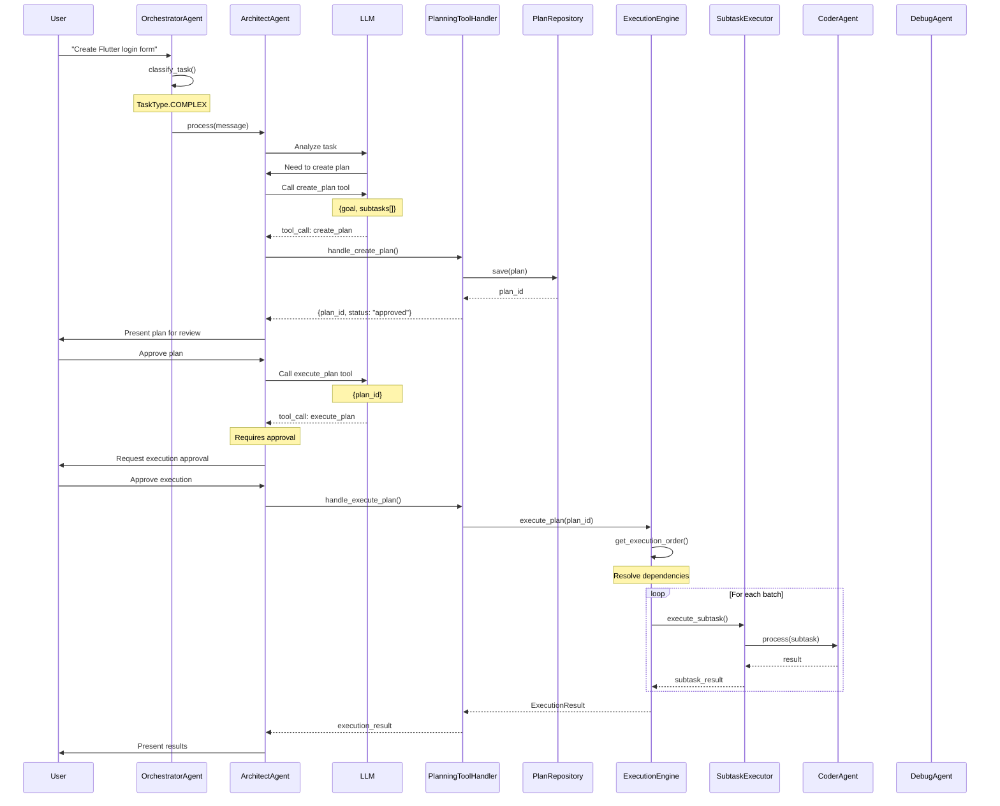

### Component Diagram

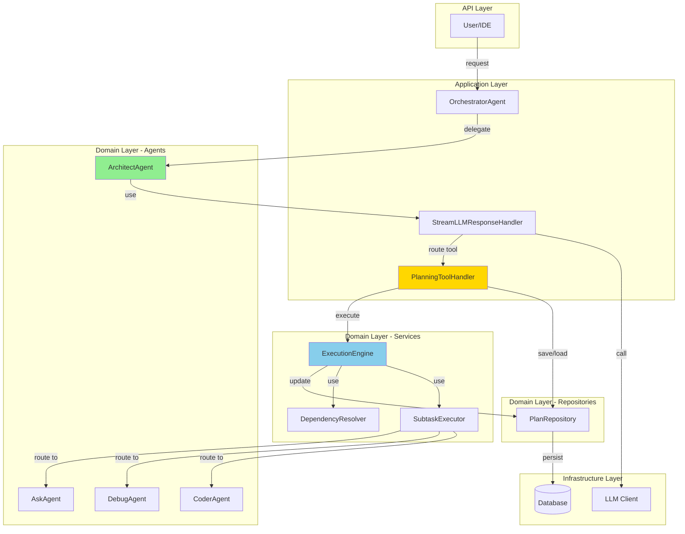

### State Machine Diagram

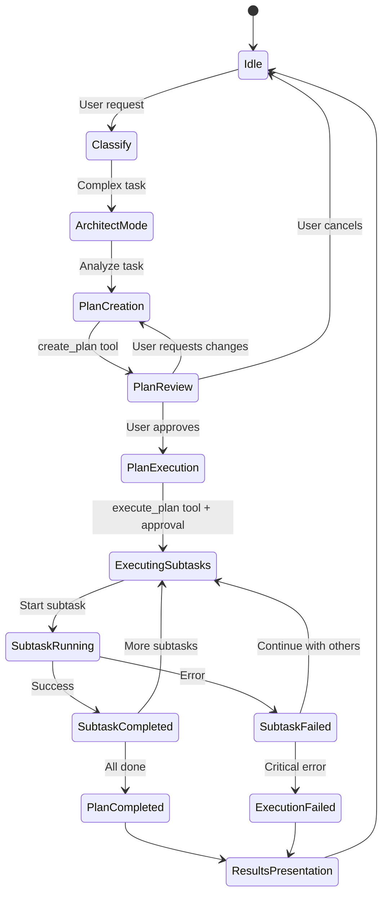

---

## Option 2: OrchestratorAgent Coordination

### Sequence Diagram

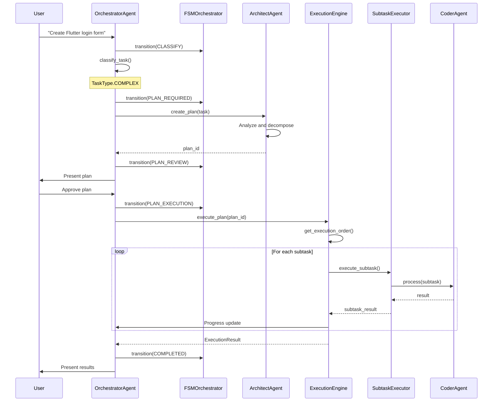

### Component Diagram

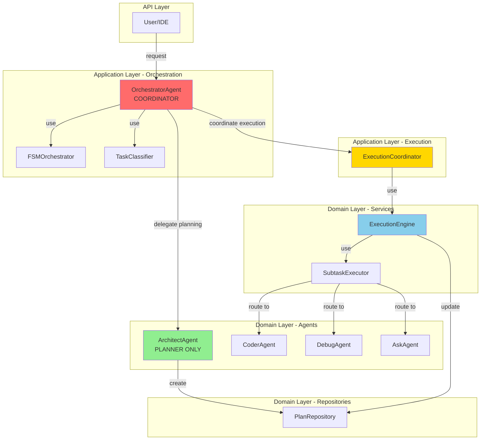

### State Machine Diagram

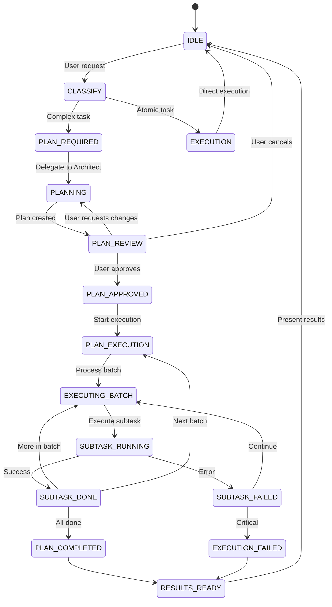

---

## Option 3: Event-Driven Architecture

### Sequence Diagram

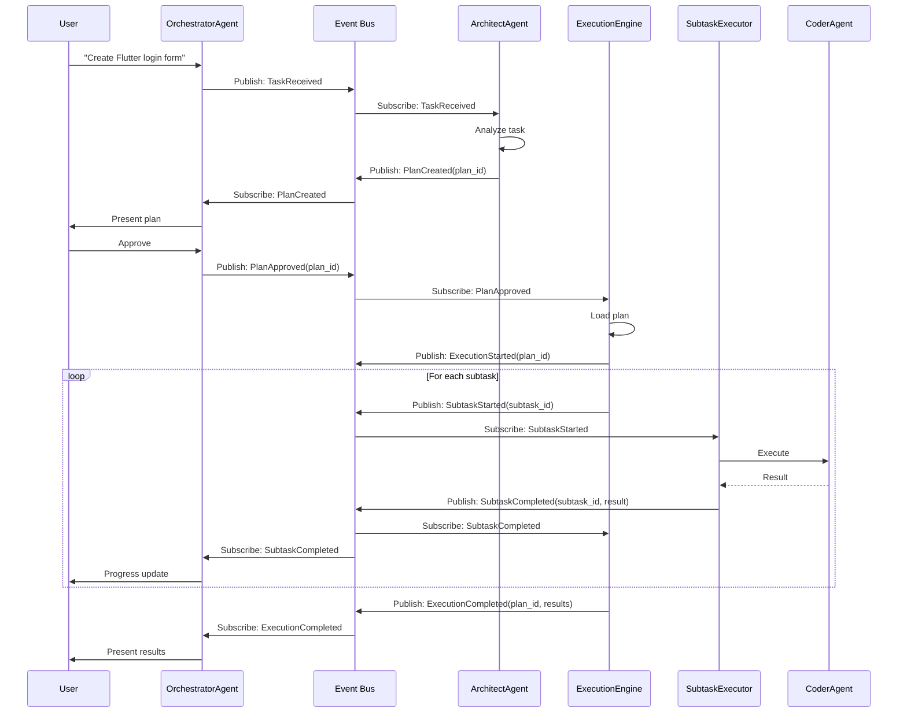

### Component Diagram

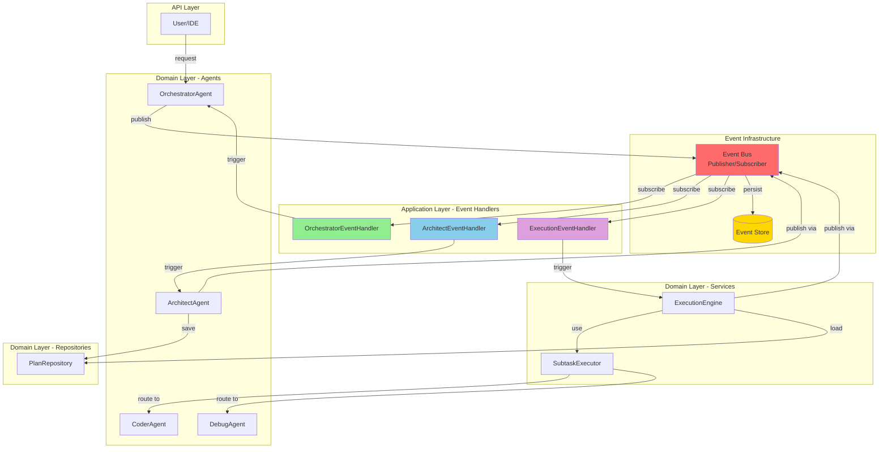

### Event Flow Diagram

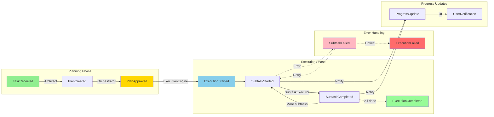

### State Machine with Events

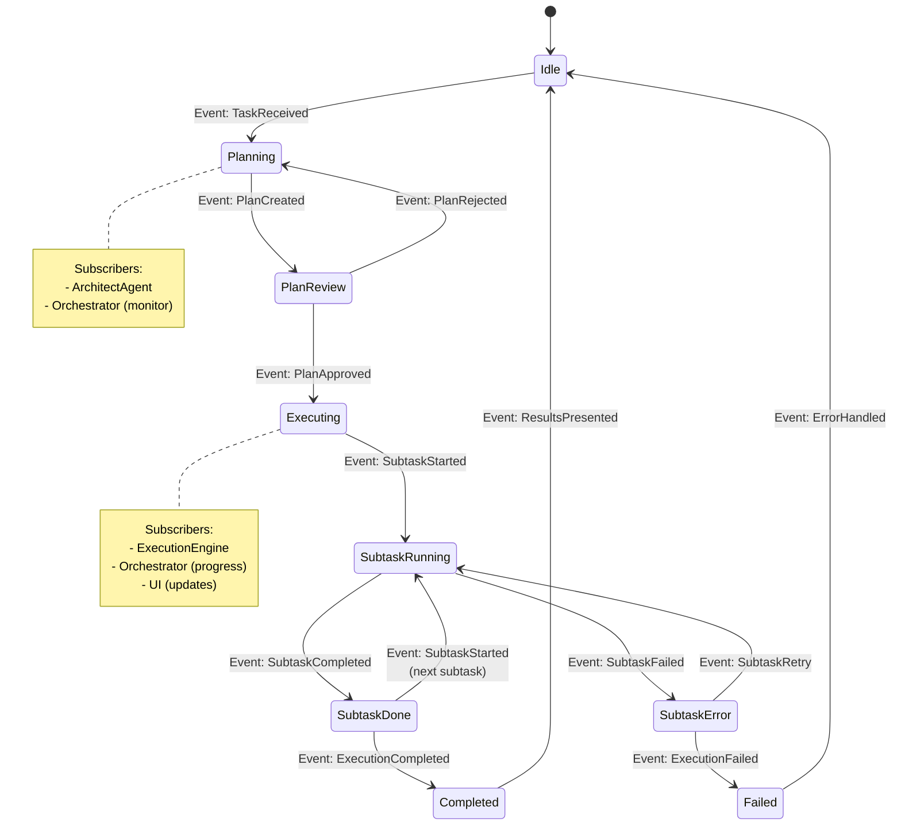

---

## Сравнение диаграмм

### Complexity Comparison

| Aspect | Option 1 | Option 2 | Option 3 |
|--------|----------|----------|----------|
| **Sequence steps** | 15-20 | 20-25 | 25-35 |
| **Components** | 8 | 12 | 15+ |
| **State transitions** | 10 | 15 | 20+ |
| **Integration points** | 3 | 6 | 10+ |
| **Event types** | 0 | 0 | 10+ |

### Visual Complexity

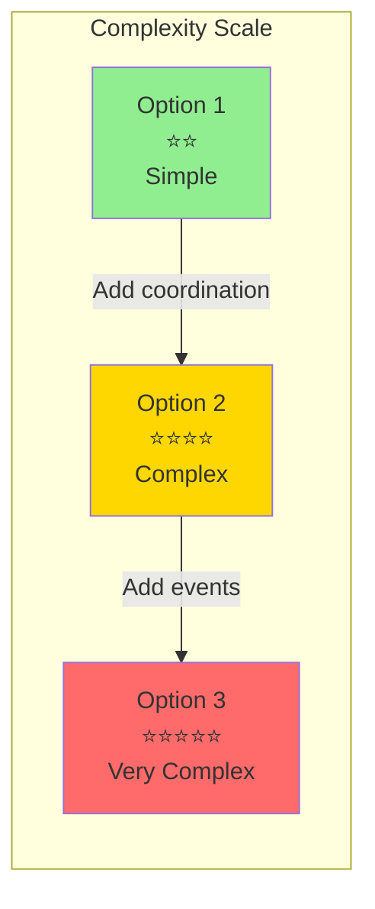

---

## Выводы из диаграмм

### Option 1: Простота и ясность
- **Линейный flow**: User → Orchestrator → Architect → ExecutionEngine
- **Минимум компонентов**: 8 основных компонентов
- **Понятные связи**: Прямые вызовы методов
- **Легко отследить**: Простой call stack

### Option 2: Координация и контроль
- **Централизованное управление**: Orchestrator контролирует всё
- **Больше состояний**: 15 FSM states
- **Сложнее debugging**: Нужно отслеживать FSM transitions
- **Больше coupling**: Orchestrator знает о всех компонентах

### Option 3: Гибкость и масштабируемость
- **Асинхронность**: Компоненты не ждут друг друга
- **Развязка**: Компоненты общаются только через события
- **Сложный flow**: Трудно отследить последовательность
- **Много moving parts**: 15+ компонентов, 10+ типов событий

---

## Рекомендация: Option 1

**Диаграммы подтверждают выбор Option 1:**

1. **Простота архитектуры** - минимум компонентов и связей
2. **Понятный flow** - легко читать sequence diagram
3. **Низкая сложность** - простая state machine
4. **Быстрая реализация** - меньше кода для написания

**Option 1 обеспечивает оптимальный баланс между функциональностью и сложностью.**
