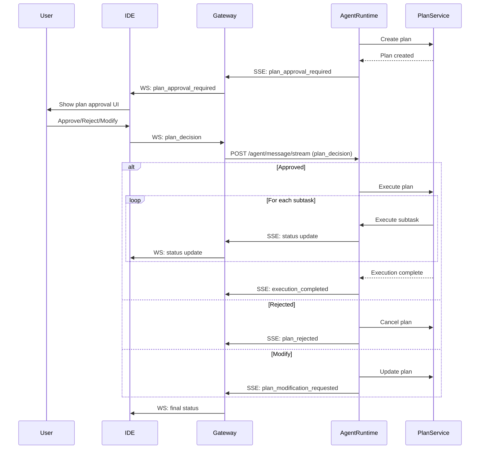

# Анализ протокола общения между Gateway и Agent-Runtime

**Дата:** 2 февраля 2026  
**Версия:** 1.0  
**Статус:** ✅ Актуально

## Оглавление
1. [Обзор архитектуры](#обзор-архитектуры)
2. [Транспортный уровень](#транспортный-уровень)
3. [Типы сообщений](#типы-сообщений)
4. [Потоки данных](#потоки-данных)
5. [REST API эндпоинты](#rest-api-эндпоинты)
6. [WebSocket протокол](#websocket-протокол)
7. [SSE Streaming](#sse-streaming)
8. [Механизмы безопасности](#механизмы-безопасности)
9. [Обработка ошибок](#обработка-ошибок)
10. [Диаграммы взаимодействия](#диаграммы-взаимодействия)

---

## Обзор архитектуры

### Компоненты системы

```
┌─────────────┐         ┌─────────────┐         ┌──────────────────┐
│             │         │             │         │                  │
│     IDE     │◄───────►│   Gateway   │◄───────►│  Agent-Runtime   │
│  (Flutter)  │ WebSocket│  (FastAPI)  │  HTTP   │    (FastAPI)     │
│             │         │             │ Streaming│                  │
└─────────────┘         └─────────────┘         └──────────────────┘
```

### Роли компонентов

**Gateway:**
- Принимает WebSocket соединения от IDE
- Проксирует REST запросы к Agent-Runtime
- Преобразует WebSocket сообщения в HTTP streaming запросы
- Преобразует SSE события от Agent-Runtime в WebSocket сообщения
- Управляет сессиями и буферизацией токенов

**Agent-Runtime:**
- Обрабатывает сообщения через MessageOrchestrationService
- Управляет мульти-агентной системой
- Генерирует SSE streaming ответы
- Хранит состояние сессий и историю сообщений
- Управляет HITL и Plan Approval механизмами

---

## Транспортный уровень

### 1. WebSocket (IDE ↔ Gateway)

**Эндпоинт:** `ws://<gateway_host>/ws/{session_id}`

**Характеристики:**
- Двунаправленная связь в реальном времени
- Один WebSocket на сессию
- JSON формат сообщений
- Автоматическое переподключение при разрыве

**Управление соединением:**
```python
# Gateway: endpoints.py:452-658
@router.websocket("/ws/{session_id}")
async def websocket_endpoint(
    websocket: WebSocket,
    session_id: str,
    session_manager: SessionManager = Depends(get_session_manager),
    token_buffer_manager: TokenBufferManager = Depends(get_token_buffer_manager),
):
    await websocket.accept()
    await session_manager.add(session_id, websocket)
    # ... обработка сообщений
```

### 2. HTTP Streaming (Gateway ↔ Agent-Runtime)

**Эндпоинт:** `POST /agent/message/stream`

**Характеристики:**
- Server-Sent Events (SSE) формат
- Однонаправленный поток от Agent-Runtime к Gateway
- Timeout: настраивается через `AGENT_STREAM_TIMEOUT`
- Аутентификация через `X-Internal-Auth` заголовок

**Формат SSE:**
```
event: message
data: {"type": "assistant_message", "token": "Hello", "is_final": false}

event: message
data: {"type": "tool_call", "call_id": "call_123", ...}

event: done
data: {"status": "completed"}
```

---

## Типы сообщений

### От IDE к Gateway (WebSocket)

#### 1. user_message
```json
{
  "type": "user_message",
  "content": "Создай новый файл main.py",
  "role": "user"
}
```

**Модель:** [`WSUserMessage`](../codelab-ai-service/gateway/app/models/websocket.py:5-9)

**Поля:**
- `type`: Всегда `"user_message"`
- `content`: Текст сообщения пользователя
- `role`: `"user"` | `"assistant"` | `"system"` | `"tool"`

#### 2. tool_result
```json
{
  "type": "tool_result",
  "call_id": "call_abc123",
  "result": {"content": "file content"},
  "error": null
}
```

**Модель:** [`WSToolResult`](../codelab-ai-service/gateway/app/models/websocket.py:32-48)

**Поля:**
- `type`: Всегда `"tool_result"`
- `call_id`: ID вызова инструмента (correlation ID)
- `result`: Результат выполнения (опционально)
- `error`: Сообщение об ошибке (опционально)

#### 3. switch_agent
```json
{
  "type": "switch_agent",
  "agent_type": "coder",
  "content": "Переключись на coder агента",
  "reason": "User requested"
}
```

**Модель:** [`WSSwitchAgent`](../codelab-ai-service/gateway/app/models/websocket.py:73-89)

**Поля:**
- `type`: Всегда `"switch_agent"`
- `agent_type`: Тип целевого агента
- `content`: Сообщение для нового агента
- `reason`: Причина переключения (опционально)

#### 4. hitl_decision
```json
{
  "type": "hitl_decision",
  "call_id": "call_abc123",
  "decision": "approve",
  "modified_arguments": null,
  "feedback": null
}
```

**Модель:** [`WSHITLDecision`](../codelab-ai-service/gateway/app/models/websocket.py:97-127)

**Поля:**
- `type`: Всегда `"hitl_decision"`
- `call_id`: ID вызова инструмента
- `decision`: `"approve"` | `"edit"` | `"reject"`
- `modified_arguments`: Измененные аргументы (для `"edit"`)
- `feedback`: Комментарий пользователя (опционально)

#### 5. plan_decision
```json
{
  "type": "plan_decision",
  "approval_request_id": "plan-approval-abc123",
  "decision": "approve",
  "feedback": null
}
```

**Модель:** [`WSPlanDecision`](../codelab-ai-service/gateway/app/models/websocket.py:155-184)

**Поля:**
- `type`: Всегда `"plan_decision"`
- `approval_request_id`: ID запроса на одобрение плана
- `decision`: `"approve"` | `"reject"` | `"modify"`
- `feedback`: Комментарий пользователя (опционально)

### От Gateway к IDE (WebSocket)

#### 1. assistant_message
```json
{
  "type": "assistant_message",
  "token": "Создаю файл",
  "is_final": false
}
```

**Источник:** [`StreamChunk`](../codelab-ai-service/agent-runtime/app/api/v1/schemas/common.py:28-99)

**Поля:**
- `type`: `"assistant_message"`
- `token`: Токен текста (для streaming)
- `content`: Полный текст (альтернатива token)
- `is_final`: Признак последнего чанка

#### 2. tool_call
```json
{
  "type": "tool_call",
  "call_id": "call_abc123",
  "tool_name": "write_file",
  "arguments": {"path": "main.py", "content": "..."},
  "requires_approval": true
}
```

**Поля:**
- `type`: `"tool_call"`
- `call_id`: Уникальный ID вызова
- `tool_name`: Имя инструмента
- `arguments`: Аргументы вызова
- `requires_approval`: Требуется ли HITL одобрение

#### 3. agent_switched
```json
{
  "type": "agent_switched",
  "content": "Switched to coder agent",
  "from_agent": "orchestrator",
  "to_agent": "coder",
  "reason": "Coding task detected",
  "confidence": "high"
}
```

**Модель:** [`WSAgentSwitched`](../codelab-ai-service/gateway/app/models/websocket.py:50-70)

**Поля:**
- `type`: `"agent_switched"`
- `content`: Описание переключения
- `from_agent`: Предыдущий агент
- `to_agent`: Новый агент
- `reason`: Причина переключения
- `confidence`: Уверенность в решении (опционально)

#### 4. plan_approval_required
```json
{
  "type": "plan_approval_required",
  "content": "Plan requires your approval",
  "approval_request_id": "plan-approval-abc123",
  "plan_id": "plan-xyz789",
  "plan_summary": {
    "goal": "Create Flutter login form",
    "subtasks_count": 4,
    "total_estimated_time": "20 min"
  }
}
```

**Модель:** [`WSPlanApprovalRequired`](../codelab-ai-service/gateway/app/models/websocket.py:130-152)

**Поля:**
- `type`: `"plan_approval_required"`
- `content`: Описание запроса
- `approval_request_id`: ID запроса на одобрение
- `plan_id`: ID плана
- `plan_summary`: Краткое описание плана

#### 5. error
```json
{
  "type": "error",
  "content": "Failed to process request"
}
```

**Модель:** [`WSErrorResponse`](../codelab-ai-service/gateway/app/models/websocket.py:92-94)

**Поля:**
- `type`: `"error"`
- `content`: Описание ошибки

#### 6. done
```json
{
  "type": "done",
  "is_final": true
}
```

**Поля:**
- `type`: `"done"`
- `is_final`: Всегда `true`

---

## Потоки данных

### Поток 1: Обработка пользовательского сообщения

```
┌─────┐                    ┌─────────┐                    ┌──────────────┐
│ IDE │                    │ Gateway │                    │Agent-Runtime │
└──┬──┘                    └────┬────┘                    └──────┬───────┘
   │                            │                                │
   │ 1. user_message (WS)       │                                │
   ├───────────────────────────►│                                │
   │                            │                                │
   │                            │ 2. POST /agent/message/stream  │
   │                            │    (HTTP Streaming)            │
   │                            ├───────────────────────────────►│
   │                            │                                │
   │                            │                                │ 3. Process
   │                            │                                │    message
   │                            │                                │
   │                            │ 4. SSE: assistant_message      │
   │                            │◄───────────────────────────────┤
   │ 5. assistant_message (WS)  │                                │
   │◄───────────────────────────┤                                │
   │                            │                                │
   │                            │ 6. SSE: tool_call              │
   │                            │◄───────────────────────────────┤
   │ 7. tool_call (WS)          │                                │
   │◄───────────────────────────┤                                │
   │                            │                                │
   │                            │ 8. SSE: done                   │
   │                            │◄───────────────────────────────┤
   │                            │                                │
```

**Детали реализации:**

**Gateway (endpoints.py:474-649):**
```python
# 1. Получение сообщения от IDE
raw_msg = await websocket.receive_text()
ide_msg = json.loads(raw_msg)
msg = WSUserMessage.model_validate(ide_msg)

# 2. Отправка в Agent-Runtime через HTTP streaming
async with client.stream(
    "POST",
    f"{AppConfig.AGENT_URL}/agent/message/stream",
    json={"session_id": session_id, "message": ide_msg},
    headers={"X-Internal-Auth": AppConfig.INTERNAL_API_KEY},
) as response:
    # 3. Чтение SSE stream
    async for line in response.aiter_lines():
        if line.startswith("data: "):
            data = json.loads(line[6:])
            # 4. Пересылка в IDE через WebSocket
            await websocket.send_json(data)
```

**Agent-Runtime (messages_router.py:74-114):**
```python
# Обработка user_message
async def generate():
    async for chunk in message_orchestration_service.process_message(
        session_id=session_id,
        message=content,
        agent_type=agent_type
    ):
        # Преобразование в SSE формат
        chunk_json = chunk.model_dump_json(exclude_none=False)
        yield f"data: {chunk_json}\n\n"

return StreamingResponse(
    generate(),
    media_type="text/event-stream",
    headers={
        "Cache-Control": "no-cache",
        "Connection": "keep-alive",
        "X-Accel-Buffering": "no"
    }
)
```

### Поток 2: Выполнение инструмента с HITL

```
┌─────┐                    ┌─────────┐                    ┌──────────────┐
│ IDE │                    │ Gateway │                    │Agent-Runtime │
└──┬──┘                    └────┬────┘                    └──────┬───────┘
   │                            │                                │
   │                            │ 1. SSE: tool_call              │
   │                            │    (requires_approval=true)    │
   │                            │◄───────────────────────────────┤
   │ 2. tool_call (WS)          │                                │
   │◄───────────────────────────┤                                │
   │                            │                                │
   │ 3. Show approval dialog    │                                │
   │                            │                                │
   │ 4. hitl_decision (WS)      │                                │
   ├───────────────────────────►│                                │
   │                            │                                │
   │                            │ 5. POST /agent/message/stream  │
   │                            │    (hitl_decision)             │
   │                            ├───────────────────────────────►│
   │                            │                                │
   │                            │                                │ 6. Process
   │                            │                                │    decision
   │                            │                                │
   │                            │ 7. SSE: assistant_message      │
   │                            │◄───────────────────────────────┤
   │ 8. assistant_message (WS)  │                                │
   │◄───────────────────────────┤                                │
```

**Детали реализации:**

**Gateway (endpoints.py:493-498):**
```python
elif msg_type == "hitl_decision":
    msg = WSHITLDecision.model_validate(ide_msg)
    logger.info(
        f"[{session_id}] Received hitl_decision: "
        f"call_id={msg.call_id}, decision={msg.decision}"
    )
```

**Agent-Runtime (messages_router.py:212-258):**
```python
elif message_type == "hitl_decision":
    call_id = message_data.get("call_id")
    decision = message_data.get("decision")
    modified_arguments = message_data.get("modified_arguments")
    feedback = message_data.get("feedback")
    
    async def hitl_decision_generate():
        async for chunk in message_orchestration_service.process_hitl_decision(
            session_id=session_id,
            call_id=call_id,
            decision=decision,
            modified_arguments=modified_arguments,
            feedback=feedback
        ):
            yield f"data: {chunk.model_dump_json()}\n\n"
```

### Поток 3: Plan Approval

```
┌─────┐                    ┌─────────┐                    ┌──────────────┐
│ IDE │                    │ Gateway │                    │Agent-Runtime │
└──┬──┘                    └────┬────┘                    └──────┬───────┘
   │                            │                                │
   │                            │ 1. SSE: plan_approval_required │
   │                            │◄───────────────────────────────┤
   │ 2. plan_approval_required  │                                │
   │    (WS)                    │                                │
   │◄───────────────────────────┤                                │
   │                            │                                │
   │ 3. Show plan approval UI   │                                │
   │                            │                                │
   │ 4. plan_decision (WS)      │                                │
   ├───────────────────────────►│                                │
   │                            │                                │
   │                            │ 5. POST /agent/message/stream  │
   │                            │    (plan_decision)             │
   │                            ├───────────────────────────────►│
   │                            │                                │
   │                            │                                │ 6. Process
   │                            │                                │    decision
   │                            │                                │
   │                            │ 7. SSE: execution updates      │
   │                            │◄───────────────────────────────┤
   │ 8. Updates (WS)            │                                │
   │◄───────────────────────────┤                                │
```

**Детали реализации:**

**Gateway (endpoints.py:496-498):**
```python
elif msg_type == "plan_decision":
    msg = WSPlanDecision.model_validate(ide_msg)
    logger.info(
        f"[{session_id}] Received plan_decision: "
        f"approval_request_id={msg.approval_request_id}, decision={msg.decision}"
    )
```

**Agent-Runtime (messages_router.py:260-304):**
```python
elif message_type == "plan_decision":
    approval_request_id = message_data.get("approval_request_id")
    decision = message_data.get("decision")
    feedback = message_data.get("feedback")
    
    async def plan_decision_generate():
        async for chunk in message_orchestration_service.process_plan_decision(
            session_id=session_id,
            approval_request_id=approval_request_id,
            decision=decision,
            feedback=feedback
        ):
            yield f"data: {chunk.model_dump_json()}\n\n"
```

---

## REST API эндпоинты

Gateway проксирует следующие REST эндпоинты к Agent-Runtime:

### 1. GET /agents
**Описание:** Получить список всех зарегистрированных агентов

**Gateway:** [`endpoints.py:37-63`](../codelab-ai-service/gateway/app/api/v1/endpoints.py:37-63)

**Запрос:**
```http
GET /agents HTTP/1.1
Host: gateway
```

**Ответ:**
```json
[
  {
    "type": "orchestrator",
    "name": "Orchestrator Agent",
    "description": "Coordinates multi-agent tasks",
    "allowed_tools": ["switch_agent", "delegate_task"],
    "has_file_restrictions": false
  },
  {
    "type": "coder",
    "name": "Coder Agent",
    "description": "Specialized in writing code",
    "allowed_tools": ["read_file", "write_file", "execute_command"],
    "has_file_restrictions": false
  }
]
```

### 2. GET /agents/{session_id}/current
**Описание:** Получить текущего активного агента для сессии

**Gateway:** [`endpoints.py:66-92`](../codelab-ai-service/gateway/app/api/v1/endpoints.py:66-92)

**Запрос:**
```http
GET /agents/session-123/current HTTP/1.1
Host: gateway
```

**Ответ:**
```json
{
  "type": "coder",
  "name": "Coder Agent",
  "description": "Specialized in writing code",
  "allowed_tools": ["read_file", "write_file", "execute_command"],
  "has_file_restrictions": false
}
```

### 3. GET /sessions/{session_id}/history
**Описание:** Получить историю сообщений сессии

**Gateway:** [`endpoints.py:95-121`](../codelab-ai-service/gateway/app/api/v1/endpoints.py:95-121)

**Запрос:**
```http
GET /sessions/session-123/history HTTP/1.1
Host: gateway
```

**Ответ:**
```json
{
  "session_id": "session-123",
  "messages": [
    {
      "role": "user",
      "content": "Создай файл main.py"
    },
    {
      "role": "assistant",
      "content": "Создаю файл main.py..."
    }
  ]
}
```

### 4. GET /sessions
**Описание:** Получить список всех активных сессий

**Gateway:** [`endpoints.py:124-150`](../codelab-ai-service/gateway/app/api/v1/endpoints.py:124-150)

**Запрос:**
```http
GET /sessions HTTP/1.1
Host: gateway
```

**Ответ:**
```json
{
  "sessions": [
    {
      "session_id": "session-123",
      "created_at": "2026-02-02T19:00:00Z",
      "last_activity": "2026-02-02T19:30:00Z"
    }
  ]
}
```

### 5. POST /sessions
**Описание:** Создать новую сессию

**Gateway:** [`endpoints.py:153-182`](../codelab-ai-service/gateway/app/api/v1/endpoints.py:153-182)

**Запрос:**
```http
POST /sessions HTTP/1.1
Host: gateway
Content-Type: application/json
```

**Ответ:**
```json
{
  "session_id": "session-456",
  "created_at": "2026-02-02T19:45:00Z"
}
```

### 6. GET /sessions/{session_id}/pending-approvals
**Описание:** Получить ожидающие одобрения запросы для сессии

**Gateway:** [`endpoints.py:185-230`](../codelab-ai-service/gateway/app/api/v1/endpoints.py:185-230)

**Запрос:**
```http
GET /sessions/session-123/pending-approvals HTTP/1.1
Host: gateway
```

**Ответ:**
```json
{
  "pending_approvals": [
    {
      "approval_request_id": "plan-approval-abc123",
      "type": "plan_approval",
      "plan_id": "plan-xyz789",
      "plan_summary": {
        "goal": "Create Flutter login form",
        "subtasks_count": 4
      },
      "created_at": "2026-02-02T19:40:00Z"
    }
  ]
}
```

### 7. GET /events/metrics/session/{session_id}
**Описание:** Получить метрики LLM для сессии

**Gateway:** [`endpoints.py:233-282`](../codelab-ai-service/gateway/app/api/v1/endpoints.py:233-282)

**Запрос:**
```http
GET /events/metrics/session/session-123 HTTP/1.1
Host: gateway
```

**Ответ:**
```json
{
  "session_id": "session-123",
  "total_requests": 5,
  "successful_requests": 5,
  "failed_requests": 0,
  "total_tokens": 1500,
  "prompt_tokens": 800,
  "completion_tokens": 700,
  "average_duration_ms": 1200,
  "requests_with_tools": 3
}
```

### 8. GET /events/metrics/sessions
**Описание:** Получить список сессий с метриками

**Gateway:** [`endpoints.py:285-317`](../codelab-ai-service/gateway/app/api/v1/endpoints.py:285-317)

### 9. GET /events/metrics
**Описание:** Получить общие метрики событий

**Gateway:** [`endpoints.py:320-359`](../codelab-ai-service/gateway/app/api/v1/endpoints.py:320-359)

### 10. GET /events/audit-log
**Описание:** Получить журнал аудита критических событий

**Gateway:** [`endpoints.py:362-412`](../codelab-ai-service/gateway/app/api/v1/endpoints.py:362-412)

**Параметры:**
- `session_id` (опционально): Фильтр по сессии
- `event_type` (опционально): Фильтр по типу события
- `limit` (опционально): Максимальное количество записей (по умолчанию: 100)

### 11. GET /events/stats
**Описание:** Получить статистику Event Bus

**Gateway:** [`endpoints.py:415-447`](../codelab-ai-service/gateway/app/api/v1/endpoints.py:415-447)

---

## WebSocket протокол

### Установка соединения

**URL:** `ws://<gateway_host>/ws/{session_id}`

**Пример (JavaScript):**
```javascript
const ws = new WebSocket('ws://localhost:8000/ws/session-123');

ws.onopen = () => {
  console.log('Connected');
};

ws.onmessage = (event) => {
  const message = JSON.parse(event.data);
  console.log('Received:', message);
};

ws.onerror = (error) => {
  console.error('WebSocket error:', error);
};

ws.onclose = () => {
  console.log('Disconnected');
};
```

### Отправка сообщений

**Формат:** JSON строка

**Пример:**
```javascript
// Отправка пользовательского сообщения
ws.send(JSON.stringify({
  type: 'user_message',
  content: 'Создай файл main.py',
  role: 'user'
}));

// Отправка результата инструмента
ws.send(JSON.stringify({
  type: 'tool_result',
  call_id: 'call_abc123',
  result: { content: 'file content' }
}));

// Отправка HITL решения
ws.send(JSON.stringify({
  type: 'hitl_decision',
  call_id: 'call_abc123',
  decision: 'approve'
}));
```

### Получение сообщений

**Формат:** JSON объект

**Обработка:**
```javascript
ws.onmessage = (event) => {
  const message = JSON.parse(event.data);
  
  switch (message.type) {
    case 'assistant_message':
      console.log('Assistant:', message.token || message.content);
      break;
      
    case 'tool_call':
      console.log('Tool call:', message.tool_name, message.arguments);
      if (message.requires_approval) {
        // Показать диалог одобрения
      } else {
        // Выполнить инструмент
      }
      break;
      
    case 'agent_switched':
      console.log('Agent switched:', message.from_agent, '->', message.to_agent);
      break;
      
    case 'plan_approval_required':
      console.log('Plan approval required:', message.plan_summary);
      // Показать UI одобрения плана
      break;
      
    case 'error':
      console.error('Error:', message.content);
      break;
      
    case 'done':
      console.log('Stream completed');
      break;
  }
};
```

### Управление жизненным циклом

**Gateway (endpoints.py:651-658):**
```python
except WebSocketDisconnect:
    logger.info(f"[{session_id}] WebSocket disconnected")
    await token_buffer_manager.remove(session_id)
    await session_manager.remove(session_id)
except Exception as e:
    logger.error(f"[{session_id}] WS fatal error: {e}", exc_info=True)
    await token_buffer_manager.remove(session_id)
    await session_manager.remove(session_id)
```

---

## SSE Streaming

### Формат SSE

Server-Sent Events используют текстовый формат:

```
event: <event_type>
data: <json_data>

```

**Пример:**
```
event: message
data: {"type":"assistant_message","token":"Hello","is_final":false}

event: message
data: {"type":"tool_call","call_id":"call_123","tool_name":"read_file","arguments":{"path":"main.py"}}

event: done
data: {"status":"completed"}

```

### Обработка SSE в Gateway

**Gateway (endpoints.py:546-627):**
```python
current_event_type = None

async for line in response.aiter_lines():
    # Пустая строка - разделитель событий
    if not line:
        current_event_type = None
        continue
    
    # Тип события
    if line.startswith("event: "):
        current_event_type = line[7:].strip()
        
        # Завершение stream
        if current_event_type == "done":
            logger.info(f"[{session_id}] Received 'done' event")
            break
        
        continue
    
    # Данные события
    if line.startswith("data: "):
        data_str = line[6:]
        
        # Маркер завершения
        if data_str == "[DONE]":
            logger.info(f"[{session_id}] Received [DONE] marker")
            break
        
        # Парсинг JSON
        if current_event_type == "message":
            data = json.loads(data_str)
            
            # Фильтрация null значений
            filtered_data = {k: v for k, v in data.items() if v is not None}
            
            # Пересылка в IDE
            await websocket.send_json(filtered_data)
    
    # Heartbeat комментарий
    if line.startswith(":"):
        logger.debug(f"[{session_id}] SSE heartbeat received")
        continue
```

### Генерация SSE в Agent-Runtime

**Agent-Runtime (messages_router.py:85-104):**
```python
async def generate():
    try:
        async for chunk in message_orchestration_service.process_message(
            session_id=session_id,
            message=content,
            agent_type=agent_type
        ):
            # Преобразование в SSE формат
            chunk_json = chunk.model_dump_json(exclude_none=False)
            yield f"data: {chunk_json}\n\n"
    except Exception as e:
        logger.error(f"Error processing message: {e}", exc_info=True)
        error_chunk = StreamChunk(
            type="error",
            error=str(e),
            is_final=True
        )
        yield f"data: {error_chunk.model_dump_json()}\n\n"

return StreamingResponse(
    generate(),
    media_type="text/event-stream",
    headers={
        "Cache-Control": "no-cache",
        "Connection": "keep-alive",
        "X-Accel-Buffering": "no"
    }
)
```

### Особенности SSE

**Заголовки:**
- `Content-Type: text/event-stream`
- `Cache-Control: no-cache`
- `Connection: keep-alive`
- `X-Accel-Buffering: no` (отключение буферизации в nginx)

**Heartbeat:**
- Периодические комментарии (`:`) для поддержания соединения
- Предотвращение timeout

**Завершение:**
- `event: done` - явное завершение
- `data: [DONE]` - маркер завершения
- Закрытие соединения

---

## Механизмы безопасности

### 1. Внутренняя аутентификация

**Заголовок:** `X-Internal-Auth`

**Gateway → Agent-Runtime:**
```python
headers={"X-Internal-Auth": AppConfig.INTERNAL_API_KEY}
```

**Конфигурация:**
```python
# gateway/.env
INTERNAL_API_KEY=your-secret-key

# agent-runtime/.env
INTERNAL_API_KEY=your-secret-key
```

### 2. Валидация сообщений

**Pydantic модели:**
```python
# Gateway
msg = WSUserMessage.model_validate(ide_msg)  # Raises ValidationError

# Agent-Runtime
request = MessageStreamRequest.model_validate(data)
```

**Обработка ошибок валидации:**
```python
try:
    msg = WSUserMessage.model_validate(ide_msg)
except Exception as e:
    logger.error(f"Failed to parse message: {e}")
    err = WSErrorResponse.model_construct(
        type="error",
        content=f"Invalid JSON message: {str(e)}"
    )
    await websocket.send_json(err.model_dump())
    continue
```

### 3. Изоляция сессий

**SessionManager:**
- Каждая сессия имеет уникальный `session_id`
- WebSocket привязан к сессии
- Автоматическая очистка при отключении

**TokenBufferManager:**
- Буферизация токенов по сессиям
- Предотвращение утечек памяти

### 4. Timeout защита

**HTTP Streaming timeout:**
```python
async with httpx.AsyncClient(timeout=AppConfig.AGENT_STREAM_TIMEOUT) as client:
    # ...
```

**Конфигурация:**
```python
AGENT_STREAM_TIMEOUT = 300.0  # 5 минут
```

### 5. Обработка ошибок HTTP

**Gateway:**
```python
try:
    response.raise_for_status()
except httpx.HTTPStatusError as e:
    error_body = await e.response.aread()
    error_text = error_body.decode('utf-8')
    logger.error(f"Agent HTTP error: {e.response.status_code}, {error_text}")
    
    err = WSErrorResponse.model_construct(
        type="error",
        content=f"Agent error: {e.response.status_code}"
    )
    await websocket.send_json(err.model_dump())
```

---

## Обработка ошибок

### Типы ошибок

#### 1. Ошибки валидации

**Причина:** Некорректный формат сообщения

**Обработка в Gateway:**
```python
try:
    ide_msg = json.loads(raw_msg)
    msg_type = ide_msg.get("type")
    
    if msg_type == "user_message":
        msg = WSUserMessage.model_validate(ide_msg)
    # ...
except Exception as e:
    logger.error(f"Failed to parse message: {e}")
    err = WSErrorResponse.model_construct(
        type="error",
        content=f"Invalid JSON message: {str(e)}"
    )
    await websocket.send_json(err.model_dump())
```

**Пример ошибки:**
```json
{
  "type": "error",
  "content": "Invalid message format: plan_decision requires 'approval_request_id' and 'decision' fields, not 'call_id'"
}
```

#### 2. Ошибки HTTP

**Причина:** Проблемы связи с Agent-Runtime

**Обработка:**
```python
except httpx.HTTPStatusError as e:
    logger.error(f"Agent HTTP error: {e.response.status_code}")
    return JSONResponse(
        status_code=e.response.status_code,
        content={"error": f"Agent Runtime error: {e.response.status_code}"}
    )
```

#### 3. Ошибки обработки

**Причина:** Ошибки в бизнес-логике Agent-Runtime

**Обработка в Agent-Runtime:**
```python
async def generate():
    try:
        async for chunk in message_orchestration_service.process_message(...):
            yield f"data: {chunk.model_dump_json()}\n\n"
    except Exception as e:
        logger.error(f"Error processing message: {e}", exc_info=True)
        error_chunk = StreamChunk(
            type="error",
            error=str(e),
            is_final=True
        )
        yield f"data: {error_chunk.model_dump_json()}\n\n"
```

#### 4. Ошибки WebSocket

**Причина:** Разрыв соединения, сетевые проблемы

**Обработка:**
```python
except WebSocketDisconnect:
    logger.info(f"[{session_id}] WebSocket disconnected")
    await token_buffer_manager.remove(session_id)
    await session_manager.remove(session_id)
except Exception as e:
    logger.error(f"[{session_id}] WS fatal error: {e}", exc_info=True)
    await token_buffer_manager.remove(session_id)
    await session_manager.remove(session_id)
```

### Стратегии восстановления

#### На стороне IDE

1. **Автоматическое переподключение WebSocket**
2. **Восстановление pending approvals** через GET `/sessions/{session_id}/pending-approvals`
3. **Восстановление истории** через GET `/sessions/{session_id}/history`

#### На стороне Gateway

1. **Retry логика** для HTTP запросов к Agent-Runtime
2. **Graceful degradation** при недоступности Agent-Runtime
3. **Логирование** всех ошибок для отладки

#### На стороне Agent-Runtime

1. **Сохранение состояния** сессий в памяти/БД
2. **Транзакционность** операций с планами
3. **Rollback** при ошибках выполнения

---

## Диаграммы взаимодействия

### Полный цикл обработки сообщения с инструментами


### HITL Flow


### Plan Approval Flow



---

## Рекомендации по использованию

### Для разработчиков IDE

1. **Всегда валидируйте сообщения** перед отправкой
2. **Обрабатывайте все типы сообщений** от Gateway
3. **Реализуйте переподключение** WebSocket при разрыве
4. **Восстанавливайте состояние** после переподключения
5. **Показывайте прогресс** пользователю во время streaming
6. **Логируйте все взаимодействия** для отладки

### Для разработчиков Gateway

1. **Используйте timeout** для HTTP запросов
2. **Фильтруйте null значения** перед отправкой в IDE
3. **Логируйте критические события** (plan_approval_required, hitl_decision)
4. **Обрабатывайте ошибки gracefully**
5. **Очищайте ресурсы** при отключении WebSocket

### Для разработчиков Agent-Runtime

1. **Генерируйте валидные StreamChunk** объекты
2. **Используйте exclude_none=False** при сериализации для plan_approval_required
3. **Обрабатывайте все типы входящих сообщений**
4. **Логируйте метрики** через Event Bus
5. **Сохраняйте состояние** для восстановления

---

## Версионирование

**Текущая версия протокола:** 1.0

**История изменений:**
- **1.0** (2026-02-02): Начальная версия с поддержкой HITL и Plan Approval

**Обратная совместимость:**
- Новые поля добавляются как опциональные
- Старые клиенты игнорируют неизвестные поля
- Обязательные изменения требуют увеличения major версии

---

## Заключение

Протокол общения между Gateway и Agent-Runtime обеспечивает:

✅ **Двунаправленную связь** через WebSocket (IDE ↔ Gateway) и HTTP Streaming (Gateway ↔ Agent-Runtime)  
✅ **Streaming ответы** для улучшения UX  
✅ **HITL механизм** для безопасного выполнения критичных операций  
✅ **Plan Approval** для контроля многошаговых задач  
✅ **Мульти-агентную поддержку** с переключением агентов  
✅ **Надежную обработку ошибок** на всех уровнях  
✅ **Метрики и аудит** для мониторинга системы  

Протокол спроектирован с учетом расширяемости и может быть дополнен новыми типами сообщений без нарушения обратной совместимости.
