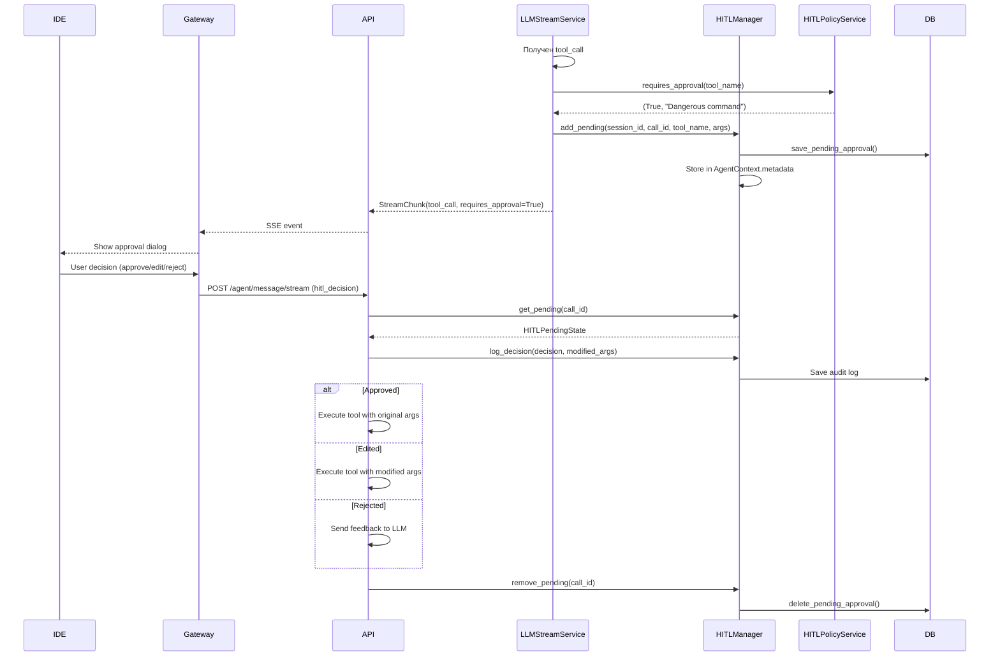

# ДЕТАЛЬНЫЙ АНАЛИЗ AGENT-RUNTIME SERVICE

## 📋 EXECUTIVE SUMMARY

**Agent Runtime Service** — это ядро AI-логики системы CodeLab, реализующее мультиагентную архитектуру с 5 специализированными агентами. Сервис построен на FastAPI с асинхронной архитектурой, поддерживает персистентность сессий в PostgreSQL/SQLite и интегрируется с LLM через прокси-сервис.

**Версия:** 0.1.0 (Production Ready)  
**Статус:** ✅ Полностью функционален  
**Язык:** Python 3.12+  
**Фреймворк:** FastAPI + SQLAlchemy (async)

---

## 🏗️ АРХИТЕКТУРА СИСТЕМЫ

### Многоуровневая архитектура

```
┌─────────────────────────────────────────────────────────────┐
│                     API Layer (FastAPI)                      │
│  - endpoints.py: REST API + SSE streaming                    │
│  - middleware: Internal auth, CORS                           │
└──────────────────────┬──────────────────────────────────────┘
                       │
┌──────────────────────▼──────────────────────────────────────┐
│                   Services Layer                             │
│  - multi_agent_orchestrator: Координация агентов             │
│  - session_manager_async: Управление сессиями                │
│  - agent_context_async: Контекст агентов                     │
│  - llm_stream_service: Стриминг от LLM                       │
│  - hitl_manager: Human-in-the-Loop                           │
└──────────────────────┬──────────────────────────────────────┘
                       │
┌──────────────────────▼──────────────────────────────────────┐
│                   Agents Layer                               │
│  - Orchestrator: LLM-based маршрутизация                     │
│  - Coder: Написание кода (все инструменты)                   │
│  - Architect: Проектирование (только .md)                    │
│  - Debug: Отладка (read-only)                                │
│  - Ask: Ответы на вопросы (минимум инструментов)            │
│  - Universal: Универсальный агент (single-agent mode)        │
└──────────────────────┬──────────────────────────────────────┘
                       │
┌──────────────────────▼──────────────────────────────────────┐
│                 Data/Integration Layer                       │
│  - database.py: Async PostgreSQL/SQLite                      │
│  - llm_proxy_client: HTTP клиент к LLM Proxy                 │
│  - tool_registry: Реестр инструментов                        │
└─────────────────────────────────────────────────────────────┘
```

---

## 📁 СТРУКТУРА ФАЙЛОВ И НАЗНАЧЕНИЕ

### Корневые файлы

| Файл | Назначение |
|------|-----------|
| `pyproject.toml` | Конфигурация проекта, зависимости (FastAPI, SQLAlchemy, langchain, smolagents) |
| `Dockerfile` | Multi-stage сборка с UV package manager |
| `README.md` | Документация по использованию и API |
| `.env.example` | Шаблон переменных окружения |

### Документация (корень)

| Файл | Содержание |
|------|-----------|
| `REFACTORING_SUMMARY.md` | История рефакторинга, улучшения кода |
| `MULTI_AGENT_IMPLEMENTATION.md` | Детали реализации мультиагентной системы |
| `ASYNC_DATABASE_MIGRATION.md` | Миграция на async database |
| `SESSION_PERSISTENCE_GUIDE.md` | Руководство по персистентности сессий |
| `SINGLE_AGENT_MODE.md` | Режим работы с одним универсальным агентом |

### app/ - Основной код приложения

#### app/main.py
**Точка входа FastAPI приложения**
- Инициализация базы данных (PostgreSQL/SQLite)
- Инициализация async менеджеров (session, agent context)
- Регистрация middleware (internal auth)
- Lifecycle management (startup/shutdown)
- Автоматическая инициализация агентов

#### app/core/ - Ядро конфигурации

| Файл | Назначение |
|------|-----------|
| `config.py` | Класс `AppConfig` с переменными окружения |
| `dependencies.py` | FastAPI Dependency Injection провайдеры |

**Ключевые настройки:**
- `LLM_PROXY_URL`: URL LLM прокси-сервиса
- `LLM_MODEL`: Модель LLM (fake-llm для тестов)
- `DB_URL`: SQLite или PostgreSQL connection string
- `MULTI_AGENT_MODE`: true/false (мульти/одноагентный режим)
- `INTERNAL_API_KEY`: Ключ для внутренней аутентификации

#### app/api/v1/ - API endpoints

`endpoints.py` - **665 строк, основной API**

**Public endpoints:**
- `GET /health` - Проверка статуса
- `POST /agent/message/stream` - SSE стриминг (основной endpoint)

**Agent endpoints:**
- `GET /agents` - Список зарегистрированных агентов
- `GET /agents/{session_id}/current` - Текущий агент сессии

**Session endpoints:**
- `GET /sessions` - Список всех сессий
- `POST /sessions` - Создать новую сессию
- `GET /sessions/{session_id}/history` - История сообщений
- `GET /sessions/{session_id}/pending-approvals` - Pending HITL approvals

**Поддерживаемые типы сообщений:**
1. `user_message` - Обычное сообщение пользователя
2. `tool_result` - Результат выполнения инструмента
3. `switch_agent` - Явное переключение агента
4. `hitl_decision` - Решение пользователя (approve/edit/reject)

#### app/models/ - Pydantic модели

`schemas.py` - **143 строки**

**Основные модели:**
- `Message` - Сообщение (role, content, name)
- `SessionState` - Состояние сессии
- `AgentStreamRequest` - Запрос на стриминг
- `StreamChunk` - Чанк SSE ответа (assistant_message, tool_call, error, switch_agent)
- `ToolCall` - Вызов инструмента
- `AgentInfo` - Информация об агенте

`hitl_models.py` - HITL модели
- `HITLPendingState` - Ожидающий approval
- `HITLDecision` - Решение (APPROVE/EDIT/REJECT)
- `HITLAuditLog` - Аудит лог решений

`metrics.py` - Метрики для экспериментов

---

## 🤖 АГЕНТЫ - ДЕТАЛЬНОЕ ОПИСАНИЕ

### Базовый класс: BaseAgent

`app/agents/base_agent.py` - **145 строк**

**Enum AgentType:**
```python
ORCHESTRATOR = "orchestrator"
CODER = "coder"
ARCHITECT = "architect"
DEBUG = "debug"
ASK = "ask"
UNIVERSAL = "universal"
```

**Основные методы:**
- `process()` - Абстрактный метод обработки сообщения (AsyncGenerator)
- `can_use_tool(tool_name)` - Проверка доступа к инструменту
- `can_edit_file(file_path)` - Проверка прав на редактирование файла
- `get_allowed_tools()` - Список разрешенных инструментов

**Атрибуты:**
- `agent_type` - Тип агента
- `system_prompt` - Системный промпт
- `allowed_tools` - Список разрешенных инструментов
- `file_restrictions` - Regex паттерны для ограничения файлов

### 1. Orchestrator Agent

`app/agents/orchestrator_agent.py` - **287 строк**

**Роль:** Главный координатор, анализирует запросы и маршрутизирует к специалистам

**Инструменты:** read_file, list_files, search_in_code

**Механизм классификации:**
1. **LLM-based** (основной): Отправляет запрос к LLM с classification prompt
2. **Keyword fallback** (резервный): Простое сопоставление ключевых слов

**Classification Prompt:**
```
Analyze user request and determine which agent should handle it:
- coder: writing/modifying code
- architect: planning/designing
- debug: troubleshooting/investigating
- ask: answering questions
```

**Метод `classify_task_with_llm()`:**
- Вызывает LLM с temperature=0.3 для стабильности
- Парсит JSON ответ (с fallback на regex extraction)
- Возвращает `(AgentType, classification_info)`

**Single-agent mode detection:**
Если зарегистрированы только Orchestrator + Universal, автоматически роутит на Universal

### 2. Coder Agent

`app/agents/coder_agent.py` - **106 строк**

**Роль:** Специалист по написанию и модификации кода

**Инструменты:** ВСЕ (read_file, write_file, list_files, search_in_code, create_directory, execute_command, attempt_completion, ask_followup_question)

**Ограничения:** НЕТ (может редактировать любые файлы)

**Особенности:**
- Валидация tool usage перед выполнением
- Валидация file editing (хотя ограничений нет)
- Делегирует обработку в `llm_stream_service.stream_response()`

### 3. Architect Agent

`app/agents/architect_agent.py` - ~100 строк

**Роль:** Проектирование и создание технических спецификаций

**Инструменты:** read_file, write_file, list_files, search_in_code, attempt_completion, ask_followup_question

**Ограничения:** Может редактировать ТОЛЬКО `.md` файлы (regex: `r'\.md$'`)

**Особенности:**
- Строгая валидация при write_file
- Возвращает error chunk если попытка редактировать не-.md файл

### 4. Debug Agent

`app/agents/debug_agent.py` - ~100 строк

**Роль:** Отладка, исследование ошибок, анализ логов

**Инструменты:** read_file, list_files, search_in_code, execute_command, attempt_completion, ask_followup_question

**Ограничения:** НЕТ write_file (read-only режим)

**Особенности:**
- Может выполнять команды для диагностики
- Не может модифицировать код
- Может переключиться на Coder для исправления

### 5. Ask Agent

`app/agents/ask_agent.py` - ~100 строк

**Роль:** Ответы на вопросы, объяснение концепций

**Инструменты:** read_file, search_in_code, list_files, attempt_completion

**Ограничения:** Минимальный набор инструментов, только чтение

**Особенности:**
- Фокус на объяснении, а не на действиях
- Может читать код для контекста

### 6. Universal Agent

`app/agents/universal_agent.py` - ~100 строк

**Роль:** Универсальный агент для single-agent mode

**Инструменты:** ВСЕ (как Coder)

**Ограничения:** НЕТ

**Использование:** Активируется когда `MULTI_AGENT_MODE=false`

### Промпты агентов

Директория `app/agents/prompts/`:
- `orchestrator.py` - Промпт для маршрутизации
- `coder.py` - Промпт для написания кода
- `architect.py` - Промпт для проектирования
- `debug.py` - Промпт для отладки
- `ask.py` - Промпт для ответов на вопросы
- `universal.py` - Универсальный промпт

---

## 🔧 СЕРВИСЫ - ДЕТАЛЬНОЕ ОПИСАНИЕ

### 1. MultiAgentOrchestrator

`app/services/multi_agent_orchestrator.py` - **227 строк**

**Главный координатор мультиагентной системы**

**Метод `process_message()`:**
```python
async def process_message(
    session_id: str,
    message: str,
    agent_type: Optional[AgentType] = None
) -> AsyncGenerator[StreamChunk, None]
```

**Логика работы:**
1. Получает/создает agent context для сессии
2. Если `agent_type` указан явно → переключается на него
3. Если текущий агент = Orchestrator → запускает классификацию
4. Orchestrator возвращает `switch_agent` chunk → переключение
5. Обрабатывает сообщение через текущего агента
6. Если агент запрашивает переключение → рекурсивно обрабатывает

**Дополнительные методы:**
- `get_current_agent(session_id)` - Текущий агент
- `get_agent_history(session_id)` - История переключений
- `reset_session(session_id)` - Сброс на Orchestrator

**Singleton:** `multi_agent_orchestrator = MultiAgentOrchestrator()`

### 2. AgentRouter

`app/services/agent_router.py` - **168 строк**

**Реестр и маршрутизатор агентов**

**Основные методы:**
- `register_agent(agent)` - Регистрация агента
- `get_agent(agent_type)` - Получение агента по типу
- `has_agent(agent_type)` - Проверка наличия
- `list_agents()` - Список зарегистрированных типов
- `get_agent_info(agent_type)` - Информация об агенте
- `unregister_agent(agent_type)` - Удаление агента

**Singleton:** `agent_router = AgentRouter()`

**Инициализация:** `app/agents/__init__.py`
- Автоматически регистрирует агентов при импорте модуля
- Поддерживает multi-agent и single-agent режимы

### 3. AsyncSessionManager

`app/services/session_manager_async.py` - **419 строк**

**Управление сессиями с async database persistence**

**Архитектура:**
- In-memory cache (`Dict[str, SessionState]`) для быстрого доступа
- Async database persistence (PostgreSQL/SQLite)
- Background task для batch writes (каждые 5 секунд)
- Thread-safe операции через `asyncio.Lock`

**Основные методы:**
- `initialize()` - Загрузка сессий из БД
- `create(session_id, system_prompt)` - Создание сессии
- `get(session_id)` - Получение сессии (sync)
- `get_or_create(session_id, system_prompt)` - Получить или создать
- `append_message(session_id, role, content, name)` - Добавить сообщение
- `append_tool_result(session_id, call_id, tool_name, result)` - Добавить результат инструмента
- `get_history(session_id)` - История сообщений
- `delete(session_id)` - Удаление сессии
- `shutdown()` - Flush pending writes

**Background writer:**
- Запускается в `_background_writer()` task
- Пишет сессии из `_pending_writes` set
- Автоматически отменяется при shutdown

**Singleton:** `session_manager: Optional[AsyncSessionManager]`

### 4. AsyncAgentContextManager

`app/services/agent_context_async.py` - **505 строк**

**Управление контекстом агентов с persistence**

**Модель AgentContext:**
```python
class AgentContext(BaseModel):
    session_id: str
    current_agent: AgentType
    agent_history: List[Dict[str, Any]]
    metadata: Dict[str, Any]
    created_at: datetime
    last_switch_at: Optional[datetime]
    switch_count: int
```

**Основные методы:**
- `initialize()` - Загрузка контекстов из БД
- `get_or_create(session_id, initial_agent)` - Получить или создать
- `get(session_id)` - Получение контекста (sync)
- `delete(session_id)` - Удаление контекста
- `cleanup_old_sessions(max_age_hours)` - Очистка старых сессий
- `shutdown()` - Flush pending writes

**Метод AgentContext.switch_agent():**
```python
def switch_agent(self, new_agent: AgentType, reason: str):
    # Записывает в agent_history
    # Обновляет current_agent, last_switch_at, switch_count
    # Помечает для persistence
```

**Background writer:** Аналогично SessionManager

**Singleton:** `agent_context_manager: Optional[AsyncAgentContextManager]`

### 5. LLMStreamService

`app/services/llm_stream_service.py` - **228 строк**

**Стриминг ответов от LLM с интеграцией HITL**

**Функция `stream_response()`:**
```python
async def stream_response(
    session_id: str,
    history: List[dict],
    allowed_tools: Optional[List[str]] = None,
    session_mgr: Optional[AsyncSessionManager] = None
) -> AsyncGenerator[StreamChunk, None]
```

**Логика работы:**
1. Фильтрует tools по `allowed_tools`
2. Вызывает LLM через `llm_proxy_client`
3. Парсит ответ через `tool_parser.parse_tool_calls()`
4. Если tool_call:
   - Проверяет через `hitl_policy_service.requires_approval()`
   - Если требуется approval → сохраняет в `hitl_manager`
   - Сохраняет assistant message с tool_call в историю
   - Возвращает `tool_call` chunk с `requires_approval` флагом
   - ОСТАНАВЛИВАЕТ генерацию (ждет tool_result от Gateway)
5. Если обычный ответ:
   - Сохраняет assistant message
   - Возвращает `assistant_message` chunk

**ВАЖНО:** Только ОДИН tool call за раз (валидация)

### 6. LLMProxyClient

`app/services/llm_proxy_client.py` - **120 строк**

**HTTP клиент для LLM Proxy сервиса**

**Метод `chat_completion()`:**
```python
async def chat_completion(
    model: str,
    messages: List[Dict[str, Any]],
    tools: Optional[List[Dict[str, Any]]] = None,
    stream: bool = False,
    extra_params: Optional[Dict[str, Any]] = None,
) -> Dict[str, Any]
```

**Особенности:**
- Async HTTP через `httpx.AsyncClient`
- Timeout: 360 секунд (настраиваемый)
- Internal auth через `X-Internal-Auth` header
- Endpoint: `{LLM_PROXY_URL}/v1/chat/completions`

**Singleton:** `llm_proxy_client = LLMProxyClient()`

### 7. ToolRegistry

`app/services/tool_registry.py` - **381 строка**

**Реестр инструментов и их спецификаций**

**Локальные инструменты (выполняются в agent-runtime):**
```python
LOCAL_TOOLS = {
    "echo": echo_tool,
    "calculator": calculator_tool,
    "switch_mode": switch_mode_tool
}
```

**IDE-side инструменты (выполняются в IDE через Gateway):**
- `read_file` - Чтение файла
- `write_file` - Запись файла (требует approval)
- `list_files` - Список файлов
- `create_directory` - Создание директории
- `execute_command` - Выполнение команды (опасные требуют approval)
- `search_in_code` - Поиск в коде

**Спецификации:** `TOOLS_SPEC: List[Dict[str, Any]]` - OpenAI-compatible format

**Функция `execute_local_tool()`:**
```python
async def execute_local_tool(tool_call: ToolCall) -> str
```

### 8. HITLManager

`app/services/hitl_manager.py` - **328 строк**

**Human-in-the-Loop управление**

**Хранилище:**
- In-memory: `AgentContext.metadata[HITL_PENDING_KEY]`
- Database: `pending_approvals` таблица (для persistence)

**Основные методы:**
- `add_pending()` - Добавить pending approval (async)
- `get_pending(session_id, call_id)` - Получить pending state
- `get_all_pending(session_id)` - Все pending для сессии
- `remove_pending(session_id, call_id)` - Удалить pending (async)
- `log_decision()` - Записать решение в audit log (async)
- `get_audit_logs(session_id)` - История решений
- `has_pending(session_id, call_id)` - Проверка наличия

**Модель HITLPendingState:**
```python
call_id: str
tool_name: str
arguments: Dict
reason: Optional[str]
created_at: datetime
timeout_seconds: int
```

**Singleton:** `hitl_manager = HITLManager()`

### 9. DatabaseService

`app/services/database.py` - **1094 строки**

**Async database операции**

**SQLAlchemy Models:**
- `SessionModel` - Сессии (id, title, description, created_at, last_activity, is_active, deleted_at)
- `MessageModel` - Сообщения (session_db_id FK, role, content, timestamp, tool_calls, etc.)
- `AgentContextModel` - Контекст агентов (session_db_id FK, current_agent, switch_count, metadata)
- `AgentSwitchModel` - История переключений (context_db_id FK, from_agent, to_agent, reason, switched_at)
- `PendingApproval` - Pending approvals (call_id unique, session_id, tool_name, arguments, reason, status)

**Основные операции:**

**Session:**
- `save_session()` - Сохранить/обновить сессию с сообщениями
- `load_session()` - Загрузить сессию
- `delete_session(soft=True)` - Удалить (soft/hard)
- `list_all_sessions()` - Список всех сессий

**Agent Context:**
- `save_agent_context()` - Сохранить контекст
- `load_agent_context()` - Загрузить контекст

**Pending Approvals:**
- `save_pending_approval()` - Сохранить pending
- `get_pending_approvals()` - Получить все pending
- `delete_pending_approval()` - Удалить pending

**Database initialization:**
```python
init_database(database_url)  # Создает engine и session_maker
await init_db()  # Создает таблицы
await close_db()  # Закрывает соединения
```

**Dependency injection:**
```python
async def get_db() -> AsyncGenerator[AsyncSession, None]
def get_database_service() -> DatabaseService
```

**Поддержка:**
- SQLite с WAL mode и performance pragmas
- PostgreSQL с asyncpg driver
- Soft delete для сессий
- Normalized schema с FK relationships
- Indexes для оптимизации запросов

---

## 🔄 ПОТОКИ ВЗАИМОДЕЙСТВИЯ

### Поток 1: Обработка пользовательского сообщения

```mermaid
sequenceDiagram
    participant IDE
    participant Gateway
    participant API as Agent Runtime API
    participant Orch as MultiAgentOrchestrator
    participant OrcAgent as Orchestrator Agent
    participant SpecAgent as Specialist Agent
    participant LLM as LLM Proxy
    participant DB as Database

    IDE->>Gateway: WebSocket message
    Gateway->>API: POST /agent/message/stream (SSE)
    API->>Orch: process_message(session_id, message)
    
    Orch->>DB: Load agent context
    DB-->>Orch: AgentContext (current_agent=orchestrator)
    
    Orch->>OrcAgent: process(message)
    OrcAgent->>LLM: classify_task_with_llm()
    LLM-->>OrcAgent: {agent: "coder", confidence: "high"}
    OrcAgent-->>Orch: StreamChunk(type="switch_agent", target="coder")
    
    Orch->>DB: Save agent switch
    Orch->>SpecAgent: process(message)
    SpecAgent->>LLM: chat_completion(history, tools)
    LLM-->>SpecAgent: tool_call or assistant_message
    
    alt Tool Call
        SpecAgent-->>API: StreamChunk(type="tool_call")
        API-->>Gateway: SSE event
        Gateway-->>IDE: Execute tool
        IDE-->>Gateway: Tool result
        Gateway->>API: POST /agent/message/stream (tool_result)
        API->>Orch: process_message(tool_result)
        Note: Цикл повторяется
    else Assistant Message
        SpecAgent-->>API: StreamChunk(type="assistant_message")
        API-->>Gateway: SSE event
        Gateway-->>IDE: Display message
    end
```

### Поток 2: HITL (Human-in-the-Loop) Approval



### Поток 3: Session Persistence

```mermaid
sequenceDiagram
    participant App as Application
    participant SessionMgr as AsyncSessionManager
    participant AgentCtx as AsyncAgentContextManager
    participant BgWriter as Background Writer
    participant DB as Database

    App->>SessionMgr: append_message(session_id, role, content)
    SessionMgr->>SessionMgr: Update in-memory state
    SessionMgr->>SessionMgr: Add to _pending_writes set
    
    Note: Background task runs every 5 seconds
    
    BgWriter->>BgWriter: Wake up (5s interval)
    BgWriter->>SessionMgr: Get _pending_writes
    SessionMgr-->>BgWriter: [session_id1, session_id2, ...]
    
    loop For each session_id
        BgWriter->>DB: save_session(session_id, messages, last_activity)
        DB-->>BgWriter: Success
    end
    
    BgWriter->>SessionMgr: Clear _pending_writes
    
    Note: Similar flow for AgentContextManager
    
    App->>AgentCtx: switch_agent(new_agent, reason)
    AgentCtx->>AgentCtx: Update context, mark _needs_persist
    
    BgWriter->>AgentCtx: Find contexts with _needs_persist
    AgentCtx-->>BgWriter: [context1, context2, ...]
    
    loop For each context
        BgWriter->>DB: save_agent_context(...)
        DB-->>BgWriter: Success
    end
```

---

## 🛠️ ТЕХНОЛОГИИ И ПАТТЕРНЫ

### Используемые технологии

**Backend Framework:**
- FastAPI 0.104.1 - Async web framework
- Uvicorn 0.24.0 - ASGI server
- Pydantic 2.5.1 - Data validation

**Database:**
- SQLAlchemy 2.0+ - Async ORM
- asyncpg 0.29.0 - PostgreSQL async driver
- aiosqlite 0.19.0 - SQLite async driver
- psycopg2-binary 2.9.9 - PostgreSQL sync driver (legacy)

**LLM Integration:**
- langchain 0.2.5+ - LLM framework
- smolagents 1.23.0+ - Agent framework
- httpx 0.25.1 - Async HTTP client

**Streaming:**
- sse-starlette 1.6.5 - Server-Sent Events

**Other:**
- python-dotenv 1.0.0 - Environment variables
- pyyaml 6.0.0 - YAML parsing
- websockets 16.0 - WebSocket support

### Архитектурные паттерны

**1. Dependency Injection**
- FastAPI `Depends()` для всех зависимостей
- Централизованные провайдеры в `app/core/dependencies.py`
- Type annotations для автоматической инъекции

**2. Singleton Pattern**
- `multi_agent_orchestrator`
- `agent_router`
- `session_manager`
- `agent_context_manager`
- `hitl_manager`
- `llm_proxy_client`

**3. Strategy Pattern**
- Базовый класс `BaseAgent`
- Специализированные реализации для каждого агента
- Единый интерфейс `process()`

**4. Repository Pattern**
- `DatabaseService` как репозиторий
- Абстракция над SQLAlchemy
- Async операции

**5. Observer Pattern**
- Background writers наблюдают за изменениями
- Batch persistence каждые 5 секунд

**6. Factory Pattern**
- `AgentRouter` как фабрика агентов
- `_create_tool_spec()` для создания спецификаций

**7. Middleware Pattern**
- `InternalAuthMiddleware` для аутентификации
- Централизованная обработка запросов

**8. Async/Await Pattern**
- Полностью асинхронная архитектура
- `AsyncGenerator` для стриминга
- `asyncio.Lock` для thread-safety

**9. Event Sourcing (частично)**
- История переключений агентов
- Audit log для HITL решений

**10. CQRS (частично)**
- Разделение read/write операций
- In-memory cache для reads
- Background writers для writes

---

## 📊 КЛЮЧЕВЫЕ МЕТРИКИ

**Размер кодовой базы:**
- Всего файлов: ~60
- Строк кода: ~6,000
- Тестов: 26 (100% pass rate)
- Документации: ~15 MD файлов

**Производительность:**
- Session persistence: Batch writes каждые 5 секунд
- LLM timeout: 360 секунд
- Database connection pool: Настраиваемый
- SQLite WAL mode: Concurrent reads

**Масштабируемость:**
- Async architecture: Тысячи concurrent connections
- Database: PostgreSQL для production
- Horizontal scaling: Stateless (кроме in-memory cache)

---

## 🔐 БЕЗОПАСНОСТЬ

**Аутентификация:**
- Internal API key через `X-Internal-Auth` header
- Middleware валидация на всех endpoints

**HITL (Human-in-the-Loop):**
- Опасные команды требуют approval
- Audit log всех решений
- Persistence pending approvals

**File Restrictions:**
- Architect: только .md файлы
- Debug: read-only режим
- Валидация перед выполнением

**Tool Restrictions:**
- Каждый агент имеет allowed_tools
- Валидация перед вызовом
- Error chunks при нарушении

---

## 🚀 DEPLOYMENT

**Docker:**
- Multi-stage build с UV package manager
- Python 3.12-slim base image
- Healthcheck endpoint
- Port 8001

**Environment Variables:**
```bash
AGENT_RUNTIME__INTERNAL_API_KEY=secret
AGENT_RUNTIME__LLM_PROXY_URL=http://llm-proxy:8002
AGENT_RUNTIME__LLM_MODEL=gpt-4
AGENT_RUNTIME__DB_URL=postgresql+asyncpg://user:pass@db:5432/agent_runtime
AGENT_RUNTIME__MULTI_AGENT_MODE=true
AGENT_RUNTIME__LOG_LEVEL=INFO
```

**Database Migration:**
- Автоматическое создание таблиц при старте
- Soft delete для сессий
- Indexes для оптимизации

---

## 📈 РЕКОМЕНДАЦИИ ПО УЛУЧШЕНИЮ

**1. Кэширование:**
- Redis для session cache (вместо in-memory)
- LLM classification cache для похожих запросов

**2. Метрики:**
- Prometheus metrics для мониторинга
- Grafana dashboards
- Tracing с OpenTelemetry

**3. Оптимизация:**
- Connection pooling для database
- Batch processing для tool calls
- Parallel agent processing

**4. Тестирование:**
- Больше integration тестов
- Load testing
- Chaos engineering

**5. Документация:**
- OpenAPI schema генерация
- API documentation website
- Architecture diagrams (Mermaid)

---

## 📝 ЗАКЛЮЧЕНИЕ

**Agent Runtime Service** представляет собой зрелую, production-ready систему с:

✅ **Мультиагентной архитектурой** - 5 специализированных агентов с LLM-based маршрутизацией  
✅ **Async persistence** - PostgreSQL/SQLite с background writers  
✅ **HITL интеграцией** - Human-in-the-Loop для опасных операций  
✅ **Строгими ограничениями** - File и tool restrictions для каждого агента  
✅ **Полным логированием** - Audit logs, agent history, metrics  
✅ **Масштабируемостью** - Async architecture, stateless design  
✅ **Безопасностью** - Internal auth, HITL, validations  

Система готова к интеграции с Gateway и IDE, поддерживает как мультиагентный, так и одноагентный режимы работы.

---

## 📚 ДОПОЛНИТЕЛЬНЫЕ РЕСУРСЫ

**Документация в репозитории:**
- `codelab-ai-service/agent-runtime/README.md` - Основная документация
- `codelab-ai-service/agent-runtime/MULTI_AGENT_IMPLEMENTATION.md` - Детали мультиагентной системы
- `codelab-ai-service/agent-runtime/REFACTORING_SUMMARY.md` - История рефакторинга
- `codelab-ai-service/agent-runtime/SESSION_PERSISTENCE_GUIDE.md` - Руководство по персистентности

**API Endpoints:**
- Health: `GET /health`
- Streaming: `POST /agent/message/stream`
- Agents: `GET /agents`
- Sessions: `GET /sessions`, `POST /sessions`
- History: `GET /sessions/{session_id}/history`

**Контакты:**
- Автор: Sergey Penkovsky
- Email: sergey.penkovsky@gmail.com
- Лицензия: MIT

---

*Документ создан: 13 января 2026*  
*Версия анализа: 1.0*
