# Диаграммы архитектуры Agent Runtime
## Сравнение текущей и целевой архитектуры

**Дата создания:** 27 января 2026  
**Версия:** 1.0  
**Статус:** Reference Document

---

## 1. Текущая архитектура develop (v2.0.0)

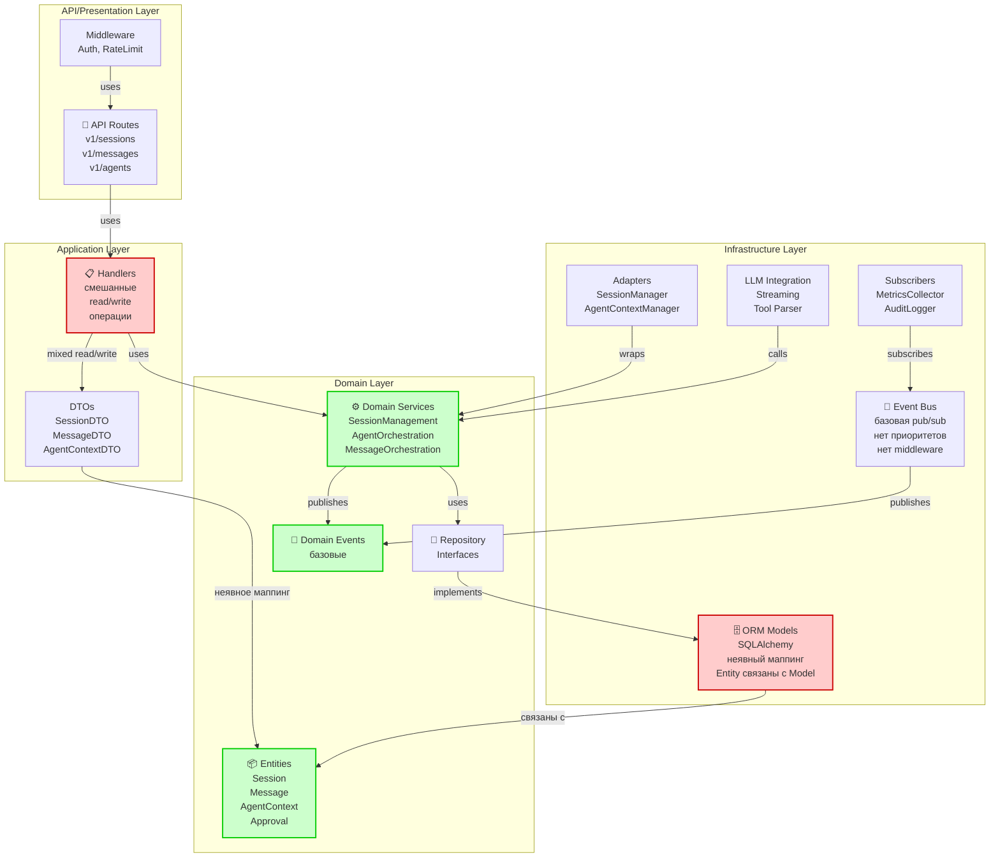

**Характеристики текущей архитектуры:**
- ⚠️ **Handlers смешивают** операции чтения и записи (не явная CQRS)
- ⚠️ **Маппинг неявный** - Entity ↔ Model связь не всегда четкая
- ⚠️ **Event Bus базовая** - нет приоритетов, middleware, wildcard подписок
- ⚠️ **Нет явного управления конкурентностью** на уровне сессий
- ⚠️ **Domain слой может случайно использовать** ORM модели
- ✅ **Event-driven система** уже реализована
- ✅ **Domain Services** хорошо структурированы

---

## 2. Целевая архитектура (после внедрения best practices)

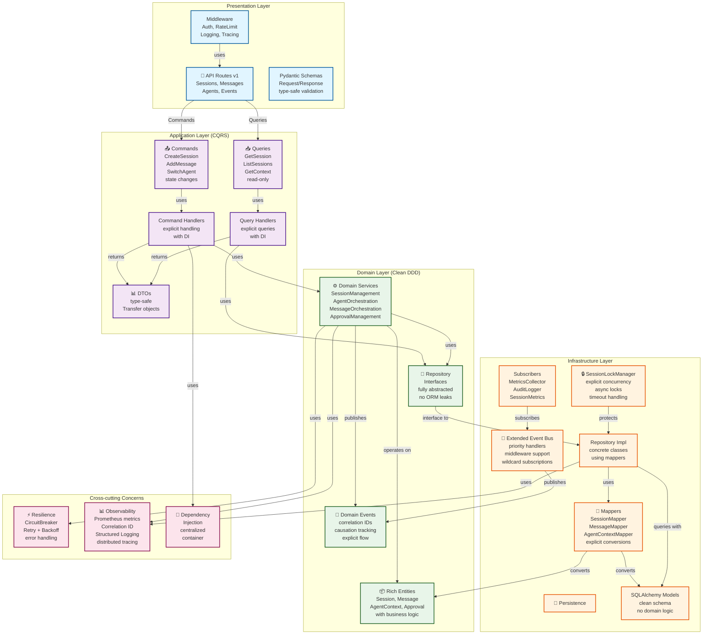

**Преимущества целевой архитектуры:**
- ✅ **CQRS явная** - четкое разделение Commands и Queries
- ✅ **Mappers явные** - полная изоляция Domain от Infrastructure  
- ✅ **SessionLockManager** - явное управление конкурентностью
- ✅ **Event Bus расширенная** - приоритеты, middleware, wildcard
- ✅ **Resilience patterns** - Circuit Breaker, exponential backoff
- ✅ **Observability** - Prometheus, correlation ID, structured logging
- ✅ **Clean Architecture** - идеальное разделение слоев
- ✅ **DDD** - богатые entities, domain services, domain events
- ✅ **Type-safe** - Pydantic models, type hints везде

---

## 3. Сравнение зависимостей: Before vs After

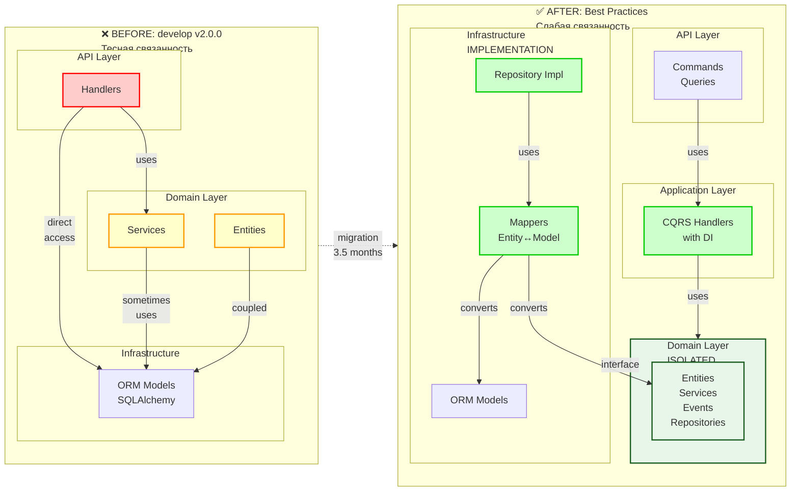

**Ключевые отличия:**

| Аспект | Before | After |
|--------|--------|-------|
| **Связанность слоев** | Тесная | Слабая (через интерфейсы) |
| **Domain изоляция** | Неполная (ORM утечки) | Полная (через Mappers) |
| **Entity в Domain** | Знает про ORM | Не знает про ORM |
| **Обработка команд** | Смешанная (read/write) | Разделенная (Commands/Queries) |
| **Маппинг данных** | Неявный | Явный (Mappers) |
| **Конкурентность** | На уровне БД | На уровне приложения |

---

## 4. Слой-за-слоем: От текущего к целевому

### API/Presentation Layer

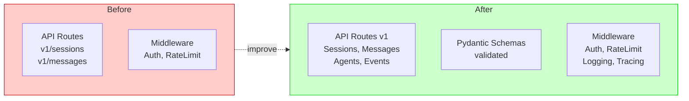

**Улучшения:**
- Добавить Pydantic Schemas для API
- Добавить logging middleware
- Добавить tracing support

---

### Application Layer

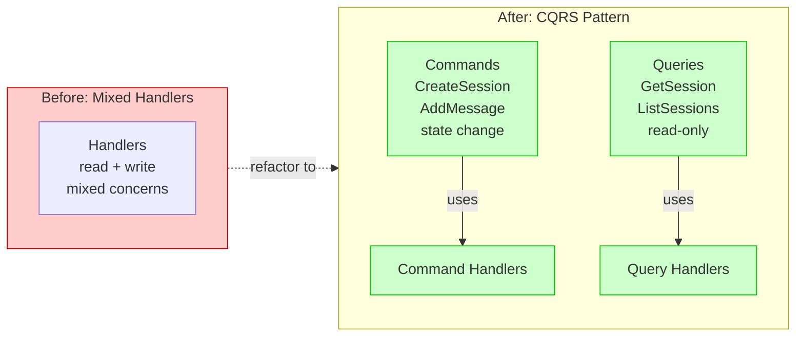

**Улучшения:**
- Разделить handlers на Commands и Queries
- Явная CQRS реализация
- Добавить Command/Query Handlers
- Централизованное управление DI

---

### Domain Layer

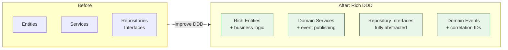

**Улучшения:**
- Обогатить Entities бизнес-логикой
- Улучшить Domain Services
- Явные Domain Events
- Корреляционные ID для трейсинга

---

### Infrastructure Layer

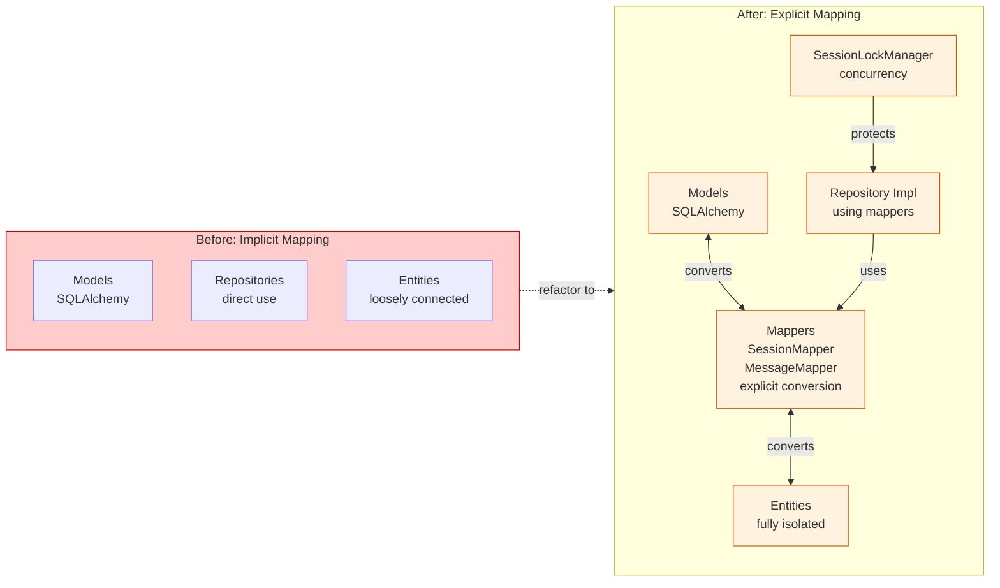

**Улучшения:**
- Явные Mappers для Entity ↔ Model
- SessionLockManager для конкурентности
- Расширенный Event Bus (приоритеты, middleware)
- Улучшенная структура Repository

---

## 5. Как зависимости изменяются по фазам

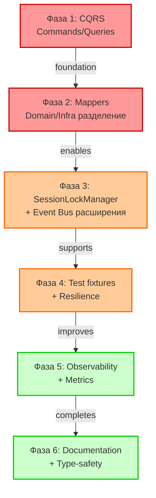

---

## 6. Dependency Injection Flow

### Before: Loose DI

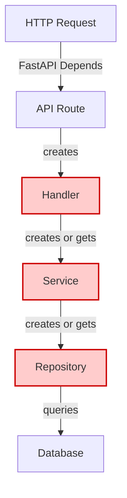

### After: Centralized DI Container

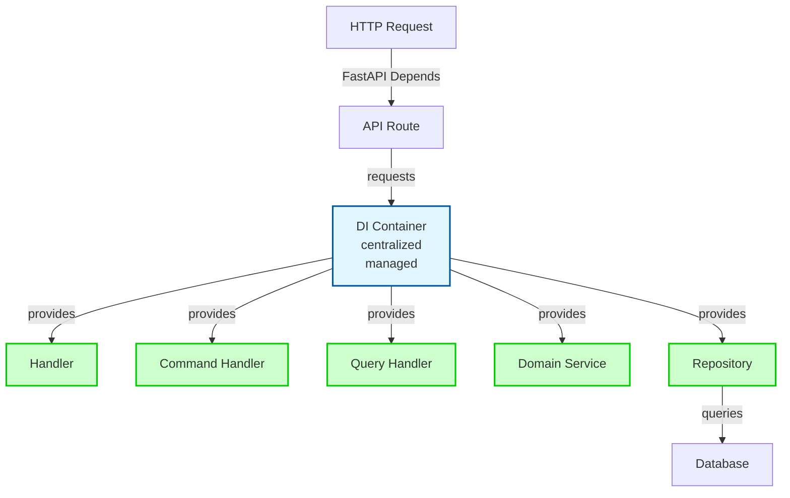

---

## 7. Event Flow: Before vs After

### Before: Simple Event Bus

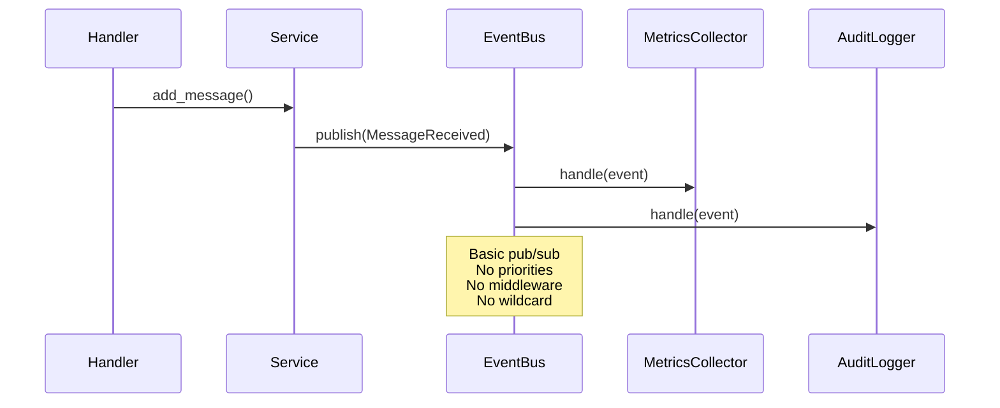

### After: Advanced Event Bus

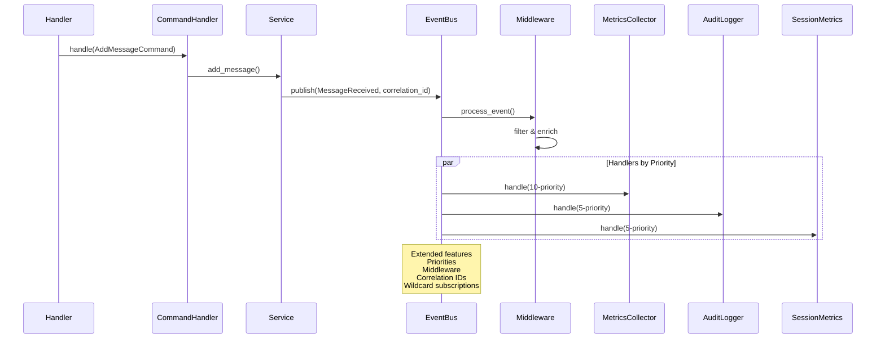

---

## 8. Clean Architecture Compliance

```mermaid
graph TB
    subgraph before["Before: Clean Architecture<br/>Compliance: 85%"]
        direction LR
        API_B["API Layer"]
        App_B["Application"]
        Domain_B["Domain<br/>⚠️ ORM leaks"]
        Infra_B["Infrastructure"]
        
        API_B -->|depends| App_B
        App_B -->|depends| Domain_B
        Domain_B -->|✗ violates| Infra_B
        Infra_B -->|provides| Domain_B
    end
    
    subgraph after["After: Clean Architecture<br/>Compliance: 100%"]
        direction LR
        API_A["API Layer"]
        App_A["Application"]
        Domain_A["Domain<br/>✅ fully isolated"]
        Infra_A["Infrastructure"]
        
        API_A -->|depends| App_A
        App_A -->|depends| Domain_A
        Domain_A -->|interface| Infra_A
        Infra_A -->|implements| Domain_A
    end
    
    classDef bad fill:#ffcccc,stroke:#cc0000,stroke-width:2px
    classDef good fill:#ccffcc,stroke:#00cc00,stroke-width:2px
    class Domain_B bad
    class Domain_A good
```

---

**Заключение:**

Переход от текущей архитектуры к целевой обеспечивает:
1. ✅ **100% Clean Architecture Compliance** - полная изоляция слоев
2. ✅ **Явная CQRS** - четкое разделение read/write операций
3. ✅ **Полная типизация** - type-safe код
4. ✅ **Лучшая масштабируемость** - ready для горизонтального масштабирования
5. ✅ **Улучшенная поддерживаемость** - лучше для новых разработчиков

**Документ подготовлен:** 27 января 2026  
**Версия:** 1.0
