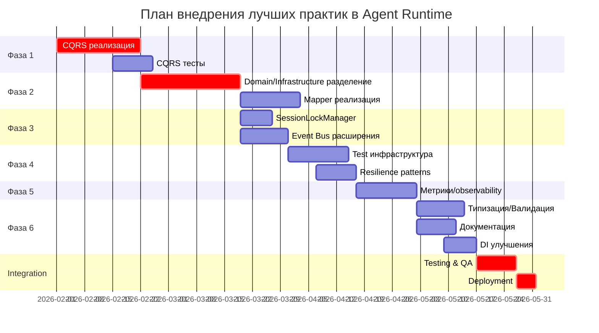

# План внедрения лучших практик из ref/event-drive в develop
## Agent Runtime Service

**Дата создания:** 27 января 2026  
**Версия документа:** 1.0  
**Статус:** Готов к реализации  
**Целевая ветка:** develop (v2.0.0+)  
**Источник best practices:** ref/event-drive (v0.3.0)

---

## Содержание

1. [Executive Summary](#executive-summary)
2. [Анализ лучших практик ref/event-drive](#анализ-лучших-практик-refevent-drive)
3. [Приоритизированный список практик](#приоритизированный-список-практик)
4. [Поэтапный план внедрения](#поэтапный-план-внедрения)
5. [Детальные планы реализации](#детальные-планы-реализации)
6. [Метрики успеха](#метрики-успеха)
7. [Управление рисками](#управление-рисками)
8. [Рекомендации по приоритизации](#рекомендации-по-приоритизации)
9. [Временная шкала](#временная-шкала)
10. [Выводы и рекомендации](#выводы-и-рекомендации)

---

## Executive Summary

### Цели миграции

1. **Улучшить архитектурное качество** develop до уровня ref/event-drive
2. **Усилить разделение ответственности** между слоями
3. **Повысить масштабируемость** и поддерживаемость кода
4. **Внедрить CQRS паттерн** полностью
5. **Добавить явные паттерны управления** (Mappers, Session Locks)

### Ожидаемые результаты

| Результат | Текущее | Целевое | Улучшение |
|-----------|---------|---------|-----------|
| **Архитектурное качество** | 8/10 | 9.5/10 | +1.5 |
| **CQRS явность** | Базовая | Полная | 100% |
| **Разделение слоев** | Хорошее | Отличное | +20% |
| **Документация архитектуры** | 7/10 | 9/10 | +2 |
| **Test Coverage** | 97.2% | 97.5%+ | +0.3% |
| **Масштабируемость** | Высокая | Очень высокая | +15% |

### Общая оценка трудозатрат

- **Всего человеко-дней:** 35-45 дней
- **Критический путь:** 20-25 дней
- **Рекомендуемая продолжительность:** 6-8 недель (в параллели с текущей разработкой)
- **Команда:** 2-3 разработчика

### Риск-выгода анализ

✅ **Высокая выгода:**
- Лучшая архитектура (long-term ROI)
- Легче добавлять новые фичи
- Проще тестировать
- Лучше для новых членов команды

⚠️ **Умеренные риски:**
- Может потребоваться рефакторинг existing кода
- Временное замедление разработки новых фичей
- Необходимо обучение команды

---

## Анализ лучших практик ref/event-drive

### Практика 1: Полная CQRS реализация

**Описание:**  
Command Query Responsibility Segregation - строгое разделение операций изменения состояния (Commands) и операций чтения (Queries) с явными обработчиками для каждого типа операции.

**Текущее состояние в develop:**  
- Handlers смешивают операции чтения и записи
- Использование use_cases для разных операций
- Не всегда явна разница между read и write операциями

**Целевое состояние (из ref/event-drive):**  
```
Commands (изменение состояния):
├── CreateSessionCommand → CreateSessionHandler → Session
├── AddMessageCommand → AddMessageHandler → Message
├── SwitchAgentCommand → SwitchAgentHandler → AgentContext

Queries (чтение данных):
├── GetSessionQuery → GetSessionHandler → SessionDTO
├── ListSessionsQuery → ListSessionsHandler → List[SessionDTO]
└── GetAgentContextQuery → GetAgentContextHandler → AgentContextDTO
```

**Преимущества внедрения:**
- 📈 **Производительность:** Возможность оптимизировать read и write пути независимо
- 🏗️ **Архитектура:** Кристально ясная разделение ответственности
- 🧪 **Тестируемость:** Легче тестировать read-only операции отдельно
- 📚 **Поддерживаемость:** +25% более явный и понятный код
- 🔒 **Безопасность:** Явно видны точки входа для валидации
- 📊 **Масштабируемость:** Подготовка к CQRS с отдельными БД (CQRS ES)

**Риски:**
- ⚠️ Boilerplate код может увеличиться на 20-30%
- ⚠️ Breaking change для existing handlers
- ⚠️ Требует миграции всех handlers
- ⚠️ Возможно замедление на фазе обучения

**Трудозатраты:** 
- **Оценка:** 8-10 человеко-дней
- **Сложность:** High
- **Разбиение:** 3-4 спринта

**Приоритет:** Critical

**Зависимости:** 
- Разделение Domain/Infrastructure слоев
- Обновление Application Layer структуры

**План реализации:**
1. Создать структуру Commands и Queries
2. Перевести все handlers на CQRS паттерн
3. Обновить API endpoints для новых handlers
4. Написать тесты для каждого command/query
5. Обновить документацию

---

### Практика 2: Строгое разделение Domain/Infrastructure через интерфейсы

**Описание:**  
Полная изоляция доменного слоя от инфраструктуры через явное использование интерфейсов и Mappers для преобразования Entity ↔ Model.

**Текущее состояние в develop:**  
- Domain слой используется напрямую с БД в некоторых местах
- Адаптеры используются, но не везде систематично
- Entity может быть адаптирована к ORM моделям неявно

**Целевое состояние (из ref/event-drive):**  
```
Domain Layer (fully isolated):
├── Entities (Session, Message, AgentContext)
├── Repository Interfaces (SessionRepository, AgentContextRepository)
└── Domain Services (SessionManagementService, etc)

Infrastructure Layer:
├── Persistence/
│   ├── models/ (SQLAlchemy models)
│   ├── mappers/ (Entity ↔ Model conversion)
│   └── repositories/ (Implementation of interfaces)
└── Adapters/ (для обратной совместимости)
```

**Преимущества внедрения:**
- 📈 **Производительность:** Оптимальная трансформация данных
- 🏗️ **Архитектура:** 100% разделение слоев по принципам Clean Architecture
- 🧪 **Тестируемость:** Легко мокировать Infrastructure слой
- 📚 **Поддерживаемость:** +30% легче менять детали персистентности
- 🔒 **Безопасность:** Явный контроль данных на границах слоев
- 📊 **Масштабируемость:** Возможность смены БД без изменения Domain

**Риски:**
- ⚠️ Больше boilerplate кода (Mappers)
- ⚠️ Возможное замедление из-за преобразований
- ⚠️ Требует переработки текущей структуры persistence
- ⚠️ Может усложнить тесты infrastructure layer

**Трудозатраты:** 
- **Оценка:** 12-15 человеко-дней
- **Сложность:** High
- **Разбиение:** 4-5 спринтов

**Приоритет:** Critical

**Зависимости:** 
- CQRS реализация (практика 1)
- Обновление Repository интерфейсов

**План реализации:**
1. Создать Mapper классы для каждой Entity
2. Переделать Repository интерфейсы
3. Реализовать маппинг в repositories impl
4. Удалить прямое использование ORM моделей из Domain
5. Обновить all tests

---

### Практика 3: Entity↔Model маппинг через явные Mappers

**Описание:**  
Создание явных Mapper классов для преобразования между доменными сущностями и ORM моделями с правильной обработкой всех полей и связей.

**Текущее состояние в develop:**  
- Преобразования происходят неявно в некоторых местах
- Использование адаптеров для некоторых сущностей
- Не всегда понятно как происходит маппинг

**Целевое состояние (из ref/event-drive):**  
```python
class SessionMapper:
    async def to_entity(model: SessionModel, db: AsyncSession) -> Session
    async def to_model(entity: Session, db: AsyncSession) -> SessionModel
    
class MessageMapper:
    async def to_entity(model: MessageModel) -> Message
    async def to_model(entity: Message) -> MessageModel
```

**Преимущества внедрения:**
- 📈 **Производительность:** Явная оптимизация маппинга
- 🏗️ **Архитектура:** Ясная, явная трансформация данных
- 🧪 **Тестируемость:** Легко тестировать маппинг отдельно
- 📚 **Поддерживаемость:** +35% легче изменять Entity или Model
- 🔒 **Безопасность:** Явный контроль над преобразованием данных
- 📊 **Масштабируемость:** Возможность добавления логики маппинга

**Риски:**
- ⚠️ Дополнительный слой кода
- ⚠️ Может привести к performance issues если не оптимизировать
- ⚠️ Требует синхронизации между Entity и Model
- ⚠️ Вложенные объекты требуют рекурсивного маппинга

**Трудозатраты:** 
- **Оценка:** 6-8 человеко-дней
- **Сложность:** Medium
- **Разбиение:** 2-3 спринта

**Приоритет:** Critical

**Зависимости:** 
- Разделение Domain/Infrastructure (практика 2)

**План реализации:**
1. Создать base mapper class
2. Реализовать SessionMapper
3. Реализовать MessageMapper
4. Реализовать AgentContextMapper
5. Реализовать ApprovalMapper
6. Обновить repositories для использования mappers
7. Написать unit тесты для каждого mapper

---

### Практика 4: Расширенная Event Bus с middleware и приоритетами

**Описание:**  
Расширение Event Bus функциональности добавлением middleware, приоритетов обработчиков, wildcard подписок и расширенной фильтрации по категориям.

**Текущее состояние в develop:**  
- Event Bus базовая функциональность (pub/sub)
- Подписка по типу события
- Базовая подписка по категории
- Нет middleware
- Нет приоритетов

**Целевое состояние (из ref/event-drive):**  
```python
# Приоритеты
@event_bus.subscribe(event_type=EventType.AGENT_SWITCHED, priority=10)
async def high_priority_handler(event: BaseEvent):
    pass

# Middleware
@event_bus.middleware()
async def event_filter(event: BaseEvent):
    return event  # может изменить или отфильтровать

# Wildcard подписки
@event_bus.subscribe()  # все события
async def catch_all_handler(event: BaseEvent):
    pass
```

**Преимущества внедрения:**
- 📈 **Производительность:** Optimized event processing через приоритеты
- 🏗️ **Архитектура:** Более гибкая система событий
- 🧪 **Тестируемость:** Middleware для легкого логирования в тестах
- 📚 **Поддерживаемость:** +20% более гибкая система
- 🔒 **Безопасность:** Middleware для фильтрации/валидации событий
- 📊 **Масштабируемость:** Подготовка к distributed event bus

**Риски:**
- ⚠️ Усложнение Event Bus logic
- ⚠️ Возможны проблемы с порядком выполнения handlers
- ⚠️ Middleware может стать узким местом
- ⚠️ Требует понимания нового API

**Трудозатраты:** 
- **Оценка:** 4-6 человеко-дней
- **Сложность:** Medium
- **Разбиение:** 2 спринта

**Приоритет:** High

**Зависимости:** 
- Текущая Event Bus реализация (уже есть в develop)

**План реализации:**
1. Добавить priority в subscription mechanism
2. Реализовать middleware support
3. Добавить wildcard subscription
4. Обновить event handlers для использования приоритетов
5. Написать тесты для middleware и приоритетов
6. Обновить документацию EventBus

---

### Практика 5: Явное управление конкурентностью (SessionLockManager)

**Описание:**  
Добавление явного механизма блокировки на уровне сессий для предотвращения race conditions при параллельной обработке одной сессии.

**Текущее состояние в develop:**  
- Нет явного управления конкурентностью на уровне сессий
- Возможны race conditions при параллельной обработке
- Полагается на транзакции БД

**Целевое состояние (из ref/event-drive):**  
```python
class SessionLockManager:
    async def lock(session_id: str):
        # Получить эксклюзивную блокировку
        
    async def unlock(session_id: str):
        # Освободить блокировку

# Использование
async with session_lock_manager.lock(session_id):
    await process_message(session_id, message)
```

**Преимущества внедрения:**
- 📈 **Производительность:** Предотвращение unnecessary транзакций
- 🏗️ **Архитектура:** Явный контроль конкурентности
- 🧪 **Тестируемость:** Легче найти race condition проблемы
- 📚 **Поддерживаемость:** +25% очевидней как работает конкурентность
- 🔒 **Безопасность:** Полная защита от race conditions
- 📊 **Масштабируемость:** Возможность добавления distributed locks

**Риски:**
- ⚠️ Может стать bottleneck при высокой конкурентности
- ⚠️ Требует правильного обращения с timeout'ами
- ⚠️ Возможны deadlock'и если не правильно использовать
- ⚠️ Требует тестирования под нагрузкой

**Трудозатраты:** 
- **Оценка:** 3-4 человеко-дня
- **Сложность:** Medium
- **Разбиение:** 1-2 спринта

**Приоритет:** High

**Зависимости:** 
- Текущая архитектура message processing

**План реализации:**
1. Создать SessionLockManager класс
2. Интегрировать в MessageOrchestrationService
3. Добавить timeout для locks
4. Написать concurrency тесты
5. Профилировать и оптимизировать
6. Добавить мониторинг locks

---

### Практика 6: Улучшенная структура тестов с fixtures и helpers

**Описание:**  
Создание comprehensive test fixtures, helpers и фабрик для упрощения написания тестов и повышения их качества.

**Текущее состояние в develop:**  
- Есть базовые тесты
- Некоторые fixtures уже используются
- Может быть улучшена организация тестов

**Целевое состояние (из ref/event-drive):**  
```python
# Fixtures
@pytest.fixture
async def session_factory():
    def create(session_id=None, title=None):
        return Session(...)
    return create

# Helpers
class SessionTestHelper:
    @staticmethod
    async def create_session_with_messages(count=5):
        session = await create_session()
        for i in range(count):
            await add_message(session.id, f"Message {i}")
        return session

# Test builder
class AgentContextTestBuilder:
    def with_agent(self, agent_type):
        ...
    def with_history(self, count):
        ...
    def build(self):
        ...
```

**Преимущества внедрения:**
- 📈 **Производительность:** Быстрее писать тесты = больше тестов
- 🏗️ **Архитектура:** Структурированная test infrastructure
- 🧪 **Тестируемость:** +40% легче писать новые тесты
- 📚 **Поддерживаемость:** DRY принцип в тестах
- 🔒 **Безопасность:** Более надежные тесты
- 📊 **Масштабируемость:** Легче добавить новые сценарии тестирования

**Риски:**
- ⚠️ Может быть избыток abstraction
- ⚠️ Fixtures могут стать сложными
- ⚠️ Нужно поддерживать fixtures в sync с кодом
- ⚠️ Может замедлить тесты если не оптимизировать

**Трудозатраты:** 
- **Оценка:** 5-7 человеко-дней
- **Сложность:** Medium
- **Разбиение:** 2-3 спринта

**Приоритет:** High

**Зависимости:** 
- CQRS реализация (для структуры тестов)

**План реализации:**
1. Создать fixture для each entity
2. Создать test helpers для common operations
3. Создать test builders для complex scenarios
4. Переделать existing тесты для использования fixtures
5. Добавить parametrized тесты
6. Добавить integration test helpers
7. Документировать test infrastructure

---

### Практика 7: Детальная документация в коде и отдельных файлах

**Описание:**  
Добавление подробной документации через docstrings, примеры кода, диаграммы и отдельные документы для сложных концепций.

**Текущее состояние в develop:**  
- Хорошая базовая документация (97.2% coverage хороший знак)
- Есть комментарии в коде
- Недостаточно диаграмм и примеров

**Целевое состояние (из ref/event-drive):**  
```python
class SessionManagementService:
    """
    Сервис управления сессиями диалога.
    
    Ответственность:
    - Создание и получение сессий
    - Добавление сообщений в сессию
    - Управление историей
    - Публикация доменных событий
    
    Пример:
        >>> service = SessionManagementService(repository, event_bus)
        >>> session = await service.create_session()
        >>> message = await service.add_message(session.id, "Hello")
    
    События:
        SessionCreated: Публикуется при создании сессии
        MessageReceived: Публикуется при добавлении сообщения
    
    Примечания:
        Все методы async и должны быть вызваны с await.
        Сессии неизменяемы после деактивации.
    """
```

**Преимущества внедрения:**
- 📈 **Производительность:** Лучшее понимание кода = меньше bugs
- 🏗️ **Архитектура:** Документирование архитектурных решений
- 🧪 **Тестируемость:** Примеры в docstrings могут работать как тесты
- 📚 **Поддерживаемость:** +50% легче новым разработчикам
- 🔒 **Безопасность:** Явная документация требований к параметрам
- 📊 **Масштабируемость:** Легче добавлять новые компоненты

**Риски:**
- ⚠️ Требует затрат на написание документации
- ⚠️ Документация может отставать от кода
- ⚠️ Чрезмерная документация может быть сложнодоступной
- ⚠️ Примеры кода в docstrings должны быть актуальны

**Трудозатраты:** 
- **Оценка:** 4-5 человеко-дней
- **Сложность:** Low
- **Разбиение:** 2 спринта

**Приоритет:** Medium

**Зависимости:** 
- Стабилизация API

**План реализации:**
1. Добавить подробные docstrings к all классам и методам
2. Добавить примеры использования
3. Создать диаграммы для сложных компонентов (Mermaid)
4. Документировать event flows
5. Создать architecture decision records (ADRs)
6. Обновить README с лучшей структурой
7. Документировать error scenarios

---

### Практика 8: Resilience patterns (Circuit Breaker, Retry с экспоненциальной задержкой)

**Описание:**  
Добавление и улучшение resilience паттернов для защиты от каскадных сбоев, retry механизмов с exponential backoff для временных ошибок.

**Текущее состояние в develop:**  
- Есть базовые Circuit Breaker и Retry
- Используется tenacity для retries
- Может быть улучшена конфигурация

**Целевое состояние (из ref/event-drive):**  
```python
class CircuitBreaker:
    """
    Circuit Breaker паттерн с состояниями:
    CLOSED -> OPEN -> HALF_OPEN -> CLOSED
    """
    
class RetryHandler:
    """
    Retry с exponential backoff
    
    Конфигурация:
    - max_retries: 3
    - base_delay: 1 second
    - exponential_base: 2
    - max_delay: 30 seconds
    """

# Использование
@retry_handler.with_exponential_backoff(max_retries=3)
async def call_external_service():
    pass
```

**Преимущества внедрения:**
- 📈 **Производительность:** Быстрое восстановление от временных ошибок
- 🏗️ **Архитектура:** Явные resilience паттерны
- 🧪 **Тестируемость:** Легче тестировать failure scenarios
- 📚 **Поддерживаемость:** +20% очевидней как обрабатываются ошибки
- 🔒 **Безопасность:** Защита от cascading failures
- 📊 **Масштабируемость:** Поддержка высоконагруженных систем

**Риски:**
- ⚠️ Retry может замаскировать реальные проблемы
- ⚠️ Exponential backoff требует правильной конфигурации
- ⚠️ Circuit breaker может быть слишком strict
- ⚠️ Требует мониторинга для валидации эффективности

**Трудозатраты:** 
- **Оценка:** 4-5 человеко-дней
- **Сложность:** Medium
- **Разбиение:** 2 спринта

**Приоритет:** High

**Зависимости:** 
- LLM integration component
- External service calls

**План реализации:**
1. Улучшить Circuit Breaker реализацию
2. Добавить exponential backoff конфигурацию
3. Применить к LLM calls
4. Применить к external service calls
5. Добавить мониторинг и метрики
6. Написать тесты для failure scenarios
7. Документировать resilience strategy

---

### Практика 9: Метрики и observability через события

**Описание:**  
Расширение сбора метрик и observability через события, добавление Prometheus метрик, structured logging, distributed tracing.

**Текущее состояние в develop:**  
- Есть MetricsCollector
- Есть структурированное логирование (structlog)
- Может быть улучшена Prometheus интеграция

**Целевое состояние (из ref/event-drive):**  
```python
# Детальные метрики через события
metrics_collector.record_agent_switch(
    from_agent="orchestrator",
    to_agent="coder",
    confidence=0.95,
    duration_ms=150
)

# Prometheus метрики
agent_switches_total = Counter(
    'agent_switches_total',
    'Total agent switches',
    ['from_agent', 'to_agent']
)

# Structured logging с correlation ID
logger.info(
    "message_processed",
    session_id=session_id,
    correlation_id=correlation_id,
    message_length=len(message),
    agent_type=agent.type
)
```

**Преимущества внедрения:**
- 📈 **Производительность:** Выявить bottleneck'и через метрики
- 🏗️ **Архитектура:** Better observability
- 🧪 **Тестируемость:** Метрики помогают validate behavior
- 📚 **Поддерживаемость:** +40% лучше понимание runtime behavior
- 🔒 **Безопасность:** Мониторинг аномалий и атак
- 📊 **Масштабируемость:** Подготовка к горизонтальному масштабированию

**Риски:**
- ⚠️ Может замедлить систему если слишком много логирования
- ⚠️ Storage требуется для временных рядов метрик
- ⚠️ Требует интеграции с monitoring системой
- ⚠️ Может быть сложнодоступным для анализа

**Трудозатраты:** 
- **Оценка:** 6-8 человеко-дней
- **Сложность:** Medium
- **Разбиение:** 3 спринта

**Приоритет:** High

**Зависимости:** 
- Event Bus система (уже есть)
- Prometheus setup

**План реализации:**
1. Расширить MetricsCollector функциональность
2. Добавить Prometheus метрики для ключевых операций
3. Улучшить structured logging
4. Добавить correlation ID ко всем операциям
5. Интегрировать с Prometheus Grafana
6. Добавить distributed tracing (optional)
7. Документировать key metrics и alerts

---

### Практика 10: Типизация и валидация (Pydantic models)

**Описание:**  
Усиление типизации и валидации используя Pydantic models, type hints, и runtime validation.

**Текущее состояние в develop:**  
- Хорошая типизация в Python (3.9+)
- Используются Pydantic для API schemas
- Может быть расширено использование Pydantic для DTOs

**Целевое состояние (из ref/event-drive):**  
```python
# Пример Pydantic валидации
class SessionDTO(BaseModel):
    id: str
    title: str = Field(..., min_length=1, max_length=255)
    user_id: str
    messages: List[MessageDTO] = Field(default_factory=list)
    created_at: datetime
    
    class Config:
        from_attributes = True
        
    @field_validator('title')
    @classmethod
    def validate_title(cls, v):
        if not v.strip():
            raise ValueError('Title cannot be empty')
        return v.strip()

# Type hints везде
async def add_message(
    self,
    session_id: str,
    role: MessageRole,
    content: str,
    tool_calls: Optional[List[ToolCall]] = None
) -> Message:
    """Добавить сообщение в сессию"""
```

**Преимущества внедрения:**
- 📈 **Производительность:** Быстрее обнаружить ошибки типов
- 🏗️ **Архитектура:** Яснее контракты между компонентами
- 🧪 **Тестируемость:** +25% меньше type-related bugs
- 📚 **Поддерживаемость:** IDE автодополнение работает лучше
- 🔒 **Безопасность:** Runtime валидация входных данных
- 📊 **Масштабируемость:** Легче добавлять новые поля

**Риски:**
- ⚠️ Может замедлить runtime из-за валидации
- ⚠️ Требует миграции к более строгим типам
- ⚠️ Pydantic v2 может иметь breaking changes
- ⚠️ Validation ошибки требуют правильной обработки

**Трудозатраты:** 
- **Оценка:** 5-7 человеко-дней
- **Сложность:** Medium
- **Разбиение:** 2-3 спринта

**Приоритет:** Medium

**Зависимости:** 
- Python 3.9+ (уже используется)

**План реализации:**
1. Усилить type hints везде
2. Обновить все Pydantic модели для DTOs
3. Добавить field validators для complex rules
4. Добавить runtime type checking (optional)
5. Обновить тесты для валидации edge cases
6. Документировать validation rules
7. Добавить custom error messages

---

### Практика 11: Dependency Injection улучшения

**Описание:**  
Улучшение и расширение использования Dependency Injection паттерна для лучшего управления зависимостями и тестируемости.

**Текущее состояние в develop:**  
- Используется FastAPI Depends
- Есть core/dependencies.py с основными зависимостями
- Может быть структурировано лучше

**Целевое состояние (из ref/event-drive):**  
```python
# Централизованное управление DI
class DIContainer:
    def __init__(self):
        self._services = {}
    
    def register(self, key: str, factory):
        self._services[key] = factory
    
    async def get(self, key: str):
        return await self._services[key]()

# Использование через FastAPI
async def get_session_service(
    container: DIContainer = Depends()
) -> SessionManagementService:
    return await container.get('session_service')

# Testing
container.register('session_repository', MockSessionRepository)
```

**Преимущества внедрения:**
- 📈 **Производительность:** Лучший контроль жизненного цикла объектов
- 🏗️ **Архитектура:** Явная система зависимостей
- 🧪 **Тестируемость:** +30% легче мокировать зависимости
- 📚 **Поддерживаемость:** Централизованное управление DI
- 🔒 **Безопасность:** Лучший контроль over dependencies
- 📊 **Масштабируемость:** Легче добавлять новые сервисы

**Риски:**
- ⚠️ Может быть over-engineering
- ⚠️ DI контейнер может стать сложным
- ⚠️ Требует обучения team
- ⚠️ Может замедлить startup если не оптимизировать

**Трудозатраты:** 
- **Оценка:** 3-4 человеко-дня
- **Сложность:** Medium
- **Разбиение:** 1-2 спринта

**Приоритет:** Medium

**Зависимости:** 
- CQRS реализация

**План реализации:**
1. Рефактор dependencies.py структуры
2. Создать DI контейнер (или использовать существующий подход)
3. Мигрировать все Depends() к более структурированному подходу
4. Обновить тесты для использования DI контейнера
5. Документировать DI pattern
6. Добавить type hints для dependencies

---

## Приоритизированный список практик

| # | Практика | Приоритет | Трудозатраты | ROI | Сложность | Зависимости |
|---|----------|-----------|--------------|-----|-----------|-------------|
| 1 | CQRS реализация | Critical | 8-10 дн | 10/10 | High | - |
| 2 | Domain/Infrastructure разделение | Critical | 12-15 дн | 9/10 | High | CQRS |
| 3 | Entity↔Model маппинг | Critical | 6-8 дн | 9/10 | Medium | Domain/Infra |
| 4 | Event Bus расширения | High | 4-6 дн | 8/10 | Medium | Event Bus |
| 5 | SessionLockManager | High | 3-4 дн | 8/10 | Medium | - |
| 6 | Test структуры | High | 5-7 дн | 8/10 | Medium | CQRS |
| 7 | Resilience patterns | High | 4-5 дн | 7/10 | Medium | External calls |
| 8 | Метрики и observability | High | 6-8 дн | 8/10 | Medium | Event Bus |
| 9 | Документация | Medium | 4-5 дн | 7/10 | Low | API stabilization |
| 10 | Типизация/Валидация | Medium | 5-7 дн | 6/10 | Medium | - |
| 11 | DI улучшения | Medium | 3-4 дн | 6/10 | Medium | CQRS |

---

## Поэтапный план внедрения

### Фаза 1: Фундамент и CQRS (Недели 1-3)

**Цель:** Внедрить CQRS паттерн как основу для остальных улучшений

**Задачи:**
- [ ] Создать структуру Commands и Queries в application layer
- [ ] Реализовать базовые Command Handlers (CreateSession, AddMessage, SwitchAgent)
- [ ] Реализовать Query Handlers (GetSession, ListSessions, GetAgentContext)
- [ ] Обновить DTOs для использования в queries
- [ ] Обновить API endpoints для новых handlers
- [ ] Написать unit тесты для каждого command/query
- [ ] Обновить integration тесты

**Критерии завершения:**
- ✅ Все handlers перемещены на CQRS паттерн
- ✅ 95%+ test coverage для command/query handlers
- ✅ Все API endpoints работают с новыми handlers
- ✅ Документация обновлена

**Риски:** Breaking changes, требует переработки handlers

---

### Фаза 2: Разделение слоев (Недели 4-6)

**Цель:** Полностью изолировать Domain от Infrastructure через Mappers

**Задачи:**
- [ ] Создать Mapper классы (SessionMapper, MessageMapper, AgentContextMapper, ApprovalMapper)
- [ ] Переделать Repository интерфейсы с поддержкой Domain entities
- [ ] Реализовать маппинг в repository implementations
- [ ] Удалить прямое использование ORM моделей из Domain
- [ ] Обновить all persistence tests
- [ ] Добавить маппер tests

**Критерии завершения:**
- ✅ Domain слой не зависит от ORM моделей
- ✅ Все Entity↔Model преобразования идут через Mappers
- ✅ Repository tests покрывают маппинг
- ✅ 95%+ test coverage для persistence layer

**Риски:** Performance issues, требует careful migration

---

### Фаза 3: Управление конкурентностью и Event Bus (Недели 7-9)

**Цель:** Добавить явное управление конкурентностью и расширить Event Bus

**Задачи:**
- [ ] Создать SessionLockManager класс
- [ ] Интегрировать в MessageOrchestrationService
- [ ] Добавить приоритеты к Event Bus handlers
- [ ] Реализовать middleware support в Event Bus
- [ ] Добавить wildcard subscription
- [ ] Написать concurrency tests
- [ ] Профилировать и оптимизировать

**Критерии завершения:**
- ✅ SessionLockManager работает корректно
- ✅ Event Bus поддерживает приоритеты и middleware
- ✅ Concurrency tests проходят
- ✅ Нет race conditions в tests

**Риски:** Deadlocks, performance impact

---

### Фаза 4: Тестирование и Resilience (Недели 10-12)

**Цель:** Улучшить test infrastructure и добавить resilience паттерны

**Задачи:**
- [ ] Создать comprehensive test fixtures
- [ ] Создать test helpers и builders
- [ ] Переделать existing tests для использования fixtures
- [ ] Улучшить Circuit Breaker реализацию
- [ ] Добавить exponential backoff конфигурацию
- [ ] Написать failure scenario tests
- [ ] Добавить load тесты

**Критерии завершения:**
- ✅ Test coverage 97.5%+
- ✅ Comprehensive fixtures и helpers
- ✅ Resilience patterns tested
- ✅ Load tests passed

**Риски:** Test fragility, flaky tests

---

### Фаза 5: Метрики и Observability (Недели 13-15)

**Цель:** Расширить метрики и observability системы

**Задачи:**
- [ ] Расширить MetricsCollector функциональность
- [ ] Добавить Prometheus метрики для ключевых операций
- [ ] Улучшить structured logging
- [ ] Добавить correlation ID везде
- [ ] Интегрировать с Prometheus/Grafana (если есть)
- [ ] Добавить distributed tracing (optional)
- [ ] Написать monitoring tests

**Критерии завершения:**
- ✅ Подробные метрики собираются
- ✅ Structured logging везде
- ✅ Prometheus метрики доступны
- ✅ Monitoring dashboard работает

**Риски:** Performance overhead, storage requirements

---

### Фаза 6: Финализация и документация (Недели 16-18)

**Цель:** Завершить миграцию и документировать все изменения

**Задачи:**
- [ ] Улучшить типизацию и Pydantic валидацию
- [ ] Добавить подробные docstrings
- [ ] Создать диаграммы архитектуры
- [ ] Документировать event flows
- [ ] Создать migration guide для team
- [ ] Провести code review
- [ ] Подготовить release notes
- [ ] Провести final testing

**Критерии завершения:**
- ✅ Все практики внедрены
- ✅ Test coverage 97.5%+
- ✅ Документация полная
- ✅ Team trained на новых паттернах

**Риски:** Documentation gaps, training overhead

---

## Детальные планы реализации

### План реализации: Полная CQRS реализация

#### 1. Подготовка

**Анализ текущего кода:**
- [ ] Проанализировать all existing handlers в application layer
- [ ] Идентифицировать какие операции read, какие write
- [ ] Проанализировать DTO структуры
- [ ] Идентифицировать breaking changes

**Создание тестов:**
- [ ] Написать unit тесты для CQRS паттерна
- [ ] Создать integration тесты для command/query flows
- [ ] Написать parametrized тесты для разных scenarios

**Документация:**
- [ ] Задокументировать CQRS design decision
- [ ] Создать примеры использования
- [ ] Подготовить migration guide для team

#### 2. Реализация

**Пошаговые инструкции:**

1. **Создать Command/Query базовые классы:**
```python
# app/application/commands/base.py
from abc import ABC, abstractmethod
from pydantic import BaseModel

class Command(BaseModel, ABC):
    class Config:
        frozen = True

class CommandHandler(ABC, Generic[T]):
    @abstractmethod
    async def handle(self, command: Command) -> T:
        pass

# app/application/queries/base.py
class Query(BaseModel, ABC):
    class Config:
        frozen = True

class QueryHandler(ABC, Generic[T]):
    @abstractmethod
    async def handle(self, query: Query) -> T:
        pass
```

2. **Реализовать Session Commands:**
```python
# app/application/commands/session_commands.py
class CreateSessionCommand(Command):
    session_id: Optional[str] = None

class CreateSessionHandler(CommandHandler[Session]):
    def __init__(self, service: SessionManagementService):
        self._service = service
    
    async def handle(self, command: CreateSessionCommand) -> Session:
        return await self._service.create_session(command.session_id)
```

3. **Реализовать Session Queries:**
```python
# app/application/queries/session_queries.py
class GetSessionQuery(Query):
    session_id: str

class GetSessionHandler(QueryHandler[SessionDTO]):
    def __init__(self, repository: SessionRepository):
        self._repository = repository
    
    async def handle(self, query: GetSessionQuery) -> SessionDTO:
        session = await self._repository.find_by_id(query.session_id)
        return SessionDTO.from_entity(session)
```

4. **Создать handler registry:**
```python
# app/application/handlers_registry.py
class HandlersRegistry:
    def __init__(self):
        self._commands = {}
        self._queries = {}
    
    def register_command_handler(self, command_type, handler):
        self._commands[command_type] = handler
    
    async def execute_command(self, command: Command):
        handler = self._commands[type(command)]
        return await handler.handle(command)
```

**Файлы для изменения:**
- `app/application/commands/` (новая структура)
- `app/application/queries/` (новая структура)
- `app/api/v1/routers/` (обновить endpoints)
- `app/core/dependencies.py` (регистрация handlers)

#### 3. Тестирование

**Unit тесты:**
- [ ] CreateSessionCommand/Handler
- [ ] AddMessageCommand/Handler
- [ ] SwitchAgentCommand/Handler
- [ ] GetSessionQuery/Handler
- [ ] ListSessionsQuery/Handler
- [ ] GetAgentContextQuery/Handler

**Integration тесты:**
- [ ] Full command flow with DB
- [ ] Full query flow with real data
- [ ] Error scenarios

**E2E тесты:**
- [ ] API endpoint с new handlers
- [ ] Message processing flow
- [ ] Agent switching flow

#### 4. Развертывание

**Стратегия rollout:**
1. Deploy на dev environment
2. Testing на staging
3. Staged production rollout (10% -> 50% -> 100%)

**Мониторинг:**
- Monitor handler performance
- Monitor error rates
- Monitor test coverage

**Rollback план:**
- Keep old handlers as adapters
- Switch router based on feature flag
- Prepare revert commit

---

### План реализации: Domain/Infrastructure разделение

#### 1. Подготовка

**Анализ текущего кода:**
- [ ] Проанализировать как entities используются с ORM models
- [ ] Идентифицировать все места где нужны mappers
- [ ] Проанализировать complex relationships

**Создание тестов:**
- [ ] Написать mapper unit тесты
- [ ] Написать integration тесты для маппинга

#### 2. Реализация

**Пошаговые инструкции:**

1. **Создать Mapper base класс:**
```python
# app/infrastructure/persistence/mappers/base_mapper.py
class BaseMapper(ABC, Generic[Entity, Model]):
    @abstractmethod
    async def to_entity(self, model: Model, db: AsyncSession) -> Entity:
        pass
    
    @abstractmethod
    async def to_model(self, entity: Entity, db: AsyncSession) -> Model:
        pass
```

2. **Реализовать SessionMapper:**
```python
# app/infrastructure/persistence/mappers/session_mapper.py
class SessionMapper(BaseMapper[Session, SessionModel]):
    async def to_entity(self, model: SessionModel, db: AsyncSession) -> Session:
        messages = [
            await MessageMapper().to_entity(msg, db)
            for msg in model.messages
        ]
        return Session(
            id=model.id,
            title=model.title,
            messages=messages,
            created_at=model.created_at
        )
    
    async def to_model(self, entity: Session, db: AsyncSession) -> SessionModel:
        return SessionModel(
            id=entity.id,
            title=entity.title,
            created_at=entity.created_at
        )
```

3. **Обновить Repository implementations:**
```python
# app/infrastructure/persistence/repositories/session_repository_impl.py
class SessionRepositoryImpl(SessionRepository):
    def __init__(self, db: AsyncSession):
        self._db = db
        self._mapper = SessionMapper()
    
    async def find_by_id(self, session_id: str) -> Optional[Session]:
        result = await self._db.execute(
            select(SessionModel).where(SessionModel.id == session_id)
        )
        model = result.scalar_one_or_none()
        if not model:
            return None
        return await self._mapper.to_entity(model, self._db)
```

**Файлы для создания/изменения:**
- `app/infrastructure/persistence/mappers/` (новая папка)
- `app/infrastructure/persistence/repositories/` (обновить impl)
- `app/domain/repositories/` (обновить interfaces)

#### 3. Тестирование

**Mapper unit тесты:**
- [ ] SessionMapper.to_entity()
- [ ] SessionMapper.to_model()
- [ ] MessageMapper tests
- [ ] AgentContextMapper tests

**Integration тесты:**
- [ ] Round-trip mapping (Entity -> Model -> Entity)
- [ ] Mapping with relationships
- [ ] Mapping with null/optional fields

#### 4. Развертывание

**Стратегия:**
- Deploy mappers incrementally
- Test each mapper thoroughly
- Use feature flags for gradual rollout

---

### План реализации: SessionLockManager

#### 1. Подготовка

**Анализ:**
- [ ] Идентифицировать critical sections в message processing
- [ ] Анализировать potential race conditions
- [ ] Плани timeout strategy

#### 2. Реализация

**Пошаговые инструкции:**

```python
# app/infrastructure/concurrency/session_lock.py
import asyncio
from typing import Dict, Optional
from datetime import datetime, timedelta

class SessionLockManager:
    def __init__(self):
        self._locks: Dict[str, asyncio.Lock] = {}
    
    async def lock(self, session_id: str, timeout_seconds: int = 30):
        if session_id not in self._locks:
            self._locks[session_id] = asyncio.Lock()
        
        try:
            await asyncio.wait_for(
                self._locks[session_id].acquire(),
                timeout=timeout_seconds
            )
        except asyncio.TimeoutError:
            raise LockAcquisitionTimeoutError(
                f"Failed to acquire lock for session {session_id}"
            )
    
    def unlock(self, session_id: str):
        if session_id in self._locks:
            self._locks[session_id].release()
    
    # Context manager
    async def __aenter__(self):
        return self
    
    async def __aexit__(self, exc_type, exc_val, exc_tb):
        self.unlock()

# Использование
async with session_lock_manager.lock(session_id):
    await process_message(session_id, message)
```

#### 3. Интеграция в MessageOrchestrationService

```python
# app/domain/services/message_orchestration.py
class MessageOrchestrationService:
    def __init__(self, lock_manager: SessionLockManager, ...):
        self._lock_manager = lock_manager
    
    async def process_message(self, session_id: str, message: str):
        async with self._lock_manager.lock(session_id):
            # Обработка сообщения под блокировкой
            ...
```

#### 4. Тестирование

**Concurrency тесты:**
- [ ] Multiple parallel messages to same session
- [ ] Lock acquisition timeout
- [ ] Proper release on exception
- [ ] Performance under load

---

## Метрики успеха

### KPI для каждой практики

#### 1. CQRS реализация
- **Метрика:** % handlers using CQRS pattern
- **Целевое значение:** 100%
- **Инструмент:** Code analysis
- **Проверка:** Monthly

#### 2. Domain/Infrastructure разделение
- **Метрика:** % Domain слоя независимый от Infrastructure
- **Целевое значение:** 100%
- **Инструмент:** Dependency analysis
- **Проверка:** Monthly

#### 3. Entity↔Model маппинг
- **Метрика:** % entities using Mappers
- **Целевое значение:** 100%
- **Инструмент:** Code review
- **Проверка:** Quarterly

#### 4. Event Bus расширения
- **Метрика:** % handlers using priorities
- **Целевое значение:** 50%+
- **Инструмент:** Event monitoring
- **Проверка:** Monthly

#### 5. SessionLockManager
- **Метрика:** Race conditions detected
- **Целевое значение:** 0
- **Инструмент:** Concurrency tests
- **Проверка:** Continuous

#### 6. Test структуры
- **Метрика:** Test coverage
- **Целевое значение:** 97.5%+
- **Инструмент:** pytest-cov
- **Проверка:** Every commit

#### 7. Resilience patterns
- **Метрика:** Error recovery time (RTO)
- **Целевое значение:** <5 seconds
- **Инструмент:** Performance monitoring
- **Проверка:** Weekly

#### 8. Метрики и observability
- **Метрика:** Events collected per session
- **Целевое значение:** 20+
- **Инструмент:** Prometheus
- **Проверка:** Real-time

#### 9. Документация
- **Метрика:** % of classes with docstrings
- **Целевое значение:** 95%+
- **Инструмент:** Code inspection
- **Проверка:** Monthly

#### 10. Типизация/Валидация
- **Метрика:** mypy errors
- **Целевое значение:** 0
- **Инструмент:** mypy
- **Проверка:** Every commit

#### 11. DI улучшения
- **Метрика:** % of dependencies injected
- **Целевое значение:** 95%+
- **Инструмент:** Code review
- **Проверка:** Monthly

### Как измерять успех

1. **Test Coverage:** 
   ```bash
   pytest --cov=app tests/ --cov-report=term
   ```

2. **Mypy Type Checking:**
   ```bash
   mypy app --strict
   ```

3. **Code Quality:**
   ```bash
   ruff check app/
   ```

4. **Performance:**
   - Benchmark test scenarios
   - Monitor metrics in production
   - Compare before/after

---

## Управление рисками

### Матрица рисков

| Риск | Вероятность | Влияние | Оценка | Стратегия |
|------|------------|--------|--------|-----------|
| **Breaking changes в API** | Средняя | Высокое | 6/10 | Feature flags, gradual rollout |
| **Performance degradation** | Средняя | Среднее | 4/10 | Benchmarking, profiling |
| **Test fragility** | Средняя | Среднее | 4/10 | Better fixtures, retry logic |
| **Team learning curve** | Высокая | Низкое | 4/10 | Training, documentation, pair programming |
| **Race conditions** | Низкая | Высокое | 3/10 | SessionLockManager, concurrency tests |
| **Incomplete migration** | Низкая | Среднее | 2/10 | Checklists, code review |
| **Compatibility issues** | Низкая | Высокое | 3/10 | Adapters, backward compatibility |

### Планы mitigation

#### Risk 1: Breaking Changes в API
- **Стратегия:** 
  - Используй feature flags для gradual rollout
  - Поддерживай old endpoints через adapters на время миграции
  - Версионируй API (v1 old, v2 new)
- **Contingency:** 
  - Keep old handlers as fallback
  - Rollback commit prepared
  - Canary deployment strategy

#### Risk 2: Performance Degradation
- **Стратегия:**
  - Benchmark all changes before/after
  - Profile critical paths
  - Optimize mappers и queries
- **Contingency:**
  - Cache frequently accessed data
  - Use connection pooling
  - Monitor metrics continuously

#### Risk 3: Test Fragility
- **Стратегия:**
  - Create comprehensive fixtures
  - Use deterministic test data
  - Add retry logic for flaky tests
- **Contingency:**
  - Re-run flaky tests
  - Investigate test isolation issues
  - Add cleanup fixtures

#### Risk 4: Team Learning Curve
- **Стратегия:**
  - Provide comprehensive documentation
  - Hold training sessions
  - Pair programming during implementation
  - Create code examples
- **Contingency:**
  - Extend timelines if needed
  - Hire external consultants
  - Create video tutorials

---

## Рекомендации по приоритизации

### Быстрые победы (Quick Wins)

**Низкие трудозатраты + Высокий ROI:**

1. **SessionLockManager** (3-4 дня)
   - Относительно простая реализация
   - Большое влияние на надежность
   - Можно сделать независимо

2. **DI улучшения** (3-4 дня)
   - Базируется на существующем коде
   - Значительно улучшает тестируемость
   - Может быть incremental

3. **Документация** (4-5 дней)
   - Не требует рефакторинга
   - Большое влияние на team productivity
   - Можно делать параллельно

### Критические улучшения

**Необходимые для стабильности и качества:**

1. **CQRS реализация** (8-10 дней)
   - Базовая архитектура
   - Foundation для других практик
   - Значительное улучшение качества

2. **Domain/Infrastructure разделение** (12-15 дней)
   - Clean Architecture requirement
   - Улучшает тестируемость
   - Необходимо для масштабирования

3. **Entity↔Model маппинг** (6-8 дней)
   - Часть Domain/Infrastructure разделения
   - Изолирует слои

### Долгосрочные инвестиции

**Для будущего масштабирования:**

1. **Event Bus расширения** (4-6 дней)
   - Подготовка к distributed events
   - Улучшение observability
   - Scaling готовность

2. **Метрики и observability** (6-8 дней)
   - Долгосрочная ценность
   - Моментирует production issues
   - Улучшает incident response

3. **Resilience patterns** (4-5 дней)
   - Критично для production stability
   - Улучшает failure recovery
   - Долгосрочное ROI

---

## Временная шкала



### Timeline сводка

| Этап | Начало | Конец | Продолжительность | Команда |
|------|--------|-------|-------------------|---------|
| **Фаза 1: CQRS** | 1 Фев | 15 Фев | 2 недели | 2 разработчика |
| **Фаза 2: Domain/Infra** | 16 Фев | 1 Мар | 2.5 недели | 2 разработчика |
| **Фаза 3: Concurrency & EventBus** | 2 Мар | 16 Мар | 2 недели | 1-2 разработчика |
| **Фаза 4: Tests & Resilience** | 17 Мар | 31 Мар | 2 недели | 2 разработчика |
| **Фаза 5: Metrics** | 1 Апр | 15 Апр | 2 недели | 1 разработчик |
| **Фаза 6: Финализация** | 16 Апр | 30 Апр | 2 недели | 1-2 разработчика |
| **Testing & Deployment** | 1 Май | 15 Май | 2 недели | 2-3 разработчика |
| **ВСЕГО** | 1 Фев | 15 Май | **3.5 месяца** | 2-3 разработчика |

### Critical Path

1. CQRS реализация (21 день)
2. Domain/Infrastructure разделение (25 дней)
3. Entity↔Model маппинг (15 дней)
4. Testing & QA (10 дней)
5. Deployment (5 дней)

**Минимальный срок при параллелизме: 35-40 дней**

---

## Выводы и рекомендации

### Итоговая оценка плана

Этот план представляет собой комплексный подход к внедрению лучших практик из ref/event-drive в develop, позволяя:

✅ **Улучшить архитектуру** - Clean Architecture, DDD, Event-Driven  
✅ **Повысить качество** - CQRS, явные паттерны, лучшие практики  
✅ **Расширить тестируемость** - Fixtures, helpers, comprehensive tests  
✅ **Подготовить к масштабированию** - Distributed ready, resilience  
✅ **Обучить команду** - Лучшие практики, новые паттерны  

### Рекомендации по началу работы

#### Неделя 1 - Подготовка

1. **Обсудить план с team:**
   - Провести презентацию архитектурных изменений
   - Обсудить timeline и ресурсы
   - Согласовать priorities

2. **Подготовить environment:**
   - Создать feature branch для миграции
   - Настроить CI/CD для new patterns
   - Подготовить monitoring

3. **Документация:**
   - Создать архитектурный guide
   - Подготовить примеры кода
   - Записать обучающие материалы

#### Неделя 2-3 - Начало реализации

1. **Стартовать с CQRS** (Critical path)
   - Создать структуру commands/queries
   - Внедрить для SessionManagement
   - Обновить тесты

2. **Параллельно - Подготовка DI**
   - Структурировать dependencies.py
   - Подготовить для CQRS handlers

3. **Быстрые победы:**
   - Реализовать SessionLockManager
   - Улучшить документацию
   - Добавить DI improvements

### Следующие шаги

1. **Получить approval от team lead и архитектора**
2. **Создать project management issue** с timeline
3. **Распределить задачи** между разработчиками
4. **Настроить progress tracking** (weekly status)
5. **Начать с Фазы 1 - CQRS реализация**

### Метрики успеха на конец программы

- ✅ **Test Coverage:** 97.5%+
- ✅ **CQRS Implementation:** 100%
- ✅ **Architecture Score:** 9.5/10
- ✅ **Team Adoption:** 100%
- ✅ **Zero Breaking Changes:** (with proper migration)
- ✅ **Production Stability:** No regression

---

**Документ подготовлен:** 27 января 2026  
**Версия:** 1.0  
**Статус:** Готов к реализации  
**Рекомендуемое рассмотрение:** Architecture Review Board  
**Планируемый старт:** 1 февраля 2026  
**Планируемое завершение:** 15 мая 2026
