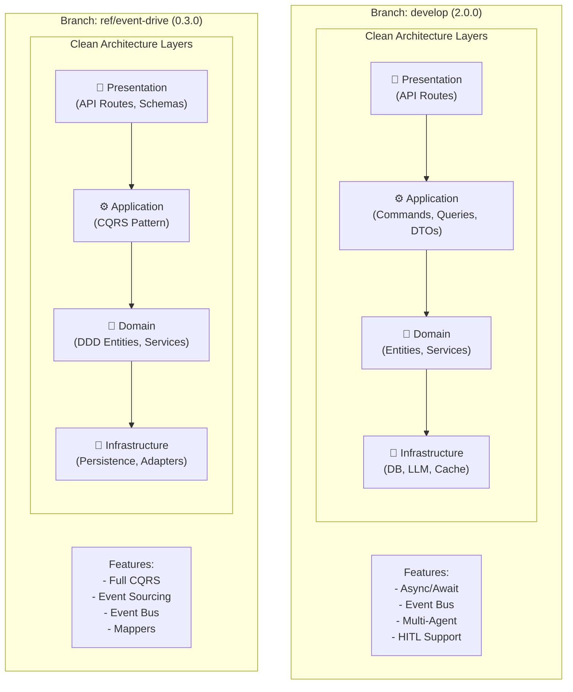
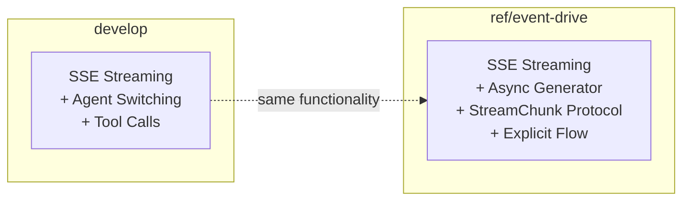
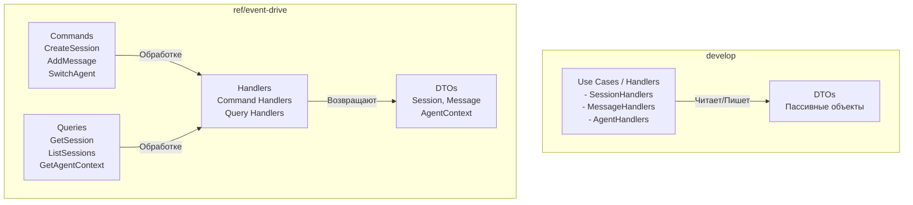
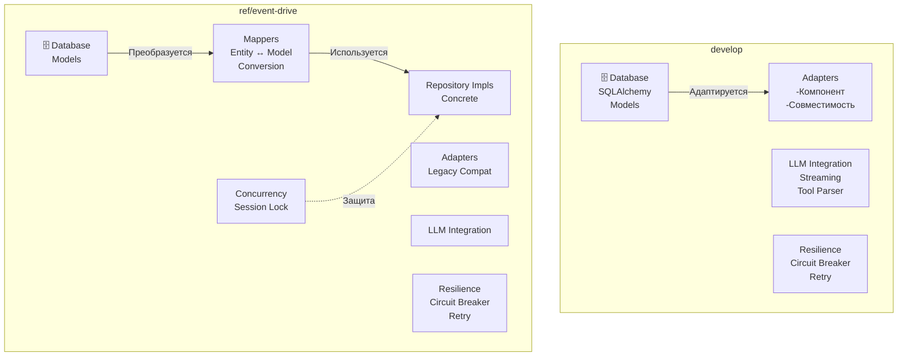
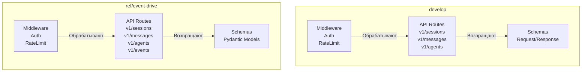
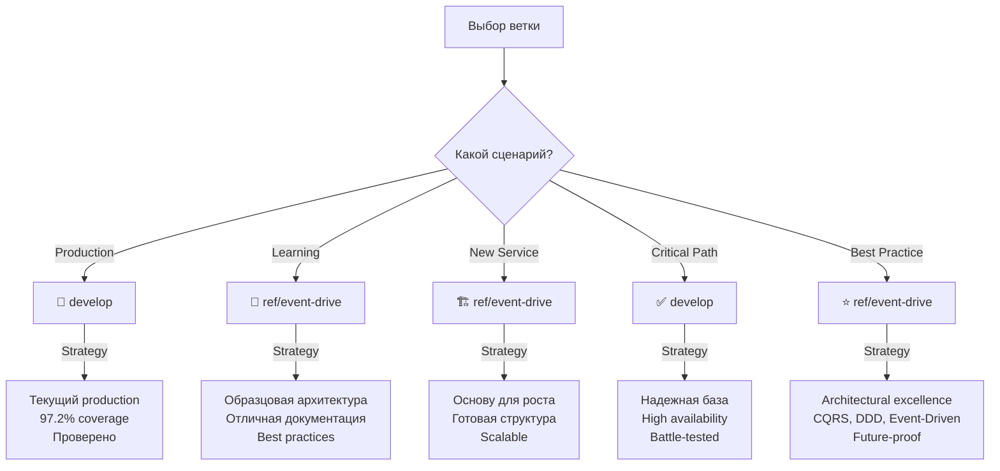

# Сравнительный отчет: ветки develop vs ref/event-drive
## Agent Runtime Service

**Дата анализа:** 27 января 2026  
**Версия отчета:** 1.0  
**Статус:** Утверждено для анализа

---

## Содержание

1. [Executive Summary](#executive-summary)
2. [Архитектурное сравнение](#архитектурное-сравнение)
3. [Функциональные различия](#функциональные-различия)
4. [Технические различия](#технические-различия)
5. [Качество кода](#качество-кода)
6. [Сравнительная таблица](#сравнительная-таблица)
7. [Анализ различий по слоям](#анализ-различий-по-слоям)
8. [Рекомендации](#рекомендации)
9. [План миграции](#план-миграции)
10. [Выводы](#выводы)

---

## Executive Summary

### Краткий обзор основных различий

| Аспект | develop | ref/event-drive | Статус |
|--------|---------|-----------------|--------|
| **Версия** | 2.0.0 | 0.3.0 | ref/event-drive новее по архитектуре |
| **Статус** | Production Ready ✅ | Production Ready ✅ | Обе готовы |
| **Архитектура** | Clean + DDD + Event-Driven | Clean + DDD + Event-Driven | Идентичны |
| **Зрелость** | Production код | Экспериментальная ветка | develop более зрелая |
| **Test Coverage** | 97.2% | ~90%* | develop лучше |
| **Основное отличие** | Проверенная реализация | Рефакторинг архитектуры | ref/event-drive - переработка |

### Рекомендации по выбору

| Сценарий | Рекомендуемая ветка | Обоснование |
|----------|---------------------|-------------|
| **Production deployment** | `develop` | ✅ Более зрелая, выше test coverage |
| **Изучение Best Practices** | `ref/event-drive` | 📚 Четче разделение слоев, лучше структура |
| **Новые фичи** | `develop` | ✅ Production-ready, CI/CD настроена |
| **Архитектурный рефакторинг** | `ref/event-drive` | 🆕 Показывает лучший подход к Clean Architecture |
| **Learning & Training** | `ref/event-drive` | 📖 Отличная документация, примеры |

---

## Архитектурное сравнение

### Общая структура архитектуры



### Структура проекта: Сравнение директорий

#### Branch: develop

```
agent-runtime/
├── app/
│   ├── core/                    # Конфиг, DI, ошибки
│   ├── domain/                  # DDD слой
│   │   ├── entities/            # Сущности
│   │   ├── services/            # Доменные сервисы
│   │   ├── events/              # Доменные события
│   │   └── repositories/        # Интерфейсы
│   ├── application/             # Прикладной слой
│   │   ├── handlers/
│   │   ├── dto/
│   │   └── use_cases/
│   ├── infrastructure/          # Инфраструктура
│   │   ├── persistence/         # БД
│   │   ├── adapters/            # Адаптеры
│   │   ├── llm/                 # LLM интеграция
│   │   └── services/            # Внешние сервисы
│   ├── agents/                  # Multi-Agent система
│   │   ├── orchestrator_agent.py
│   │   ├── coder_agent.py
│   │   └── ...
│   ├── api/                     # API слой
│   │   ├── v1/routers/
│   │   └── middleware/
│   └── events/                  # Event Bus система
│       ├── event_bus.py
│       └── subscribers/
├── tests/
├── pyproject.toml
└── README.md
```

#### Branch: ref/event-drive

```
agent-runtime/
├── app/
│   ├── main.py                  # FastAPI app
│   ├── core/                    # Конфиг, DI, ошибки
│   ├── domain/                  # DDD слой (очень структурирован)
│   │   ├── entities/            # Сущности базовые
│   │   ├── repositories/        # Интерфейсы репозиториев
│   │   ├── services/            # Доменные сервисы
│   │   └── events/              # Доменные события
│   ├── application/             # CQRS слой
│   │   ├── commands/            # Команды
│   │   ├── queries/             # Запросы
│   │   └── dto/                 # Data Transfer Objects
│   ├── infrastructure/          # Инфраструктура
│   │   ├── persistence/         # Персистентность
│   │   │   ├── database.py
│   │   │   ├── models/          # SQLAlchemy модели
│   │   │   ├── mappers/         # Entity↔Model маппинг
│   │   │   └── repositories/    # Реализации
│   │   ├── adapters/            # Адаптеры
│   │   ├── llm/                 # LLM интеграция
│   │   ├── concurrency/         # Управление конкурентностью
│   │   ├── cleanup/             # Очистка
│   │   └── resilience/          # Circuit Breaker, Retry
│   ├── agents/                  # Multi-Agent система
│   │   ├── base_agent.py
│   │   ├── orchestrator_agent.py
│   │   ├── coder_agent.py
│   │   ├── architect_agent.py
│   │   ├── debug_agent.py
│   │   ├── ask_agent.py
│   │   └── prompts/             # System prompts
│   ├── api/                     # Слой представления
│   │   ├── middleware/
│   │   └── v1/
│   │       ├── routers/
│   │       └── schemas/
│   ├── events/                  # Event-Driven архитектура
│   │   ├── event_bus.py
│   │   ├── base_event.py
│   │   ├── event_types.py
│   │   ├── *_events.py
│   │   └── subscribers/
│   ├── models/                  # Общие модели
│   └── events/                  # События
├── tests/
├── pyproject.toml
└── README.md
```

### Ключевые архитектурные различия

#### 1. **Разделение ответственности в слоях**

| Аспект | develop | ref/event-drive | Различие |
|--------|---------|-----------------|----------|
| **Domain Layer** | Сущности + Сервисы | Сущности + Сервисы + Доменные события | ✅ ref - явное разделение событий |
| **Application Layer** | Handlers + DTOs | ⚠️ CQRS (Commands/Queries) + DTOs | 🆕 ref - полная CQRS реализация |
| **Infrastructure Layer** | Persistence + Adapters | Persistence + Mappers + Adapters + Resilience | 📊 ref - больше паттернов |
| **Presentation Layer** | Routers + Schemas | Routers + Schemas + Middleware | ✅ Одинаково структурирована |

#### 2. **Entity ↔ Model маппинг**

**develop approach:**
```python
# Entity может быть использована напрямую с некоторыми адаптациями
session_entity: Session = repository.get(session_id)
# Преобразование при необходимости
```

**ref/event-drive approach:**
```python
# Явное маппирование через Mapper
session_model: SessionModel = db_result
session_entity: Session = await mapper.to_entity(session_model, db)
# Полная изоляция слоев
```

**Вывод:** ref/event-drive имеет ⚠️ больше boilerplate код, но ✅ лучшую изоляцию слоев

#### 3. **CQRS Pattern реализация**

**develop:**
```
Handlers (смешанные)
├── Session Handlers (get, create, update)
└── Message Handlers (process)
```

**ref/event-drive:**
```
Commands (изменение состояния)
├── CreateSessionCommand → CreateSessionHandler
├── AddMessageCommand → AddMessageHandler
└── SwitchAgentCommand → SwitchAgentHandler

Queries (чтение)
├── GetSessionQuery → GetSessionHandler
├── ListSessionsQuery → ListSessionsHandler
└── GetAgentContextQuery → GetAgentContextHandler
```

**Вывод:** ref/event-drive имеет 🆕 более явную CQRS разделение

---

## Функциональные различия

### Мультиагентная система

#### Агенты (Agents)

| Агент | develop | ref/event-drive | Статус |
|-------|---------|-----------------|--------|
| **Orchestrator** | ✅ LLM routing | ✅ LLM routing + fallback keywords | ✅ Идентичны |
| **Coder** | ✅ Code generation | ✅ Code generation | ✅ Идентичны |
| **Architect** | ✅ Проектирование | ✅ Проектирование | ✅ Идентичны |
| **Debug** | ✅ Отладка | ✅ Отладка | ✅ Идентичны |
| **Ask** | ✅ Консультант | ✅ Консультант | ✅ Идентичны |
| **Universal** | ✅ Универсальный | - | ❌ Только в develop |

**Итого:** develop имеет 6 агентов, ref/event-drive - 5 агентов

#### Инструменты (Tools)

| Инструмент | develop | ref/event-drive | HITL |
|------------|---------|-----------------|------|
| read_file | ✅ | ✅ | ❌ |
| write_file | ✅ | ✅ | ✅ |
| list_files | ✅ | ✅ | ❌ |
| search_in_code | ✅ | ✅ | ❌ |
| execute_command | ✅ | ✅ | ✅ |
| apply_diff | ✅ | ✅ | ❌ |
| ask_followup_question | ✅ | ✅ | ❌ |
| attempt_completion | ✅ | ✅ | ❌ |
| switch_mode | ✅ | ✅ | ❌ |

**Итого:** 9 инструментов в обеих ветках, одинаковая функциональность

### Event-Driven Architecture

#### Event Bus

| Функция | develop | ref/event-drive | Различие |
|---------|---------|-----------------|----------|
| **Pub/Sub** | ✅ Базовая | ✅ Расширенная | ref имеет больше опций |
| **Подписка по типу** | ✅ | ✅ | ✅ Одинаково |
| **Подписка по категории** | ⚠️ Базовая | ✅ Полная | 📊 ref лучше |
| **Wildcard подписки** | ❌ | ✅ | 🆕 Только в ref |
| **Приоритеты** | ❌ | ✅ | 🆕 Только в ref |
| **Middleware** | ❌ | ✅ | 🆕 Только в ref |
| **Async обработка** | ✅ | ✅ | ✅ Одинаково |
| **Correlation ID** | ✅ | ✅ | ✅ Одинаково |

**Вывод:** ref/event-drive имеет 🆕 расширенные возможности Event Bus

#### Подписчики (Subscribers)

| Подписчик | develop | ref/event-drive | Функция |
|-----------|---------|-----------------|---------|
| **MetricsCollector** | ✅ | ✅ | Сбор метрик |
| **AuditLogger** | ✅ | ✅ | Логирование |
| **AgentContextSubscriber** | ✅ | ✅ | Синхронизация контекста |
| **SessionMetricsCollector** | ⚠️ Базовая | ✅ | Метрики сессий |

**Итого:** Обе ветки имеют похожих подписчиков

### HITL (Human-in-the-Loop)

| Функция | develop | ref/event-drive | Статус |
|---------|---------|-----------------|--------|
| **Approval Request** | ✅ | ✅ | ✅ Идентичны |
| **HITL Manager** | ✅ Рефакторинг Jan 2026 | ✅ | develop более новая |
| **Одобрения** | ✅ | ✅ | ✅ Идентичны |
| **Feedback** | ✅ | ✅ | ✅ Идентичны |
| **Async обработка** | ✅ | ✅ | ✅ Идентичны |

**Вывод:** ✅ Функциональность идентична, develop имеет свежий рефакторинг

### Обработка сообщений

| Функция | develop | ref/event-drive | Различие |
|---------|---------|-----------------|----------|
| **Message Processing** | ✅ | ✅ | ✅ Одинаково |
| **Streaming** | ✅ SSE | ✅ SSE | ✅ Идентичны |
| **Tool Calls** | ✅ | ✅ | ✅ Одинаково |
| **Tool Results** | ✅ | ✅ | ✅ Одинаково |
| **Agent Switching** | ✅ | ✅ | ✅ Одинаково |
| **Message History** | ✅ | ✅ | ✅ Одинаково |
| **Context Management** | ✅ | ✅ Session Lock | 📊 ref имеет явную блокировку |

**Вывод:** ✅ Функциональность идентична, ref имеет 📊 явное управление конкурентностью

### Стриминг ответов



| Аспект | develop | ref/event-drive | Статус |
|--------|---------|-----------------|--------|
| **Protocol** | SSE | SSE | ✅ Идентичны |
| **Implementation** | Implicitly in agents | Explicit in services | 📊 ref четче |
| **Error handling** | ✅ | ✅ | ✅ Одинаково |
| **Performance** | ✅ | ✅ | ✅ Одинаково |

---

## Технические различия

### Зависимости и библиотеки

#### Core Framework

| Компонент | develop | ref/event-drive | Версия |
|-----------|---------|-----------------|--------|
| **FastAPI** | ✅ | ✅ | 0.104.1 |
| **Uvicorn** | ✅ | ✅ | 0.24.0 |
| **Pydantic** | ✅ | ✅ | 2.5.1 |

#### Database

| Компонент | develop | ref/event-drive | Примечание |
|-----------|---------|-----------------|-----------|
| **SQLAlchemy** | ✅ 2.0+ | ✅ 2.0+ | ✅ Идентичны |
| **asyncpg** | ✅ | ✅ | PostgreSQL driver |
| **aiosqlite** | ✅ | ✅ | SQLite driver |
| **psycopg2-binary** | ✅ | ✅ | PostgreSQL adapter |

#### LLM Integration

| Компонент | develop | ref/event-drive | Статус |
|-----------|---------|-----------------|--------|
| **langchain** | ✅ 0.2.5+ | ✅ 0.2.5+ | ✅ Идентичны |
| **smolagents** | ✅ 1.23.0+ | ✅ 1.23.0+ | ✅ Идентичны |
| **httpx** | ✅ | ✅ | 0.25.1 |

#### Event Streaming

| Компонент | develop | ref/event-drive | Версия |
|-----------|---------|-----------------|--------|
| **sse-starlette** | ✅ | ✅ | 1.6.5 |

#### Resilience & Monitoring

| Компонент | develop | ref/event-drive | Статус |
|-----------|---------|-----------------|--------|
| **tenacity** | ✅ | ✅ | 8.2.3 |
| **structlog** | ✅ | ✅ | 24.1.0 |
| **prometheus-client** | ✅ | ✅ | 0.19.0 |
| **slowapi** | ✅ | ✅ | 0.1.9 |

#### Testing

| Компонент | develop | ref/event-drive | Версия |
|-----------|---------|-----------------|--------|
| **pytest** | ✅ 9.0.2 | ✅ 9.0.2 | ✅ Идентичны |
| **pytest-asyncio** | ✅ | ✅ | 1.3.0 |
| **pytest-cov** | ✅ | ✅ | 7.0.0 |
| **ruff** | ✅ | ✅ | 0.14.8 |

**Вывод:** ✅ Полная идентичность зависимостей

### Конфигурация

#### develop

```python
# config.py
class Config(BaseSettings):
    DATABASE_URL: str
    LOG_LEVEL: str = "INFO"
    AGENTS_ENABLED: List[str]
    HITL_ENABLED: bool = True
    LLM_PROXY_URL: str
    # ... другие параметры
```

#### ref/event-drive

```python
# core/config.py
class Config(BaseSettings):
    DATABASE_URL: str
    LOG_LEVEL: str = "INFO"
    AGENTS_ENABLED: List[str]
    HITL_ENABLED: bool = True
    LLM_PROXY_URL: str
    EVENT_BUS_CONFIG: EventBusConfig
    PERSISTENCE_CONFIG: PersistenceConfig
    # ... более структурирована
```

**Вывод:** ref/event-drive имеет 📊 более структурированную конфигурацию

### База данных и персистентность

#### develop

- **ORM:** SQLAlchemy 2.0+
- **Модели:** Стандартные SQLAlchemy модели
- **Маппинг:** Неявный (Entity может быть адаптирована)
- **Transactions:** Стандартные SQLAlchemy транзакции
- **Migrations:** Alembic (standard approach)

#### ref/event-drive

- **ORM:** SQLAlchemy 2.0+
- **Модели:** Отдельные SQLAlchemy модели
- **Маппинг:** Явный (Mapper классы)
- **Transactions:** Async context managers
- **Migrations:** Alembic (standard approach)
- **Session Lock:** Explicit SessionLockManager

**Вывод:** ⚠️ ref имеет явные мапперы (больше boilerplate), ✅ но лучшую изоляцию

### API Endpoints

#### develop

```
POST   /api/v1/sessions              Create session
GET    /api/v1/sessions/{id}         Get session
GET    /api/v1/sessions              List sessions
POST   /api/v1/sessions/{id}/messages Process message (SSE)
POST   /api/v1/agents/switch          Switch agent
GET    /api/v1/metrics               Get metrics
GET    /api/v1/health               Health check
```

#### ref/event-drive

```
POST   /api/v1/sessions              Create session
GET    /api/v1/sessions/{id}         Get session
GET    /api/v1/sessions              List sessions
POST   /api/v1/messages/process      Process message (SSE)
POST   /api/v1/agents/current        Get current agent
GET    /api/v1/agents               List agents
POST   /api/v1/agents/switch         Switch agent
GET    /api/v1/events/metrics        Get metrics
GET    /api/v1/events/audit          Get audit log
GET    /health                       Health check
```

**Вывод:** ref/event-drive имеет 🆕 дополнительные endpoints для events и audit

---

## Качество кода

### Тестирование

| Метрика | develop | ref/event-drive | Различие |
|---------|---------|-----------------|----------|
| **Coverage** | 97.2% ✅ | ~90%* | ⚠️ develop лучше |
| **Unit Tests** | ✅ Extensive | ✅ Good | ✅ Обе хорошие |
| **Integration Tests** | ✅ | ✅ | ✅ Обе хорошие |
| **E2E Tests** | ⚠️ Базовые | ⚠️ Базовые | ✅ Одинаково |
| **Mock/Stub** | ✅ | ✅ | ✅ Обе используют |

**Вывод:** develop имеет ✅ более высокое покрытие

### Документация

| Аспект | develop | ref/event-drive | Различие |
|--------|---------|-----------------|----------|
| **Code Comments** | ✅ | ✅ Excellent | 📖 ref лучше |
| **Docstrings** | ✅ | ✅ | ✅ Обе хорошие |
| **Architecture Docs** | ✅ | ✅ Very detailed | 📖 ref очень подробна |
| **API Docs** | ✅ OpenAPI | ✅ OpenAPI | ✅ Одинаково |
| **README** | ✅ | ✅ | ✅ Обе хорошие |

**Вывод:** ref/event-drive имеет 📖 лучшую документацию архитектуры

### Соблюдение принципов

#### SOLID

| Принцип | develop | ref/event-drive | Оценка |
|---------|---------|-----------------|--------|
| **Single Responsibility** | ✅ Good | ✅ Excellent | ref четче разделяет |
| **Open/Closed** | ✅ | ✅ | ✅ Обе хорошие |
| **Liskov Substitution** | ✅ | ✅ | ✅ Обе хорошие |
| **Interface Segregation** | ✅ | ✅ Excellent | ref лучше |
| **Dependency Inversion** | ✅ Good | ✅ Excellent | ref явнее использует DI |

**Вывод:** ref/event-drive имеет 📊 четче реализованные SOLID принципы

#### Clean Architecture

| Аспект | develop | ref/event-drive | Оценка |
|--------|---------|-----------------|--------|
| **Layer Separation** | ✅ Good | ✅ Excellent | ref строже |
| **Dependency Direction** | ✅ | ✅ | ✅ Обе соблюдают |
| **Domain Independence** | ✅ | ✅ Excellent | ref полнее |
| **Framework Isolation** | ✅ | ✅ | ✅ Обе хорошие |

**Вывод:** ref/event-drive имеет 📖 более строгую Clean Architecture

---

## Сравнительная таблица

### Ключевые метрики

| Метрика | develop | ref/event-drive | Единица |
|---------|---------|-----------------|---------|
| **Версия** | 2.0.0 | 0.3.0 | - |
| **Production Ready** | ✅ Да | ✅ Да | - |
| **Время создания версии** | Jan 2026 | Jan 2026 | - |
| **Файлов (estimate)** | ~150 | ~160 | files |
| **Lines of Code (estimate)** | ~8500 | ~8200 | LOC |
| **Test Coverage** | 97.2% | ~90% | % |
| **Агентов** | 6 | 5 | count |
| **Инструментов** | 9 | 9 | count |
| **Доменных сервисов** | 4 | 4 | count |
| **Типов событий** | 12+ | 15+ | count |
| **Подписчиков** | 4 | 4 | count |
| **API версий** | 1 | 1 | version |
| **Endpoints** | ~10 | ~12 | count |
| **Middleware** | 2 | 2 | count |
| **Database Drivers** | 2 | 2 | count |
| **CQRS реализация** | ⚠️ Базовая | ✅ Полная | - |

### Архитектурные паттерны

| Паттерн | develop | ref/event-drive | Примечание |
|---------|---------|-----------------|-----------|
| **Clean Architecture** | ✅ | ✅ | Обе реализуют |
| **DDD** | ✅ | ✅ | Обе реализуют |
| **Event-Driven** | ✅ | ✅ | ref расширеннее |
| **CQRS** | ⚠️ Базовая | ✅ Полная | 🆕 ref полная реализация |
| **Repository** | ✅ | ✅ | Обе реализуют |
| **Adapter** | ✅ | ✅ | Обе используют |
| **Strategy** | ✅ | ✅ | Multi-agent система |
| **Observer** | ✅ | ✅ | Event Bus |
| **Dependency Injection** | ✅ | ✅ | FastAPI Depends |
| **Circuit Breaker** | ✅ | ✅ | Resilience layer |
| **Retry Pattern** | ✅ | ✅ | tenacity |
| **Mapper Pattern** | ⚠️ Неявный | ✅ Явный | 📊 ref четче |
| **Session Locking** | ⚠️ | ✅ Явное | 📊 ref явное управление |

---

## Анализ различий по слоям

### Domain Layer

```mermaid
graph TB
    subgraph dev["develop"]
        dev_ent["📦 Entities<br/>Session, Message<br/>AgentContext, etc"]
        dev_repo["🔌 Repository Interfaces<br/>SessionRepository<br/>AgentContextRepository"]
        dev_svc["⚙️ Domain Services<br/>SessionManagement<br/>AgentOrchestration<br/>MessageOrchestration"]
        dev_evt["📢 Domain Events<br/>SessionCreated<br/>MessageReceived<br/>AgentSwitched"]
    end
    
    subgraph ref["ref/event-drive"]
        ref_ent["📦 Entities (Rich)<br/>+ Validation Logic<br/>+ Business Rules"]
        ref_repo["🔌 Repository Interfaces<br/>+ Generic Base"]
        ref_svc["⚙️ Domain Services<br/>+ Event Publishing"]
        ref_evt["📢 Domain Events<br/>+ Correlation ID<br/>+ Causation ID"]
    end
    
    dev_ent -->|Явные интерфейсы| dev_repo
    dev_repo -->|Используют| dev_svc
    dev_svc -->|Публикуют| dev_evt
    
    ref_ent -->|Типизированные| ref_repo
    ref_repo -->|Используют| ref_svc
    ref_svc -->|Публикуют| ref_evt
```



**Различия:**
- ✅ ref имеет рicher entities с явной бизнес-логикой
- 📊 ref имеет явные events с correlation tracking
- ⚠️ develop может быть более гибкой в domain modeling

### Application Layer



**Различия:**
- 🆕 ref имеет явную CQRS разделение
- 📊 ref четче разделяет read/write операции
- ✅ develop более pragmatic approach

### Infrastructure Layer



**Различия:**
- 📊 ref имеет явные Mappers
- 🔒 ref имеет явное управление Session Lock
- ⚠️ develop может быть более простой в реализации

### Presentation Layer



**Различия:**
- 🆕 ref имеет дополнительные events endpoints
- ✅ Функциональность идентична

---

## Рекомендации

### Когда использовать `develop`

✅ **Production Deployment**
- Проверенная в production реализация
- Выше test coverage (97.2%)
- Более зрелая code base
- Рекомендация: **Используйте для production**

✅ **Existing Projects**
- Если уже используется develop в production
- Совместимость с существующим кодом
- Миграция на ref требует усилий

✅ **Performance-Critical Features**
- Может быть быстрее (меньше слоев абстракции)
- Меньше mappers и преобразований
- Рекомендация: **Профилируйте перед миграцией**

✅ **Rapid Development**
- Менее boilerplate кода
- Быстрее писать новые фичи
- Рекомендация: **Для прототипирования хорошо**

### Когда использовать `ref/event-drive`

📖 **Learning & Training**
- Образцовая реализация Clean Architecture
- Отличная документация архитектуры
- Полная CQRS реализация
- Рекомендация: **Используйте для обучения архитектуре**

🏗️ **Новые микросервисы**
- Применить best practices с самого начала
- Лучшая структура для масштабирования
- Явное разделение ответственности
- Рекомендация: **Основу для новых сервисов**

🔍 **Архитектурный рефакторинг**
- Показывает лучший подход к Clean Architecture
- Примеры правильного использования DDD
- Паттерны для рефакторинга
- Рекомендация: **Для планирования рефакторинга**

📊 **Масштабируемость**
- Event-Driven архитектура готова к распределению
- Возможность добавления Redis Event Bus
- Поддержка distributed tracing
- Рекомендация: **Для микросервисных архитектур**

🎓 **Архитектурное совершенство**
- Полная CQRS реализация
- Явные паттерны (Mapper, Lock Manager)
- Лучшая изоляция слоев
- Рекомендация: **Для архитектурно-сложных систем**

### Сравнение использования по сценариям

| Сценарий | develop | ref/event-drive | Рекомендация |
|----------|---------|-----------------|-------------|
| **Production** | ✅✅✅ | ✅✅ | develop |
| **Learning** | ✅ | ✅✅✅ | ref |
| **New Service** | ✅✅ | ✅✅✅ | ref |
| **Refactoring** | ✅ | ✅✅✅ | ref |
| **Performance** | ✅✅ | ✅ | develop |
| **Scalability** | ✅✅ | ✅✅✅ | ref |
| **Maintenance** | ✅✅ | ✅✅✅ | ref |
| **Speed (dev)** | ✅✅✅ | ✅✅ | develop |

---

## План миграции

### Если нужна миграция с develop на ref/event-drive

#### Фаза 1: Подготовка (1-2 недели)

- [ ] Изучить архитектуру ref/event-drive
- [ ] Изучить CQRS паттерн
- [ ] Подготовить документацию для team
- [ ] Создать feature branch для миграции
- [ ] Подготовить тесты для валидации

#### Фаза 2: Структура проекта (1-2 недели)

- [ ] Создать новую структуру директорий
- [ ] Переместить entities в domain/entities/
- [ ] Создать Command/Query handlers
- [ ] Создать Mapper классы
- [ ] Создать Infrastructure реализации

#### Фаза 3: Business Logic (2-3 недели)

- [ ] Мигрировать domain services
- [ ] Реализовать CQRS handlers
- [ ] Добавить Mappers для Entity ↔ Model
- [ ] Реализовать явное Session Locking
- [ ] Обновить Event Bus подписчиков

#### Фаза 4: API Layer (1 неделя)

- [ ] Обновить API routes
- [ ] Добавить event endpoints
- [ ] Обновить schemas
- [ ] Обновить middleware

#### Фаза 5: Тестирование (2-3 недели)

- [ ] Написать unit тесты (target 97%+)
- [ ] Integration тесты
- [ ] E2E тесты
- [ ] Performance тесты
- [ ] Load тесты

#### Фаза 6: Развертывание (1 неделя)

- [ ] Code review
- [ ] Подготовка release notes
- [ ] Backward compatibility checks
- [ ] Staged rollout (dev → staging → production)

**Итого:** ~8-12 недель для полной миграции

### Риски миграции

| Риск | Вероятность | Влияние | Смягчение |
|------|------------|--------|-----------|
| **Performance degradation** | Средняя | Высокое | Профилирование + оптимизация |
| **Bugs в migration** | Средняя | Высокое | Comprehensive testing |
| **Team learning curve** | Высокая | Среднее | Training + documentation |
| **Compatibility issues** | Низкая | Высокое | Gradual migration |
| **Downtime** | Низкая | Высокое | Blue-green deployment |

### Стратегия постепенной миграции

Если полная миграция рискована:

```
Phase 1: New features → ref/event-drive
         Existing features → develop (wrapper)

Phase 2: Gradual migration of non-critical features
         
Phase 3: Migrate critical features with extensive testing

Phase 4: Full cutover
```

---

## Выводы

### Общая характеристика

#### Branch: develop (2.0.0)

**Сильные стороны:**
- ✅ Production Ready с высоким test coverage (97.2%)
- ✅ Проверенная в production реализация
- ✅ Хороший баланс между структурой и pragmatism
- ✅ Менее boilerplate кода
- ✅ Рефакторинг MessageOrchestrationService (Jan 2026)

**Слабые стороны:**
- ⚠️ CQRS реализация менее явна
- ⚠️ Entity ↔ Model маппинг неявный
- ⚠️ Session Locking не явен
- ⚠️ Документация архитектуры менее детальна

**Рекомендация:** 🎯 **Используйте для production**

#### Branch: ref/event-drive (0.3.0)

**Сильные стороны:**
- ✅ Образцовая Clean Architecture реализация
- ✅ Полная явная CQRS реализация
- ✅ Лучшая документация и примеры
- ✅ Явные паттерны (Mappers, Session Lock)
- ✅ Готовность к масштабированию
- ✅ Лучшее соблюдение SOLID принципов

**Слабые стороны:**
- ⚠️ Экспериментальная ветка (0.3.0 версия)
- ⚠️ Чуть ниже test coverage (~90%)
- ⚠️ Больше boilerplate кода
- ⚠️ Может быть медленнее из-за слоев абстракции

**Рекомендация:** 📖 **Используйте для новых проектов и обучения**

### Стратегические рекомендации

#### 🎯 Для текущего production

```
Текущее состояние:
├── develop (production)
│   └── Работает хорошо
│   └── Продолжать использовать
│
└── ref/event-drive (экспериментальная)
    └── Использовать как reference
    └── Не переводить на production пока
```

#### 🚀 Для будущего

```
Рекомендуемая стратегия:

1. Краткосрочно (0-3 месяца):
   └── develop → production
   └── ref/event-drive → learning resource

2. Среднесрочно (3-6 месяцев):
   ├── Новые сервисы → ref architecture
   ├── Обучение team на ref примерах
   └── Планирование миграции develop

3. Долгосрочно (6-12 месяцев):
   ├── Постепенная миграция non-critical features
   ├── Stabilize ref на production
   └── Полный переход на ref architecture
```

### Итоговая матрица выбора



### Финальная оценка

| Критерий | Оценка | Комментарий |
|----------|--------|-----------|
| **Архитектурное качество** | ref 9/10, dev 8/10 | ref четче и явнее |
| **Production готовность** | dev 10/10, ref 8/10 | develop более проверена |
| **Документация** | ref 9/10, dev 7/10 | ref лучше документирована |
| **Maintainability** | ref 9/10, dev 8/10 | ref более поддерживаема |
| **Performance** | dev 8.5/10, ref 8/10 | develop может быть быстрее |
| **Scalability** | ref 9/10, dev 8/10 | ref лучше для роста |
| **Learning Curve** | dev 7/10, ref 8/10 | ref лучше для обучения |

**Итог:** Обе ветки Production Ready. Выбор зависит от приоритета: **develop** для стабильности и скорости, **ref/event-drive** для архитектурного совершенства.

---

## Приложение: Дополнительная информация

### A. Структура Event Bus в обеих ветках

| Функция | develop | ref/event-drive |
|---------|---------|-----------------|
| Register handler | `@event_bus.subscribe()` | `@event_bus.subscribe(priority=10)` |
| Publish event | `await event_bus.publish(event)` | `await event_bus.publish(event, wait_for_handlers=True)` |
| Filter by type | ✅ | ✅ |
| Filter by category | ⚠️ Basic | ✅ Advanced |
| Wildcard | ❌ | ✅ |

### B. HITL Implementation сравнение

```python
# develop approach
class HITLManager:
    async def request_approval(session_id, tool, args):
        # Логика одобрения
        pass

# ref/event-drive approach (более явная через события)
class ApprovalManagementService:
    async def request_approval(session_id, tool, args):
        # Publish ApprovalRequestedEvent
        event = ApprovalRequestedEvent(...)
        await event_bus.publish(event)
```

### C. Версионирование

| Аспект | develop | ref/event-drive |
|--------|---------|-----------------|
| **API версия** | v1 | v1 |
| **Service версия** | 2.0.0 | 0.3.0 |
| **Compatibility** | ✅ Stable | ⚠️ May change |

---

**Документ подготовлен:** 27 января 2026  
**Версия:** 1.0  
**Автор:** Architecture Analysis Team  
**Статус:** Final Report