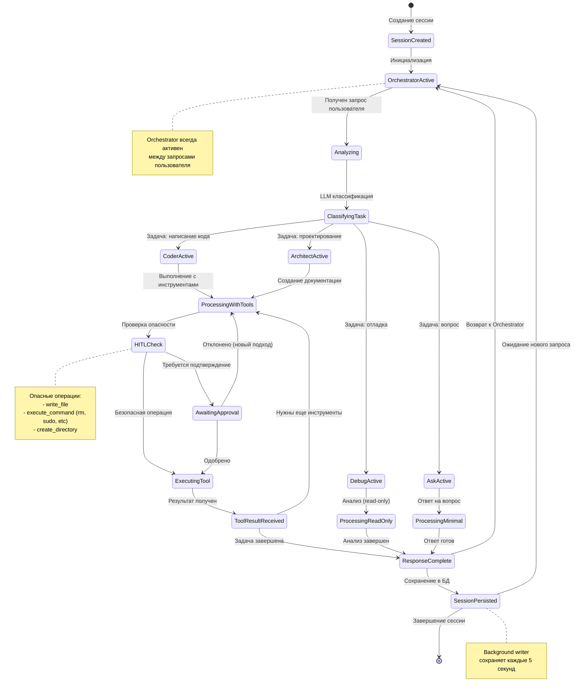
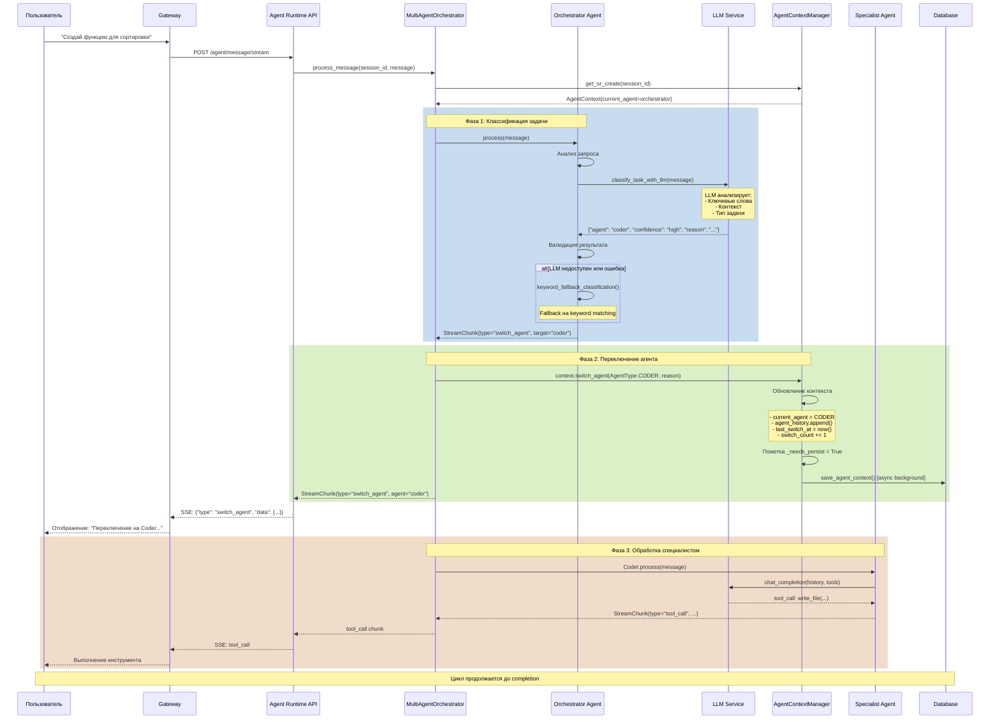
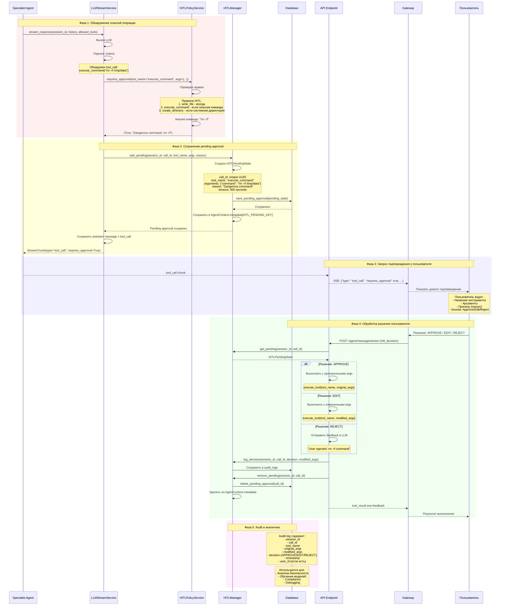
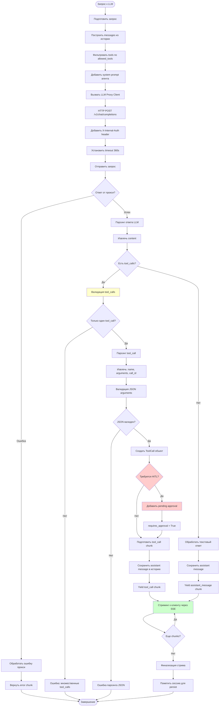
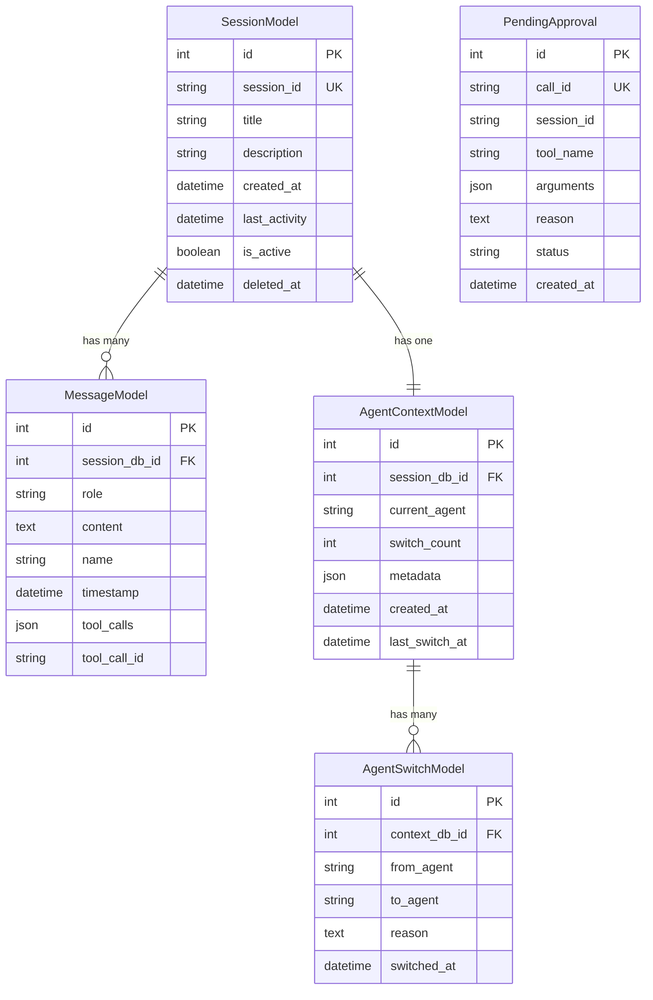

# ДОКУМЕНТАЦИЯ ФУНКЦИОНИРОВАНИЯ AGENT-RUNTIME SERVICE

**Версия:** 1.0
**Дата:** 13 января 2026
**Статус:** Production Ready

---

## СОДЕРЖАНИЕ

- [A. ОБЗОР СИСТЕМЫ](#a-обзор-системы)
- [B. ДЕТАЛЬНЫЕ СХЕМЫ ВЗАИМОДЕЙСТВИЯ АГЕНТОВ](#b-детальные-схемы-взаимодействия-агентов)
- [C. ОПИСАНИЕ ВЗАИМОДЕЙСТВИЯ МЕЖДУ АГЕНТАМИ](#c-описание-взаимодействия-между-агентами)
- [D. КОМПОНЕНТЫ СИСТЕМЫ](#d-компоненты-системы)
- [E. ПРОТОКОЛЫ И API](#e-протоколы-и-api)

---

## A. ОБЗОР СИСТЕМЫ

### Назначение и цели сервиса

**Agent Runtime Service** — это ядро AI-логики системы CodeLab, представляющее собой интеллектуальную мультиагентную платформу для автоматизации разработки программного обеспечения. Сервис обеспечивает координацию специализированных AI-агентов, каждый из которых оптимизирован для выполнения определенного класса задач.

**Основные цели:**

1. **Интеллектуальная маршрутизация задач** — автоматическое определение наиболее подходящего агента для каждого запроса пользователя
2. **Специализация агентов** — разделение ответственности между агентами для повышения качества и безопасности
3. **Персистентность сессий** — сохранение контекста и истории взаимодействия для долгосрочной работы
4. **Безопасность выполнения** — контроль опасных операций через механизм Human-in-the-Loop (HITL)
5. **Масштабируемость** — асинхронная архитектура для обработки множества параллельных сессий

### Ключевые возможности

#### 1. Мультиагентная архитектура

Система включает 6 специализированных агентов:

- **Orchestrator** — главный координатор, анализирует запросы и маршрутизирует к специалистам
- **Coder** — специалист по написанию и модификации кода (полный доступ ко всем инструментам)
- **Architect** — проектирование и создание технических спецификаций (только .md файлы)
- **Debug** — отладка и исследование ошибок (read-only режим)
- **Ask** — ответы на вопросы и объяснение концепций (минимум инструментов)
- **Universal** — универсальный агент для single-agent режима

#### 2. LLM-based маршрутизация

- Использование LLM для интеллектуального анализа запросов
- Fallback на keyword-based классификацию при недоступности LLM
- Автоматическое переключение между агентами в процессе работы
- История переключений для анализа и оптимизации

#### 3. Персистентность данных

- Асинхронное сохранение сессий в PostgreSQL/SQLite
- Background batch writers для оптимизации производительности
- In-memory кэш для быстрого доступа
- Soft delete для возможности восстановления

#### 4. Human-in-the-Loop (HITL)

- Автоматическое определение опасных операций
- Запрос подтверждения у пользователя перед выполнением
- Возможность редактирования параметров команд
- Полный audit log всех решений

#### 5. Streaming API

- Server-Sent Events (SSE) для real-time коммуникации
- Поддержка длительных операций
- Прогрессивная отдача результатов
- Обработка ошибок в процессе стриминга

#### 6. Гибкая конфигурация

- Multi-agent и single-agent режимы
- Настраиваемые ограничения для каждого агента
- Конфигурируемые политики HITL
- Поддержка различных LLM моделей

### Архитектурные принципы

#### 1. Асинхронность (Async-First)

Вся архитектура построена на асинхронных операциях:
- FastAPI с async endpoints
- Async database operations (SQLAlchemy 2.0+)
- Async HTTP клиенты (httpx)
- AsyncGenerator для стриминга

**Преимущества:**
- Высокая пропускная способность
- Эффективное использование ресурсов
- Поддержка тысяч одновременных соединений

#### 2. Разделение ответственности (Separation of Concerns)

Четкое разделение на слои:
- **API Layer** — обработка HTTP запросов, SSE streaming
- **Services Layer** — бизнес-логика, координация
- **Agents Layer** — специализированная обработка задач
- **Data Layer** — персистентность, интеграция с внешними сервисами

#### 3. Dependency Injection

Использование FastAPI Depends() для:
- Управления жизненным циклом зависимостей
- Упрощения тестирования
- Централизованной конфигурации
- Type-safe инъекции

#### 4. Event-Driven Architecture

- Streaming chunks как события
- Background writers реагируют на изменения
- Agent switching через события
- HITL approvals как асинхронные события

#### 5. Fail-Safe Design

- Graceful degradation при недоступности LLM
- Fallback механизмы для критических операций
- Валидация на всех уровнях
- Comprehensive error handling

#### 6. Observability

- Структурированное логирование
- Audit logs для критических операций
- История переключений агентов
- Метрики для мониторинга

#### 7. Security by Design

- Internal API authentication
- File restrictions для агентов
- Tool restrictions для агентов
- HITL для опасных операций
- Валидация всех входных данных

---

## B. ДЕТАЛЬНЫЕ СХЕМЫ ВЗАИМОДЕЙСТВИЯ АГЕНТОВ

### 1. Схема жизненного цикла сессии с агентами



### 2. Схема переключения между агентами (Agent Switching)



### 3. Схема обработки сообщений и инструментов

```mermaid
flowchart TD
    Start([Получен запрос пользователя]) --> LoadSession[Загрузить/создать сессию]
    LoadSession --> LoadContext[Загрузить agent context]
    
    LoadContext --> CheckCurrentAgent{Текущий агент?}
    
    CheckCurrentAgent -->|Orchestrator| ClassifyTask[Классифицировать задачу]
    CheckCurrentAgent -->|Specialist| ProcessDirectly[Обработать напрямую]
    
    ClassifyTask --> LLMClassify[LLM классификация]
    LLMClassify --> CheckLLMSuccess{LLM успешен?}
    
    CheckLLMSuccess -->|Да| ParseResult[Парсинг результата]
    CheckLLMSuccess -->|Нет| KeywordFallback[Keyword fallback]
    
    ParseResult --> DetermineAgent[Определить целевого агента]
    KeywordFallback --> DetermineAgent
    
    DetermineAgent --> SwitchAgent[Переключить агента]
    SwitchAgent --> SaveSwitch[Сохранить переключение в БД]
    SaveSwitch --> ProcessDirectly
    
    ProcessDirectly --> BuildPrompt[Построить промпт с историей]
    BuildPrompt --> FilterTools[Фильтровать инструменты по allowed_tools]
    
    FilterTools --> CallLLM[Вызвать LLM]
    CallLLM --> ParseResponse[Парсинг ответа LLM]
    
    ParseResponse --> CheckResponseType{Тип ответа?}
    
    CheckResponseType -->|Tool Call| ValidateTool[Валидация инструмента]
    CheckResponseType -->|Text| SaveMessage[Сохранить сообщение]
    
    ValidateTool --> CheckToolAllowed{Инструмент разрешен?}
    CheckToolAllowed -->|Нет| ReturnError[Вернуть error chunk]
    CheckToolAllowed -->|Да| CheckFileRestrictions{Проверить file restrictions}
    
    CheckFileRestrictions -->|Нарушение| ReturnError
    CheckFileRestrictions -->|OK| CheckHITL{Требуется HITL?}
    
    CheckHITL -->|Да| SavePending[Сохранить pending approval]
    CheckHITL -->|Нет| MarkIDESide{IDE-side tool?}
    
    SavePending --> ReturnToolCallWithApproval[Вернуть tool_call с requires_approval=true]
    ReturnToolCallWithApproval --> WaitForDecision[Ожидать решения пользователя]
    
    WaitForDecision --> CheckDecision{Решение?}
    CheckDecision -->|Approve| ExecuteOriginal[Выполнить с оригинальными args]
    CheckDecision -->|Edit| ExecuteModified[Выполнить с измененными args]
    CheckDecision -->|Reject| SendFeedback[Отправить feedback в LLM]
    
    ExecuteOriginal --> LogDecision[Записать в audit log]
    ExecuteModified --> LogDecision
    SendFeedback --> LogDecision
    
    LogDecision --> RemovePending[Удалить pending approval]
    RemovePending --> MarkIDESide
    
    MarkIDESide -->|Да| ReturnToolCall[Вернуть tool_call chunk]
    MarkIDESide -->|Нет| ExecuteLocal[Выполнить локально]
    
    ExecuteLocal --> ReturnToolResult[Вернуть tool_result]
    ReturnToolCall --> WaitForToolResult[Ожидать tool_result от Gateway]
    
    WaitForToolResult --> ReturnToolResult
    ReturnToolResult --> SaveToolResult[Сохранить tool_result в историю]
    
    SaveToolResult --> CheckCompletion{Задача завершена?}
    CheckCompletion -->|Нет| ProcessDirectly
    CheckCompletion -->|Да| SaveMessage
    
    SaveMessage --> ReturnResponse[Вернуть assistant_message chunk]
    ReturnResponse --> PersistSession[Background persist в БД]
    
    ReturnError --> End([Завершение])
    PersistSession --> End
    
    style CheckHITL fill:#ffcccc
    style SavePending fill:#ffcccc
    style WaitForDecision fill:#ffcccc
    style LogDecision fill:#ccffcc
```



### 4. Схема HITL (Human-in-the-Loop) взаимодействия



### 5. Схема взаимодействия с LLM и стриминга



### 6. Схема работы с базой данных и персистентностью

```mermaid
flowchart TD
    Start([Изменение состояния]) --> CheckType{Тип изменения?}
    
    CheckType -->|Session Message| SessionPath[Session Manager Path]
    CheckType -->|Agent Switch| AgentPath[Agent Context Path]
    CheckType -->|HITL Approval| HITLPath[HITL Manager Path]
    
    subgraph SessionPersistence[Session Persistence Flow]
        SessionPath --> AppendMsg[append_message/append_tool_result]
        AppendMsg --> UpdateMemory[Обновить in-memory state]
        UpdateMemory --> AddToPending[Добавить session_id в _pending_writes]
        AddToPending --> UpdateActivity[Обновить last_activity]
    end
    
    subgraph AgentPersistence[Agent Context Persistence Flow]
        AgentPath --> SwitchAgent[switch_agent()]
        SwitchAgent --> UpdateContext[Обновить AgentContext]
        UpdateContext --> AppendHistory[Добавить в agent_history]
        AppendHistory --> IncrementCounter[Increment switch_count]
        IncrementCounter --> MarkPersist[_needs_persist = True]
    end
    
    subgraph HITLPersistence[HITL Persistence Flow]
        HITLPath --> AddPending[add_pending()]
        AddPending --> CreateState[Создать HITLPendingState]
        CreateState --> SaveToDB[save_pending_approval() - async]
        SaveToDB --> SaveToMemory[Сохранить в AgentContext.metadata]
    end
    
    SessionPersistence --> BackgroundWriter[Background Writer Task]
    AgentPersistence --> BackgroundWriter
    
    subgraph BackgroundWriter[Background Writer - каждые 5 секунд]
        BGStart([Таймер: 5 секунд]) --> CheckPending{Есть pending writes?}
        
        CheckPending -->|Нет| Sleep[Спать 5 секунд]
        CheckPending -->|Да| GetPending[Получить _pending_writes set]
        
        GetPending --> LoopSessions[Для каждой сессии]
        
        LoopSessions --> GetSessionState[Получить SessionState из памяти]
        GetSessionState --> PrepareData[Подготовить данные для БД]
        
        PrepareData --> StartTransaction[Начать DB транзакцию]
        StartTransaction --> UpsertSession[Upsert SessionModel]
        UpsertSession --> SaveMessages[Сохранить MessageModel записи]
        SaveMessages --> CommitTransaction[Commit транзакции]
        
        CommitTransaction --> CheckSuccess{Успех?}
        CheckSuccess -->|Да| RemoveFromPending[Удалить из _pending_writes]
        CheckSuccess -->|Нет| LogError[Логировать ошибку]
        
        LogError --> RetryLater[Оставить в pending для retry]
        RemoveFromPending --> CheckMore{Еще сессии?}
        RetryLater --> CheckMore
        
        CheckMore -->|Да| LoopSessions
        CheckMore -->|Нет| CheckContexts[Проверить agent contexts]
        
        CheckContexts --> LoopContexts[Для каждого context с _needs_persist]
        LoopContexts --> SaveContext[save_agent_context()]
        SaveContext --> SaveSwitches[Сохранить AgentSwitchModel записи]
        SaveSwitches --> ClearPersistFlag[_needs_persist = False]
        
        ClearPersistFlag --> CheckMoreContexts{Еще contexts?}
        CheckMoreContexts -->|Да| LoopContexts
        CheckMoreContexts -->|Нет| Sleep
        
        Sleep --> BGStart
    end
    
    HITLPersistence --> DirectDB[Прямая запись в БД]
    
    subgraph DirectDB[Direct Database Operations]
        DBStart([HITL операция]) --> AsyncWrite[Async database write]
        AsyncWrite --> CreateRecord[Создать PendingApproval запись]
        CreateRecord --> InsertDB[INSERT в БД]
        InsertDB --> ReturnResult[Вернуть результат]
    end
    
    subgraph DatabaseLayer[Database Layer - SQLAlchemy]
        DBEngine[AsyncEngine] --> SessionMaker[async_sessionmaker]
        SessionMaker --> AsyncSession[AsyncSession]
        
        AsyncSession --> Models[SQLAlchemy Models]
        
        Models --> SessionModel[SessionModel]
        Models --> MessageModel[MessageModel]
        Models --> AgentContextModel[AgentContextModel]
        Models --> AgentSwitchModel[AgentSwitchModel]
        Models --> PendingApproval[PendingApproval]
        
        SessionModel -.->|1:N| MessageModel
        AgentContextModel -.->|1:N| AgentSwitchModel
        SessionModel -.->|1:1| AgentContextModel
    end
    
    BackgroundWriter -.->|Использует| DatabaseLayer
    DirectDB -.->|Использует| DatabaseLayer
    
    subgraph Shutdown[Graceful Shutdown]
        ShutdownSignal([SIGTERM/SIGINT]) --> CancelBGTask[Отменить background task]
        CancelBGTask --> FlushPending[Flush все pending writes]
        FlushPending --> CloseConnections[Закрыть DB connections]
        CloseConnections --> ShutdownComplete([Shutdown завершен])
    end
    
    style BackgroundWriter fill:#e1f5ff
    style DirectDB fill:#fff4e1
    style DatabaseLayer fill:#f0f0f0
    style Shutdown fill:#ffe1e1
```

---

## C. ОПИСАНИЕ ВЗАИМОДЕЙСТВИЯ МЕЖДУ АГЕНТАМИ

### Как Orchestrator выбирает агента

Orchestrator использует двухуровневую систему выбора агента для обеспечения надежности и качества маршрутизации.

#### 1. LLM-based маршрутизация (основной метод)

**Процесс:**

1. **Подготовка промпта классификации:**
```python
classification_prompt = f"""
Analyze the following user request and determine which specialized agent should handle it.

Available agents:
- coder: For writing, modifying, or refactoring code
- architect: For planning, designing, or creating technical specifications
- debug: For troubleshooting, investigating errors, or analyzing logs
- ask: For answering questions or explaining concepts

User request: {user_message}

Respond with JSON: {{"agent": "agent_name", "confidence": "high|medium|low", "reason": "explanation"}}
"""
```

2. **Вызов LLM с низкой температурой:**
```python
response = await llm_proxy_client.chat_completion(
    model=config.llm_model,
    messages=[{"role": "user", "content": classification_prompt}],
    temperature=0.3,  # Низкая температура для стабильности
    extra_params={"max_tokens": 200}
)
```

3. **Парсинг результата с fallback:**
```python
# Попытка парсинга JSON
try:
    result = json.loads(response_text)
    agent_type = AgentType(result["agent"])
    confidence = result.get("confidence", "medium")
    reason = result.get("reason", "")
except:
    # Fallback: regex extraction
    match = re.search(r'"agent":\s*"(\w+)"', response_text)
    if match:
        agent_type = AgentType(match.group(1))
```

4. **Валидация результата:**
```python
# Проверка, что агент зарегистрирован
if not agent_router.has_agent(agent_type):
    # Fallback на keyword classification
    agent_type = self._keyword_fallback_classification(user_message)
```

**Преимущества LLM-based подхода:**
- Понимание контекста и намерений
- Обработка сложных и неоднозначных запросов
- Адаптация к новым паттернам запросов
- Высокая точность классификации

#### 2. Keyword Fallback (резервный метод)

Используется когда:
- LLM недоступен
- LLM вернул ошибку
- Результат LLM не валиден
- Timeout при вызове LLM

**Правила классификации:**

```python
def _keyword_fallback_classification(self, message: str) -> AgentType:
    message_lower = message.lower()
    
    # Coder keywords
    coder_keywords = ["write", "create", "implement", "code", "function", 
                      "class", "fix", "modify", "refactor", "add"]
    
    # Architect keywords
    architect_keywords = ["design", "plan", "architecture", "document",
                          "specification", "diagram", "structure"]
    
    # Debug keywords
    debug_keywords = ["debug", "error", "bug", "issue", "problem",
                      "investigate", "analyze", "troubleshoot"]
    
    # Ask keywords
    ask_keywords = ["what", "how", "why", "explain", "tell me",
                    "describe", "question"]
    
    # Подсчет совпадений для каждого агента
    scores = {
        AgentType.CODER: sum(1 for kw in coder_keywords if kw in message_lower),
        AgentType.ARCHITECT: sum(1 for kw in architect_keywords if kw in message_lower),
        AgentType.DEBUG: sum(1 for kw in debug_keywords if kw in message_lower),
        AgentType.ASK: sum(1 for kw in ask_keywords if kw in message_lower)
    }
    
    # Выбор агента с максимальным score
    return max(scores.items(), key=lambda x: x[1])[0] or AgentType.CODER
```

#### 3. Single-agent mode detection

Если система работает в single-agent режиме:

```python
def _should_use_universal_agent(self) -> bool:
    registered_agents = agent_router.list_agents()
    # Если зарегистрированы только Orchestrator и Universal
    return (AgentType.UNIVERSAL in registered_agents and 
            len(registered_agents) == 2)

# В process_message():
if self._should_use_universal_agent():
    return AgentType.UNIVERSAL  # Пропустить классификацию
```

### Протокол переключения агентов

Переключение агентов следует строгому протоколу для обеспечения консистентности и отслеживаемости.

#### Этапы переключения:

**1. Инициация переключения:**

Может быть инициировано:
- Orchestrator после классификации
- Специализированным агентом (например, Debug → Coder для исправления)
- Явным запросом пользователя через `switch_agent` message type

**2. Создание switch event:**

```python
switch_chunk = StreamChunk(
    type="switch_agent",
    data={
        "from_agent": current_agent.value,
        "to_agent": target_agent.value,
        "reason": classification_reason,
        "timestamp": datetime.utcnow().isoformat()
    }
)
```

**3. Обновление контекста:**

```python
# В AgentContext
def switch_agent(self, new_agent: AgentType, reason: str):
    # Сохранить в историю
    self.agent_history.append({
        "from_agent": self.current_agent.value,
        "to_agent": new_agent.value,
        "reason": reason,
        "timestamp": datetime.utcnow().isoformat()
    })
    
    # Обновить текущего агента
    self.current_agent = new_agent
    self.last_switch_at = datetime.utcnow()
    self.switch_count += 1
    
    # Пометить для персистентности
    self._needs_persist = True
```

**4. Персистентность в БД:**

```python
# Background writer сохраняет:
# 1. AgentContextModel - обновленный контекст
# 2. AgentSwitchModel - новая запись о переключении
await db_service.save_agent_context(
    session_id=context.session_id,
    current_agent=context.current_agent,
    switch_count=context.switch_count,
    metadata=context.metadata
)
```

**5. Уведомление клиента:**

```python
# SSE event отправляется клиенту
yield f"data: {json.dumps(switch_chunk.dict())}\n\n"
```

#### Ограничения переключений:

- **Максимум переключений:** Нет жесткого лимита, но логируется для анализа
- **Циклические переключения:** Отслеживаются через agent_history
- **Время между переключениями:** Нет минимального интервала
- **Откат:** Возможен возврат к предыдущему агенту

### Передача контекста между агентами

Контекст передается через несколько механизмов для обеспечения непрерывности работы.

#### 1. Session History (основной контекст)

Все агенты имеют доступ к полной истории сессии:

```python
class SessionState:
    session_id: str
    messages: List[Message]  # Вся история сообщений
    system_prompt: str
    created_at: datetime
    last_activity: datetime
```

**Структура Message:**
```python
class Message:
    role: str  # "user", "assistant", "tool"
    content: str
    name: Optional[str]  # Имя агента или инструмента
    tool_calls: Optional[List[ToolCall]]
    tool_call_id: Optional[str]
```

**Пример истории при переключении:**
```python
[
    {"role": "user", "content": "Создай функцию сортировки"},
    {"role": "assistant", "name": "orchestrator", 
     "content": "Анализирую запрос... Переключаюсь на Coder"},
    {"role": "assistant", "name": "coder",
     "content": "Создаю функцию сортировки...",
     "tool_calls": [{"name": "write_file", ...}]},
    {"role": "tool", "name": "write_file",
     "content": "File created successfully"}
]
```

#### 2. Agent Context Metadata

Дополнительный контекст хранится в metadata:

```python
class AgentContext:
    session_id: str
    current_agent: AgentType
    agent_history: List[Dict]  # История переключений
    metadata: Dict[str, Any]  # Произвольные данные
    
# Примеры использования metadata:
metadata = {
    "last_error": "File not found: config.py",
    "files_modified": ["src/main.py", "src/utils.py"],
    "pending_tasks": ["Add tests", "Update documentation"],
    "user_preferences": {"language": "python", "style": "pep8"},
    HITL_PENDING_KEY: {...}  # Pending HITL approvals
}
```

#### 3. System Prompts с контекстом

Каждый агент получает контекст через system prompt:

```python
def build_system_prompt_with_context(agent: BaseAgent, context: AgentContext) -> str:
    base_prompt = agent.system_prompt
    
    # Добавить информацию о предыдущих агентах
    if context.agent_history:
        last_switch = context.agent_history[-1]
        context_info = f"""
Previous agent: {last_switch['from_agent']}
Reason for switch: {last_switch['reason']}
"""
        base_prompt += f"\n\nContext:\n{context_info}"
    
    # Добавить metadata если релевантно
    if "last_error" in context.metadata:
        base_prompt += f"\n\nLast error: {context.metadata['last_error']}"
    
    return base_prompt
```

#### 4. Tool Results как контекст

Результаты выполнения инструментов доступны всем последующим агентам:

```python
# Coder выполнил read_file
{"role": "tool", "name": "read_file", "content": "def sort_list(arr): ..."}

# Debug может использовать этот контекст для анализа
# Architect может использовать для документирования
```

### Ограничения и правила для каждого агента

Каждый агент имеет строгие ограничения для обеспечения безопасности и специализации.

#### 1. Orchestrator Agent

**Разрешенные инструменты:**
- `read_file` - Чтение файлов для анализа
- `list_files` - Просмотр структуры проекта
- `search_in_code` - Поиск в коде

**Ограничения:**
- ❌ Не может модифицировать файлы
- ❌ Не может выполнять команды
- ❌ Не может создавать директории

**Файловые ограничения:** Нет (read-only инструменты)

**Цель ограничений:** Orchestrator только анализирует и маршрутизирует, не выполняет действия

#### 2. Coder Agent

**Разрешенные инструменты:**
- ✅ ВСЕ инструменты:
  - `read_file`
  - `write_file`
  - `list_files`
  - `search_in_code`
  - `create_directory`
  - `execute_command`
  - `attempt_completion`
  - `ask_followup_question`

**Ограничения:**
- ✅ Может редактировать любые файлы
- ⚠️ Опасные операции требуют HITL approval

**Файловые ограничения:** Нет

**Цель ограничений:** Максимальная гибкость для написания кода, но с контролем безопасности

#### 3. Architect Agent

**Разрешенные инструменты:**
- `read_file`
- `write_file` (только .md файлы)
- `list_files`
- `search_in_code`
- `attempt_completion`
- `ask_followup_question`

**Ограничения:**
- ❌ Не может выполнять команды
- ❌ Не может создавать директории
- ⚠️ Строгие файловые ограничения

**Файловые ограничения:**
```python
file_restrictions = [r'\.md$']  # Только .md файлы
```

**Валидация при write_file:**
```python
def can_edit_file(self, file_path: str) -> bool:
    if not self.file_restrictions:
        return True
    return any(re.search(pattern, file_path)
               for pattern in self.file_restrictions)

# При попытке редактировать не-.md файл:
if not self.can_edit_file(file_path):
    yield StreamChunk(
        type="error",
        data={"message": f"Architect can only edit .md files, not {file_path}"}
    )
```

**Цель ограничений:** Фокус на документации и проектировании, предотвращение случайной модификации кода

#### 4. Debug Agent

**Разрешенные инструменты:**
- `read_file`
- `list_files`
- `search_in_code`
- `execute_command` (для диагностики)
- `attempt_completion`
- `ask_followup_question`

**Ограничения:**
- ❌ Не может модифицировать файлы (нет write_file)
- ❌ Не может создавать директории
- ✅ Может выполнять команды для диагностики

**Файловые ограничения:** Read-only (нет write_file)

**Цель ограничений:** Исследование и диагностика без риска повреждения кода. Для исправлений должен переключиться на Coder.

#### 5. Ask Agent

**Разрешенные инструменты:**
- `read_file`
- `search_in_code`
- `list_files`
- `attempt_completion`

**Ограничения:**
- ❌ Не может модифицировать файлы
- ❌ Не может выполнять команды
- ❌ Не может создавать директории
- ❌ Нет ask_followup_question (минимальная интерактивность)

**Файловые ограничения:** Read-only

**Цель ограничений:** Только информационные ответы, минимум действий

#### 6. Universal Agent

**Разрешенные инструменты:**
- ✅ ВСЕ инструменты (как Coder)

**Ограничения:**
- ✅ Полный доступ
- ⚠️ Опасные операции требуют HITL approval

**Файловые ограничения:** Нет

**Цель ограничений:** Универсальность для single-agent режима

### Примеры сценариев взаимодействия

#### Сценарий 1: Создание новой функции

```
Пользователь: "Создай функцию для сортировки массива чисел"

1. Orchestrator получает запрос
   - Анализирует: "создай функцию" → задача написания кода
   - LLM классификация: {"agent": "coder", "confidence": "high"}
   - Переключение: Orchestrator → Coder

2. Coder обрабатывает запрос
   - Анализирует требования
   - Решает создать файл utils/sorting.py
   - Tool call: write_file("utils/sorting.py", content="def sort_array(arr): ...")
   - HITL проверка: write_file требует approval
   - Ожидание подтверждения пользователя

3. Пользователь одобряет
   - Файл создается
   - Coder получает tool_result: "File created successfully"
   - Coder завершает: "Функция создана в utils/sorting.py"
   - Возврат к Orchestrator
```

#### Сценарий 2: Отладка ошибки с последующим исправлением

```
Пользователь: "У меня ошибка: NameError: name 'config' is not defined"

1. Orchestrator получает запрос
   - Анализирует: "ошибка" → задача отладки
   - LLM классификация: {"agent": "debug", "confidence": "high"}
   - Переключение: Orchestrator → Debug

2. Debug исследует проблему
   - Tool call: search_in_code("config")
   - Находит использование config без импорта
   - Tool call: read_file("main.py")
   - Анализирует код
   - Определяет: отсутствует "from config import config"

3. Debug понимает, что нужно исправление
   - Не может модифицировать файлы (read-only)
   - Возвращает: "Найдена проблема: отсутствует импорт. Переключаюсь на Coder для исправления"
   - Переключение: Debug → Coder

4. Coder исправляет
   - Tool call: write_file("main.py", добавляет импорт)
   - HITL approval
   - Пользователь одобряет
   - Исправление применено
   - Coder: "Импорт добавлен, ошибка должна быть исправлена"
```

#### Сценарий 3: Проектирование архитектуры

```
Пользователь: "Спроектируй архитектуру для микросервиса аутентификации"

1. Orchestrator получает запрос
   - Анализирует: "спроектируй архитектуру" → задача проектирования
   - LLM классификация: {"agent": "architect", "confidence": "high"}
   - Переключение: Orchestrator → Architect

2. Architect создает документацию
   - Анализирует требования
   - Tool call: write_file("docs/auth-service-architecture.md", content="...")
   - HITL approval (write_file)
   - Пользователь одобряет
   - Документ создан

3. Architect продолжает
   - Tool call: write_file("docs/api-specification.md", content="...")
   - HITL approval
   - Пользователь одобряет
   - Завершение: "Архитектура задокументирована в docs/"
```

#### Сценарий 4: Ответ на вопрос с контекстом кода

```
Пользователь: "Как работает функция authenticate() в auth.py?"

1. Orchestrator получает запрос
   - Анализирует: "как работает" → вопрос
   - LLM классификация: {"agent": "ask", "confidence": "high"}
   - Переключение: Orchestrator → Ask

2. Ask отвечает на вопрос
   - Tool call: read_file("auth.py")
   - Анализирует код функции authenticate()
   - Tool call: search_in_code("authenticate") для контекста
   - Формирует объяснение
   - Возвращает: "Функция authenticate() работает следующим образом: ..."
   - Завершение без модификаций
```

#### Сценарий 5: Сложная задача с множественными переключениями

```
Пользователь: "Добавь логирование во все функции API"

1. Orchestrator → Coder
   - Coder анализирует структуру проекта
   - Tool call: list_files("src/api/")
   - Находит множество файлов

2. Coder → Architect (для планирования)
   - Coder понимает, что нужен план
   - Переключение на Architect
   - Architect создает план в docs/logging-plan.md

3. Architect → Coder (для реализации)
   - План готов, нужна реализация
   - Переключение на Coder
   - Coder начинает модификацию файлов

4. Coder обнаруживает проблему
   - При добавлении логирования находит ошибку
   - Переключение: Coder → Debug

5. Debug → Coder (исправление)
   - Debug анализирует ошибку
   - Переключается на Coder для исправления
   - Coder исправляет и продолжает добавление логирования

6. Завершение
   - Coder завершает задачу
   - Возврат к Orchestrator
```

---

## D. КОМПОНЕНТЫ СИСТЕМЫ

### Детальное описание агентов

#### 1. Orchestrator Agent

**Файл:** `app/agents/orchestrator_agent.py` (287 строк)

**Роль:** Главный координатор системы, анализирует запросы пользователя и маршрутизирует их к специализированным агентам.

**System Prompt:**
```python
"""You are the Orchestrator agent in a multi-agent system. Your role is to:
1. Analyze user requests
2. Determine which specialist agent should handle the task
3. Route the request to the appropriate agent
4. Coordinate between agents when needed

Available specialist agents:
- Coder: For writing, modifying, or refactoring code
- Architect: For planning, designing, or creating technical specifications
- Debug: For troubleshooting, investigating errors, or analyzing logs
- Ask: For answering questions or explaining concepts

You have access to read-only tools to understand the project context before routing."""
```

**Ключевые методы:**

```python
async def process(self, message: str, history: List[dict]) -> AsyncGenerator[StreamChunk, None]:
    """Обработка сообщения с классификацией и маршрутизацией"""
    
async def classify_task_with_llm(self, user_message: str) -> Tuple[AgentType, Dict]:
    """LLM-based классификация задачи"""
    
def _keyword_fallback_classification(self, message: str) -> AgentType:
    """Fallback классификация по ключевым словам"""
```

**Особенности:**
- Двухуровневая классификация (LLM + keyword fallback)
- Низкая температура (0.3) для стабильности
- Автоматическое определение single-agent режима
- Валидация результатов классификации

#### 2. Coder Agent

**Файл:** `app/agents/coder_agent.py` (106 строк)

**Роль:** Специалист по написанию, модификации и рефакторингу кода.

**System Prompt:**
```python
"""You are the Coder agent, specialized in writing and modifying code. Your responsibilities:
1. Write new code based on requirements
2. Modify existing code
3. Refactor code for better quality
4. Implement features and bug fixes

You have access to all development tools including file operations and command execution.
Always follow best practices and write clean, maintainable code."""
```

**Allowed Tools:** ВСЕ инструменты
- read_file, write_file, list_files, search_in_code
- create_directory, execute_command
- attempt_completion, ask_followup_question

**Ключевые методы:**

```python
async def process(self, message: str, history: List[dict]) -> AsyncGenerator[StreamChunk, None]:
    """Обработка с полным доступом к инструментам"""
```

**Особенности:**
- Полный доступ ко всем инструментам
- Валидация tool usage перед выполнением
- Интеграция с HITL для опасных операций
- Делегирование в llm_stream_service

#### 3. Architect Agent

**Файл:** `app/agents/architect_agent.py` (~100 строк)

**Роль:** Проектирование архитектуры и создание технических спецификаций.

**System Prompt:**
```python
"""You are the Architect agent, specialized in software design and architecture. Your responsibilities:
1. Design system architecture
2. Create technical specifications
3. Plan implementation strategies
4. Document design decisions

You can only edit .md files to maintain focus on documentation.
Use diagrams (Mermaid) and clear documentation to communicate designs."""
```

**Allowed Tools:**
- read_file, write_file (только .md), list_files, search_in_code
- attempt_completion, ask_followup_question

**File Restrictions:** `[r'\.md$']`

**Ключевые методы:**

```python
def can_edit_file(self, file_path: str) -> bool:
    """Проверка, что файл .md"""
    return any(re.search(pattern, file_path) for pattern in self.file_restrictions)
```

**Особенности:**
- Строгие файловые ограничения
- Фокус на документации
- Поддержка Mermaid диаграмм
- Валидация при каждом write_file

#### 4. Debug Agent

**Файл:** `app/agents/debug_agent.py` (~100 строк)

**Роль:** Отладка, исследование ошибок и анализ проблем.

**System Prompt:**
```python
"""You are the Debug agent, specialized in troubleshooting and debugging. Your responsibilities:
1. Investigate errors and bugs
2. Analyze logs and stack traces
3. Identify root causes of issues
4. Suggest fixes (but don't implement them)

You have read-only access to code and can execute diagnostic commands.
When you identify a fix, switch to the Coder agent for implementation."""
```

**Allowed Tools:**
- read_file, list_files, search_in_code
- execute_command (для диагностики)
- attempt_completion, ask_followup_question

**Ключевые методы:**

```python
async def process(self, message: str, history: List[dict]) -> AsyncGenerator[StreamChunk, None]:
    """Обработка в read-only режиме"""
```

**Особенности:**
- Read-only режим (нет write_file)
- Может выполнять диагностические команды
- Должен переключаться на Coder для исправлений
- Фокус на анализе, а не на действиях

#### 5. Ask Agent

**Файл:** `app/agents/ask_agent.py` (~100 строк)

**Роль:** Ответы на вопросы и объяснение концепций.

**System Prompt:**
```python
"""You are the Ask agent, specialized in answering questions and explaining concepts. Your responsibilities:
1. Answer user questions clearly and concisely
2. Explain code and concepts
3. Provide documentation references
4. Help users understand the codebase

You have minimal tools - focus on providing information, not taking actions."""
```

**Allowed Tools:**
- read_file, search_in_code, list_files
- attempt_completion

**Особенности:**
- Минимальный набор инструментов
- Только чтение, никаких модификаций
- Фокус на объяснении
- Нет ask_followup_question (минимальная интерактивность)

#### 6. Universal Agent

**Файл:** `app/agents/universal_agent.py` (~100 строк)

**Роль:** Универсальный агент для single-agent режима.

**System Prompt:**
```python
"""You are a universal AI assistant for software development. You can:
1. Write and modify code
2. Design architecture
3. Debug issues
4. Answer questions

You have access to all tools and should handle any development task."""
```

**Allowed Tools:** ВСЕ инструменты

**Особенности:**
- Активируется когда `MULTI_AGENT_MODE=false`
- Полная функциональность всех агентов
- Используется для простых сценариев
- Нет маршрутизации между агентами

### Описание ключевых сервисов

#### 1. MultiAgentOrchestrator

**Файл:** `app/services/multi_agent_orchestrator.py` (227 строк)

**Назначение:** Главный координатор мультиагентной системы.

**Ключевые методы:**

```python
async def process_message(
    self,
    session_id: str,
    message: str,
    agent_type: Optional[AgentType] = None
) -> AsyncGenerator[StreamChunk, None]:
    """
    Обработка сообщения с автоматической маршрутизацией.
    
    Логика:
    1. Получить/создать agent context
    2. Если agent_type указан → переключиться
    3. Если текущий агент = Orchestrator → классификация
    4. Обработать через текущего агента
    5. Обработать switch_agent chunks рекурсивно
    """

async def get_current_agent(self, session_id: str) -> Optional[AgentType]:
    """Получить текущего агента сессии"""

async def get_agent_history(self, session_id: str) -> List[Dict]:
    """Получить историю переключений агентов"""

async def reset_session(self, session_id: str):
    """Сбросить сессию на Orchestrator"""
```

**Singleton:**
```python
multi_agent_orchestrator = MultiAgentOrchestrator()
```

**Особенности:**
- Автоматическая маршрутизация
- Рекурсивная обработка переключений
- Интеграция с AgentContextManager
- Поддержка явного переключения агентов

#### 2. AsyncSessionManager

**Файл:** `app/services/session_manager_async.py` (419 строк)

**Назначение:** Управление сессиями с async database persistence.

**Архитектура:**
- In-memory cache для быстрого доступа
- Background batch writer (каждые 5 секунд)
- Async database persistence
- Thread-safe операции через asyncio.Lock

**Ключевые методы:**

```python
async def initialize(self):
    """Загрузка сессий из БД и запуск background writer"""

async def create(self, session_id: str, system_prompt: str = "") -> SessionState:
    """Создание новой сессии"""

def get(self, session_id: str) -> Optional[SessionState]:
    """Синхронное получение сессии из кэша"""

async def get_or_create(self, session_id: str, system_prompt: str = "") -> SessionState:
    """Получить или создать сессию"""

async def append_message(self, session_id: str, role: str, content: str, name: Optional[str] = None):
    """Добавить сообщение в историю"""

async def append_tool_result(self, session_id: str, call_id: str, tool_name: str, result: str):
    """Добавить результат выполнения инструмента"""

async def get_history(self, session_id: str) -> List[dict]:
    """Получить историю сообщений"""

async def delete(self, session_id: str, soft: bool = True):
    """Удалить сессию (soft/hard delete)"""

async def shutdown(self):
    """Graceful shutdown с flush pending writes"""
```

**Background Writer:**
```python
async def _background_writer(self):
    """
    Фоновая задача для batch persistence.
    Запускается каждые 5 секунд.
    Пишет все сессии из _pending_writes set.
    """
    while True:
        await asyncio.sleep(5)
        if self._pending_writes:
            async with self._lock:
                sessions_to_write = list(self._pending_writes)
                self._pending_writes.clear()
            
            for session_id in sessions_to_write:
                session = self._sessions.get(session_id)
                if session:
                    await self._db_service.save_session(session)
```

**Singleton:**
```python
session_manager: Optional[AsyncSessionManager] = None
```

#### 3. AsyncAgentContextManager

**Файл:** `app/services/agent_context_async.py` (505 строк)

**Назначение:** Управление контекстом агентов с persistence.

**Модель AgentContext:**
```python
class AgentContext(BaseModel):
    session_id: str
    current_agent: AgentType
    agent_history: List[Dict[str, Any]]  # История переключений
    metadata: Dict[str, Any]  # Произвольные данные
    created_at: datetime
    last_switch_at: Optional[datetime]
    switch_count: int
    _needs_persist: bool = False  # Флаг для background writer
```

**Ключевые методы:**

```python
async def initialize(self):
    """Загрузка контекстов из БД"""

async def get_or_create(
    self,
    session_id: str,
    initial_agent: AgentType = AgentType.ORCHESTRATOR
) -> AgentContext:
    """Получить или создать контекст"""

def get(self, session_id: str) -> Optional[AgentContext]:
    """Синхронное получение из кэша"""

async def delete(self, session_id: str):
    """Удалить контекст"""

async def cleanup_old_sessions(self, max_age_hours: int = 24):
    """Очистка старых неактивных сессий"""

async def shutdown(self):
    """Graceful shutdown"""
```

**Метод AgentContext.switch_agent:**
```python
def switch_agent(self, new_agent: AgentType, reason: str):
    """
    Переключение агента с записью в историю.
    
    1. Добавляет запись в agent_history
    2. Обновляет current_agent
    3. Обновляет last_switch_at
    4. Инкрементирует switch_count
    5. Устанавливает _needs_persist = True
    """
    self.agent_history.append({
        "from_agent": self.current_agent.value,
        "to_agent": new_agent.value,
        "reason": reason,
        "timestamp": datetime.utcnow().isoformat()
    })
    self.current_agent = new_agent
    self.last_switch_at = datetime.utcnow()
    self.switch_count += 1
    self._needs_persist = True
```

**Singleton:**
```python
agent_context_manager: Optional[AsyncAgentContextManager] = None
```

#### 4. LLMStreamService

**Файл:** `app/services/llm_stream_service.py` (228 строк)

**Назначение:** Стриминг ответов от LLM с интеграцией HITL.

**Функция stream_response:**

```python
async def stream_response(
    session_id: str,
    history: List[dict],
    allowed_tools: Optional[List[str]] = None,
    session_mgr: Optional[AsyncSessionManager] = None
) -> AsyncGenerator[StreamChunk, None]:
    """
    Стриминг ответа от LLM.
    
    Логика:
    1. Фильтрация tools по allowed_tools
    2. Вызов LLM через llm_proxy_client
    3. Парсинг ответа (text или tool_call)
    4. Проверка HITL для tool_calls
    5. Сохранение в историю
    6. Yield StreamChunk
    """
```

**Интеграция с HITL:**
```python
# Проверка требования approval
requires_approval, reason = hitl_policy_service.requires_approval(
    tool_name=tool_call.name,
    arguments=tool_call.arguments
)

if requires_approval:
    # Сохранить pending approval
    await hitl_manager.add_pending(
        session_id=session_id,
        call_id=tool_call.call_id,
        tool_name=tool_call.name,
        arguments=tool_call.arguments,
        reason=reason
    )
    
    # Вернуть tool_call с флагом
    yield StreamChunk(
        type="tool_call",
        data={
            "tool_call": tool_call.dict(),
            "requires_approval": True,
            "reason": reason
        }
    )
    return  # STOP - ждем решения пользователя
```

**Особенности:**
- Только ОДИН tool call за раз
- Автоматическая HITL проверка
- Сохранение в историю
- Error handling

#### 5. HITLManager

**Файл:** `app/services/hitl_manager.py` (328 строк)

**Назначение:** Human-in-the-Loop управление.

**Хранилище:**
- In-memory: `AgentContext.metadata[HITL_PENDING_KEY]`
- Database: `pending_approvals` таблица

**Ключевые методы:**

```python
async def add_pending(
    self,
    session_id: str,
    call_id: str,
    tool_name: str,
    arguments: Dict,
    reason: Optional[str] = None,
    timeout_seconds: int = 300
) -> HITLPendingState:
    """Добавить pending approval"""

def get_pending(self, session_id: str, call_id: str) -> Optional[HITLPendingState]:
    """Получить pending state"""

def get_all_pending(self, session_id: str) -> List[HITLPendingState]:
    """Все pending для сессии"""

async def remove_pending(self, session_id: str, call_id: str):
    """Удалить pending approval"""

async def log_decision(
    self,
    session_id: str,
    call_id: str,
    decision: HITLDecision,
    modified_args: Optional[Dict] = None
):
    """Записать решение в audit log"""

async def get_audit_logs(self, session_id: str) -> List[HITLAuditLog]:
    """История решений"""

def has_pending(self, session_id: str, call_id: str) -> bool:
    """Проверка наличия pending"""
```

**Модель HITLPendingState:**
```python
class HITLPendingState(BaseModel):
    call_id: str
    tool_name: str
    arguments: Dict
    reason: Optional[str]
    created_at: datetime
    timeout_seconds: int
```

**Singleton:**
```python
hitl_manager = HITLManager()
```

#### 6. HITLPolicyService

**Файл:** `app/services/hitl_policy_service.py`

**Назначение:** Определение политик HITL - какие операции требуют approval.

**Ключевой метод:**

```python
def requires_approval(self, tool_name: str, arguments: Dict) -> Tuple[bool, Optional[str]]:
    """
    Определяет, требуется ли approval для операции.
    
    Returns:
        (requires_approval: bool, reason: Optional[str])
    """
    
    # write_file всегда требует approval
    if tool_name == "write_file":
        return (True, "File modification requires approval")
    
    # execute_command - проверка на опасные команды
    if tool_name == "execute_command":
        command = arguments.get("command", "")
        dangerous_patterns = [
            r'\brm\b.*-rf',  # rm -rf
            r'\bsudo\b',     # sudo
            r'\bchmod\b',    # chmod
            r'\bchown\b',    # chown
            r'>\s*/dev/',    # redirect to /dev/
            r'\|.*\bsh\b',   # pipe to shell
        ]
        
        for pattern in dangerous_patterns:
            if re.search(pattern, command, re.IGNORECASE):
                return (True, f"Dangerous command detected: {pattern}")
    
    # create_directory - проверка системных директорий
    if tool_name == "create_directory":
        path = arguments.get("path", "")
        system_dirs = ["/etc", "/usr", "/bin", "/sbin", "/var", "/sys"]
        if any(path.startswith(d) for d in system_dirs):
            return (True, "Creating system directory requires approval")
    
    return (False, None)
```

**Singleton:**
```python
hitl_policy_service = HITLPolicyService()
```

#### 7. LLMProxyClient

**Файл:** `app/services/llm_proxy_client.py` (120 строк)

**Назначение:** HTTP клиент для LLM Proxy сервиса.

**Ключевой метод:**

```python
async def chat_completion(
    self,
    model: str,
    messages: List[Dict[str, Any]],
    tools: Optional[List[Dict[str, Any]]] = None,
    stream: bool = False,
    extra_params: Optional[Dict[str, Any]] = None,
) -> Dict[str, Any]:
    """
    Вызов LLM через прокси.
    
    Args:
        model: Название модели (gpt-4, claude-3, etc.)
        messages: История сообщений
        tools: Список доступных инструментов (OpenAI format)
        stream: Стриминг (пока не поддерживается)
        extra_params: Дополнительные параметры (temperature, max_tokens, etc.)
    
    Returns:
        Ответ LLM в OpenAI-compatible формате
    """
    
    url = f"{self.base_url}/v1/chat/completions"
    headers = {
        "Content-Type": "application/json",
        "X-Internal-Auth": self.internal_api_key
    }
    
    payload = {
        "model": model,
        "messages": messages,
        **({"tools": tools} if tools else {}),
        **(extra_params or {})
    }
    
    async with httpx.AsyncClient(timeout=self.timeout) as client:
        response = await client.post(url, json=payload, headers=headers)
        response.raise_for_status()
        return response.json()
```

**Конфигурация:**
```python
class LLMProxyClient:
    def __init__(self):
        self.base_url = config.llm_proxy_url
        self.internal_api_key = config.internal_api_key
        self.timeout = 360.0  # 6 минут
```

**Singleton:**
```python
llm_proxy_client = LLMProxyClient()
```

#### 8. ToolRegistry

**Файл:** `app/services/tool_registry.py` (381 строка)

**Назначение:** Реестр инструментов и их спецификаций.

**Локальные инструменты:**
```python
LOCAL_TOOLS = {
    "echo": echo_tool,
    "calculator": calculator_tool,
    "switch_mode": switch_mode_tool
}

async def execute_local_tool(tool_call: ToolCall) -> str:
    """Выполнение локального инструмента"""
    if tool_call.name not in LOCAL_TOOLS:
        raise ValueError(f"Unknown local tool: {tool_call.name}")
    
    tool_func = LOCAL_TOOLS[tool_call.name]
    return await tool_func(**tool_call.arguments)
```

**IDE-side инструменты:**
```python
IDE_SIDE_TOOLS = [
    "read_file",
    "write_file",
    "list_files",
    "create_directory",
    "execute_command",
    "search_in_code"
]
```

**Спецификации инструментов:**
```python
TOOLS_SPEC: List[Dict[str, Any]] = [
    {
        "type": "function",
        "function": {
            "name": "read_file",
            "description": "Read the contents of a file",
            "parameters": {
                "type": "object",
                "properties": {
                    "path": {
                        "type": "string",
                        "description": "Path to the file to read"
                    }
                },
                "required": ["path"]
            }
        }
    },
    # ... остальные инструменты
]
```

**Функция фильтрации:**
```python
def filter_tools_by_allowed(allowed_tools: List[str]) -> List[Dict[str, Any]]:
    """Фильтрация спецификаций по allowed_tools"""
    return [
        tool for tool in TOOLS_SPEC
        if tool["function"]["name"] in allowed_tools
    ]
```

#### 9. DatabaseService

**Файл:** `app/services/database.py` (1094 строки)

**Назначение:** Async database операции.

**SQLAlchemy Models:**

```python
class SessionModel(Base):
    __tablename__ = "sessions"
    
    id = Column(Integer, primary_key=True)
    session_id = Column(String, unique=True, index=True)
    title = Column(String, nullable=True)
    description = Column(String, nullable=True)
    created_at = Column(DateTime, default=datetime.utcnow)
    last_activity = Column(DateTime, default=datetime.utcnow)
    is_active = Column(Boolean, default=True)
    deleted_at = Column(DateTime, nullable=True)
    
    messages = relationship("MessageModel", back_populates="session")
    agent_context = relationship("AgentContextModel", back_populates="session", uselist=False)

class MessageModel(Base):
    __tablename__ = "messages"
    
    id = Column(Integer, primary_key=True)
    session_db_id = Column(Integer, ForeignKey("sessions.id"))
    role = Column(String)  # user, assistant, tool
    content = Column(Text)
    name = Column(String, nullable=True)
    timestamp = Column(DateTime, default=datetime.utcnow)
    tool_calls = Column(JSON, nullable=True)
    tool_call_id = Column(String, nullable=True)
    
    session = relationship("SessionModel", back_populates="messages")

class AgentContextModel(Base):
    __tablename__ = "agent_contexts"
    
    id = Column(Integer, primary_key=True)
    session_db_id = Column(Integer, ForeignKey("sessions.id"), unique=True)
    current_agent = Column(String)
    switch_count = Column(Integer, default=0)
    metadata = Column(JSON, default={})
    created_at = Column(DateTime, default=datetime.utcnow)
    last_switch_at = Column(DateTime, nullable=True)
    
    session = relationship("SessionModel", back_populates="agent_context")
    switches = relationship("AgentSwitchModel", back_populates="context")

class AgentSwitchModel(Base):
    __tablename__ = "agent_switches"
    
    id = Column(Integer, primary_key=True)
    context_db_id = Column(Integer, ForeignKey("agent_contexts.id"))
    from_agent = Column(String)
    to_agent = Column(String)
    reason = Column(Text, nullable=True)
    switched_at = Column(DateTime, default=datetime.utcnow)
    
    context = relationship("AgentContextModel", back_populates="switches")

class PendingApproval(Base):
    __tablename__ = "pending_approvals"
    
    id = Column(Integer, primary_key=True)
    call_id = Column(String, unique=True, index=True)
    session_id = Column(String, index=True)
    tool_name = Column(String)
    arguments = Column(JSON)
    reason = Column(Text, nullable=True)
    status = Column(String, default="pending")  # pending, approved, rejected
    created_at = Column(DateTime, default=datetime.utcnow)
```

**Ключевые операции:**

```python
class DatabaseService:
    async def save_session(self, session_state: SessionState):
        """Сохранить/обновить сессию с сообщениями"""
    
    async def load_session(self, session_id: str) -> Optional[SessionState]:
        """Загрузить сессию из БД"""
    
    async def delete_session(self, session_id: str, soft: bool = True):
        """Удалить сессию (soft/hard)"""
    
    async def list_all_sessions(self) -> List[Dict]:
        """Список всех сессий"""
    
    async def save_agent_context(self, context: AgentContext):
        """Сохранить контекст агента"""
    
    async def load_agent_context(self, session_id: str) -> Optional[AgentContext]:
        """Загрузить контекст агента"""
    
    async def save_pending_approval(self, pending: HITLPendingState):
        """Сохранить pending approval"""
    
    async def get_pending_approvals(self, session_id: str) -> List[HITLPendingState]:
        """Получить все pending approvals"""
    
    async def delete_pending_approval(self, call_id: str):
        """Удалить pending approval"""
```

**Database initialization:**
```python
def init_database(database_url: str):
    """Инициализация engine и session_maker"""
    global engine, async_session_maker
    
    if database_url.startswith("sqlite"):
        engine = create_async_engine(
            database_url,
            connect_args={"check_same_thread": False},
            echo=False
        )
    else:  # PostgreSQL
        engine = create_async_engine(
            database_url,
            pool_size=10,
            max_overflow=20,
            echo=False
        )
    
    async_session_maker = async_sessionmaker(
        engine,
        class_=AsyncSession,
        expire_on_commit=False
    )

async def init_db():
    """Создание таблиц"""
    async with engine.begin() as conn:
        await conn.run_sync(Base.metadata.create_all)

async def close_db():
    """Закрытие соединений"""
    await engine.dispose()
```

### Модели данных и их связи

#### Диаграмма связей моделей



#### Pydantic модели (API)

```python
# app/models/schemas.py

class Message(BaseModel):
    role: str  # "user", "assistant", "tool"
    content: str
    name: Optional[str] = None
    tool_calls: Optional[List[ToolCall]] = None
    tool_call_id: Optional[str] = None

class ToolCall(BaseModel):
    call_id: str
    name: str
    arguments: Dict[str, Any]

class SessionState(BaseModel):
    session_id: str
    messages: List[Message]
    system_prompt: str
    created_at: datetime
    last_activity: datetime

class AgentStreamRequest(BaseModel):
    session_id: str
    message: str
    message_type: str = "user_message"  # user_message, tool_result, switch_agent, hitl_decision
    agent_type: Optional[str] = None
    tool_call_id: Optional[str] = None
    tool_result: Optional[str] = None
    hitl_decision: Optional[Dict] = None

class StreamChunk(BaseModel):
    type: str  # assistant_message, tool_call, error, switch_agent, completion
    data: Dict[str, Any]
    timestamp: Optional[str] = None

class AgentInfo(BaseModel):
    agent_type: str
    description: str
    allowed_tools: List[str]
    file_restrictions: Optional[List[str]] = None
```

---

## E. ПРОТОКОЛЫ И API

### REST API Endpoints

#### Health Check

```http
GET /health
```

**Описание:** Проверка статуса сервиса

**Response:**
```json
{
  "status": "healthy",
  "version": "0.1.0",
  "multi_agent_mode": true,
  "registered_agents": ["orchestrator", "coder", "architect", "debug", "ask"]
}
```

#### Streaming Endpoint (основной)

```http
POST /agent/message/stream
Content-Type: application/json
X-Internal-Auth: <internal_api_key>
```

**Request Body:**
```json
{
  "session_id": "session-123",
  "message": "Создай функцию для сортировки",
  "message_type": "user_message",
  "agent_type": null
}
```

**Message Types:**
- `user_message` - Обычное сообщение пользователя
- `tool_result` - Результат выполнения инструмента
- `switch_agent` - Явное переключение агента
- `hitl_decision` - Решение пользователя (approve/edit/reject)

**Response:** Server-Sent Events (SSE)

```
event: message
data: {"type": "switch_agent", "data": {"from_agent": "orchestrator", "to_agent": "coder", "reason": "..."}}

event: message
data: {"type": "assistant_message", "data": {"content": "Создаю функцию...", "agent": "coder"}}

event: message
data: {"type": "tool_call", "data": {"tool_call": {...}, "requires_approval": true, "reason": "..."}}

event: done
data: {"status": "completed"}
```

#### Agent Endpoints

```http
GET /agents
X-Internal-Auth: <internal_api_key>
```

**Response:**
```json
{
  "agents": [
    {
      "agent_type": "orchestrator",
      "description": "Main coordinator...",
      "allowed_tools": ["read_file", "list_files", "search_in_code"],
      "file_restrictions": null
    },
    {
      "agent_type": "coder",
      "description": "Code specialist...",
      "allowed_tools": ["read_file", "write_file", ...],
      "file_restrictions": null
    }
  ]
}
```

```http
GET /agents/{session_id}/current
X-Internal-Auth: <internal_api_key>
```

**Response:**
```json
{
  "session_id": "session-123",
  "current_agent": "coder",
  "switch_count": 2,
  "last_switch_at": "2026-01-13T20:30:00Z"
}
```

#### Session Endpoints

```http
GET /sessions
X-Internal-Auth: <internal_api_key>
```

**Response:**
```json
{
  "sessions": [
    {
      "session_id": "session-123",
      "title": "Sort function implementation",
      "created_at": "2026-01-13T20:00:00Z",
      "last_activity": "2026-01-13T20:30:00Z",
      "is_active": true,
      "message_count": 15
    }
  ]
}
```

```http
POST /sessions
Content-Type: application/json
X-Internal-Auth: <internal_api_key>
```

**Request Body:**
```json
{
  "session_id": "session-456",
  "system_prompt": "You are a helpful coding assistant"
}
```

**Response:**
```json
{
  "session_id": "session-456",
  "created_at": "2026-01-13T21:00:00Z",
  "status": "created"
}
```

```http
GET /sessions/{session_id}/history
X-Internal-Auth: <internal_api_key>
```

**Response:**
```json
{
  "session_id": "session-123",
  "messages": [
    {
      "role": "user",
      "content": "Создай функцию для сортировки",
      "timestamp": "2026-01-13T20:00:00Z"
    },
    {
      "role": "assistant",
      "name": "orchestrator",
      "content": "Анализирую запрос...",
      "timestamp": "2026-01-13T20:00:05Z"
    },
    {
      "role": "assistant",
      "name": "coder",
      "content": "Создаю функцию...",
      "tool_calls": [{...}],
      "timestamp": "2026-01-13T20:00:10Z"
    }
  ]
}
```

```http
GET /sessions/{session_id}/pending-approvals
X-Internal-Auth: <internal_api_key>
```

**Response:**
```json
{
  "session_id": "session-123",
  "pending_approvals": [
    {
      "call_id": "call-abc-123",
      "tool_name": "write_file",
      "arguments": {
        "path": "utils/sort.py",
        "content": "def sort_array(arr): ..."
      },
      "reason": "File modification requires approval",
      "created_at": "2026-01-13T20:00:15Z",
      "timeout_seconds": 300
    }
  ]
}
```

### SSE Протокол для стриминга

#### Формат SSE событий

**Базовая структура:**
```
event: <event_type>
data: <json_payload>

```

**Event Types:**
- `message` - Основные события (chunks)
- `done` - Завершение стрима
- `error` - Ошибка

#### Типы StreamChunk

**1. assistant_message**
```json
{
  "type": "assistant_message",
  "data": {
    "content": "Текст ответа ассистента",
    "agent": "coder",
    "timestamp": "2026-01-13T20:00:00Z"
  }
}
```

**2. tool_call**
```json
{
  "type": "tool_call",
  "data": {
    "tool_call": {
      "call_id": "call-abc-123",
      "name": "write_file",
      "arguments": {
        "path": "utils/sort.py",
        "content": "..."
      }
    },
    "requires_approval": true,
    "reason": "File modification requires approval"
  }
}
```

**3. switch_agent**
```json
{
  "type": "switch_agent",
  "data": {
    "from_agent": "orchestrator",
    "to_agent": "coder",
    "reason": "Task requires code modification",
    "confidence": "high",
    "timestamp": "2026-01-13T20:00:00Z"
  }
}
```

**4. error**
```json
{
  "type": "error",
  "data": {
    "message": "Tool validation failed: write_file not allowed for architect on non-.md files",
    "error_code": "TOOL_VALIDATION_ERROR",
    "details": {
      "tool_name": "write_file",
      "file_path": "src/main.py",
      "agent": "architect"
    }
  }
}
```

**5. completion**
```json
{
  "type": "completion",
  "data": {
    "status": "success",
    "message": "Task completed successfully",
    "agent": "coder"
  }
}
```

### Формат сообщений

#### User Message

```json
{
  "session_id": "session-123",
  "message": "Создай функцию для сортировки массива",
  "message_type": "user_message"
}
```

#### Tool Result

```json
{
  "session_id": "session-123",
  "message_type": "tool_result",
  "tool_call_id": "call-abc-123",
  "tool_result": "File created successfully at utils/sort.py"
}
```

#### Switch Agent (явное)

```json
{
  "session_id": "session-123",
  "message": "Switch to debug mode",
  "message_type": "switch_agent",
  "agent_type": "debug"
}
```

#### HITL Decision

```json
{
  "session_id": "session-123",
  "message_type": "hitl_decision",
  "tool_call_id": "call-abc-123",
  "hitl_decision": {
    "decision": "APPROVE",  // APPROVE, EDIT, REJECT
    "modified_args": null   // Только для EDIT
  }
}
```

**EDIT example:**
```json
{
  "session_id": "session-123",
  "message_type": "hitl_decision",
  "tool_call_id": "call-abc-123",
  "hitl_decision": {
    "decision": "EDIT",
    "modified_args": {
      "path": "utils/sorting.py",  // Изменено имя файла
      "content": "..."
    }
  }
}
```

### Обработка ошибок

#### Error Response Format

```json
{
  "type": "error",
  "data": {
    "message": "Human-readable error message",
    "error_code": "ERROR_CODE",
    "details": {
      // Дополнительная информация
    }
  }
}
```

#### Error Codes

**Validation Errors:**
- `TOOL_VALIDATION_ERROR` - Инструмент не разрешен для агента
- `FILE_RESTRICTION_ERROR` - Файл не соответствует ограничениям агента
- `INVALID_MESSAGE_TYPE` - Неизвестный тип сообщения
- `MISSING_REQUIRED_FIELD` - Отсутствует обязательное поле

**Session Errors:**
- `SESSION_NOT_FOUND` - Сессия не найдена
- `SESSION_CREATION_FAILED` - Ошибка создания сессии

**Agent Errors:**
- `AGENT_NOT_FOUND` - Агент не зарегистрирован
- `AGENT_SWITCH_FAILED` - Ошибка переключения агента
- `CLASSIFICATION_FAILED` - Ошибка классификации задачи

**LLM Errors:**
- `LLM_TIMEOUT` - Timeout при вызове LLM
- `LLM_ERROR` - Ошибка LLM
- `LLM_PROXY_UNAVAILABLE` - LLM Proxy недоступен

**HITL Errors:**
- `PENDING_APPROVAL_NOT_FOUND` - Pending approval не найден
- `HITL_TIMEOUT` - Timeout ожидания решения
- `INVALID_DECISION` - Неверное решение

**Database Errors:**
- `DB_CONNECTION_ERROR` - Ошибка подключения к БД
- `DB_WRITE_ERROR` - Ошибка записи в БД
- `DB_READ_ERROR` - Ошибка чтения из БД

#### Error Handling Examples

**Tool Validation Error:**
```json
{
  "type": "error",
  "data": {
    "message": "Architect agent cannot edit non-.md files",
    "error_code": "FILE_RESTRICTION_ERROR",
    "details": {
      "agent": "architect",
      "tool": "write_file",
      "file_path": "src/main.py",
      "allowed_patterns": ["\\.md$"]
    }
  }
}
```

**LLM Timeout:**
```json
{
  "type": "error",
  "data": {
    "message": "LLM request timed out after 360 seconds",
    "error_code": "LLM_TIMEOUT",
    "details": {
      "timeout_seconds": 360,
      "model": "gpt-4"
    }
  }
}
```

**Session Not Found:**
```json
{
  "type": "error",
  "data": {
    "message": "Session not found: session-999",
    "error_code": "SESSION_NOT_FOUND",
    "details": {
      "session_id": "session-999"
    }
  }
}
```

### Authentication

Все endpoints требуют internal authentication через header:

```http
X-Internal-Auth: <INTERNAL_API_KEY>
```

**Middleware:** `InternalAuthMiddleware` проверяет header на всех endpoints кроме `/health`.

**Ошибка аутентификации:**
```json
{
  "detail": "Invalid or missing internal API key"
}
```
**HTTP Status:** 401 Unauthorized

---

## ЗАКЛЮЧЕНИЕ

Данная документация предоставляет полное описание функционирования Agent Runtime Service, включая:

✅ **Обзор системы** - назначение, возможности, архитектурные принципы
✅ **Детальные схемы** - 6 Mermaid диаграмм взаимодействия агентов
✅ **Описание взаимодействия** - маршрутизация, переключение, передача контекста, ограничения, примеры сценариев
✅ **Компоненты системы** - детальное описание всех агентов, сервисов и моделей данных
✅ **Протоколы и API** - REST endpoints, SSE протокол, форматы сообщений, обработка ошибок

Система представляет собой зрелую production-ready платформу с мультиагентной архитектурой, асинхронной персистентностью, HITL интеграцией и строгими ограничениями безопасности.

---

**Версия документа:** 1.0
**Дата последнего обновления:** 13 января 2026
**Автор:** На основе анализа agent-runtime-analysis.md