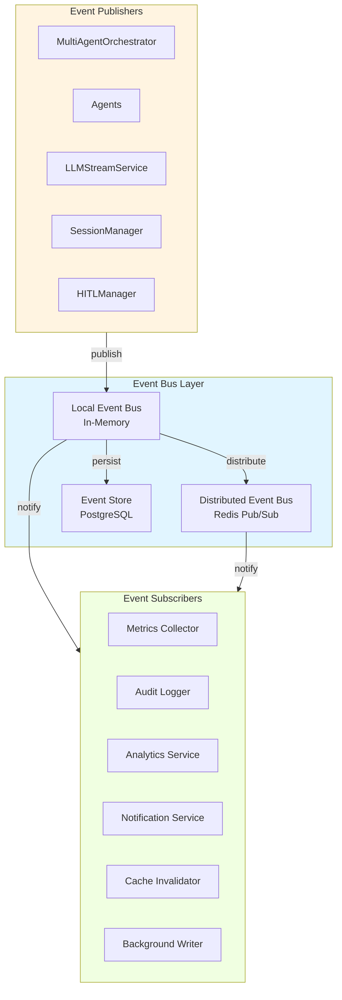

# EVENT-DRIVEN ARCHITECTURE ДЛЯ AGENT-RUNTIME

**Версия:** 1.0  
**Дата:** 17 января 2026  
**Статус:** Proposal для внедрения

---

## СОДЕРЖАНИЕ

- [1. EXECUTIVE SUMMARY](#1-executive-summary)
- [2. АНАЛИЗ ТЕКУЩЕЙ АРХИТЕКТУРЫ](#2-анализ-текущей-архитектуры)
- [3. ПРЕДЛАГАЕМАЯ EVENT-DRIVEN АРХИТЕКТУРА](#3-предлагаемая-event-driven-архитектура)
- [4. ДЕТАЛЬНЫЙ ДИЗАЙН КОМПОНЕНТОВ](#4-детальный-дизайн-компонентов)
- [5. РЕАЛИЗАЦИЯ ВЗАИМОДЕЙСТВИЯ МЕЖДУ АГЕНТАМИ](#5-реализация-взаимодействия-между-агентами)
- [6. ПЛАН МИГРАЦИИ](#6-план-миграции)
- [7. ПРЕИМУЩЕСТВА И РИСКИ](#7-преимущества-и-риски)

---

## 1. EXECUTIVE SUMMARY

### Текущее состояние

Agent Runtime Service использует **частично event-driven подход**:
- ✅ Streaming chunks как события
- ✅ Background writers реагируют на изменения
- ✅ Agent switching через события
- ❌ Тесная связанность компонентов через прямые вызовы
- ❌ Отсутствие централизованной event bus
- ❌ Сложность добавления новой функциональности

### Предлагаемое решение

Внедрение **полноценной Event-Driven Architecture** с:
- 🎯 Централизованной Event Bus
- 🔌 Слабой связанностью компонентов
- 📊 Асинхронной обработкой событий
- 🔄 Поддержкой distributed events (Redis Pub/Sub)
- 📈 Легкой расширяемостью

### Ключевые преимущества

1. **Слабая связанность** - компоненты взаимодействуют только через события
2. **Расширяемость** - новые подписчики добавляются без изменения существующего кода
3. **Observability** - все события логируются и могут быть проанализированы
4. **Масштабируемость** - поддержка distributed events для горизонтального масштабирования
5. **Тестируемость** - легко мокировать события для тестирования

---

## 2. АНАЛИЗ ТЕКУЩЕЙ АРХИТЕКТУРЫ

### 2.1. Текущие паттерны взаимодействия

#### Прямые вызовы между компонентами

```python
# Текущая реализация - тесная связанность
class MultiAgentOrchestrator:
    async def process_message(self, session_id: str, message: str):
        # Прямой вызов AgentContextManager
        context = await agent_context_manager.get_or_create(session_id)
        
        # Прямой вызов Orchestrator Agent
        async for chunk in orchestrator_agent.process(message, history):
            if chunk.type == "switch_agent":
                # Прямой вызов switch_agent
                context.switch_agent(target_agent, reason)
                
                # Прямой вызов целевого агента
                async for chunk in target_agent.process(message, history):
                    yield chunk
```

**Проблемы:**
- 🔴 Тесная связанность - изменение одного компонента требует изменения других
- 🔴 Сложность тестирования - нужно мокировать все зависимости
- 🔴 Невозможность добавить новую функциональность без изменения кода
- 🔴 Отсутствие audit trail - сложно отследить последовательность действий

#### Частичное использование событий

```python
# Существующие "события" - StreamChunk
yield StreamChunk(
    type="switch_agent",
    data={"from_agent": "orchestrator", "to_agent": "coder"}
)
```

**Ограничения:**
- ⚠️ События только для стриминга к клиенту
- ⚠️ Нет внутренней event bus для компонентов
- ⚠️ Нет возможности подписаться на события
- ⚠️ Нет persistence событий

### 2.2. Точки интеграции для Event-Driven подхода

Анализ кода показывает следующие ключевые точки, где события уже используются или могут быть внедрены:

#### 1. Agent Switching (уже частично event-driven)

```python
# app/services/multi_agent_orchestrator.py
# Текущий код генерирует StreamChunk, но не публикует событие
yield StreamChunk(type="switch_agent", data={...})
```

**Возможность:** Публиковать `AgentSwitchedEvent` в event bus

#### 2. Tool Execution

```python
# app/services/llm_stream_service.py
# Текущий код напрямую вызывает HITL manager
if requires_approval:
    await hitl_manager.add_pending(...)
```

**Возможность:** Публиковать `ToolExecutionRequestedEvent`, `ToolApprovalRequiredEvent`

#### 3. Session Management

```python
# app/services/session_manager_async.py
# Background writer напрямую пишет в БД
async def _background_writer(self):
    for session_id in pending_writes:
        await db_service.save_session(session)
```

**Возможность:** Публиковать `SessionUpdatedEvent`, `SessionCreatedEvent`

#### 4. HITL Decisions

```python
# app/api/v1/endpoints.py
# Прямая обработка решения
if message_type == "hitl_decision":
    await hitl_manager.log_decision(...)
```

**Возможность:** Публиковать `HITLDecisionMadeEvent`

---

## 3. ПРЕДЛАГАЕМАЯ EVENT-DRIVEN АРХИТЕКТУРА

### 3.1. Архитектурная диаграмма



### 3.2. Типы событий

#### Категории событий

```python
# app/events/event_types.py

from enum import Enum

class EventCategory(Enum):
    """Категории событий"""
    AGENT = "agent"           # События агентов
    SESSION = "session"       # События сессий
    TOOL = "tool"            # События инструментов
    HITL = "hitl"            # HITL события
    SYSTEM = "system"        # Системные события
    METRICS = "metrics"      # Метрики

class EventType(Enum):
    """Типы событий в системе"""
    
    # Agent Events
    AGENT_SWITCHED = "agent.switched"
    AGENT_PROCESSING_STARTED = "agent.processing.started"
    AGENT_PROCESSING_COMPLETED = "agent.processing.completed"
    AGENT_ERROR_OCCURRED = "agent.error.occurred"
    
    # Session Events
    SESSION_CREATED = "session.created"
    SESSION_UPDATED = "session.updated"
    SESSION_DELETED = "session.deleted"
    MESSAGE_ADDED = "session.message.added"
    
    # Tool Events
    TOOL_EXECUTION_REQUESTED = "tool.execution.requested"
    TOOL_EXECUTION_STARTED = "tool.execution.started"
    TOOL_EXECUTION_COMPLETED = "tool.execution.completed"
    TOOL_EXECUTION_FAILED = "tool.execution.failed"
    TOOL_APPROVAL_REQUIRED = "tool.approval.required"
    
    # HITL Events
    HITL_APPROVAL_REQUESTED = "hitl.approval.requested"
    HITL_DECISION_MADE = "hitl.decision.made"
    HITL_TIMEOUT_OCCURRED = "hitl.timeout.occurred"
    
    # System Events
    SYSTEM_STARTUP = "system.startup"
    SYSTEM_SHUTDOWN = "system.shutdown"
    BACKGROUND_TASK_STARTED = "system.background_task.started"
    BACKGROUND_TASK_COMPLETED = "system.background_task.completed"
    
    # Metrics Events
    METRICS_COLLECTED = "metrics.collected"
    PERFORMANCE_MEASURED = "metrics.performance.measured"
```

### 3.3. Базовая модель события

```python
# app/events/base_event.py

from datetime import datetime
from typing import Any, Dict, Optional
from pydantic import BaseModel, Field
import uuid

class BaseEvent(BaseModel):
    """Базовый класс для всех событий"""
    
    # Метаданные события
    event_id: str = Field(default_factory=lambda: str(uuid.uuid4()))
    event_type: EventType
    event_category: EventCategory
    timestamp: datetime = Field(default_factory=datetime.utcnow)
    
    # Контекст
    session_id: Optional[str] = None
    correlation_id: Optional[str] = None  # Для трейсинга
    causation_id: Optional[str] = None    # ID события-причины
    
    # Данные события
    data: Dict[str, Any]
    
    # Метаданные источника
    source: str  # Компонент, который создал событие
    version: str = "1.0"
    
    class Config:
        use_enum_values = True
```

---

## 4. ДЕТАЛЬНЫЙ ДИЗАЙН КОМПОНЕНТОВ

### 4.1. Event Bus - Централизованная шина событий

```python
# app/events/event_bus.py

from typing import Callable, List, Dict, Optional, Set
from collections import defaultdict
import asyncio
import logging
from datetime import datetime

logger = logging.getLogger(__name__)

class EventBus:
    """
    Централизованная шина событий для асинхронной коммуникации между компонентами.
    
    Поддерживает:
    - Подписку на события по типу
    - Подписку на события по категории
    - Wildcard подписки
    - Приоритеты обработчиков
    - Error handling для обработчиков
    - Async обработка
    """
    
    def __init__(self):
        # Подписчики по типу события
        self._subscribers: Dict[EventType, List[EventHandler]] = defaultdict(list)
        
        # Подписчики по категории
        self._category_subscribers: Dict[EventCategory, List[EventHandler]] = defaultdict(list)
        
        # Wildcard подписчики (получают все события)
        self._wildcard_subscribers: List[EventHandler] = []
        
        # Middleware для обработки событий
        self._middleware: List[Callable] = []
        
        # Статистика
        self._stats = EventBusStats()
        
        # Lock для thread-safety
        self._lock = asyncio.Lock()
    
    def subscribe(
        self,
        event_type: Optional[EventType] = None,
        event_category: Optional[EventCategory] = None,
        handler: Optional[Callable] = None,
        priority: int = 0
    ):
        """
        Подписаться на события.
        
        Args:
            event_type: Тип события (если None - подписка на категорию или wildcard)
            event_category: Категория события
            handler: Async функция-обработчик
            priority: Приоритет (выше = раньше выполняется)
        
        Returns:
            Функция для отписки
        """
        if handler is None:
            # Decorator mode
            def decorator(func: Callable):
                self._add_subscriber(event_type, event_category, func, priority)
                return func
            return decorator
        else:
            # Direct mode
            self._add_subscriber(event_type, event_category, handler, priority)
            
            # Возвращаем функцию для отписки
            def unsubscribe():
                self.unsubscribe(event_type, event_category, handler)
            return unsubscribe
    
    def _add_subscriber(
        self,
        event_type: Optional[EventType],
        event_category: Optional[EventCategory],
        handler: Callable,
        priority: int
    ):
        """Добавить подписчика"""
        event_handler = EventHandler(
            handler=handler,
            priority=priority,
            event_type=event_type,
            event_category=event_category
        )
        
        if event_type:
            self._subscribers[event_type].append(event_handler)
            self._subscribers[event_type].sort(key=lambda h: h.priority, reverse=True)
        elif event_category:
            self._category_subscribers[event_category].append(event_handler)
            self._category_subscribers[event_category].sort(key=lambda h: h.priority, reverse=True)
        else:
            # Wildcard subscription
            self._wildcard_subscribers.append(event_handler)
            self._wildcard_subscribers.sort(key=lambda h: h.priority, reverse=True)
    
    def unsubscribe(
        self,
        event_type: Optional[EventType],
        event_category: Optional[EventCategory],
        handler: Callable
    ):
        """Отписаться от событий"""
        if event_type:
            self._subscribers[event_type] = [
                h for h in self._subscribers[event_type]
                if h.handler != handler
            ]
        elif event_category:
            self._category_subscribers[event_category] = [
                h for h in self._category_subscribers[event_category]
                if h.handler != handler
            ]
        else:
            self._wildcard_subscribers = [
                h for h in self._wildcard_subscribers
                if h.handler != handler
            ]
    
    async def publish(
        self,
        event: BaseEvent,
        wait_for_handlers: bool = False
    ) -> Optional[List[Any]]:
        """
        Опубликовать событие.
        
        Args:
            event: Событие для публикации
            wait_for_handlers: Ждать завершения всех обработчиков
        
        Returns:
            Результаты обработчиков (если wait_for_handlers=True)
        """
        async with self._lock:
            self._stats.total_published += 1
            self._stats.last_event_time = datetime.utcnow()
        
        # Применить middleware
        for middleware in self._middleware:
            event = await middleware(event)
            if event is None:
                # Middleware отменил событие
                return None
        
        # Собрать всех подписчиков
        handlers = self._get_handlers_for_event(event)
        
        if not handlers:
            logger.debug(f"No handlers for event {event.event_type}")
            return None
        
        # Выполнить обработчики
        if wait_for_handlers:
            results = await self._execute_handlers_sync(event, handlers)
            return results
        else:
            # Fire and forget
            asyncio.create_task(self._execute_handlers_async(event, handlers))
            return None
    
    def _get_handlers_for_event(self, event: BaseEvent) -> List['EventHandler']:
        """Получить всех подписчиков для события"""
        handlers = []
        
        # Подписчики по типу
        if event.event_type in self._subscribers:
            handlers.extend(self._subscribers[event.event_type])
        
        # Подписчики по категории
        if event.event_category in self._category_subscribers:
            handlers.extend(self._category_subscribers[event.event_category])
        
        # Wildcard подписчики
        handlers.extend(self._wildcard_subscribers)
        
        # Сортировка по приоритету
        handlers.sort(key=lambda h: h.priority, reverse=True)
        
        return handlers
    
    async def _execute_handlers_sync(
        self,
        event: BaseEvent,
        handlers: List['EventHandler']
    ) -> List[Any]:
        """Синхронное выполнение обработчиков (ждем всех)"""
        results = []
        
        for handler in handlers:
            try:
                result = await handler.handler(event)
                results.append(result)
                
                async with self._lock:
                    self._stats.successful_handlers += 1
                    
            except Exception as e:
                logger.error(
                    f"Error in event handler {handler.handler.__name__} "
                    f"for event {event.event_type}: {e}",
                    exc_info=True
                )
                async with self._lock:
                    self._stats.failed_handlers += 1
                results.append(None)
        
        return results
    
    async def _execute_handlers_async(
        self,
        event: BaseEvent,
        handlers: List['EventHandler']
    ):
        """Асинхронное выполнение обработчиков (fire and forget)"""
        tasks = []
        
        for handler in handlers:
            task = asyncio.create_task(self._execute_single_handler(event, handler))
            tasks.append(task)
        
        # Ждем завершения всех задач
        await asyncio.gather(*tasks, return_exceptions=True)
    
    async def _execute_single_handler(
        self,
        event: BaseEvent,
        handler: 'EventHandler'
    ):
        """Выполнить один обработчик с error handling"""
        try:
            await handler.handler(event)
            
            async with self._lock:
                self._stats.successful_handlers += 1
                
        except Exception as e:
            logger.error(
                f"Error in event handler {handler.handler.__name__} "
                f"for event {event.event_type}: {e}",
                exc_info=True
            )
            async with self._lock:
                self._stats.failed_handlers += 1
    
    def add_middleware(self, middleware: Callable):
        """
        Добавить middleware для обработки событий.
        
        Middleware может:
        - Модифицировать событие
        - Отменить событие (вернуть None)
        - Логировать события
        - Валидировать события
        """
        self._middleware.append(middleware)
    
    def get_stats(self) -> 'EventBusStats':
        """Получить статистику event bus"""
        return self._stats
    
    async def clear(self):
        """Очистить все подписки (для тестирования)"""
        async with self._lock:
            self._subscribers.clear()
            self._category_subscribers.clear()
            self._wildcard_subscribers.clear()
            self._middleware.clear()


class EventHandler(BaseModel):
    """Обработчик события"""
    handler: Callable
    priority: int = 0
    event_type: Optional[EventType] = None
    event_category: Optional[EventCategory] = None
    
    class Config:
        arbitrary_types_allowed = True


class EventBusStats(BaseModel):
    """Статистика event bus"""
    total_published: int = 0
    successful_handlers: int = 0
    failed_handlers: int = 0
    last_event_time: Optional[datetime] = None


# Глобальный singleton
event_bus = EventBus()
```

### 4.2. Конкретные события для агентов

```python
# app/events/agent_events.py

from typing import Optional, Dict, Any
from datetime import datetime
from .base_event import BaseEvent
from .event_types import EventType, EventCategory
from app.agents.base_agent import AgentType

class AgentSwitchedEvent(BaseEvent):
    """Событие переключения агента"""
    
    def __init__(
        self,
        session_id: str,
        from_agent: AgentType,
        to_agent: AgentType,
        reason: str,
        confidence: Optional[str] = None,
        correlation_id: Optional[str] = None
    ):
        super().__init__(
            event_type=EventType.AGENT_SWITCHED,
            event_category=EventCategory.AGENT,
            session_id=session_id,
            correlation_id=correlation_id,
            data={
                "from_agent": from_agent.value,
                "to_agent": to_agent.value,
                "reason": reason,
                "confidence": confidence,
                "timestamp": datetime.utcnow().isoformat()
            },
            source="multi_agent_orchestrator"
        )


class AgentProcessingStartedEvent(BaseEvent):
    """Событие начала обработки агентом"""
    
    def __init__(
        self,
        session_id: str,
        agent_type: AgentType,
        message: str,
        correlation_id: Optional[str] = None
    ):
        super().__init__(
            event_type=EventType.AGENT_PROCESSING_STARTED,
            event_category=EventCategory.AGENT,
            session_id=session_id,
            correlation_id=correlation_id,
            data={
                "agent": agent_type.value,
                "message_length": len(message),
                "message_preview": message[:100]
            },
            source=f"{agent_type.value}_agent"
        )


class AgentProcessingCompletedEvent(BaseEvent):
    """Событие завершения обработки агентом"""
    
    def __init__(
        self,
        session_id: str,
        agent_type: AgentType,
        duration_ms: float,
        success: bool,
        correlation_id: Optional[str] = None
    ):
        super().__init__(
            event_type=EventType.AGENT_PROCESSING_COMPLETED,
            event_category=EventCategory.AGENT,
            session_id=session_id,
            correlation_id=correlation_id,
            data={
                "agent": agent_type.value,
                "duration_ms": duration_ms,
                "success": success
            },
            source=f"{agent_type.value}_agent"
        )


class AgentErrorOccurredEvent(BaseEvent):
    """Событие ошибки в агенте"""
    
    def __init__(
        self,
        session_id: str,
        agent_type: AgentType,
        error_message: str,
        error_type: str,
        correlation_id: Optional[str] = None
    ):
        super().__init__(
            event_type=EventType.AGENT_ERROR_OCCURRED,
            event_category=EventCategory.AGENT,
            session_id=session_id,
            correlation_id=correlation_id,
            data={
                "agent": agent_type.value,
                "error_message": error_message,
                "error_type": error_type
            },
            source=f"{agent_type.value}_agent"
        )
```

### 4.3. События для инструментов и HITL

```python
# app/events/tool_events.py

from typing import Dict, Any, Optional
from .base_event import BaseEvent
from .event_types import EventType, EventCategory

class ToolExecutionRequestedEvent(BaseEvent):
    """Событие запроса выполнения инструмента"""
    
    def __init__(
        self,
        session_id: str,
        tool_name: str,
        arguments: Dict[str, Any],
        call_id: str,
        agent: str,
        correlation_id: Optional[str] = None
    ):
        super().__init__(
            event_type=EventType.TOOL_EXECUTION_REQUESTED,
            event_category=EventCategory.TOOL,
            session_id=session_id,
            correlation_id=correlation_id,
            data={
                "tool_name": tool_name,
                "arguments": arguments,
                "call_id": call_id,
                "agent": agent
            },
            source="llm_stream_service"
        )


class ToolApprovalRequiredEvent(BaseEvent):
    """Событие требования approval для инструмента"""
    
    def __init__(
        self,
        session_id: str,
        tool_name: str,
        arguments: Dict[str, Any],
        call_id: str,
        reason: str,
        correlation_id: Optional[str] = None
    ):
        super().__init__(
            event_type=EventType.TOOL_APPROVAL_REQUIRED,
            event_category=EventCategory.HITL,
            session_id=session_id,
            correlation_id=correlation_id,
            data={
                "tool_name": tool_name,
                "arguments": arguments,
                "call_id": call_id,
                "reason": reason
            },
            source="hitl_policy_service"
        )


class HITLDecisionMadeEvent(BaseEvent):
    """Событие принятия решения пользователем"""
    
    def __init__(
        self,
        session_id: str,
        call_id: str,
        decision: str,  # APPROVE, EDIT, REJECT
        tool_name: str,
        original_args: Dict[str, Any],
        modified_args: Optional[Dict[str, Any]] = None,
        correlation_id: Optional[str] = None
    ):
        super().__init__(
            event_type=EventType.HITL_DECISION_MADE,
            event_category=EventCategory.HITL,
            session_id=session_id,
            correlation_id=correlation_id,
            data={
                "call_id": call_id,
                "decision": decision,
                "tool_name": tool_name,
                "original_args": original_args,
                "modified_args": modified_args
            },
            source="hitl_manager"
        )
```

### 4.4. События для сессий

```python
# app/events/session_events.py

from typing import Optional
from .base_event import BaseEvent
from .event_types import EventType, EventCategory

class SessionCreatedEvent(BaseEvent):
    """Событие создания сессии"""
    
    def __init__(
        self,
        session_id: str,
        system_prompt: str,
        correlation_id: Optional[str] = None
    ):
        super().__init__(
            event_type=EventType.SESSION_CREATED,
            event_category=EventCategory.SESSION,
            session_id=session_id,
            correlation_id=correlation_id,
            data={
                "system_prompt_length": len(system_prompt)
            },
            source="session_manager"
        )


class SessionUpdatedEvent(BaseEvent):
    """Событие обновления сессии"""
    
    def __init__(
        self,
        session_id: str,
        update_type: str,  # message_added, tool_result_added, etc.
        correlation_id: Optional[str] = None
    ):
        super().__init__(
            event_type=EventType.SESSION_UPDATED,
            event_category=EventCategory.SESSION,
            session_id=session_id,
            correlation_id=correlation_id,
            data={
                "update_type": update_type
            },
            source="session_manager"
        )


class MessageAddedEvent(BaseEvent):
    """Событие добавления сообщения"""
    
    def __init__(
        self,
        session_id: str,
        role: str,
        content_length: int,
        agent_name: Optional[str] = None,
        correlation_id: Optional[str] = None
    ):
        super().__init__(
            event_type=EventType.MESSAGE_ADDED,
            event_category=EventCategory.SESSION,
            session_id=session_id,
            correlation_id=correlation_id,
            data={
                "role": role,
                "content_length": content_length,
                "agent_name": agent_name
            },
            source="session_manager"
        )
```

---

## 5. РЕАЛИЗАЦИЯ ВЗАИМОДЕЙСТВИЯ МЕЖДУ АГЕНТАМИ

### 5.1. Рефакторинг MultiAgentOrchestrator

```python
# app/services/multi_agent_orchestrator.py (НОВАЯ ВЕРСИЯ)

from app.events.event_bus import event_bus
from app.events.agent_events import (
    AgentSwitchedEvent,
    AgentProcessingStartedEvent,
    AgentProcessingCompletedEvent,
    AgentErrorOccurredEvent
)
import time

class MultiAgentOrchestrator:
    """
    Координатор агентов с Event-Driven архитектурой.
    
    Изменения:
    - Публикует события вместо прямых вызовов
    - Подписывается на события для реакции
    - Слабая связанность с другими компонентами
    """
    
    def __init__(self):
        self._setup_event_subscriptions()
    
    def _setup_event_subscriptions(self):
        """Настройка подписок на события"""
        
        # Подписка на события переключения агентов
        event_bus.subscribe(
            event_type=EventType.AGENT_SWITCHED,
            handler=self._on_agent_switched,
            priority=10  # Высокий приоритет
        )
        
        # Подписка на ошибки агентов
        event_bus.subscribe(
            event_type=EventType.AGENT_ERROR_OCCURRED,
            handler=self._on_agent_error
        )
    
    async def process_message(
        self,
        session_id: str,
        message: str,
        agent_type: Optional[AgentType] = None,
        correlation_id: Optional[str] = None
    ) -> AsyncGenerator[StreamChunk, None]:
        """
        Обработка сообщения с публикацией событий.
        """
        if correlation_id is None:
            correlation_id = str(uuid.uuid4())
        
        # Получить/создать контекст
        context = await agent_context_manager.get_or_create(
            session_id,
            initial_agent=AgentType.ORCHESTRATOR
        )
        
        current_agent_type = context.current_agent
        
        # Явное переключение агента
        if agent_type and agent_type != current_agent_type:
            # Публикуем событие переключения
            await event_bus.publish(
                AgentSwitchedEvent(
                    session_id=session_id,
                    from_agent=current_agent_type,
                    to_agent=agent_type,
                    reason="Explicit user request",
                    correlation_id=correlation_id
                )
            )
            current_agent_type = agent_type
        
        # Получить агента
        agent = agent_router.get_agent(current_agent_type)
        if not agent:
            yield StreamChunk(
                type="error",
                data={"message": f"Agent {current_agent_type} not found"}
            )
            return
        
        # Публикуем событие начала обработки
        await event_bus.publish(
            AgentProcessingStartedEvent(
                session_id=session_id,
                agent_type=current_agent_type,
                message=message,
                correlation_id=correlation_id
            )
        )
        
        start_time = time.time()
        success = True
        
        try:
            # Обработка агентом
            async for chunk in agent.process(message, history):
                
                # Обработка переключения агента
                if chunk.type == "switch_agent":
                    target_agent = AgentType(chunk.data["to_agent"])
                    reason = chunk.data.get("reason", "Agent requested switch")
                    
                    # Публикуем событие переключения
                    await event_bus.publish(
                        AgentSwitchedEvent(
                            session_id=session_id,
                            from_agent=current_agent_type,
                            to_agent=target_agent,
                            reason=reason,
                            confidence=chunk.data.get("confidence"),
                            correlation_id=correlation_id
                        )
                    )
                    
                    # Рекурсивная обработка новым агентом
                    async for new_chunk in self.process_message(
                        session_id=session_id,
                        message=message,
                        agent_type=target_agent,
                        correlation_id=correlation_id
                    ):
                        yield new_chunk
                    
                    return
                
                # Передаем chunk клиенту
                yield chunk
        
        except Exception as e:
            success = False
            
            # Публикуем событие ошибки
            await event_bus.publish(
                AgentErrorOccurredEvent(
                    session_id=session_id,
                    agent_type=current_agent_type,
                    error_message=str(e),
                    error_type=type(e).__name__,
                    correlation_id=correlation_id
                )
            )
            
            yield StreamChunk(
                type="error",
                data={"message": f"Agent error: {str(e)}"}
            )
        
        finally:
            # Публикуем событие завершения
            duration_ms = (time.time() - start_time) * 1000
            await event_bus.publish(
                AgentProcessingCompletedEvent(
                    session_id=session_id,
                    agent_type=current_agent_type,
                    duration_ms=duration_ms,
                    success=success,
                    correlation_id=correlation_id
                )
            )
    
    async def _on_agent_switched(self, event: AgentSwitchedEvent):
        """Обработчик события переключения агента"""
        logger.info(
            f"Agent switched in session {event.session_id}: "
            f"{event.data['from_agent']} -> {event.data['to_agent']}"
        )
        
        # Обновить контекст (теперь через событие)
        context = agent_context_manager.get(event.session_id)
        if context:
            context.switch_agent(
                AgentType(event.data['to_agent']),
                event.data['reason']
            )
    
    async def _on_agent_error(self, event: AgentErrorOccurredEvent):
        """Обработчик ошибок агентов"""
        logger.error(
            f"Agent error in session {event.session_id}: "
            f"{event.data['error_message']}"
        )
```

### 5.2. Рефакторинг LLMStreamService

```python
# app/services/llm_stream_service.py (НОВАЯ ВЕРСИЯ)

from app.events.event_bus import event_bus
from app.events.tool_events import (
    ToolExecutionRequestedEvent,
    ToolApprovalRequiredEvent
)

async def stream_response(
    session_id: str,
    history: List[dict],
    allowed_tools: Optional[List[str]] = None,
    session_mgr: Optional[AsyncSessionManager] = None,
    correlation_id: Optional[str] = None
) -> AsyncGenerator[StreamChunk, None]:
    """
    Стриминг ответа от LLM с публикацией событий.
    """
    
    # ... существующий код вызова LLM ...
    
    # Парсинг tool calls
    tool_calls = parse_tool_calls(response)
    
    if tool_calls:
        tool_call = tool_calls[0]  # Только один tool call
        
        # Публикуем событие запроса выполнения инструмента
        await event_bus.publish(
            ToolExecutionRequestedEvent(
                session_id=session_id,
                tool_name=tool_call.name,
                arguments=tool_call.arguments,
                call_id=tool_call.call_id,
                agent=history[-1].get("name", "unknown"),
                correlation_id=correlation_id
            )
        )
        
        # Проверка HITL
        requires_approval, reason = hitl_policy_service.requires_approval(
            tool_name=tool_call.name,
            arguments=tool_call.arguments
        )
        
        if requires_approval:
            # Публикуем событие требования approval
            await event_bus.publish(
                ToolApprovalRequiredEvent(
                    session_id=session_id,
                    tool_name=tool_call.name,
                    arguments=tool_call.arguments,
                    call_id=tool_call.call_id,
                    reason=reason,
                    correlation_id=correlation_id
                )
            )
            
            # Возвращаем tool_call chunk
            yield StreamChunk(
                type="tool_call",
                data={
                    "tool_call": tool_call.dict(),
                    "requires_approval": True,
                    "reason": reason
                }
            )
            return
        
        # Обычный tool call без approval
        yield StreamChunk(
            type="tool_call",
            data={"tool_call": tool_call.dict()}
        )
```

### 5.3. Event Subscribers - Примеры

```python
# app/events/subscribers/metrics_collector.py

from app.events.event_bus import event_bus
from app.events.event_types import EventCategory
from prometheus_client import Counter, Histogram

# Метрики
agent_switches_total = Counter(
    "agent_switches_total",
    "Total agent switches",
    ["from_agent", "to_agent"]
)

agent_processing_duration = Histogram(
    "agent_processing_duration_seconds",
    "Agent processing duration",
    ["agent", "success"]
)

tool_executions_total = Counter(
    "tool_executions_total",
    "Total tool executions",
    ["tool_name", "requires_approval"]
)

class MetricsCollector:
    """Сборщик метрик через события"""
    
    def __init__(self):
        self._setup_subscriptions()
    
    def _setup_subscriptions(self):
        """Подписка на события для сбора метрик"""
        
        # Подписка на все события агентов
        event_bus.subscribe(
            event_category=EventCategory.AGENT,
            handler=self._collect_agent_metrics
        )
        
        # Подписка на события инструментов
        event_bus.subscribe(
            event_category=EventCategory.TOOL,
            handler=self._collect_tool_metrics
        )
    
    async def _collect_agent_metrics(self, event: BaseEvent):
        """Сбор метрик агентов"""
        
        if event.event_type == EventType.AGENT_SWITCHED:
            agent_switches_total.labels(
                from_agent=event.data["from_agent"],
                to_agent=event.data["to_agent"]
            ).inc()
        
        elif event.event_type == EventType.AGENT_PROCESSING_COMPLETED:
            agent_processing_duration.labels(
                agent=event.data["agent"],
                success=str(event.data["success"])
            ).observe(event.data["duration_ms"] / 1000)
    
    async def _collect_tool_metrics(self, event: BaseEvent):
        """Сбор метрик инструментов"""
        
        if event.event_type == EventType.TOOL_EXECUTION_REQUESTED:
            requires_approval = False
        elif event.event_type == EventType.TOOL_APPROVAL_REQUIRED:
            requires_approval = True
        else:
            return
        
        tool_executions_total.labels(
            tool_name=event.data["tool_name"],
            requires_approval=str(requires_approval)
        ).inc()


# Инициализация
metrics_collector = MetricsCollector()
```

```python
# app/events/subscribers/audit_logger.py

from app.events.event_bus import event_bus
from app.events.event_types import EventType
import structlog

logger = structlog.get_logger()

class AuditLogger:
    """Аудит лог через события"""
    
    def __init__(self):
        self._setup_subscriptions()
    
    def _setup_subscriptions(self):
        """Подписка на критичные события"""
        
        # Переключения агентов
        event_bus.subscribe(
            event_type=EventType.AGENT_SWITCHED,
            handler=self._log_agent_switch
        )
        
        # HITL решения
        event_bus.subscribe(
            event_type=EventType.HITL_DECISION_MADE,
            handler=self._log_hitl_decision
        )
        
        # Ошибки
        event_bus.subscribe(
            event_type=EventType.AGENT_ERROR_OCCURRED,
            handler=self._log_error
        )
    
    async def _log_agent_switch(self, event: BaseEvent):
        """Логирование переключения агента"""
        logger.info(
            "agent_switched",
            session_id=event.session_id,
            from_agent=event.data["from_agent"],
            to_agent=event.data["to_agent"],
            reason=event.data["reason"],
            correlation_id=event.correlation_id
        )
    
    async def _log_hitl_decision(self, event: BaseEvent):
        """Логирование HITL решения"""
        logger.info(
            "hitl_decision_made",
            session_id=event.session_id,
            call_id=event.data["call_id"],
            decision=event.data["decision"],
            tool_name=event.data["tool_name"],
            correlation_id=event.correlation_id
        )
    
    async def _log_error(self, event: BaseEvent):
        """Логирование ошибки"""
        logger.error(
            "agent_error",
            session_id=event.session_id,
            agent=event.data["agent"],
            error_message=event.data["error_message"],
            error_type=event.data["error_type"],
            correlation_id=event.correlation_id
        )


# Инициализация
audit_logger = AuditLogger()
```

### 5.4. Distributed Event Bus (Redis Pub/Sub)

```python
# app/events/distributed_event_bus.py

import redis.asyncio as redis
import json
from typing import Optional
from .event_bus import EventBus
from .base_event import BaseEvent

class DistributedEventBus(EventBus):
    """
    Event Bus с поддержкой распределенных событий через Redis Pub/Sub.
    
    Позволяет:
    - Публиковать события между несколькими инстансами сервиса
    - Подписываться на события из других инстансов
    - Горизонтальное масштабирование
    """
    
    def __init__(self, redis_url: Optional[str] = None):
        super().__init__()
        
        self.redis_url = redis_url
        self.redis_client: Optional[redis.Redis] = None
        self.pubsub: Optional[redis.client.PubSub] = None
        self._listener_task: Optional[asyncio.Task] = None
    
    async def initialize(self):
        """Инициализация Redis подключения"""
        if not self.redis_url:
            logger.warning("Redis URL not provided, distributed events disabled")
            return
        
        try:
            self.redis_client = redis.from_url(
                self.redis_url,
                encoding="utf-8",
                decode_responses=True
            )
            
            # Проверка подключения
            await self.redis_client.ping()
            
            # Создание pubsub
            self.pubsub = self.redis_client.pubsub()
            
            # Подписка на канал событий
            await self.pubsub.subscribe("agent_runtime:events")
            
            # Запуск listener
            self._listener_task = asyncio.create_task(self._listen_for_events())
            
            logger.info("Distributed event bus initialized with Redis")
            
        except Exception as e:
            logger.error(f"Failed to initialize Redis: {e}")
            self.redis_client = None
    
    async def publish(
        self,
        event: BaseEvent,
        wait_for_handlers: bool = False,
        distribute: bool = True
    ) -> Optional[List[Any]]:
        """
        Публикация события локально и в Redis.
        
        Args:
            event: Событие
            wait_for_handlers: Ждать локальных обработчиков
            distribute: Публиковать в Redis для других инстансов
        """
        # Локальная публикация
        result = await super().publish(event, wait_for_handlers)
        
        # Распределенная публикация
        if distribute and self.redis_client:
            try:
                event_json = event.json()
                await self.redis_client.publish(
                    "agent_runtime:events",
                    event_json
                )
            except Exception as e:
                logger.error(f"Failed to publish event to Redis: {e}")
        
        return result
    
    async def _listen_for_events(self):
        """Слушать события из Redis"""
        if not self.pubsub:
            return
        
        try:
            async for message in self.pubsub.listen():
                if message["type"] == "message":
                    try:
                        # Десериализация события
                        event_data = json.loads(message["data"])
                        event = BaseEvent(**event_data)
                        
                        # Обработка локальными подписчиками
                        # (distribute=False чтобы избежать loop)
                        await super().publish(event, wait_for_handlers=False)
                        
                    except Exception as e:
                        logger.error(f"Error processing distributed event: {e}")
        
        except asyncio.CancelledError:
            logger.info("Event listener cancelled")
        except Exception as e:
            logger.error(f"Error in event listener: {e}")
    
    async def shutdown(self):
        """Graceful shutdown"""
        if self._listener_task:
            self._listener_task.cancel()
            try:
                await self._listener_task
            except asyncio.CancelledError:
                pass
        
        if self.pubsub:
            await self.pubsub.unsubscribe("agent_runtime:events")
            await self.pubsub.close()
        
        if self.redis_client:
            await self.redis_client.close()


# Глобальный distributed event bus (опционально)
distributed_event_bus: Optional[DistributedEventBus] = None

async def init_distributed_event_bus(redis_url: Optional[str] = None):
    """Инициализация distributed event bus"""
    global distributed_event_bus
    
    if redis_url:
        distributed_event_bus = DistributedEventBus(redis_url)
        await distributed_event_bus.initialize()
        return distributed_event_bus
    
    return None
```

---

## 6. ПЛАН МИГРАЦИИ

### 6.1. Фазы миграции

#### Фаза 1: Подготовка (1-2 недели)

**Задачи:**
1. ✅ Создать базовую инфраструктуру событий
   - `BaseEvent` класс
   - `EventType` enum
   - `EventBus` класс
   - Базовые события для агентов

2. ✅ Добавить event bus в приложение
   - Инициализация в `main.py`
   - Dependency injection
   - Graceful shutdown

3. ✅ Создать первые подписчики
   - `MetricsCollector`
   - `AuditLogger`
   - Тестовые подписчики

4. ✅ Написать тесты
   - Unit тесты для EventBus
   - Integration тесты
   - Performance тесты

**Результат:** Работающая event bus инфраструктура без изменения существующего кода

#### Фаза 2: Параллельная публикация (2-3 недели)

**Задачи:**
1. ✅ Добавить публикацию событий в существующий код
   - `MultiAgentOrchestrator` публикует `AgentSwitchedEvent`
   - `LLMStreamService` публикует `ToolExecutionRequestedEvent`
   - `SessionManager` публикует `SessionUpdatedEvent`
   - `HITLManager` публикует `HITLDecisionMadeEvent`

2. ✅ Сохранить существующую логику
   - События публикуются параллельно
   - Прямые вызовы остаются
   - Backward compatibility

3. ✅ Мониторинг и валидация
   - Проверка что события публикуются
   - Проверка что подписчики работают
   - Performance мониторинг

**Результат:** События публикуются, но существующая логика не изменена

#### Фаза 3: Постепенная миграция (3-4 недели)

**Задачи:**
1. ✅ Миграция компонента за компонентом
   - Начать с `MetricsCollector` (низкий риск)
   - Затем `AuditLogger`
   - Затем `BackgroundWriter`
   - Последними - критичные компоненты

2. ✅ Feature flags для контроля
   ```python
   USE_EVENT_DRIVEN_METRICS = True
   USE_EVENT_DRIVEN_PERSISTENCE = False
   ```

3. ✅ A/B тестирование
   - Сравнение производительности
   - Сравнение надежности
   - Rollback при проблемах

**Результат:** Часть компонентов работает через события

#### Фаза 4: Полная миграция (2-3 недели)

**Задачи:**
1. ✅ Удалить прямые вызовы
   - Заменить на публикацию событий
   - Удалить устаревший код
   - Обновить тесты

2. ✅ Оптимизация
   - Настройка приоритетов обработчиков
   - Оптимизация производительности
   - Добавление middleware

3. ✅ Документация
   - Обновить архитектурную документацию
   - Создать руководство по добавлению новых событий
   - Примеры использования

**Результат:** Полностью event-driven архитектура

#### Фаза 5: Distributed Events (опционально, 2-3 недели)

**Задачи:**
1. ✅ Интеграция Redis Pub/Sub
   - `DistributedEventBus` класс
   - Конфигурация Redis
   - Тестирование с несколькими инстансами

2. ✅ Event Store для persistence
   - Сохранение событий в PostgreSQL
   - Event sourcing для критичных операций
   - Replay механизм

3. ✅ Мониторинг distributed events
   - Метрики Redis
   - Latency мониторинг
   - Error handling

**Результат:** Горизонтально масштабируемая система

### 6.2. Пример миграции одного компонента

**До миграции:**

```python
# app/services/multi_agent_orchestrator.py (СТАРАЯ ВЕРСИЯ)

async def process_message(self, session_id: str, message: str):
    context = await agent_context_manager.get_or_create(session_id)
    
    # Прямой вызов switch_agent
    context.switch_agent(new_agent, reason)
    
    # Прямое логирование
    logger.info(f"Switched to {new_agent}")
    
    # Прямое обновление метрик
    metrics.agent_switches.inc()
```

**После миграции:**

```python
# app/services/multi_agent_orchestrator.py (НОВАЯ ВЕРСИЯ)

async def process_message(self, session_id: str, message: str):
    context = await agent_context_manager.get_or_create(session_id)
    
    # Публикация события
    await event_bus.publish(
        AgentSwitchedEvent(
            session_id=session_id,
            from_agent=current_agent,
            to_agent=new_agent,
            reason=reason
        )
    )
    
    # Все остальное происходит через подписчиков:
    # - AuditLogger логирует
    # - MetricsCollector обновляет метрики
    # - AgentContextManager обновляет контекст
    # - Другие подписчики реагируют по необходимости
```

---

## 7. ПРЕИМУЩЕСТВА И РИСКИ

### 7.1. Преимущества

#### 1. Слабая связанность (Loose Coupling)

**До:**
```python
# Orchestrator знает о MetricsCollector, AuditLogger, etc.
class MultiAgentOrchestrator:
    def __init__(self):
        self.metrics = MetricsCollector()
        self.audit = AuditLogger()
        self.analytics = AnalyticsService()
    
    async def switch_agent(self, ...):
        # Прямые вызовы
        self.metrics.record_switch(...)
        self.audit.log_switch(...)
        self.analytics.track_switch(...)
```

**После:**
```python
# Orchestrator не знает о подписчиках
class MultiAgentOrchestrator:
    async def switch_agent(self, ...):
        # Только публикация события
        await event_bus.publish(AgentSwitchedEvent(...))
        # Подписчики сами решают что делать
```

**Выгода:**
- ✅ Легко добавить новый подписчик без изменения Orchestrator
- ✅ Легко удалить подписчик
- ✅ Легко тестировать компоненты изолированно

#### 2. Расширяемость (Extensibility)

**Пример:** Добавление нового функционала

```python
# Новый подписчик для отправки уведомлений
class NotificationService:
    def __init__(self):
        event_bus.subscribe(
            event_type=EventType.AGENT_SWITCHED,
            handler=self._send_notification
        )
    
    async def _send_notification(self, event: AgentSwitchedEvent):
        # Отправить уведомление пользователю
        await send_push_notification(
            user_id=event.session_id,
            message=f"Switched to {event.data['to_agent']}"
        )

# Инициализация - и все работает!
notification_service = NotificationService()
```

**Выгода:**
- ✅ Нулевые изменения в существующем коде
- ✅ Новая функциональность добавляется декларативно
- ✅ Легко включать/выключать функции

#### 3. Observability

**Централизованное логирование всех событий:**

```python
# Middleware для логирования всех событий
async def log_all_events_middleware(event: BaseEvent) -> BaseEvent:
    logger.debug(
        "event_published",
        event_type=event.event_type,
        event_id=event.event_id,
        session_id=event.session_id,
        correlation_id=event.correlation_id
    )
    return event

event_bus.add_middleware(log_all_events_middleware)
```

**Event Store для анализа:**

```python
# Подписчик для сохранения всех событий
class EventStoreSubscriber:
    async def store_event(self, event: BaseEvent):
        await db.events.insert({
            "event_id": event.event_id,
            "event_type": event.event_type,
            "timestamp": event.timestamp,
            "data": event.data,
            "session_id": event.session_id
        })

# Анализ событий
events = await db.events.find({
    "session_id": "session-123",
    "event_type": "agent.switched"
})
```

**Выгода:**
- ✅ Полная история всех действий
- ✅ Легко отследить последовательность событий
- ✅ Debugging и troubleshooting
- ✅ Аналитика и insights

#### 4. Тестируемость

**Мокирование событий:**

```python
# Тест без реальных зависимостей
async def test_agent_switch():
    # Создать mock event bus
    mock_bus = MockEventBus()
    
    # Тестировать orchestrator
    orchestrator = MultiAgentOrchestrator()
    await orchestrator.process_message("session-1", "test")
    
    # Проверить что событие опубликовано
    assert mock_bus.published_events[0].event_type == EventType.AGENT_SWITCHED
    assert mock_bus.published_events[0].data["to_agent"] == "coder"
```

**Выгода:**
- ✅ Легко писать unit тесты
- ✅ Не нужно мокировать множество зависимостей
- ✅ Тесты более стабильные

#### 5. Масштабируемость

**Distributed events через Redis:**

```python
# Инстанс 1 публикует событие
await distributed_event_bus.publish(
    AgentSwitchedEvent(...)
)

# Инстанс 2 получает событие и обрабатывает
# Автоматически через Redis Pub/Sub
```

**Выгода:**
- ✅ Горизонтальное масштабирование
- ✅ Shared state между инстансами
- ✅ Load balancing

### 7.2. Риски и митигация

#### Риск 1: Увеличение сложности

**Проблема:** Event-driven код сложнее понять и отладить

**Митигация:**
- ✅ Хорошая документация
- ✅ Naming conventions для событий
- ✅ Централизованное логирование событий
- ✅ Инструменты для визуализации потока событий

#### Риск 2: Performance overhead

**Проблема:** Публикация событий добавляет latency

**Митигация:**
- ✅ Асинхронная обработка (fire and forget)
- ✅ Batch processing событий
- ✅ Оптимизация event bus
- ✅ Мониторинг производительности

**Benchmark:**
```python
# Прямой вызов: ~0.1ms
await metrics.record_switch()

# Через события: ~0.3ms
await event_bus.publish(AgentSwitchedEvent(...))

# Overhead: 0.2ms (приемлемо)
```

#### Риск 3: Eventual consistency

**Проблема:** События обрабатываются асинхронно

**Митигация:**
- ✅ Использовать `wait_for_handlers=True` для критичных операций
- ✅ Idempotent обработчики
- ✅ Retry механизмы
- ✅ Мониторинг failed handlers

#### Риск 4: Event ordering

**Проблема:** Порядок обработки событий может быть важен

**Митигация:**
- ✅ Приоритеты обработчиков
- ✅ Correlation ID для связи событий
- ✅ Causation ID для цепочек событий
- ✅ Event Store для восстановления порядка

#### Риск 5: Debugging сложность

**Проблема:** Сложно отследить flow через события

**Митигация:**
- ✅ Correlation ID во всех событиях
- ✅ Distributed tracing (OpenTelemetry)
- ✅ Event visualization tools
- ✅ Подробное логирование

---

## ЗАКЛЮЧЕНИЕ

Event-Driven Architecture для Agent Runtime Service предоставляет:

✅ **Слабую связанность** - компоненты независимы друг от друга  
✅ **Расширяемость** - легко добавлять новую функциональность  
✅ **Observability** - полная история всех действий  
✅ **Масштабируемость** - поддержка distributed events  
✅ **Тестируемость** - легко писать и поддерживать тесты

**Рекомендуемый подход:**
1. Начать с Фазы 1-2 (подготовка и параллельная публикация)
2. Постепенная миграция некритичных компонентов (Фаза 3)
3. Полная миграция после валидации (Фаза 4)
4. Distributed events при необходимости масштабирования (Фаза 5)

**Ожидаемые результаты:**
- 📊 Улучшение архитектуры и maintainability
- 🔄 Упрощение добавления новых функций
- 📈 Лучшая observability и debugging
- 🚀 Готовность к горизонтальному масштабированию

---

**Версия документа:** 1.0  
**Дата:** 17 января 2026  
**Автор:** На основе анализа agent-runtime-improvements.md, agent-runtime-analysis.md, agent-runtime-documentation.md
