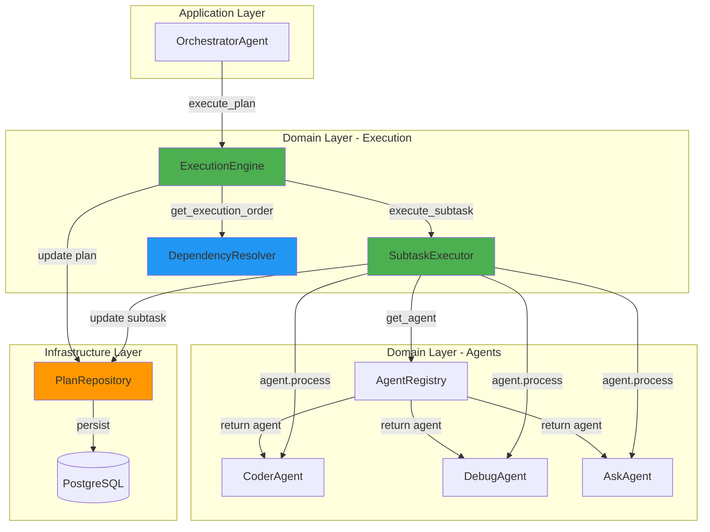
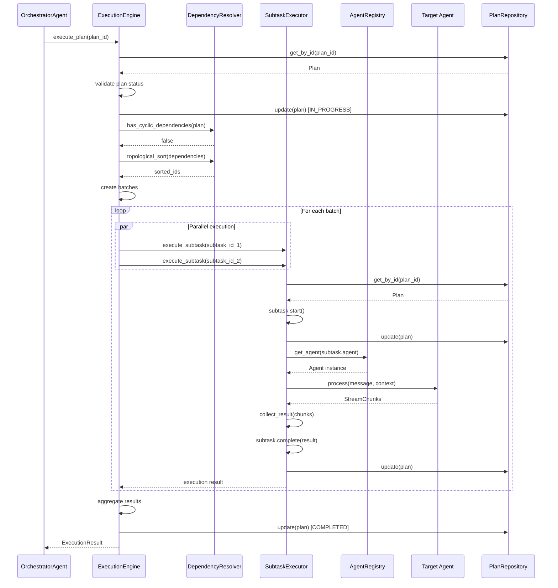
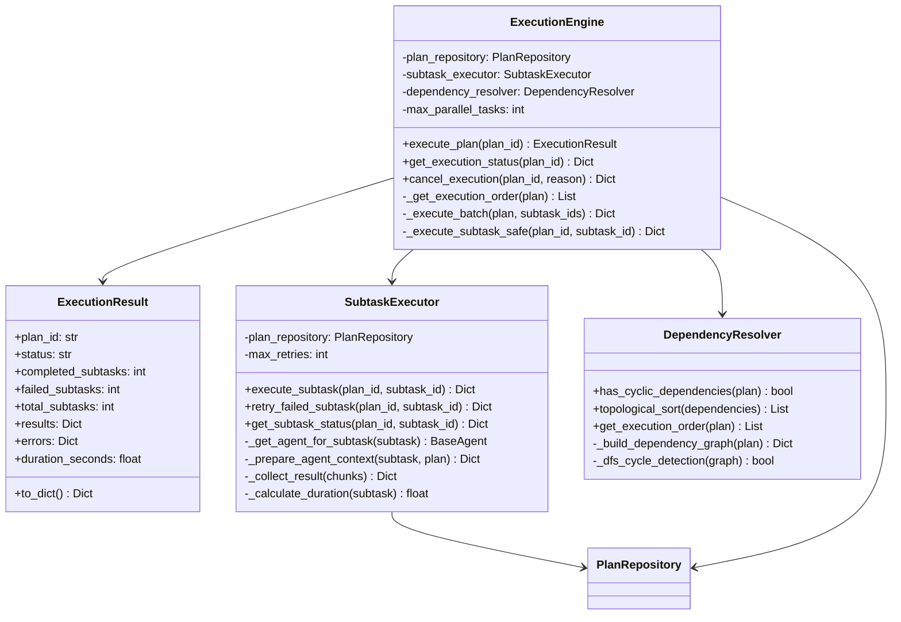
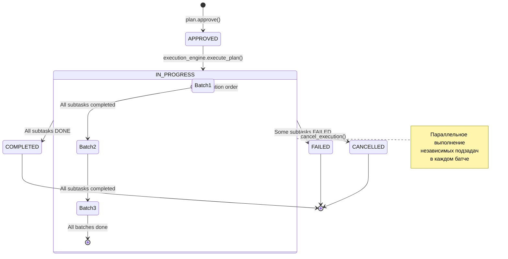
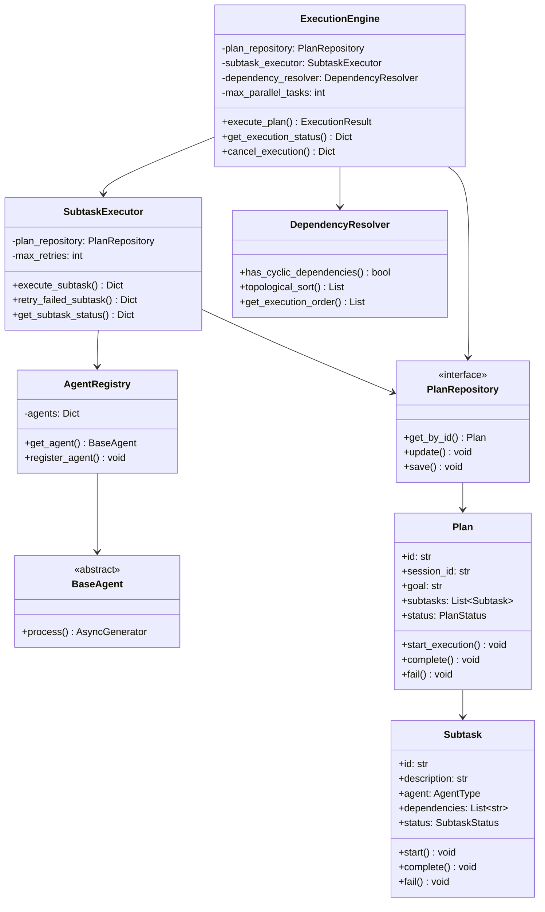
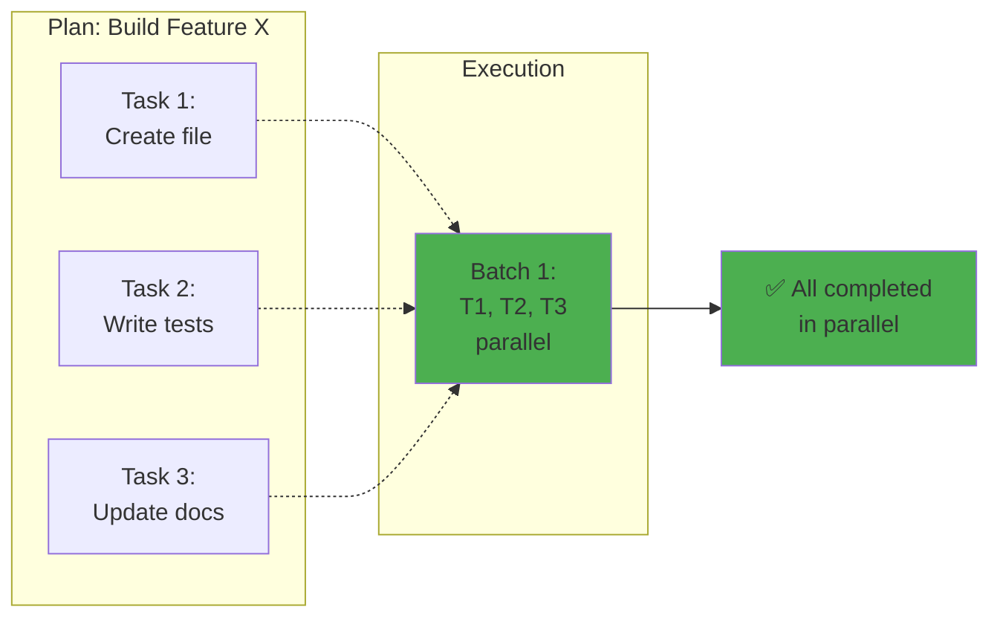
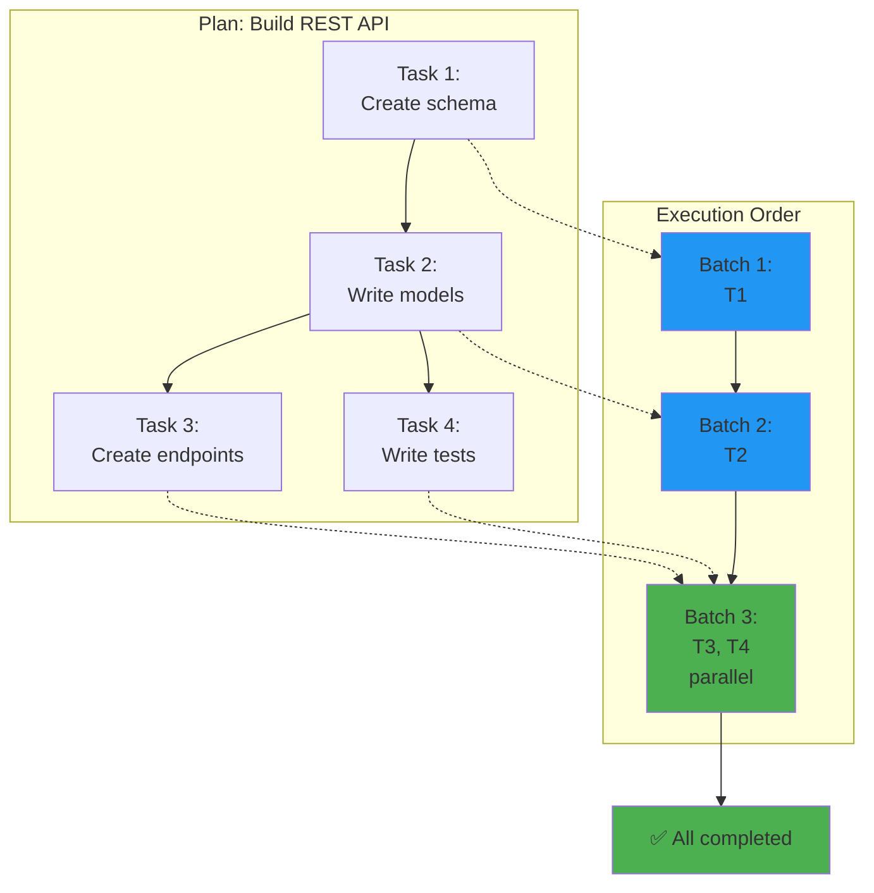
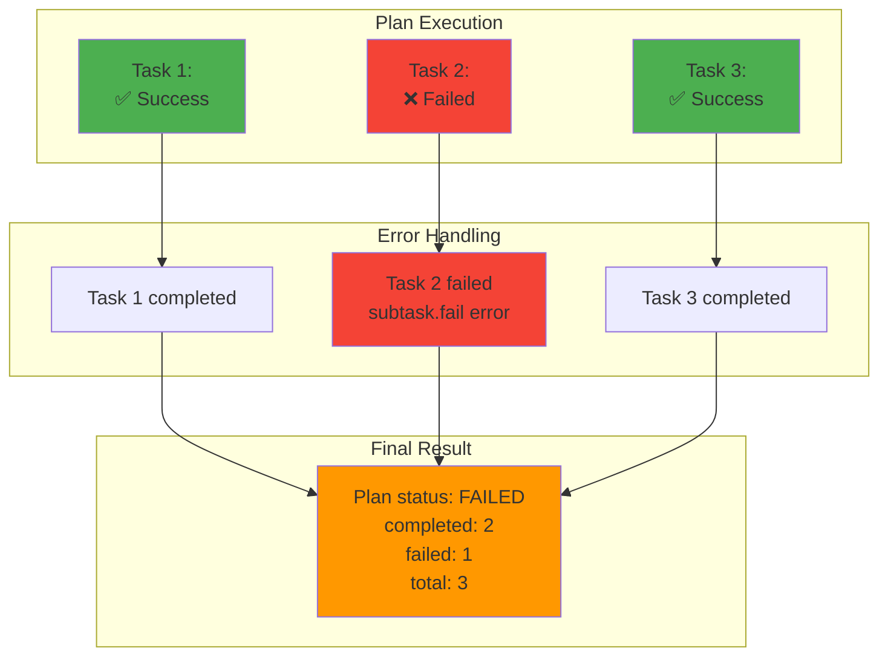

# ExecutionEngine & SubtaskExecutor - Архитектура

> **Версия:** 0.6.0-alpha | **Дата:** 2026-01-31

---

## 🏗️ Общая архитектура



---

## 🔄 Поток выполнения плана



---

## 🎯 Компонентная архитектура



---

## 🔀 Алгоритм батчирования

### Псевдокод

```
function get_execution_order(plan):
    # 1. Проверка циклов
    if has_cyclic_dependencies(plan):
        raise Error("Circular dependencies")
    
    # 2. Топологическая сортировка
    sorted_ids = topological_sort(plan.dependencies)
    
    # 3. Батчирование
    batches = []
    completed = ∅
    remaining = set(sorted_ids)
    
    while remaining ≠ ∅:
        # Найти готовые задачи
        ready = [id for id in remaining 
                 if all deps in completed]
        
        if ready = ∅:
            raise Error("No ready tasks")
        
        # Ограничить размер батча
        batch = ready[0:max_parallel_tasks]
        batches.append(batch)
        
        # Обновить состояние
        completed = completed ∪ batch
        remaining = remaining \ batch
    
    return batches
```

### Пример

**Входные данные:**
```
Task 1: deps=[]
Task 2: deps=[]
Task 3: deps=[Task 1, Task 2]
Task 4: deps=[]
Task 5: deps=[Task 3]

max_parallel_tasks = 2
```

**Выполнение:**
```
Iteration 1:
  ready = [Task 1, Task 2, Task 4]
  batch = [Task 1, Task 2]  # Ограничено max_parallel_tasks
  completed = {Task 1, Task 2}
  remaining = {Task 3, Task 4, Task 5}

Iteration 2:
  ready = [Task 4]  # Task 3 ждёт Task 1 и Task 2
  batch = [Task 4]
  completed = {Task 1, Task 2, Task 4}
  remaining = {Task 3, Task 5}

Iteration 3:
  ready = [Task 3]  # Теперь Task 1 и Task 2 завершены
  batch = [Task 3]
  completed = {Task 1, Task 2, Task 3, Task 4}
  remaining = {Task 5}

Iteration 4:
  ready = [Task 5]
  batch = [Task 5]
  completed = {Task 1, Task 2, Task 3, Task 4, Task 5}
  remaining = ∅

Result: [[Task 1, Task 2], [Task 4], [Task 3], [Task 5]]
```

---

## 🔄 Жизненный цикл выполнения



---

## 🎨 Паттерны проектирования

### 1. Facade Pattern

**ExecutionEngine** предоставляет упрощённый интерфейс для сложной системы:

```python
# Вместо:
plan = await plan_repo.get_by_id(plan_id)
plan.start_execution()
await plan_repo.update(plan)
order = dependency_resolver.topological_sort(...)
for batch in batches:
    tasks = [subtask_executor.execute_subtask(...) for id in batch]
    results = await asyncio.gather(*tasks)
# ... и т.д.

# Используем:
result = await execution_engine.execute_plan(plan_id, ...)
```

### 2. Strategy Pattern

**SubtaskExecutor** делегирует выполнение разным агентам:

```python
# Стратегия выбирается на основе subtask.agent
agent = agent_registry.get_agent(subtask.agent)
result = await agent.process(...)  # Разные стратегии выполнения
```

### 3. Command Pattern

**execute_plan()** инкапсулирует запрос как объект:

```python
# Команда
result = await execution_engine.execute_plan(
    plan_id=plan_id,
    session_id=session_id,
    ...
)

# Можно отменить
await execution_engine.cancel_execution(plan_id, reason)

# Можно мониторить
status = await execution_engine.get_execution_status(plan_id)
```

### 4. Repository Pattern

**PlanRepository** абстрагирует персистентность:

```python
# Domain слой не знает о БД
await plan_repository.update(plan)

# Infrastructure слой реализует детали
class PlanRepositoryImpl:
    async def update(self, plan: Plan):
        # SQLAlchemy, PostgreSQL и т.д.
```

### 5. Dependency Injection

**Все зависимости через конструктор:**

```python
execution_engine = ExecutionEngine(
    plan_repository=plan_repo,
    subtask_executor=subtask_exec,
    dependency_resolver=dep_resolver,
    max_parallel_tasks=3
)
```

---

## 🔧 Технические детали

### Параллельное выполнение

**Проблема:** Как выполнять независимые подзадачи параллельно?

**Решение:** `asyncio.gather()` с `return_exceptions=True`

```python
# Создать задачи
tasks = [
    subtask_executor.execute_subtask(id, ...)
    for id in batch
]

# Выполнить параллельно
results = await asyncio.gather(*tasks, return_exceptions=True)

# Обработать результаты и исключения
for subtask_id, result in zip(batch, results):
    if isinstance(result, Exception):
        handle_error(subtask_id, result)
    else:
        handle_success(subtask_id, result)
```

**Преимущества:**
- ✅ Эффективное использование ресурсов
- ✅ Не блокирует event loop
- ✅ Изоляция ошибок (return_exceptions=True)
- ✅ Масштабируемость до 10+ параллельных задач

### Топологическая сортировка

**Проблема:** Как определить порядок выполнения с учётом зависимостей?

**Решение:** Алгоритм Кана (Kahn's algorithm)

```python
def topological_sort(dependencies: Dict[str, List[str]]) -> List[str]:
    # 1. Вычислить in-degree для каждой вершины
    in_degree = {node: 0 for node in dependencies}
    for deps in dependencies.values():
        for dep in deps:
            in_degree[dep] += 1
    
    # 2. Найти вершины с in-degree = 0
    queue = [node for node, degree in in_degree.items() if degree == 0]
    result = []
    
    # 3. Обработать очередь
    while queue:
        node = queue.pop(0)
        result.append(node)
        
        for neighbor in dependencies[node]:
            in_degree[neighbor] -= 1
            if in_degree[neighbor] == 0:
                queue.append(neighbor)
    
    return result
```

**Сложность:** O(V + E)
- V = количество подзадач
- E = количество зависимостей

### Контекст зависимостей

**Проблема:** Как передать результаты зависимостей в подзадачу?

**Решение:** Enriched context

```python
def _prepare_agent_context(subtask, plan):
    # Собрать результаты всех зависимостей
    dependency_results = {}
    for dep_id in subtask.dependencies:
        dep_subtask = plan.get_subtask_by_id(dep_id)
        if dep_subtask.status == SubtaskStatus.DONE:
            dependency_results[dep_id] = {
                "description": dep_subtask.description,
                "result": dep_subtask.result,
                "agent": dep_subtask.agent.value
            }
    
    return {
        "subtask_id": subtask.id,
        "plan_goal": plan.goal,
        "dependencies": dependency_results,
        "execution_mode": "subtask"
    }
```

**Пример контекста:**
```json
{
  "subtask_id": "task-3",
  "plan_goal": "Build REST API",
  "dependencies": {
    "task-1": {
      "description": "Create database schema",
      "result": "Schema created: users, posts, comments tables",
      "agent": "coder"
    },
    "task-2": {
      "description": "Write models",
      "result": "Models created: User, Post, Comment",
      "agent": "coder"
    }
  },
  "execution_mode": "subtask"
}
```

---

## 📊 Диаграмма классов



---

## 🎭 Сценарии использования

### Сценарий 1: Простой план без зависимостей



**Время выполнения:** max(T1, T2, T3) вместо T1 + T2 + T3

---

### Сценарий 2: План с зависимостями



**Время выполнения:** T1 + T2 + max(T3, T4)

---

### Сценарий 3: Обработка ошибок



**Изоляция ошибок:** Failed Task 2 не блокирует Task 3

---

## 📈 Performance характеристики

### Сложность алгоритмов

| Операция | Сложность | Описание |
|----------|-----------|----------|
| Cycle detection | O(V + E) | DFS по графу |
| Topological sort | O(V + E) | Алгоритм Кана |
| Батчирование | O(V²) | Worst case, обычно O(V) |
| Выполнение батча | O(1) | Параллельно через asyncio |

### Масштабируемость

**Тестовые данные:**
- 10 подзадач, 5 зависимостей: ~0.1s (сортировка)
- 100 подзадач, 50 зависимостей: ~1s (сортировка)
- 1000 подзадач, 500 зависимостей: ~10s (сортировка)

**Параллелизм:**
- max_parallel_tasks=3: до 3x ускорение
- max_parallel_tasks=5: до 5x ускорение
- max_parallel_tasks=10: до 10x ускорение

**Ограничения:**
- Память: O(V + E) для графа
- CPU: зависит от количества параллельных задач
- I/O: зависит от агентов (LLM calls, file operations)

---

## 🎓 Best Practices

### 1. Используйте ExecutionEngine для планов

```python
# ✅ Хорошо
result = await execution_engine.execute_plan(plan_id, ...)

# ❌ Плохо - ручная координация
for subtask in plan.subtasks:
    await subtask_executor.execute_subtask(...)
```

### 2. Используйте SubtaskExecutor для отдельных задач

```python
# ✅ Хорошо - для тестирования или retry
result = await subtask_executor.execute_subtask(
    plan_id, subtask_id, ...
)

# ❌ Плохо - прямой вызов агента
agent = agent_registry.get_agent(AgentType.CODER)
result = await agent.process(...)
```

### 3. Обрабатывайте частичные ошибки

```python
# ✅ Хорошо
result = await execution_engine.execute_plan(...)
if result.status == "failed":
    for subtask_id, error in result.errors.items():
        logger.error(f"Subtask {subtask_id} failed: {error}")
        await subtask_executor.retry_failed_subtask(...)

# ❌ Плохо - игнорировать частичные ошибки
result = await execution_engine.execute_plan(...)
if result.status == "completed":
    pass  # Что если status == "failed"?
```

### 4. Мониторьте прогресс

```python
# ✅ Хорошо - периодический мониторинг
task = asyncio.create_task(execution_engine.execute_plan(...))
while not task.done():
    status = await execution_engine.get_execution_status(plan_id)
    print(f"Progress: {status['progress']['percentage']}%")
    await asyncio.sleep(5)

# ❌ Плохо - блокирующее ожидание
result = await execution_engine.execute_plan(...)
```

---

## 📚 Дополнительные ресурсы

- [Planning System Architecture](planning-system-architecture.md)
- [Execution Engine Guide](../codelab-ai-service/agent-runtime/doc/EXECUTION_ENGINE_GUIDE.md)
- [Quick Start Guide](../codelab-ai-service/agent-runtime/doc/PLANNING_SYSTEM_QUICKSTART.md)
- [Test Examples](../codelab-ai-service/agent-runtime/tests/test_execution_engine.py)

---

**Версия:** 1.0.0  
**Последнее обновление:** 2026-01-31  
**Автор:** CodeLab Team
