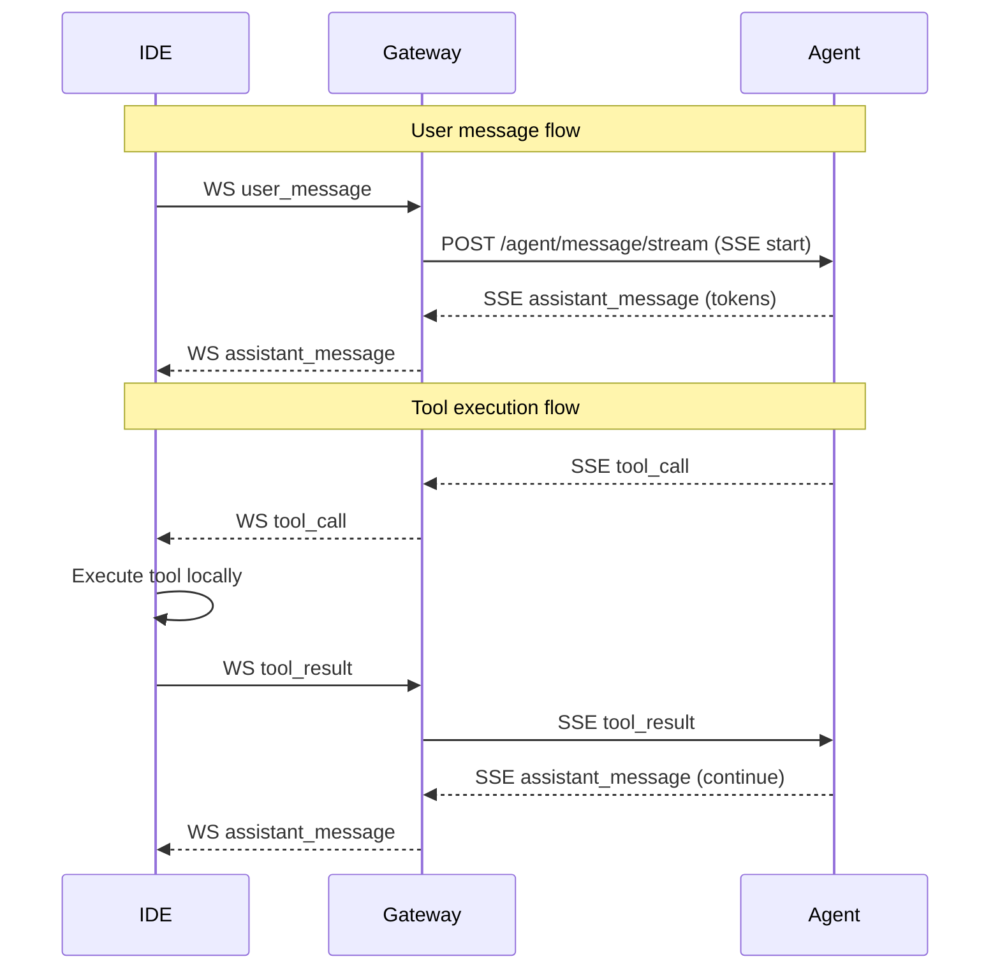

# План реализации HTTP Streaming архитектуры

## Контекст проблемы

Текущая архитектура использует синхронные HTTP запросы для tool execution между Gateway и Agent Runtime, что приводит к блокировке на 30 секунд и нарушает требования к производительности.

**Текущий flow:**
1. IDE → WS → Gateway → POST /agent/message/stream → Agent (возвращает полный ответ)
2. Agent при tool_call → POST /tool/execute/{session_id} → Gateway → блокируется 30 сек → WS → IDE → выполняет tool → WS → Gateway → возвращает результат

**Проблемы:**
- Нет настоящего streaming от Agent к Gateway
- Tool execution блокирует весь pipeline
- Неэффективное использование ресурсов

## Рекомендованное решение: HTTP Streaming (Server-Sent Events)

**Новый flow:**
1. IDE → WS → Gateway → POST /agent/message/stream (SSE) → Agent начинает streaming
2. Agent отправляет токены через SSE: `assistant_message`, `tool_call`
3. Gateway пересылает SSE как WS сообщения в IDE
4. IDE получает `tool_call`, выполняет локально, отправляет `tool_result` через WS
5. Gateway получает `tool_result` через WS, пересылает в Agent через новый SSE event
6. Agent продолжает streaming с результатом tool и финальным ответом

## Архитектурная диаграмма



## Изменения моделей данных

### Новые модели для SSE

Добавить в `gateway/app/models/rest.py` и `agent-runtime/app/models/schemas.py`:

```python
class SSEEvent(BaseModel):
    event: str  # "token", "tool_call", "tool_result", "error", "done"
    data: Dict[str, Any]

class StreamingRequest(BaseModel):
    session_id: str
    message: WSUserMessage
```

### Обновление существующих моделей

В `gateway/app/models/websocket.py` добавить:

```python
class WSAssistantMessage(BaseModel):
    type: Literal["assistant_message"]
    token: str
    is_final: bool
    metadata: Optional[Dict[str, Any]] = None
```

## Детальные изменения по файлам

### Gateway изменения

#### 1. `codelab-ai-service/gateway/app/api/v1/endpoints.py`
- **Удалить:** `/tool/execute/{session_id}` endpoint полностью
- **Изменить:** `/ws/{session_id}` WebSocket endpoint:
  - Добавить обработку `assistant_message` от Agent через SSE
  - Для `tool_result` от IDE - пересылать в Agent через SSE event
  - Удалить зависимость от `tool_result_manager`

#### 2. `codelab-ai-service/gateway/app/services/tool_result_manager.py`
- **Удалить:** Весь файл, так как tool results будут обрабатываться через SSE

#### 3. `codelab-ai-service/gateway/app/services/stream_service.py`
- **Изменить:** `stream_agent_single` на `stream_agent_sse`:
  - Использовать SSE client для чтения потока от Agent
  - Преобразовывать SSE events в WS messages для IDE
  - Поддерживать bidirectional communication (tool_result обратно в Agent)

#### 4. `codelab-ai-service/gateway/app/models/rest.py`
- **Добавить:** Модели для SSE communication

### Agent Runtime изменения

#### 1. `codelab-ai-service/agent-runtime/app/api/v1/endpoints.py`
- **Изменить:** `/agent/message/stream`:
  - Изменить с JSON response на SSE streaming response
  - Использовать `StreamingResponse` с `text/event-stream`
  - Принимать tool_result через SSE events

#### 2. `codelab-ai-service/agent-runtime/app/services/chat_service.py`
- **Изменить:** `stream_message`:
  - Вместо возврата dict - yield SSE events
  - Интегрировать с новым streaming orchestrator

#### 3. `codelab-ai-service/agent-runtime/app/services/orchestrator.py`
- **Изменить:** `run` метод:
  - Стать async generator, yield SSE events
  - При tool_call: yield `tool_call` event, затем await `tool_result` event
  - Продолжать reasoning после получения tool_result

#### 4. `codelab-ai-service/agent-runtime/app/services/tool_call_handler.py`
- **Удалить:** Весь файл, так как tool execution теперь идет через IDE

#### 5. `codelab-ai-service/agent-runtime/app/services/llm_stream_service.py`
- **Добавить/Изменить:** Сервис для streaming от LLM proxy с поддержкой tool calls

## Последовательность шагов реализации

### Фаза 1: Модели и базовая инфраструктура
1. Добавить новые модели данных для SSE
2. Создать базовый SSE streaming сервис в Gateway
3. Обновить Agent endpoint для SSE response

### Фаза 2: Agent Runtime streaming
1. Изменить orchestrator на async generator
2. Добавить поддержку tool_call/tool_result events
3. Удалить tool_call_handler

### Фаза 3: Gateway streaming
1. Заменить stream_service на SSE-based
2. Обновить WS endpoint для bidirectional SSE
3. Удалить tool_result_manager и /tool/execute endpoint

### Фаза 4: Интеграция и тестирование
1. Протестировать базовый streaming flow
2. Добавить tool execution через streaming
3. End-to-end тестирование

## План тестирования

### Unit тесты
- SSE event parsing/serialization
- Orchestrator state management с tool calls
- WS message transformation

### Integration тесты
- Gateway ↔ Agent SSE communication
- IDE ↔ Gateway WS с tool calls
- Полный flow: user message → tool call → tool result → final answer

### Performance тесты
- Streaming latency vs blocking approach
- Memory usage during long conversations
- Concurrent session handling

### Load тесты
- Multiple simultaneous streaming sessions
- Tool execution under load
- Network interruption recovery

## Риски и mitigation

1. **SSE connection reliability:** Добавить reconnection logic и heartbeat
2. **Message ordering:** Использовать sequence numbers в SSE events
3. **Backward compatibility:** Обеспечить graceful degradation
4. **Tool execution timeout:** Настроить timeouts на SSE уровне