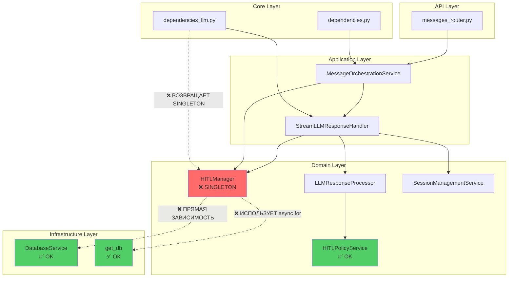
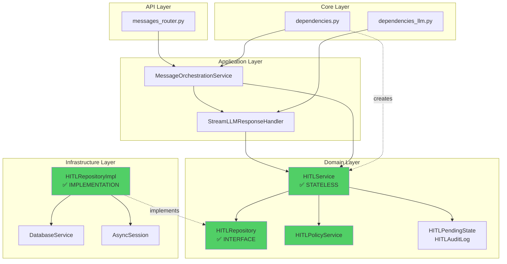

# План рефакторинга HITLManager

## 📊 Карта зависимостей agent-runtime

### Текущая архитектура (проблемная)



### Выявленные проблемы

#### 🔴 Критические нарушения

1. **Глобальный синглтон с состоянием**
   ```python
   # ❌ ПРОБЛЕМА: hitl_management.py:347
   hitl_manager = HITLManager()
   ```
   - Нарушает Dependency Inversion Principle (SOLID)
   - Создает скрытые зависимости
   - Затрудняет тестирование
   - Невозможно изолировать состояние между запросами

2. **Прямая зависимость от инфраструктуры в конструкторе**
   ```python
   # ❌ ПРОБЛЕМА: hitl_management.py:41-43
   class HITLManager:
       def __init__(self):
           self.db_service = get_database_service()  # Прямой вызов!
   ```
   - Нарушает Clean Architecture (Domain → Infrastructure)
   - Нарушает Dependency Inversion Principle
   - Создает tight coupling

3. **Использование глобальной DB сессии внутри методов**
   ```python
   # ❌ ПРОБЛЕМА: hitl_management.py:117-118
   async def get_pending(self, session_id: str, call_id: str):
       async for db in get_db():  # Создает новую сессию!
           # ...
   ```
   - Нарушает Single Responsibility Principle
   - Создает проблемы с транзакциями
   - Невозможно контролировать жизненный цикл сессии
   - Может привести к утечкам соединений

4. **Смешение ответственностей**
   - Управление состоянием HITL (Domain)
   - Работа с БД (Infrastructure)
   - Публикация событий (Application)
   - Логирование (Cross-cutting concern)

#### 🟡 Средние нарушения

5. **Неправильная инъекция зависимостей**
   ```python
   # ❌ ПРОБЛЕМА: dependencies_llm.py:103-111
   def get_hitl_manager():
       return hitl_manager  # Возвращает глобальный синглтон
   ```

6. **Дублирование логики работы с БД**
   - `_save_pending_async()` и `_delete_pending_async()` дублируют логику
   - Должны быть в Repository

## 🎯 Целевая архитектура (Clean Architecture)

### Принципы решения

1. **Dependency Inversion**: Domain не зависит от Infrastructure
2. **Dependency Injection**: Все зависимости инжектируются через конструктор
3. **Single Responsibility**: Каждый класс имеет одну ответственность
4. **Interface Segregation**: Используем абстракции (Repository pattern)
5. **Separation of Concerns**: Разделяем Domain, Application, Infrastructure

### Новая структура



## 📋 План рефакторинга

### Этап 1: Создание Repository интерфейса и реализации

#### 1.1 Создать Domain Repository интерфейс

**Файл**: `app/domain/repositories/hitl_repository.py`

```python
"""
HITL Repository interface (Domain Layer).
Определяет контракт для работы с HITL данными.
"""
from abc import ABC, abstractmethod
from typing import List, Optional
from datetime import datetime

from ..entities.hitl import HITLPendingState, HITLAuditLog


class HITLRepository(ABC):
    """
    Repository interface for HITL persistence operations.
    
    Следует Repository pattern из Clean Architecture.
    Domain layer определяет интерфейс, Infrastructure реализует.
    """
    
    @abstractmethod
    async def save_pending(
        self,
        session_id: str,
        call_id: str,
        tool_name: str,
        arguments: dict,
        reason: Optional[str] = None
    ) -> HITLPendingState:
        """Save pending approval to persistence."""
        pass
    
    @abstractmethod
    async def get_pending(
        self,
        session_id: str,
        call_id: str
    ) -> Optional[HITLPendingState]:
        """Get pending approval by call_id."""
        pass
    
    @abstractmethod
    async def get_all_pending(
        self,
        session_id: str
    ) -> List[HITLPendingState]:
        """Get all pending approvals for session."""
        pass
    
    @abstractmethod
    async def delete_pending(
        self,
        call_id: str
    ) -> bool:
        """Delete pending approval."""
        pass
    
    @abstractmethod
    async def save_audit_log(
        self,
        audit_log: HITLAuditLog
    ) -> None:
        """Save audit log entry (optional, can use events)."""
        pass
```

#### 1.2 Создать Infrastructure Repository реализацию

**Файл**: `app/infrastructure/persistence/repositories/hitl_repository_impl.py`

```python
"""
HITL Repository implementation (Infrastructure Layer).
Реализует HITLRepository используя DatabaseService.
"""
import logging
from typing import List, Optional
from datetime import datetime, timezone
from sqlalchemy.ext.asyncio import AsyncSession

from app.domain.repositories.hitl_repository import HITLRepository
from app.domain.entities.hitl import HITLPendingState, HITLAuditLog
from app.services.database import DatabaseService

logger = logging.getLogger("agent-runtime.infrastructure.hitl_repository")


class HITLRepositoryImpl(HITLRepository):
    """
    Implementation of HITLRepository using DatabaseService.
    
    Принимает AsyncSession через конструктор (Dependency Injection).
    Не создает сессии самостоятельно.
    """
    
    def __init__(self, db: AsyncSession, db_service: DatabaseService):
        """
        Initialize repository with database session.
        
        Args:
            db: Database session (injected)
            db_service: Database service for high-level operations (injected)
        """
        self._db = db
        self._db_service = db_service
    
    async def save_pending(
        self,
        session_id: str,
        call_id: str,
        tool_name: str,
        arguments: dict,
        reason: Optional[str] = None
    ) -> HITLPendingState:
        """Save pending approval to database."""
        await self._db_service.save_pending_approval(
            db=self._db,
            session_id=session_id,
            call_id=call_id,
            tool_name=tool_name,
            arguments=arguments,
            reason=reason
        )
        
        # Create and return entity
        pending_state = HITLPendingState(
            call_id=call_id,
            tool_name=tool_name,
            arguments=arguments,
            reason=reason,
            timeout_seconds=300
        )
        
        logger.info(
            f"Saved pending HITL approval: session={session_id}, "
            f"call_id={call_id}, tool={tool_name}"
        )
        
        return pending_state
    
    async def get_pending(
        self,
        session_id: str,
        call_id: str
    ) -> Optional[HITLPendingState]:
        """Get pending approval from database."""
        from sqlalchemy import select
        from app.infrastructure.persistence.models import PendingApproval
        
        result = await self._db.execute(
            select(PendingApproval).where(
                PendingApproval.call_id == call_id,
                PendingApproval.session_id == session_id,
                PendingApproval.status == 'pending'
            )
        )
        approval = result.scalar_one_or_none()
        
        if not approval:
            return None
        
        return HITLPendingState(
            call_id=approval.call_id,
            tool_name=approval.tool_name,
            arguments=approval.arguments,
            reason=approval.reason,
            created_at=approval.created_at,
            timeout_seconds=300
        )
    
    async def get_all_pending(
        self,
        session_id: str
    ) -> List[HITLPendingState]:
        """Get all pending approvals for session."""
        pending_approvals = await self._db_service.get_pending_approvals(
            self._db, session_id
        )
        
        return [
            HITLPendingState(
                call_id=approval['call_id'],
                tool_name=approval['tool_name'],
                arguments=approval['arguments'],
                reason=approval.get('reason'),
                created_at=approval['created_at'],
                timeout_seconds=300
            )
            for approval in pending_approvals
        ]
    
    async def delete_pending(self, call_id: str) -> bool:
        """Delete pending approval from database."""
        result = await self._db_service.delete_pending_approval(
            self._db, call_id
        )
        
        if result:
            logger.info(f"Deleted pending HITL approval: call_id={call_id}")
        
        return result
    
    async def save_audit_log(self, audit_log: HITLAuditLog) -> None:
        """
        Save audit log (optional implementation).
        
        Note: Currently audit logs are tracked via events.
        This method can be implemented if persistent audit trail is needed.
        """
        logger.debug(
            f"Audit log for {audit_log.call_id}: {audit_log.decision.value}"
        )
        # TODO: Implement if persistent audit trail is required
```

### Этап 2: Рефакторинг HITLManager → HITLService

#### 2.1 Создать новый HITLService (Domain Layer)

**Файл**: `app/domain/services/hitl_service.py`

```python
"""
HITL Service for managing Human-in-the-Loop workflow (Domain Layer).

Координирует работу с HITL состоянием через Repository pattern.
Не имеет прямых зависимостей от Infrastructure.
"""
import logging
from typing import Dict, List, Optional, Callable, Awaitable
from datetime import datetime

from app.domain.entities.hitl import (
    HITLPendingState,
    HITLUserDecision,
    HITLDecision,
    HITLAuditLog
)
from app.domain.repositories.hitl_repository import HITLRepository
from app.events.event_bus import event_bus
from app.events.tool_events import (
    HITLApprovalRequestedEvent,
    HITLDecisionMadeEvent
)

logger = logging.getLogger("agent-runtime.domain.hitl_service")


class HITLService:
    """
    Domain service for HITL workflow management.
    
    Следует принципам Clean Architecture:
    - Stateless (без внутреннего состояния)
    - Dependency Injection (все зависимости через конструктор)
    - Зависит только от абстракций (HITLRepository interface)
    - Не знает о деталях Infrastructure
    
    Attributes:
        _repository: Repository для работы с HITL данными
        _event_publisher: Функция для публикации событий (опционально)
    """
    
    def __init__(
        self,
        repository: HITLRepository,
        event_publisher: Optional[Callable[[object], Awaitable[None]]] = None
    ):
        """
        Initialize HITL service with dependencies.
        
        Args:
            repository: HITL repository (injected)
            event_publisher: Optional event publisher function (injected)
        """
        self._repository = repository
        self._event_publisher = event_publisher
    
    async def add_pending(
        self,
        session_id: str,
        call_id: str,
        tool_name: str,
        arguments: Dict,
        reason: Optional[str] = None,
        timeout_seconds: int = 300
    ) -> HITLPendingState:
        """
        Add a tool call to pending HITL approval.
        
        Args:
            session_id: Session identifier
            call_id: Tool call identifier
            tool_name: Name of the tool
            arguments: Tool arguments
            reason: Reason for requiring approval
            timeout_seconds: Timeout for user decision
            
        Returns:
            Created HITLPendingState
        """
        # Save through repository
        pending_state = await self._repository.save_pending(
            session_id=session_id,
            call_id=call_id,
            tool_name=tool_name,
            arguments=arguments,
            reason=reason
        )
        
        logger.info(
            f"Added pending HITL approval: session={session_id}, "
            f"call_id={call_id}, tool={tool_name}"
        )
        
        # Publish event
        await event_bus.publish(
            HITLApprovalRequestedEvent(
                session_id=session_id,
                call_id=call_id,
                tool_name=tool_name,
                arguments=arguments,
                reason=reason or "",
                timeout_seconds=timeout_seconds
            )
        )
        
        return pending_state
    
    async def get_pending(
        self,
        session_id: str,
        call_id: str
    ) -> Optional[HITLPendingState]:
        """
        Get pending HITL state for a tool call.
        
        Args:
            session_id: Session identifier
            call_id: Tool call identifier
            
        Returns:
            HITLPendingState if found, None otherwise
        """
        return await self._repository.get_pending(session_id, call_id)
    
    async def get_all_pending(
        self,
        session_id: str
    ) -> List[HITLPendingState]:
        """
        Get all pending HITL states for a session.
        
        Args:
            session_id: Session identifier
            
        Returns:
            List of HITLPendingState objects
        """
        return await self._repository.get_all_pending(session_id)
    
    async def remove_pending(
        self,
        session_id: str,
        call_id: str
    ) -> bool:
        """
        Remove a pending HITL state.
        
        Args:
            session_id: Session identifier
            call_id: Tool call identifier
            
        Returns:
            True if removed, False if not found
        """
        removed = await self._repository.delete_pending(call_id)
        
        if removed:
            logger.info(f"Removed pending HITL state: call_id={call_id}")
        
        return removed
    
    async def cleanup_expired(
        self,
        session_id: str
    ) -> int:
        """
        Clean up expired pending HITL states.
        
        Args:
            session_id: Session identifier
            
        Returns:
            Number of expired states removed
        """
        pending_states = await self._repository.get_all_pending(session_id)
        
        expired_count = 0
        for pending_state in pending_states:
            if pending_state.is_expired():
                await self._repository.delete_pending(pending_state.call_id)
                expired_count += 1
        
        if expired_count > 0:
            logger.info(
                f"Cleaned up {expired_count} expired HITL states "
                f"for session {session_id}"
            )
        
        return expired_count
    
    async def log_decision(
        self,
        session_id: str,
        call_id: str,
        tool_name: str,
        original_arguments: Dict,
        decision: HITLDecision,
        modified_arguments: Optional[Dict] = None,
        feedback: Optional[str] = None
    ) -> HITLAuditLog:
        """
        Log a user decision to audit log.
        
        Args:
            session_id: Session identifier
            call_id: Tool call identifier
            tool_name: Tool name
            original_arguments: Original tool arguments
            decision: User decision
            modified_arguments: Modified arguments (for EDIT)
            feedback: User feedback (for REJECT)
            
        Returns:
            Created HITLAuditLog
        """
        # Create audit log entry
        audit_log = HITLAuditLog(
            session_id=session_id,
            call_id=call_id,
            tool_name=tool_name,
            original_arguments=original_arguments,
            decision=decision,
            modified_arguments=modified_arguments,
            feedback=feedback
        )
        
        logger.info(
            f"Logged HITL decision: session={session_id}, call_id={call_id}, "
            f"decision={decision.value}, tool={tool_name}"
        )
        
        # Publish event
        await event_bus.publish(
            HITLDecisionMadeEvent(
                session_id=session_id,
                call_id=call_id,
                decision=decision.value,
                tool_name=tool_name,
                original_args=original_arguments,
                modified_args=modified_arguments
            )
        )
        
        return audit_log
```

### Этап 3: Обновление Dependency Injection

#### 3.1 Обновить `app/domain/repositories/__init__.py`

```python
"""Domain repositories."""

from .base import Repository
from .session_repository import SessionRepository
from .agent_context_repository import AgentContextRepository
from .hitl_repository import HITLRepository  # NEW

__all__ = [
    "Repository",
    "SessionRepository",
    "AgentContextRepository",
    "HITLRepository",  # NEW
]
```

#### 3.2 Обновить `app/infrastructure/persistence/repositories/__init__.py`

```python
"""Infrastructure repository implementations."""

from .session_repository_impl import SessionRepositoryImpl
from .agent_context_repository_impl import AgentContextRepositoryImpl
from .hitl_repository_impl import HITLRepositoryImpl  # NEW

__all__ = [
    "SessionRepositoryImpl",
    "AgentContextRepositoryImpl",
    "HITLRepositoryImpl",  # NEW
]
```

#### 3.3 Обновить `app/domain/services/__init__.py`

```python
"""Domain services."""

from .session_management import SessionManagementService
from .agent_orchestration import AgentOrchestrationService
from .message_orchestration import MessageOrchestrationService
from .hitl_service import HITLService  # NEW (заменяет HITLManager)
from .hitl_policy import HITLPolicyService, hitl_policy_service
from .agent_registry import AgentRegistry, agent_registry, agent_router
from .tool_registry import ToolRegistry, tool_registry
from .tool_filter_service import ToolFilterService
from .llm_response_processor import LLMResponseProcessor

__all__ = [
    "SessionManagementService",
    "AgentOrchestrationService",
    "MessageOrchestrationService",
    "HITLService",  # NEW
    "HITLPolicyService",
    "hitl_policy_service",
    "AgentRegistry",
    "agent_registry",
    "agent_router",
    "ToolRegistry",
    "tool_registry",
    "ToolFilterService",
    "LLMResponseProcessor",
]
```

#### 3.4 Обновить `app/core/dependencies.py`

Добавить новые dependency functions:

```python
# ==================== HITL Dependencies ====================

async def get_hitl_repository(
    db: AsyncSession = Depends(get_db_session),
    db_service: DatabaseService = Depends(get_database_service)
) -> HITLRepositoryImpl:
    """
    Получить HITL repository.
    
    Args:
        db: Database session (инжектируется)
        db_service: Database service (инжектируется)
        
    Returns:
        HITLRepositoryImpl: Repository implementation
    """
    from ..infrastructure.persistence.repositories import HITLRepositoryImpl
    return HITLRepositoryImpl(db=db, db_service=db_service)


async def get_hitl_service(
    repository: HITLRepositoryImpl = Depends(get_hitl_repository),
    event_publisher: EventPublisherAdapter = Depends(get_event_publisher)
) -> HITLService:
    """
    Получить HITL service.
    
    Args:
        repository: HITL repository (инжектируется)
        event_publisher: Event publisher (инжектируется)
        
    Returns:
        HITLService: Domain service для HITL
    """
    from ..domain.services import HITLService
    return HITLService(
        repository=repository,
        event_publisher=event_publisher.publish
    )
```

#### 3.5 Обновить `app/core/dependencies_llm.py`

Заменить `get_hitl_manager` на `get_hitl_service`:

```python
# УДАЛИТЬ старый код:
# def get_hitl_manager():
#     return hitl_manager

# ДОБАВИТЬ новый код:
from .dependencies import get_hitl_service

# Использовать в get_stream_llm_response_handler:
async def get_stream_llm_response_handler(
    llm_client: LLMClient = Depends(get_llm_client),
    tool_filter: ToolFilterService = Depends(get_tool_filter_service),
    response_processor: LLMResponseProcessor = Depends(get_llm_response_processor),
    event_publisher: LLMEventPublisher = Depends(get_llm_event_publisher),
    session_service: SessionManagementService = Depends(get_session_management_service),
    hitl_service: HITLService = Depends(get_hitl_service)  # ИЗМЕНЕНО
) -> StreamLLMResponseHandler:
    """Получить handler для стриминга LLM ответов."""
    return StreamLLMResponseHandler(
        llm_client=llm_client,
        tool_filter=tool_filter,
        response_processor=response_processor,
        event_publisher=event_publisher,
        session_service=session_service,
        hitl_service=hitl_service  # ИЗМЕНЕНО
    )
```

### Этап 4: Обновление использующих компонентов

#### 4.1 Обновить `StreamLLMResponseHandler`

```python
# В app/application/handlers/stream_llm_response_handler.py

from ...domain.services import HITLService  # ИЗМЕНЕНО

class StreamLLMResponseHandler:
    def __init__(
        self,
        llm_client: LLMClient,
        tool_filter: ToolFilterService,
        response_processor: LLMResponseProcessor,
        event_publisher: LLMEventPublisher,
        session_service: SessionManagementService,
        hitl_service: HITLService  # ИЗМЕНЕНО: было hitl_manager
    ):
        self._llm_client = llm_client
        self._tool_filter = tool_filter
        self._response_processor = response_processor
        self._event_publisher = event_publisher
        self._session_service = session_service
        self._hitl_service = hitl_service  # ИЗМЕНЕНО
    
    # Обновить все вызовы:
    # self._hitl_manager.add_pending() → self._hitl_service.add_pending()
```

#### 4.2 Обновить `MessageOrchestrationService`

```python
# В app/domain/services/message_orchestration.py

# УДАЛИТЬ импорт:
# from .hitl_management import hitl_manager

# Использовать HITLService через dependency injection
# (передавать через конструктор или метод)
```

#### 4.3 Обновить `sessions_router.py`

```python
# В app/api/v1/routers/sessions_router.py

# УДАЛИТЬ:
# from ....domain.services.hitl_management import hitl_manager

# ДОБАВИТЬ:
from ....core.dependencies import get_hitl_service
from ....domain.services import HITLService

# Обновить endpoint:
@router.get("/{session_id}/pending-approvals")
async def get_pending_approvals(
    session_id: str,
    hitl_service: HITLService = Depends(get_hitl_service)  # ИЗМЕНЕНО
):
    """Get pending tool approvals for session."""
    try:
        pending_approvals = await hitl_service.get_all_pending(session_id)  # ИЗМЕНЕНО
        # ...
```

### Этап 5: Удаление старого кода

#### 5.1 Удалить или пометить как deprecated

- `app/domain/services/hitl_management.py` - удалить полностью
- Все импорты `from .hitl_management import hitl_manager` - заменить

#### 5.2 Обновить тесты

Обновить все тесты, использующие `HITLManager`:
- `tests/test_event_integration.py`
- `tests/test_stream_llm_response_handler.py`
- Другие тесты

## ✅ Преимущества новой архитектуры

### 1. Соответствие Clean Architecture

```
✅ Domain Layer не зависит от Infrastructure
✅ Используется Repository pattern
✅ Dependency Inversion Principle соблюден
```

### 2. Соответствие SOLID

```
✅ Single Responsibility: HITLService - бизнес-логика, Repository - персистентность
✅ Open/Closed: Можно добавлять новые реализации Repository
✅ Liskov Substitution: Любая реализация HITLRepository взаимозаменяема
✅ Interface Segregation: Четкий интерфейс Repository
✅ Dependency Inversion: Зависимость от абстракций, не от конкретных классов
```

### 3. Улучшенная тестируемость

```python
# Легко мокировать Repository
mock_repository = Mock(spec=HITLRepository)
hitl_service = HITLService(repository=mock_repository)

# Легко тестировать изолированно
await hitl_service.add_pending(...)
mock_repository.save_pending.assert_called_once()
```

### 4. Правильное управление DB сессиями

```python
# Сессия управляется на уровне API/Application
async with get_db() as db:
    repository = HITLRepositoryImpl(db, db_service)
    service = HITLService(repository)
    await service.add_pending(...)
    # Сессия автоматически закрывается
```

### 5. Отсутствие глобального состояния

```python
# Каждый запрос получает свой экземпляр
hitl_service = Depends(get_hitl_service)
# Нет проблем с concurrent requests
```

## 🔄 Миграционная стратегия

### Вариант 1: Big Bang (рекомендуется для небольших проектов)

1. Создать все новые файлы
2. Обновить все зависимости за один раз
3. Удалить старый код
4. Запустить все тесты

### Вариант 2: Постепенная миграция

1. Создать новые классы параллельно со старыми
2. Добавить adapter/facade для совместимости
3. Постепенно мигрировать компоненты
4. Удалить старый код когда все мигрировано

**Рекомендация**: Вариант 1, так как изменения локализованы в HITL подсистеме.

## 📝 Чеклист выполнения

- [ ] Создать `HITLRepository` interface (Domain)
- [ ] Создать `HITLRepositoryImpl` (Infrastructure)
- [ ] Создать `HITLService` (Domain)
- [ ] Обновить `__init__.py` файлы
- [ ] Добавить dependency functions в `dependencies.py`
- [ ] Обновить `dependencies_llm.py`
- [ ] Обновить `StreamLLMResponseHandler`
- [ ] Обновить `MessageOrchestrationService`
- [ ] Обновить `sessions_router.py`
- [ ] Обновить все тесты
- [ ] Удалить `hitl_management.py`
- [ ] Запустить все тесты
- [ ] Обновить документацию

## 🎓 Выводы

Текущая реализация `HITLManager` нарушает фундаментальные принципы Clean Architecture и SOLID:

1. **Глобальный синглтон** создает скрытые зависимости
2. **Прямая зависимость от Infrastructure** нарушает слоистую архитектуру
3. **Создание DB сессий внутри методов** создает проблемы с транзакциями
4. **Смешение ответственностей** затрудняет тестирование и поддержку

Предложенный рефакторинг решает все эти проблемы через:

1. **Repository Pattern** для изоляции персистентности
2. **Dependency Injection** для явного управления зависимостями
3. **Stateless Service** для устранения глобального состояния
4. **Clean Architecture** для правильного разделения слоев

Это сделает код более тестируемым, поддерживаемым и расширяемым.
