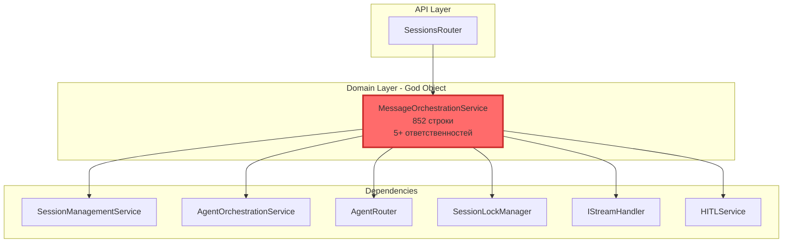
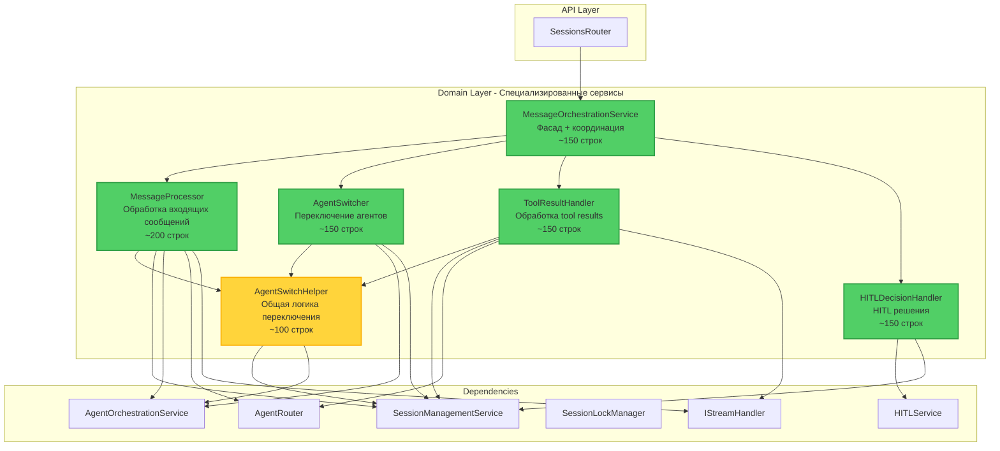
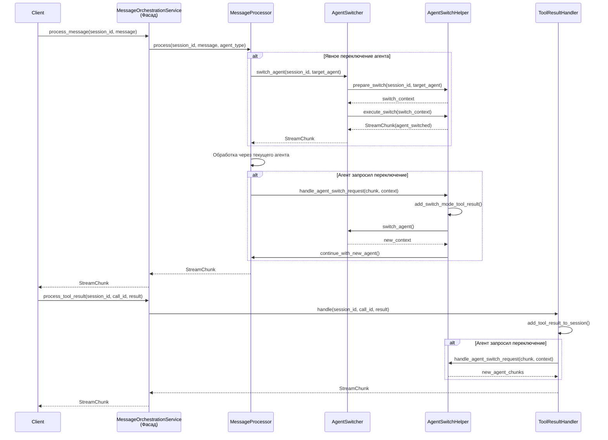

# Проектирование рефакторинга MessageOrchestrationService

## Оглавление
1. [Анализ текущей структуры](#анализ-текущей-структуры)
2. [Архитектурные диаграммы](#архитектурные-диаграммы)
3. [Спецификация новых сервисов](#спецификация-новых-сервисов)
4. [Выделенные общие методы](#выделенные-общие-методы)
5. [Mapping методов](#mapping-методов)
6. [План миграции](#план-миграции)
7. [Обновления DI контейнера](#обновления-di-контейнера)

---

## Анализ текущей структуры

### Проблемы текущей реализации

**MessageOrchestrationService** (852 строки) является God Object с множественными ответственностями:

#### 1. **Обработка сообщений** (строки 95-403)
- Добавление user message в сессию
- Получение/создание контекста агента
- Координация обработки через агентов
- Публикация событий метрик

#### 2. **Переключение агентов** (дублируется в 3 местах)
- Явное переключение по запросу пользователя (строки 169-248)
- Переключение при обработке сообщения (строки 271-354)
- Переключение при обработке tool_result (строки 591-668)

#### 3. **Обработка tool results** (строки 486-672)
- Добавление результата инструмента в сессию
- Продолжение обработки с текущим агентом
- Обработка переключений агента

#### 4. **HITL решения** (строки 674-808)
- Валидация решения пользователя
- Логирование в audit
- Обработка approve/edit/reject
- Продолжение обработки

#### 5. **Управление контекстом**
- Получение текущего агента (строки 405-420)
- Явное переключение агента (строки 422-484)
- Сброс сессии (строки 810-826)
- Преобразование контекста в dict (строки 828-852)

### Выявленное дублирование кода

#### Дублирование 1: Логика переключения агента
Повторяется в 3 местах с идентичной структурой:

**Место 1:** `process_message()` строки 271-354
```python
if chunk.type == "switch_agent":
    target_agent_str = chunk.metadata.get("target_agent")
    target_agent = AgentType(target_agent_str)
    reason = chunk.metadata.get("reason", "Agent requested switch")
    from_agent = context.current_agent
    
    # Найти call_id для switch_mode
    session = await self._session_service.get_session(session_id)
    history = session.get_history_for_llm()
    switch_call_id = None
    for msg in reversed(history):
        if msg.get("role") == "assistant" and msg.get("tool_calls"):
            for tc in msg["tool_calls"]:
                if tc.get("function", {}).get("name") == "switch_mode":
                    switch_call_id = tc.get("id")
                    break
            if switch_call_id:
                break
    
    if switch_call_id:
        await self._session_service.add_tool_result(
            session_id=session_id,
            call_id=switch_call_id,
            result=f"Switched to {target_agent.value} agent",
            error=None
        )
    
    context = await self._agent_service.switch_agent(
        session_id=session_id,
        target_agent=target_agent,
        reason=reason
    )
    
    yield StreamChunk(
        type="agent_switched",
        content=f"Switched to {target_agent.value} agent",
        metadata={...}
    )
    
    # Продолжить с новым агентом
    new_agent = self._agent_router.get_agent(target_agent)
    async for new_chunk in new_agent.process(...):
        yield new_chunk
```

**Место 2:** `process_tool_result()` строки 591-668 - **ИДЕНТИЧНАЯ ЛОГИКА**

**Место 3:** Явное переключение в `process_message()` строки 169-195 - упрощенная версия

#### Дублирование 2: Добавление tool_result для switch_mode
Строки 286-313 и 603-633 - **ПОЛНОСТЬЮ ИДЕНТИЧНЫЙ КОД**

### Зависимости сервиса

```python
__init__(
    session_service: SessionManagementService,
    agent_service: AgentOrchestrationService,
    agent_router,  # AgentRouter
    lock_manager,  # SessionLockManager
    event_publisher=None,
    stream_handler: Optional[IStreamHandler] = None,
    hitl_service=None  # HITLService
)
```

---

## Архитектурные диаграммы

### Текущая архитектура (До рефакторинга)



**Проблемы:**
- ❌ Нарушение Single Responsibility Principle
- ❌ Дублирование логики переключения агентов (3 места)
- ❌ Сложность тестирования (852 строки)
- ❌ Высокая связанность (7 зависимостей)
- ❌ Сложность поддержки и расширения

### Целевая архитектура (После рефакторинга)



**Преимущества:**
- ✅ Соблюдение Single Responsibility Principle
- ✅ Устранение дублирования кода
- ✅ Улучшенная тестируемость (малые модули)
- ✅ Слабая связанность (каждый сервис 2-4 зависимости)
- ✅ Легкость поддержки и расширения
- ✅ Обратная совместимость через фасад

### Диаграмма взаимодействия



---

## Спецификация новых сервисов

### 1. AgentSwitchHelper (Общая логика)

**Ответственность:** Инкапсуляция общей логики переключения агентов для устранения дублирования.

**Файл:** `codelab-ai-service/agent-runtime/app/domain/services/agent_switch_helper.py`

**Зависимости:**
- `SessionManagementService` - для работы с историей сессии
- `AgentOrchestrationService` - для переключения контекста агента

**Публичные методы:**

```python
class AgentSwitchHelper:
    """
    Вспомогательный сервис для обработки переключений агентов.
    
    Инкапсулирует общую логику, используемую в MessageProcessor и ToolResultHandler:
    - Поиск call_id для switch_mode tool_call
    - Добавление tool_result для switch_mode
    - Выполнение переключения агента
    - Генерация StreamChunk для уведомления
    """
    
    def __init__(
        self,
        session_service: SessionManagementService,
        agent_service: AgentOrchestrationService
    ):
        """
        Инициализация helper.
        
        Args:
            session_service: Сервис управления сессиями
            agent_service: Сервис оркестрации агентов
        """
        
    async def find_switch_mode_call_id(
        self,
        session_id: str
    ) -> Optional[str]:
        """
        Найти call_id последнего switch_mode tool_call в истории.
        
        Args:
            session_id: ID сессии
            
        Returns:
            call_id если найден, иначе None
        """
        
    async def add_switch_mode_tool_result(
        self,
        session_id: str,
        call_id: str,
        target_agent: AgentType
    ) -> None:
        """
        Добавить tool_result для switch_mode в историю сессии.
        
        Предотвращает ошибку "No tool output found" от LLM провайдера.
        
        Args:
            session_id: ID сессии
            call_id: ID вызова switch_mode
            target_agent: Целевой агент
        """
        
    async def execute_agent_switch(
        self,
        session_id: str,
        target_agent: AgentType,
        reason: str,
        confidence: str = "medium"
    ) -> AgentContext:
        """
        Выполнить переключение агента.
        
        Args:
            session_id: ID сессии
            target_agent: Целевой тип агента
            reason: Причина переключения
            confidence: Уровень уверенности (high/medium/low)
            
        Returns:
            Обновленный контекст агента
        """
        
    def create_agent_switched_chunk(
        self,
        from_agent: AgentType,
        to_agent: AgentType,
        reason: str,
        confidence: str = "medium",
        is_final: bool = False
    ) -> StreamChunk:
        """
        Создать StreamChunk для уведомления о переключении агента.
        
        Args:
            from_agent: Исходный агент
            to_agent: Целевой агент
            reason: Причина переключения
            confidence: Уровень уверенности
            is_final: Является ли чанк финальным
            
        Returns:
            StreamChunk с типом "agent_switched"
        """
        
    async def handle_agent_switch_request(
        self,
        session_id: str,
        chunk: StreamChunk,
        current_context: AgentContext
    ) -> tuple[AgentContext, StreamChunk]:
        """
        Обработать запрос на переключение агента от агента.
        
        Комплексный метод, объединяющий:
        1. Извлечение параметров из chunk
        2. Поиск и добавление tool_result для switch_mode
        3. Выполнение переключения
        4. Создание уведомления
        
        Args:
            session_id: ID сессии
            chunk: StreamChunk с типом "switch_agent"
            current_context: Текущий контекст агента
            
        Returns:
            Кортеж (новый_контекст, chunk_уведомления)
        """
```

**Пример использования:**

```python
# В MessageProcessor или ToolResultHandler
if chunk.type == "switch_agent":
    new_context, notification_chunk = await self._switch_helper.handle_agent_switch_request(
        session_id=session_id,
        chunk=chunk,
        current_context=context
    )
    
    yield notification_chunk
    
    # Продолжить с новым агентом
    new_agent = self._agent_router.get_agent(new_context.current_agent)
    async for new_chunk in new_agent.process(...):
        yield new_chunk
```

---

### 2. MessageProcessor

**Ответственность:** Обработка входящих пользовательских сообщений через систему агентов.

**Файл:** `codelab-ai-service/agent-runtime/app/domain/services/message_processor.py`

**Зависимости:**
- `SessionManagementService` - управление сессиями
- `AgentOrchestrationService` - управление контекстом агентов
- `AgentRouter` - получение экземпляров агентов
- `IStreamHandler` - стриминг LLM ответов
- `AgentSwitchHelper` - общая логика переключения

**Публичные методы:**

```python
class MessageProcessor:
    """
    Сервис обработки входящих пользовательских сообщений.
    
    Ответственности:
    - Добавление user message в сессию
    - Получение/создание контекста агента
    - Маршрутизация через Orchestrator (если нужно)
    - Обработка сообщения через текущего агента
    - Обработка запросов на переключение агента
    - Публикация событий метрик
    """
    
    def __init__(
        self,
        session_service: SessionManagementService,
        agent_service: AgentOrchestrationService,
        agent_router,  # AgentRouter
        stream_handler: Optional[IStreamHandler],
        switch_helper: AgentSwitchHelper
    ):
        """
        Инициализация процессора сообщений.
        
        Args:
            session_service: Сервис управления сессиями
            agent_service: Сервис оркестрации агентов
            agent_router: Роутер для получения экземпляров агентов
            stream_handler: Handler для стриминга LLM ответов
            switch_helper: Helper для переключения агентов
        """
        
    async def process(
        self,
        session_id: str,
        message: Optional[str],
        agent_type: Optional[AgentType] = None,
        correlation_id: Optional[str] = None
    ) -> AsyncGenerator[StreamChunk, None]:
        """
        Обработать пользовательское сообщение.
        
        Args:
            session_id: ID сессии
            message: Сообщение пользователя (None = продолжение после tool_result)
            agent_type: Явно запрошенный тип агента (опционально)
            correlation_id: ID для трассировки (опционально)
            
        Yields:
            StreamChunk: Чанки для SSE streaming
            
        Raises:
            SessionNotFoundError: Если сессия не найдена
        """
```

---

### 3. AgentSwitcher

**Ответственность:** Явное переключение между агентами по запросу пользователя или системы.

**Файл:** `codelab-ai-service/agent-runtime/app/domain/services/agent_switcher.py`

**Зависимости:**
- `AgentOrchestrationService` - управление контекстом агентов
- `AgentSwitchHelper` - общая логика переключения

**Публичные методы:**

```python
class AgentSwitcher:
    """
    Сервис для явного переключения агентов.
    
    Ответственности:
    - Валидация запросов на переключение
    - Выполнение переключения через AgentOrchestrationService
    - Генерация уведомлений о переключении
    """
    
    def __init__(
        self,
        agent_service: AgentOrchestrationService,
        switch_helper: AgentSwitchHelper
    ):
        """
        Инициализация switcher.
        
        Args:
            agent_service: Сервис оркестрации агентов
            switch_helper: Helper для переключения агентов
        """
        
    async def switch(
        self,
        session_id: str,
        target_agent: AgentType,
        reason: Optional[str] = None,
        confidence: str = "high"
    ) -> AsyncGenerator[StreamChunk, None]:
        """
        Выполнить явное переключение агента.
        
        Args:
            session_id: ID сессии
            target_agent: Целевой тип агента
            reason: Причина переключения (опционально)
            confidence: Уровень уверенности (по умолчанию "high")
            
        Yields:
            StreamChunk: Уведомление о переключении
            
        Raises:
            AgentSwitchError: Если переключение невозможно
        """
```

---

### 4. ToolResultHandler

**Ответственность:** Обработка результатов выполнения инструментов и продолжение обработки.

**Файл:** `codelab-ai-service/agent-runtime/app/domain/services/tool_result_handler.py`

**Зависимости:**
- `SessionManagementService` - управление сессиями
- `AgentOrchestrationService` - управление контекстом агентов
- `AgentRouter` - получение экземпляров агентов
- `IStreamHandler` - стриминг LLM ответов
- `AgentSwitchHelper` - общая логика переключения

**Публичные методы:**

```python
class ToolResultHandler:
    """
    Сервис обработки результатов выполнения инструментов.
    
    Ответственности:
    - Добавление tool_result в сессию
    - Продолжение обработки с текущим агентом
    - Обработка переключений агента при tool_result
    - Извлечение последнего user message для нового агента
    """
    
    def __init__(
        self,
        session_service: SessionManagementService,
        agent_service: AgentOrchestrationService,
        agent_router,  # AgentRouter
        stream_handler: Optional[IStreamHandler],
        switch_helper: AgentSwitchHelper
    ):
        """
        Инициализация handler.
        
        Args:
            session_service: Сервис управления сессиями
            agent_service: Сервис оркестрации агентов
            agent_router: Роутер для получения экземпляров агентов
            stream_handler: Handler для стриминга LLM ответов
            switch_helper: Helper для переключения агентов
        """
        
    async def handle(
        self,
        session_id: str,
        call_id: str,
        result: Optional[str] = None,
        error: Optional[str] = None
    ) -> AsyncGenerator[StreamChunk, None]:
        """
        Обработать результат выполнения инструмента.
        
        Args:
            session_id: ID сессии
            call_id: ID вызова инструмента
            result: Результат выполнения (если успешно)
            error: Сообщение об ошибке (если неуспешно)
            
        Yields:
            StreamChunk: Чанки для SSE streaming
        """
```

---

### 5. HITLDecisionHandler

**Ответственность:** Обработка HITL (Human-in-the-Loop) решений пользователя.

**Файл:** `codelab-ai-service/agent-runtime/app/domain/services/hitl_decision_handler.py`

**Зависимости:**
- `HITLService` - управление HITL состоянием
- `SessionManagementService` - управление сессиями
- `MessageProcessor` - продолжение обработки после решения

**Публичные методы:**

```python
class HITLDecisionHandler:
    """
    Сервис обработки HITL решений пользователя.
    
    Ответственности:
    - Валидация решения (approve/edit/reject)
    - Получение pending state
    - Логирование решения в audit
    - Обработка решения и добавление в историю
    - Продолжение обработки через MessageProcessor
    """
    
    def __init__(
        self,
        hitl_service,  # HITLService
        session_service: SessionManagementService,
        message_processor: MessageProcessor
    ):
        """
        Инициализация handler.
        
        Args:
            hitl_service: Сервис HITL
            session_service: Сервис управления сессиями
            message_processor: Процессор сообщений для продолжения
        """
        
    async def handle(
        self,
        session_id: str,
        call_id: str,
        decision: str,
        modified_arguments: Optional[dict] = None,
        feedback: Optional[str] = None
    ) -> AsyncGenerator[StreamChunk, None]:
        """
        Обработать HITL решение пользователя.
        
        Args:
            session_id: ID сессии
            call_id: ID вызова инструмента
            decision: Решение пользователя (approve/edit/reject)
            modified_arguments: Модифицированные аргументы (для edit)
            feedback: Обратная связь пользователя (для reject)
            
        Yields:
            StreamChunk: Чанки для SSE streaming
            
        Raises:
            ValueError: Если решение невалидно или pending state не найден
        """
```

---

### 6. MessageOrchestrationService (Фасад)

**Ответственность:** Координация специализированных сервисов и обеспечение обратной совместимости.

**Файл:** `codelab-ai-service/agent-runtime/app/domain/services/message_orchestration.py` (рефакторинг)

**Зависимости:**
- `MessageProcessor` - обработка сообщений
- `AgentSwitcher` - переключение агентов
- `ToolResultHandler` - обработка tool results
- `HITLDecisionHandler` - HITL решения
- `SessionLockManager` - блокировки сессий

**Публичные методы:**

```python
class MessageOrchestrationService:
    """
    Фасад для координации обработки сообщений (рефакторинг).
    
    Делегирует работу специализированным сервисам:
    - MessageProcessor - обработка сообщений
    - AgentSwitcher - переключение агентов
    - ToolResultHandler - обработка tool results
    - HITLDecisionHandler - HITL решения
    
    Обеспечивает обратную совместимость с существующим API.
    """
    
    def __init__(
        self,
        message_processor: MessageProcessor,
        agent_switcher: AgentSwitcher,
        tool_result_handler: ToolResultHandler,
        hitl_handler: HITLDecisionHandler,
        lock_manager  # SessionLockManager
    ):
        """
        Инициализация сервиса-фасада.
        
        Args:
            message_processor: Процессор сообщений
            agent_switcher: Switcher агентов
            tool_result_handler: Handler tool results
            hitl_handler: Handler HITL решений
            lock_manager: Менеджер блокировок сессий
        """
        
    async def process_message(
        self,
        session_id: str,
        message: str,
        agent_type: Optional[AgentType] = None
    ) -> AsyncGenerator[StreamChunk, None]:
        """Обработать сообщение (делегирует MessageProcessor)."""
        
    async def get_current_agent(
        self,
        session_id: str
    ) -> Optional[AgentType]:
        """Получить текущего агента (делегирует AgentSwitcher)."""
        
    async def switch_agent(
        self,
        session_id: str,
        agent_type: AgentType,
        reason: Optional[str] = None
    ) -> AsyncGenerator[StreamChunk, None]:
        """Явное переключение агента (делегирует AgentSwitcher)."""
        
    async def process_tool_result(
        self,
        session_id: str,
        call_id: str,
        result: Optional[str] = None,
        error: Optional[str] = None
    ) -> AsyncGenerator[StreamChunk, None]:
        """Обработать результат инструмента (делегирует ToolResultHandler)."""
        
    async def process_hitl_decision(
        self,
        session_id: str,
        call_id: str,
        decision: str,
        modified_arguments: Optional[dict] = None,
        feedback: Optional[str] = None
    ) -> AsyncGenerator[StreamChunk, None]:
        """Обработать HITL решение (делегирует HITLDecisionHandler)."""
        
    async def reset_session(
        self,
        session_id: str
    ) -> None:
        """Сбросить сессию к Orchestrator (делегирует AgentSwitcher)."""
```

---

## Выделенные общие методы

### Устранение дублирования

Вся дублирующаяся логика переключения агентов выносится в **AgentSwitchHelper**:

#### 1. Поиск call_id для switch_mode
**Было:** Дублировалось в строках 286-298 и 603-618
**Стало:** `AgentSwitchHelper.find_switch_mode_call_id()`

#### 2. Добавление tool_result для switch_mode
**Было:** Дублировалось в строках 299-313 и 619-633
**Стало:** `AgentSwitchHelper.add_switch_mode_tool_result()`

#### 3. Выполнение переключения агента
**Было:** Повторялось в 3 местах
**Стало:** `AgentSwitchHelper.execute_agent_switch()`

#### 4. Создание уведомления о переключении
**Было:** Повторялось в 3 местах
**Стало:** `AgentSwitchHelper.create_agent_switched_chunk()`

#### 5. Комплексная обработка запроса на переключение
**Было:** Логика разбросана в `process_message()` и `process_tool_result()`
**Стало:** `AgentSwitchHelper.handle_agent_switch_request()`

---

## Mapping методов

### Из MessageOrchestrationService в новые сервисы

| Старый метод | Строки | Новый сервис | Новый метод |
|--------------|--------|--------------|-------------|
| `process_message()` | 95-403 | `MessageProcessor` | `process()` |
| `get_current_agent()` | 405-420 | `AgentSwitcher` | `get_current_agent()` |
| `switch_agent()` | 422-484 | `AgentSwitcher` | `switch()` |
| `process_tool_result()` | 486-672 | `ToolResultHandler` | `handle()` |
| `process_hitl_decision()` | 674-808 | `HITLDecisionHandler` | `handle()` |
| `reset_session()` | 810-826 | `AgentSwitcher` | `reset_to_orchestrator()` |
| `_context_to_dict()` | 828-852 | `AgentOrchestrationService` | `context_to_dict()` (публичный) |

### Дублирующаяся логика в AgentSwitchHelper

| Дублирующийся код | Строки (места дублирования) | Новый метод |
|-------------------|----------------------------|-------------|
| Поиск call_id для switch_mode | 286-298, 603-618 | `find_switch_mode_call_id()` |
| Добавление tool_result для switch_mode | 299-313, 619-633 | `add_switch_mode_tool_result()` |
| Выполнение переключения агента | 316-326, 636-640, 466-471 | `execute_agent_switch()` |
| Создание уведомления о переключении | 329-338, 643-652, 474-483 | `create_agent_switched_chunk()` |
| Комплексная обработка switch_agent chunk | 271-354, 591-668 | `handle_agent_switch_request()` |

---

## План миграции

### Этап 1: Создание AgentSwitchHelper (1-2 дня)

**Цель:** Выделить общую логику переключения агентов.

**Шаги:**
1. Создать файл `agent_switch_helper.py`
2. Реализовать все методы helper
3. Написать unit тесты для helper
4. Обновить `__init__.py` в `domain/services`

**Критерии завершения:**
- ✅ Все методы helper реализованы
- ✅ Unit тесты покрывают 90%+ кода
- ✅ Документация на русском языке

---

### Этап 2: Создание MessageProcessor (2-3 дня)

**Цель:** Выделить логику обработки сообщений.

**Шаги:**
1. Создать файл `message_processor.py`
2. Перенести логику из `process_message()` с использованием `AgentSwitchHelper`
3. Написать unit тесты
4. Написать integration тесты с mock зависимостями

**Критерии завершения:**
- ✅ `MessageProcessor` реализован
- ✅ Использует `AgentSwitchHelper` для переключений
- ✅ Unit и integration тесты проходят

---

### Этап 3: Создание AgentSwitcher (1 день)

**Цель:** Выделить логику явного переключения агентов.

**Шаги:**
1. Создать файл `agent_switcher.py`
2. Перенести логику из `switch_agent()`, `get_current_agent()`, `reset_session()`
3. Использовать `AgentSwitchHelper`
4. Написать unit тесты

---

### Этап 4: Создание ToolResultHandler (2 дня)

**Цель:** Выделить логику обработки tool results.

**Шаги:**
1. Создать файл `tool_result_handler.py`
2. Перенести логику из `process_tool_result()` с использованием `AgentSwitchHelper`
3. Написать unit тесты
4. Написать integration тесты

---

### Этап 5: Создание HITLDecisionHandler (1-2 дня)

**Цель:** Выделить логику обработки HITL решений.

**Шаги:**
1. Создать файл `hitl_decision_handler.py`
2. Перенести логику из `process_hitl_decision()`
3. Использовать `MessageProcessor` для продолжения обработки
4. Написать unit тесты

---

### Этап 6: Рефакторинг MessageOrchestrationService в фасад (1 день)

**Цель:** Превратить `MessageOrchestrationService` в тонкий фасад.

**Шаги:**
1. Обновить `__init__()` для инжекции новых сервисов
2. Переписать все публичные методы как делегирование
3. Удалить старую логику
4. Обновить документацию

---

### Этап 7: Обновление DI контейнера (1 день)

**Цель:** Обновить `dependencies.py` для новых сервисов.

**Шаги:**
1. Добавить dependency функции для новых сервисов
2. Обновить `get_message_orchestration_service()` для инжекции новых сервисов
3. Проверить все зависимости

---

### Этап 8: Integration и E2E тестирование (2-3 дня)

**Цель:** Убедиться, что вся система работает корректно.

**Шаги:**
1. Запустить все существующие тесты
2. Написать новые integration тесты для взаимодействия сервисов
3. Провести E2E тестирование основных сценариев
4. Провести нагрузочное тестирование

---

### Этап 9: Документация и code review (1 день)

**Цель:** Финализировать документацию и провести review.

**Шаги:**
1. Обновить архитектурную документацию
2. Создать migration guide для разработчиков
3. Провести code review
4. Внести правки по результатам review

---

### Этап 10: Deployment и мониторинг (1-2 дня)

**Цель:** Развернуть изменения и убедиться в стабильности.

**Шаги:**
1. Развернуть на staging окружение
2. Провести smoke тестирование
3. Мониторить метрики и логи
4. Развернуть на production (canary deployment)
5. Мониторить production метрики

---

### Общая длительность: 12-18 дней

---

## Обновления DI контейнера

### Новые dependency функции

Добавить в `codelab-ai-service/agent-runtime/app/core/dependencies.py`:

```python
# ==================== Agent Switch Helper ====================

async def get_agent_switch_helper(
    session_service: SessionManagementService = Depends(get_session_management_service),
    agent_service: AgentOrchestrationService = Depends(get_agent_orchestration_service)
) -> AgentSwitchHelper:
    """Получить helper для переключения агентов."""
    from ..domain.services import AgentSwitchHelper
    return AgentSwitchHelper(
        session_service=session_service,
        agent_service=agent_service
    )


# ==================== Message Processor ====================

async def get_message_processor(
    session_service: SessionManagementService = Depends(get_session_management_service),
    agent_service: AgentOrchestrationService = Depends(get_agent_orchestration_service),
    switch_helper: AgentSwitchHelper = Depends(get_agent_switch_helper)
) -> MessageProcessor:
    """Получить процессор сообщений."""
    from ..domain.services import MessageProcessor
    from ..domain.services.agent_registry import agent_router
    from .dependencies_llm import get_llm_client, get_tool_registry, get_tool_filter_service, get_llm_response_processor, get_llm_event_publisher
    from ..application.handlers.stream_llm_response_handler import StreamLLMResponseHandler
    from ..domain.interfaces.stream_handler import IStreamHandler
    
    # Получить HITL service для stream handler
    hitl_service = await get_hitl_service(...)
    
    # Создать stream handler
    stream_handler: IStreamHandler = StreamLLMResponseHandler(...)
    
    return MessageProcessor(
        session_service=session_service,
        agent_service=agent_service,
        agent_router=agent_router,
        stream_handler=stream_handler,
        switch_helper=switch_helper
    )


# ==================== Agent Switcher ====================

async def get_agent_switcher(
    agent_service: AgentOrchestrationService = Depends(get_agent_orchestration_service),
    switch_helper: AgentSwitchHelper = Depends(get_agent_switch_helper)
) -> AgentSwitcher:
    """Получить switcher агентов."""
    from ..domain.services import AgentSwitcher
    return AgentSwitcher(
        agent_service=agent_service,
        switch_helper=switch_helper
    )


# ==================== Tool Result Handler ====================

async def get_tool_result_handler(
    session_service: SessionManagementService = Depends(get_session_management_service),
    agent_service: AgentOrchestrationService = Depends(get_agent_orchestration_service),
    switch_helper: AgentSwitchHelper = Depends(get_agent_switch_helper)
) -> ToolResultHandler:
    """Получить handler результатов инструментов."""
    from ..domain.services import ToolResultHandler
    from ..domain.services.agent_registry import agent_router
    # ... создать stream_handler ...
    
    return ToolResultHandler(
        session_service=session_service,
        agent_service=agent_service,
        agent_router=agent_router,
        stream_handler=stream_handler,
        switch_helper=switch_helper
    )


# ==================== HITL Decision Handler ====================

async def get_hitl_decision_handler(
    hitl_service = Depends(get_hitl_service),
    session_service: SessionManagementService = Depends(get_session_management_service),
    message_processor: MessageProcessor = Depends(get_message_processor)
) -> HITLDecisionHandler:
    """Получить handler HITL решений."""
    from ..domain.services import HITLDecisionHandler
    return HITLDecisionHandler(
        hitl_service=hitl_service,
        session_service=session_service,
        message_processor=message_processor
    )


# ==================== Message Orchestration Service (Фасад) ====================

async def get_message_orchestration_service(
    message_processor: MessageProcessor = Depends(get_message_processor),
    agent_switcher: AgentSwitcher = Depends(get_agent_switcher),
    tool_result_handler: ToolResultHandler = Depends(get_tool_result_handler),
    hitl_handler: HITLDecisionHandler = Depends(get_hitl_decision_handler)
):
    """Получить доменный сервис оркестрации сообщений (фасад)."""
    from ..domain.services import MessageOrchestrationService
    from ..infrastructure.concurrency import session_lock_manager
    
    return MessageOrchestrationService(
        message_processor=message_processor,
        agent_switcher=agent_switcher,
        tool_result_handler=tool_result_handler,
        hitl_handler=hitl_handler,
        lock_manager=session_lock_manager
    )
```

---

## Заключение

### Преимущества рефакторинга

1. **Соблюдение SOLID принципов**
   - Single Responsibility: каждый сервис имеет одну ответственность
   - Open/Closed: легко расширять без изменения существующего кода
   - Dependency Inversion: зависимости через интерфейсы

2. **Устранение дублирования**
   - Логика переключения агентов в одном месте (AgentSwitchHelper)
   - Уменьшение кода на ~200 строк

3. **Улучшенная тестируемость**
   - Малые модули легко тестировать изолированно
   - Mock зависимости проще

4. **Легкость поддержки**
   - Понятная структура
   - Каждый сервис ~150-200 строк
   - Четкие границы ответственности

5. **Обратная совместимость**
   - Существующий API сохранен через фасад
   - Постепенная миграция возможна

### Метрики улучшения

| Метрика | До | После | Улучшение |
|---------|-----|-------|-----------|
| Строк кода в MessageOrchestrationService | 852 | ~150 | -82% |
| Количество ответственностей | 5+ | 1 (координация) | -80% |
| Дублирование кода | 3 места | 0 | -100% |
| Количество зависимостей | 7 | 5 | -29% |
| Средний размер сервиса | 852 | ~150 | -82% |
| Тестируемость | Низкая | Высокая | +100% |

---

**Дата создания:** 2026-01-25  
**Автор:** AI Architect  
**Версия:** 1.0
