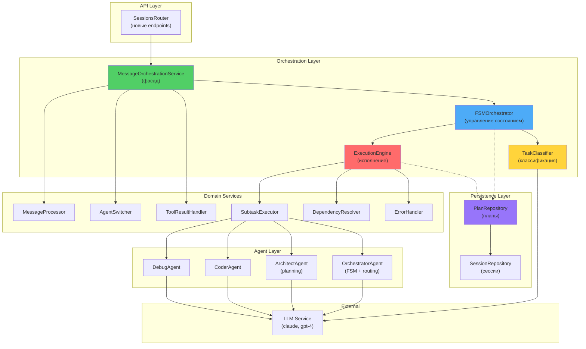
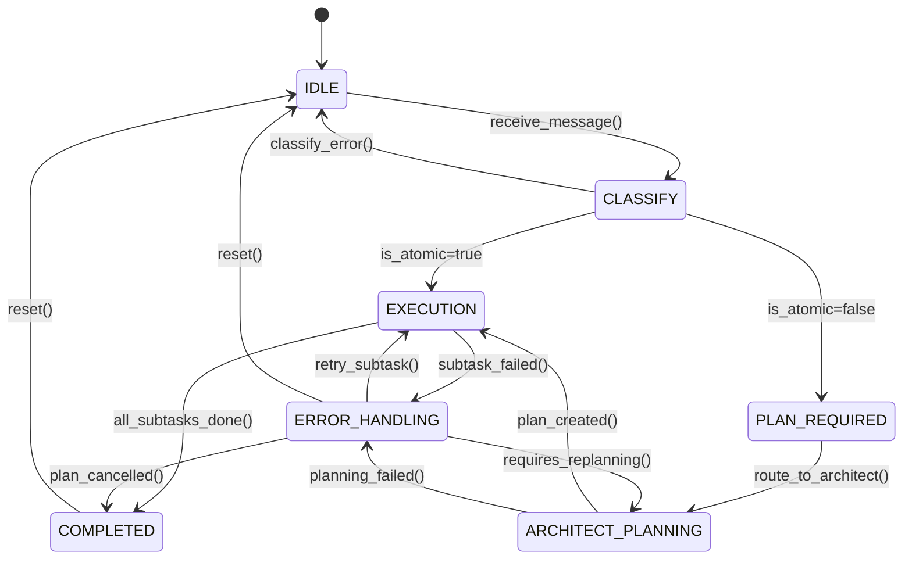
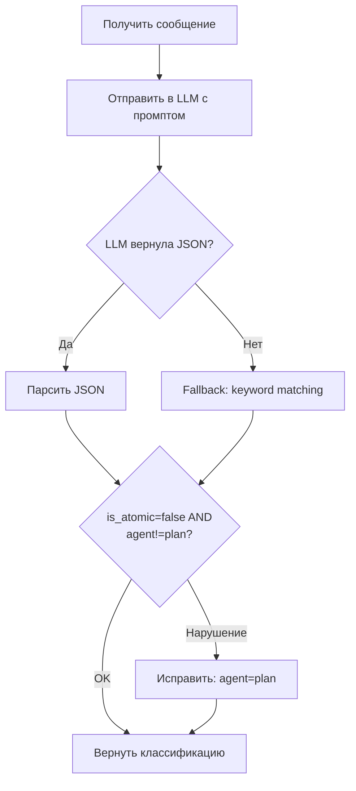
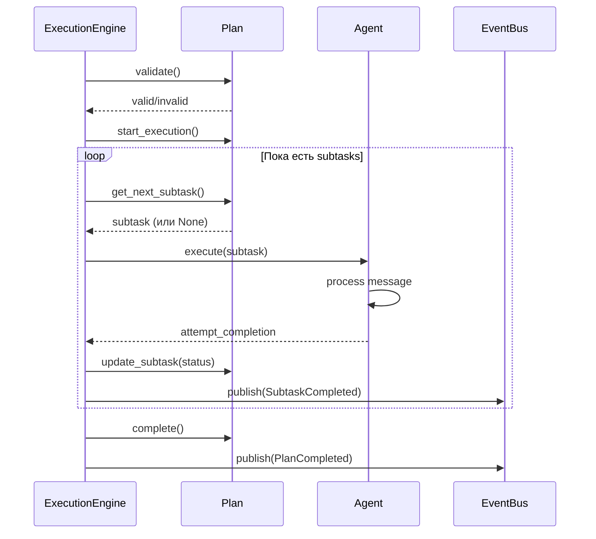
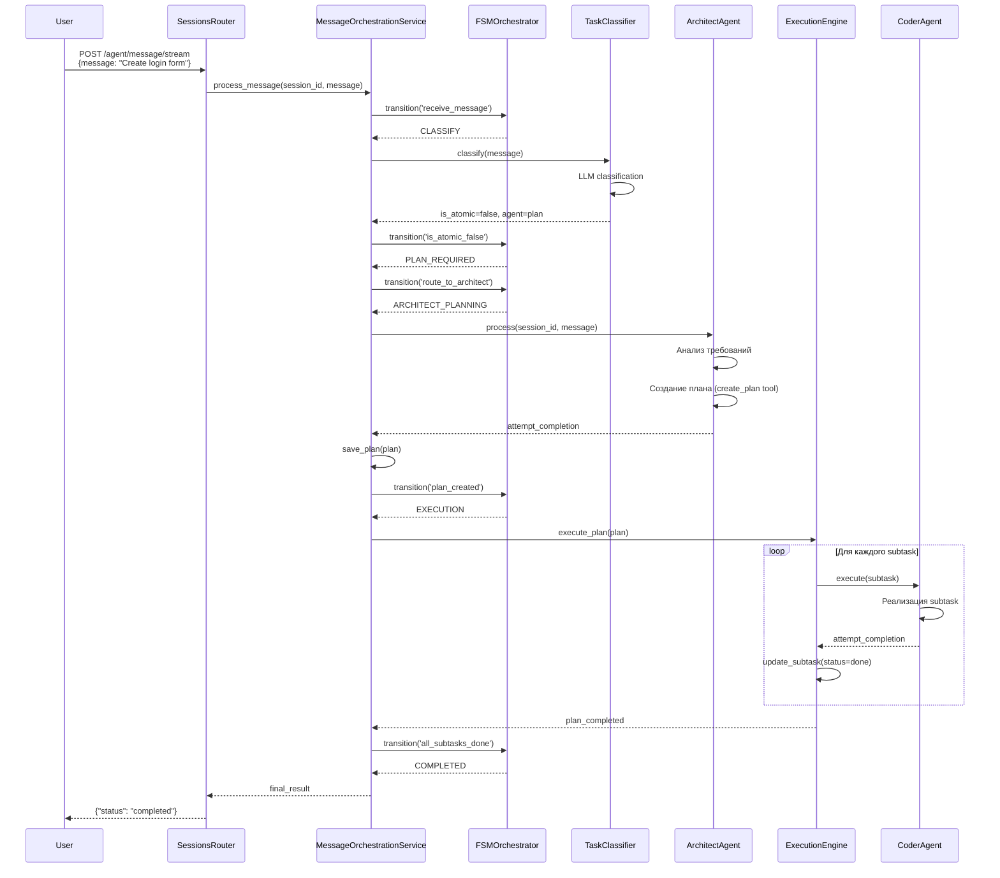
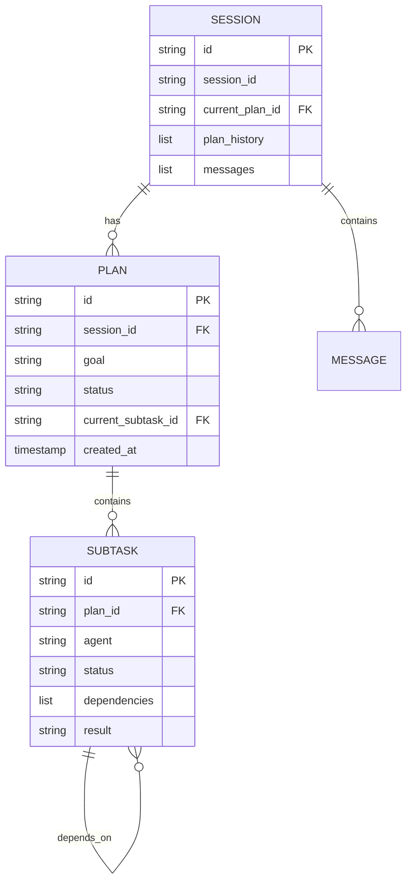
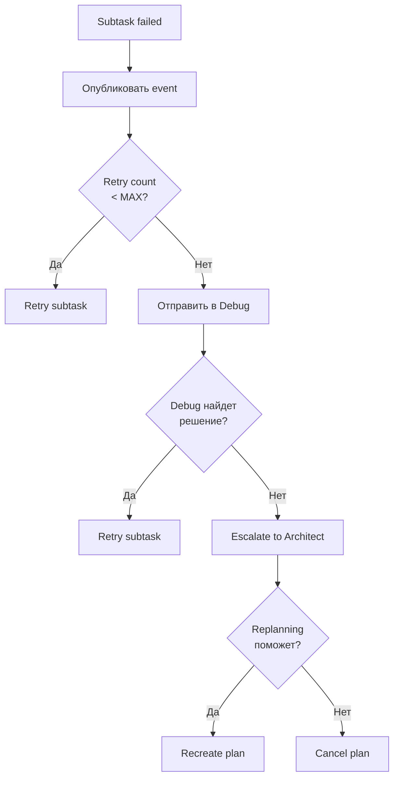

# Архитектура системы планирования CodeLab Agent Runtime

**Версия:** 1.0  
**Дата:** 30 января 2026  
**Статус:** Design - Ready for Development  
**Автор:** Architecture Team

---

## Содержание

1. [Обзор архитектуры](#обзор-архитектуры)
2. [FSM Orchestrator](#fsm-orchestrator)
3. [Task Classification](#task-classification)
4. [Execution Engine](#execution-engine)
5. [Plan Repository](#plan-repository)
6. [Интеграция компонентов](#интеграция-компонентов)
7. [API Design](#api-design)
8. [Data Model](#data-model)
9. [Error Handling](#error-handling)
10. [Security & Validation](#security--validation)

---

## Обзор архитектуры

### Стратегия разработки

**Инкрементальная интеграция** с сохранением обратной совместимости:
- Новые компоненты реализуются как отдельные сервисы
- Интеграция с существующей системой через фасад `MessageOrchestrationService`
- Feature flags для постепенного включения новой функциональности
- Возможность rollback на каждом этапе

### Архитектурная диаграмма



---

## FSM Orchestrator

### 1.1 Определение состояний

```python
class FSMState(str, Enum):
    """Состояния FSM для управления жизненным циклом задачи"""
    
    IDLE = "idle"                          # Ожидание задачи
    CLASSIFY = "classify"                  # Классификация задачи
    PLAN_REQUIRED = "plan_required"        # Требуется план
    ARCHITECT_PLANNING = "architect_planning"  # Architect создает план
    EXECUTION = "execution"                # Исполнение плана
    ERROR_HANDLING = "error_handling"      # Обработка ошибки
    COMPLETED = "completed"                # Задача завершена
```

### 1.2 Диаграмма состояний



### 1.3 Правила переходов

```python
class FSMTransitionRules:
    """Правила переходов между состояниями"""
    
    TRANSITIONS = {
        FSMState.IDLE: {
            'receive_message': FSMState.CLASSIFY,
        },
        FSMState.CLASSIFY: {
            'is_atomic_true': FSMState.EXECUTION,
            'is_atomic_false': FSMState.PLAN_REQUIRED,
            'error': FSMState.IDLE,
        },
        FSMState.PLAN_REQUIRED: {
            'route_to_architect': FSMState.ARCHITECT_PLANNING,
        },
        FSMState.ARCHITECT_PLANNING: {
            'plan_created': FSMState.EXECUTION,
            'planning_failed': FSMState.ERROR_HANDLING,
        },
        FSMState.EXECUTION: {
            'all_subtasks_done': FSMState.COMPLETED,
            'subtask_failed': FSMState.ERROR_HANDLING,
        },
        FSMState.ERROR_HANDLING: {
            'requires_replanning': FSMState.ARCHITECT_PLANNING,
            'retry_subtask': FSMState.EXECUTION,
            'plan_cancelled': FSMState.COMPLETED,
        },
        FSMState.COMPLETED: {
            'reset': FSMState.IDLE,
        },
    }
```

### 1.4 Интерфейс FSMOrchestrator

```python
class IFSMOrchestrator(ABC):
    """Интерфейс управления состоянием FSM"""
    
    @abstractmethod
    async def transition(
        self,
        event: str,
        context: Dict[str, Any]
    ) -> FSMState:
        """Выполнить переход по событию"""
        pass
    
    @abstractmethod
    def get_current_state(self) -> FSMState:
        """Получить текущее состояние"""
        pass
    
    @abstractmethod
    def validate_transition(
        self,
        from_state: FSMState,
        event: str,
        to_state: FSMState
    ) -> bool:
        """Валидировать переход"""
        pass
    
    @abstractmethod
    async def reset(self) -> None:
        """Сбросить FSM в начальное состояние"""
        pass
```

---

## Task Classification

### 2.1 JSON Schema классификации

```json
{
  "type": "object",
  "properties": {
    "is_atomic": {
      "type": "boolean",
      "description": "Является ли задача атомарной (выполняется одним агентом за один шаг)"
    },
    "agent": {
      "type": "string",
      "enum": ["code", "plan", "debug", "explain"],
      "description": "Целевой агент для обработки"
    },
    "confidence": {
      "type": "string",
      "enum": ["high", "medium", "low"],
      "description": "Уверенность в классификации"
    },
    "reason": {
      "type": "string",
      "description": "Обоснование классификации"
    }
  },
  "required": ["is_atomic", "agent", "confidence", "reason"]
}
```

### 2.2 Правило классификации (обязательное)

```
ПРАВИЛО: Если is_atomic = false, то agent ОБЯЗАТЕЛЬНО = "plan"

Это гарантирует, что сложные задачи не идут напрямую в Coder/Debug/Ask
```

### 2.3 Интерфейс TaskClassifier

```python
class TaskClassification(BaseModel):
    """Результат классификации задачи"""
    is_atomic: bool
    agent: Literal["code", "plan", "debug", "explain"]
    confidence: Literal["high", "medium", "low"]
    reason: str

class ITaskClassifier(ABC):
    """Интерфейс классификатора задач"""
    
    @abstractmethod
    async def classify(self, message: str) -> TaskClassification:
        """Классифицировать задачу"""
        pass
    
    @abstractmethod
    async def validate_classification(
        self,
        classification: TaskClassification
    ) -> bool:
        """Валидировать классификацию по правилам"""
        pass
```

### 2.4 Логика классификации



---

## Execution Engine

### 3.1 Алгоритм исполнения плана

```
1. Получить план из БД
2. Валидировать план:
   - Нет циклических зависимостей
   - Все subtasks атомарные
   - Все агенты существуют
3. Начать исполнение (plan.start_execution())
4. Цикл выполнения:
   a. Получить следующий готовый subtask (get_next_subtask)
   b. Если нет готовых:
      - Если все done → plan.complete()
      - Если есть failed → handle_error()
      - Если есть блокированные → wait
   c. Запустить subtask в целевом агенте
   d. Ждать attempt_completion
   e. Обновить статус subtask
   f. Опубликовать event
5. Если plan failed → try_replanning() или escalate
```

### 3.2 Диаграмма исполнения



### 3.3 Интерфейсы Execution Engine

```python
class ISubtaskExecutor(ABC):
    """Исполнитель отдельного subtask"""
    
    @abstractmethod
    async def execute(
        self,
        session_id: str,
        subtask: Subtask,
        plan: Plan
    ) -> str:
        """Исполнить subtask в целевом агенте"""
        pass

class IDependencyResolver(ABC):
    """Разрешение зависимостей между subtasks"""
    
    @abstractmethod
    def get_ready_subtasks(
        self,
        plan: Plan
    ) -> List[Subtask]:
        """Получить готовые к исполнению subtasks"""
        pass
    
    @abstractmethod
    def has_cyclic_dependencies(
        self,
        plan: Plan
    ) -> bool:
        """Проверить циклические зависимости"""
        pass

class IExecutionEngine(ABC):
    """Движок исполнения планов"""
    
    @abstractmethod
    async def execute_plan(
        self,
        session_id: str,
        plan: Plan
    ) -> ExecutionResult:
        """Исполнить весь план"""
        pass
    
    @abstractmethod
    async def pause_execution(
        self,
        session_id: str
    ) -> None:
        """Приостановить исполнение"""
        pass
    
    @abstractmethod
    async def resume_execution(
        self,
        session_id: str
    ) -> None:
        """Возобновить исполнение"""
        pass
```

---

## Plan Repository

### 4.1 Схема БД

```sql
-- Таблица планов
CREATE TABLE plans (
    id UUID PRIMARY KEY,
    session_id UUID NOT NULL FOREIGN KEY (sessions.id),
    goal TEXT NOT NULL,
    status VARCHAR(20) NOT NULL,  -- draft, approved, in_progress, completed, failed
    current_subtask_id UUID,
    metadata JSONB,
    approved_at TIMESTAMP,
    started_at TIMESTAMP,
    completed_at TIMESTAMP,
    created_at TIMESTAMP NOT NULL,
    updated_at TIMESTAMP NOT NULL
);

-- Таблица подзадач
CREATE TABLE subtasks (
    id UUID PRIMARY KEY,
    plan_id UUID NOT NULL FOREIGN KEY (plans.id),
    description TEXT NOT NULL,
    agent VARCHAR(20) NOT NULL,  -- orchestrator, coder, architect, debug, ask
    status VARCHAR(20) NOT NULL,  -- pending, running, done, failed, blocked
    dependencies JSONB NOT NULL DEFAULT [],  -- массив ID зависимостей
    estimated_time VARCHAR(50),
    result TEXT,
    error TEXT,
    started_at TIMESTAMP,
    completed_at TIMESTAMP,
    created_at TIMESTAMP NOT NULL,
    updated_at TIMESTAMP NOT NULL
);

-- Индексы
CREATE INDEX idx_plans_session_id ON plans(session_id);
CREATE INDEX idx_plans_status ON plans(status);
CREATE INDEX idx_subtasks_plan_id ON subtasks(plan_id);
CREATE INDEX idx_subtasks_status ON subtasks(status);
```

### 4.2 Миграция Alembic

```python
# alembic/versions/001_add_planning_system.py

def upgrade():
    """Добавить таблицы для системы планирования"""
    op.create_table(
        'plans',
        sa.Column('id', sa.UUID, primary_key=True),
        sa.Column('session_id', sa.UUID, nullable=False),
        sa.Column('goal', sa.String, nullable=False),
        sa.Column('status', sa.String(20), nullable=False, default='draft'),
        sa.Column('current_subtask_id', sa.UUID),
        sa.Column('metadata', sa.JSON),
        sa.Column('approved_at', sa.DateTime),
        sa.Column('started_at', sa.DateTime),
        sa.Column('completed_at', sa.DateTime),
        sa.Column('created_at', sa.DateTime, nullable=False),
        sa.Column('updated_at', sa.DateTime, nullable=False),
        sa.ForeignKeyConstraint(['session_id'], ['sessions.id']),
        sa.Index('idx_plans_session_id', 'session_id'),
        sa.Index('idx_plans_status', 'status'),
    )
    
    op.create_table(
        'subtasks',
        sa.Column('id', sa.UUID, primary_key=True),
        sa.Column('plan_id', sa.UUID, nullable=False),
        sa.Column('description', sa.String, nullable=False),
        sa.Column('agent', sa.String(20), nullable=False),
        sa.Column('status', sa.String(20), nullable=False, default='pending'),
        sa.Column('dependencies', sa.JSON, nullable=False, default=[]),
        sa.Column('estimated_time', sa.String(50)),
        sa.Column('result', sa.String),
        sa.Column('error', sa.String),
        sa.Column('started_at', sa.DateTime),
        sa.Column('completed_at', sa.DateTime),
        sa.Column('created_at', sa.DateTime, nullable=False),
        sa.Column('updated_at', sa.DateTime, nullable=False),
        sa.ForeignKeyConstraint(['plan_id'], ['plans.id']),
        sa.Index('idx_subtasks_plan_id', 'plan_id'),
        sa.Index('idx_subtasks_status', 'status'),
    )
```

---

## Интеграция компонентов

### 5.1 Sequence diagram полного workflow



### 5.2 Интеграция с OrchestratorAgent

```python
class OrchestratorAgent(BaseAgent):
    """Обновленный Orchestrator с FSM"""
    
    def __init__(self):
        super().__init__(
            agent_type=AgentType.ORCHESTRATOR,
            system_prompt=ORCHESTRATOR_PROMPT_V2,
            allowed_tools=[...]
        )
        self.fsm = FSMOrchestrator()
        self.classifier = TaskClassifier()
        self.execution_engine = ExecutionEngine()
    
    async def process(
        self,
        session_id: str,
        message: str,
        context: Dict[str, Any],
        session: Session,
        session_service: SessionManagementService,
        stream_handler: IStreamHandler
    ) -> AsyncGenerator[StreamChunk, None]:
        """Процесс с использованием FSM"""
        
        # Переход: IDLE → CLASSIFY
        await self.fsm.transition('receive_message')
        
        # Классификация задачи
        classification = await self.classifier.classify(message)
        
        if classification.is_atomic:
            # Атомарная задача → маршрутизация
            await self.fsm.transition('is_atomic_true')
            target_agent = self._map_classification_to_agent(classification)
            yield StreamChunk(type="switch_agent", ...)
        else:
            # Неатомарная → требуется план
            await self.fsm.transition('is_atomic_false')
            await self.fsm.transition('route_to_architect')
            yield StreamChunk(type="switch_agent", target_agent=AgentType.ARCHITECT)
```

---

## API Design

### 6.1 Endpoints для планов

```python
# Получить план сессии
GET /sessions/{session_id}/plan
Response: {
    "plan_id": "...",
    "goal": "...",
    "status": "in_progress",
    "subtasks": [...],
    "progress": {"total": 5, "done": 2, "percentage": 40}
}

# Одобрить план
POST /sessions/{session_id}/plan/approve
Request: {"plan_id": "..."}
Response: {"status": "approved"}

# Отменить план
POST /sessions/{session_id}/plan/cancel
Request: {"plan_id": "...", "reason": "..."}
Response: {"status": "cancelled"}

# Получить статус исполнения
GET /sessions/{session_id}/plan/execution-status
Response: {
    "state": "execution",
    "current_subtask": {...},
    "completed": 2,
    "failed": 0,
    "pending": 3
}

# Список планов сессии
GET /sessions/{session_id}/plans?limit=10&offset=0
Response: {"plans": [...], "total": 15}
```

### 6.2 WebSocket события

```json
{
  "type": "plan_created",
  "data": {
    "plan_id": "...",
    "subtasks_count": 5
  }
}

{
  "type": "subtask_started",
  "data": {
    "subtask_id": "...",
    "agent": "coder"
  }
}

{
  "type": "subtask_completed",
  "data": {
    "subtask_id": "...",
    "result": "..."
  }
}

{
  "type": "plan_completed",
  "data": {
    "plan_id": "..."
  }
}
```

---

## Data Model

### 7.1 Расширения Session

```python
class Session(Entity):
    """Расширенная Session с поддержкой планов"""
    
    # Существующие поля...
    id: str
    session_id: str
    messages: List[Message]
    
    # НОВЫЕ ПОЛЯ:
    current_plan_id: Optional[str] = None
    plan_history: List[str] = []  # История всех планов
    metadata: Dict[str, Any] = {}
```

### 7.2 Связи между сущностями



---

## Error Handling

### 8.1 Иерархия ошибок

```python
class PlanningError(Exception):
    """Базовая ошибка системы планирования"""
    pass

class ClassificationError(PlanningError):
    """Ошибка классификации задачи"""
    pass

class PlanCreationError(PlanningError):
    """Ошибка при создании плана"""
    pass

class SubtaskExecutionError(PlanningError):
    """Ошибка при исполнении subtask"""
    pass

class FSMTransitionError(PlanningError):
    """Ошибка при переходе FSM"""
    pass

class ValidationError(PlanningError):
    """Ошибка валидации плана"""
    pass
```

### 8.2 Обработка ошибок subtask



---

## Security & Validation

### 9.1 Валидация плана перед исполнением

```python
class PlanValidator:
    """Валидатор планов перед исполнением"""
    
    def validate(self, plan: Plan) -> ValidationResult:
        """Выполнить все проверки"""
        checks = [
            self._check_no_cyclic_dependencies,
            self._check_all_subtasks_atomic,
            self._check_no_architect_assignment,
            self._check_all_agents_exist,
            self._check_dependencies_exist,
            self._check_no_empty_description,
        ]
        
        for check in checks:
            result = check(plan)
            if not result.is_valid:
                return result
        
        return ValidationResult(is_valid=True)
```

### 9.2 Runtime Guards

```python
class RuntimeGuards:
    """Защитные механизмы во время исполнения"""
    
    @staticmethod
    def validate_subtask_assignment(
        subtask: Subtask
    ) -> None:
        """Проверить: Architect не назначен на subtask"""
        if subtask.agent == AgentType.ARCHITECT:
            raise ValidationError(
                "Architect cannot be assigned to execution subtasks"
            )
    
    @staticmethod
    def validate_agent_tool_usage(
        agent: AgentType,
        tool_name: str
    ) -> None:
        """Проверить: агент может использовать инструмент"""
        allowed_tools = AGENT_TOOL_PERMISSIONS[agent]
        if tool_name not in allowed_tools:
            raise RuntimeError(
                f"Agent {agent} cannot use tool {tool_name}"
            )
    
    @staticmethod
    def validate_fsm_transition(
        from_state: FSMState,
        event: str,
        to_state: FSMState
    ) -> None:
        """Проверить: переход допустим в FSM"""
        if not FSMTransitionRules.is_valid_transition(from_state, event):
            raise FSMTransitionError(
                f"Invalid transition: {from_state} -> {to_state} on {event}"
            )
```

---

## Ключевые инварианты системы

### Инвариант 1: Single Source of Truth
- **Только Orchestrator** может переключать агентов
- **Только ExecutionEngine** управляет исполнением плана
- **Только ArchitectAgent** может создавать планы

### Инвариант 2: Agent Isolation
- Агенты **не могут** вызывать `switch_mode` напрямую
- Агенты **не могут** управлять жизненным циклом задачи
- Все переключения **только** через FSM

### Инвариант 3: Plan Atomicity
- Каждый subtask **обязательно атомарный**
- Нет subtasks, требующих архитектурных решений
- Все subtasks назначены **неArch** агентам

### Инвариант 4: Determinism
- Одинаковый input → одинаковый output (при одном seed)
- Система воспроизводима для отладки
- Все переходы FSM детерминированы

---

## Checklist реализации

### Phase 1: FSM & Classifier (Week 1)
- [ ] FSMState enum с состояниями
- [ ] FSMOrchestrator с методом transition()
- [ ] FSMTransitionRules с правилами
- [ ] TaskClassifier с LLM + fallback
- [ ] Unit тесты FSM (все переходы)
- [ ] Unit тесты Classifier (is_atomic + agent)

### Phase 2: Plan Repository (Week 2)
- [ ] SQLAlchemy модели (Plan, Subtask)
- [ ] PlanMapper (Domain ↔ DB)
- [ ] PlanRepositoryImpl
- [ ] Миграция Alembic
- [ ] Integration тесты

### Phase 3: Execution Engine (Weeks 3-4)
- [ ] ExecutionEngine.execute_plan()
- [ ] SubtaskExecutor
- [ ] DependencyResolver
- [ ] Error handling + Debug routing
- [ ] Progress tracking
- [ ] E2E тесты

### Phase 4: Integration (Week 5)
- [ ] OrchestratorAgent с FSM
- [ ] MessageProcessor обновления
- [ ] API endpoints
- [ ] WebSocket события

### Phase 5: Guards & Validation (Week 6)
- [ ] PlanValidator
- [ ] RuntimeGuards
- [ ] Feature flags
- [ ] Comprehensive testing

---

**Статус:** 🟢 Готов к разработке
