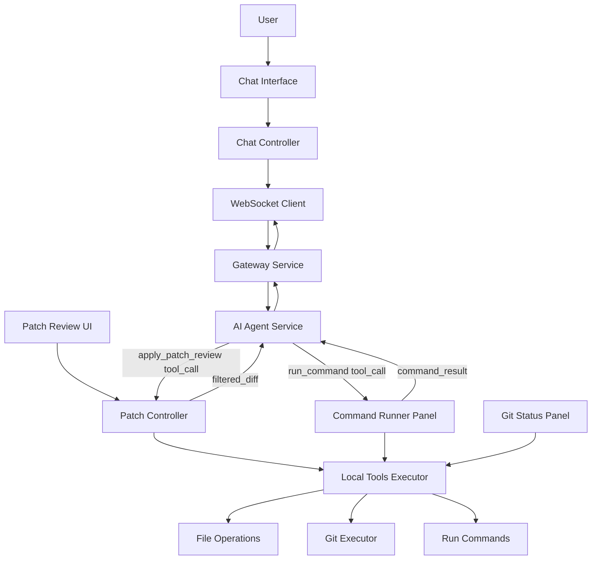

Отлично! Ниже подготовлена **High-Level Layout диаграмма Codelab IDE POC**, показывающая основные компоненты, их взаимодействие и потоки данных. Формат — **Mermaid** для документации.

---

# 🟥 **High-Level Layout Diagram — Codelab IDE POC**

---

# 🟦 **Пояснение компонентов**

### **User Layer**

* Пользовательский ввод через Chat UI
* Интерактивный выбор chunk в Patch Review UI

### **UI Layer**

* **ChatController:** управляет потоками сообщений и LLM streaming
* **PatchController:** визуализирует diff, позволяет выбирать chunk-и
* **CommandPanel / GitPanel:** отдельные панели для управления командами и Git

### **Core IDE Layer**

* **Local Tools Executor:** точка интеграции всех инструментов (файлы, git, команды)
* **FileOps:** read/write файлов
* **GitOps:** git.diff, apply_patch
* **CommandRunner:** запуск shell-команд

### **WebSocket / Gateway**

* В POC используется WebSocket для связи с AI Agent Service через Gateway
* Все tool-calls маршрутизируются через этот канал

### **Patch Review Flow**

* AI Agent генерирует diff
* IDE показывает Patch Review UI пользователю
* Пользователь выбирает chunk-и → IDE отправляет filtered diff обратно агенту

### **Command Flow**

* AI Agent может вызвать `run_command` → IDE запускает процесс локально
* Streaming stdout/stderr возвращается агенту

---

# 🟩 **Особенности POC**

1. Все git и file operations выполняются локально, без облачного хранения кода
2. Streaming LLM output отображается токен за токеном в Chat UI
3. Patch Review UI интерактивен, поддерживает выбор chunk
4. Минимальный набор инструментов: read_file, write_file, git.diff, apply_patch, run_command
5. Архитектура готова к расширению: новые tools, multi-workspace, LLM providers
