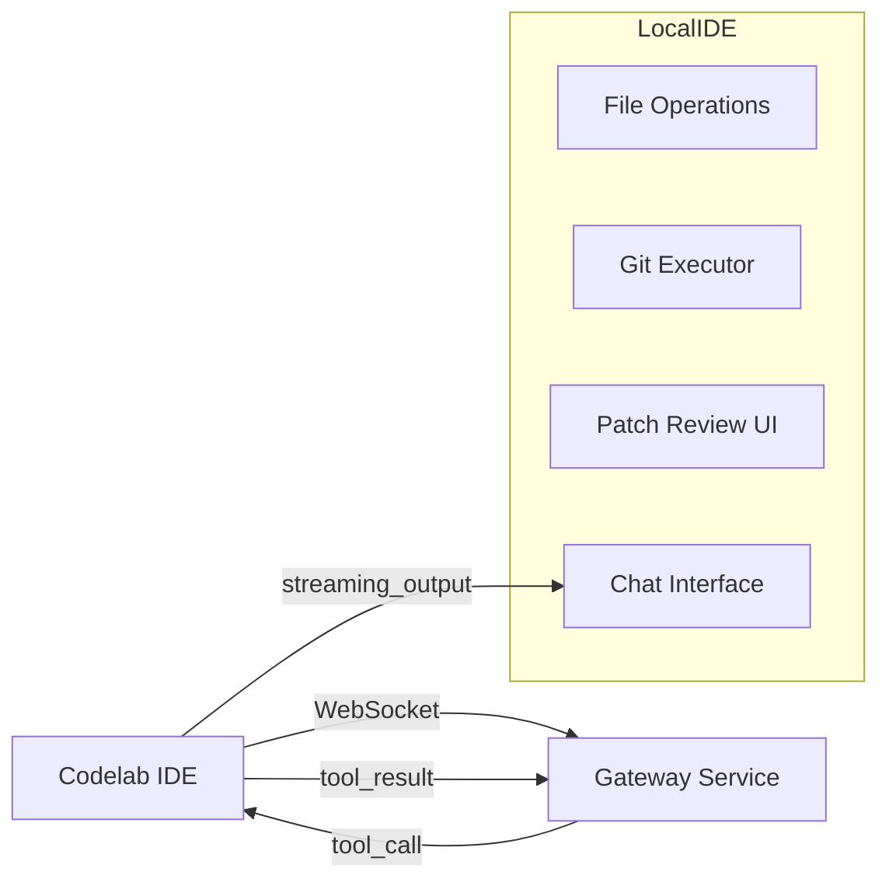

# 🟥 **POC Codelab IDE — Цель**

* Интеграция с AI Agent через WebSocket (Gateway)
* Локальное выполнение minimal set of tools: файловые операции, git diff, apply_patch
* Отображение streaming LLM output в чат
* Patch Review UI (минимальная реализация)
* Интерактивный user approval flow через чат

POC предназначен для проверки **реальности архитектуры**, latency, UI/UX и tool-calls workflow.

---

# 🟦 **1. Основной стек технологий**

| Компонент          | Технология                                     |
| ------------------ | ---------------------------------------------- |
| IDE Desktop        | Flutter Desktop (macOS/Linux/Windows)          |
| WebSocket          | `web_socket_channel` (Flutter)                 |
| JSON serialization | `json_serializable`                            |
| Git execution      | `Process.start("git", [...])`                  |
| File operations    | Dart IO (`File`, `Directory`)                  |
| Patch Review UI    | Flutter widgets (`ListView`, `SelectableText`) |
| Streaming UI       | `StreamBuilder`                                |

---

# 🟩 **2. Минимальные функции POC**

### 🔹 Chat Interface

* Поле ввода для сообщений пользователя
* Отображение сообщений AI в streaming режиме (token-by-token)
* Поддержка tool-calls (diff, patch, prompt_user)

### 🔹 Local Tools Executor

Поддержка инструментов:

1. **File Tools**

   * `read_file(path)`
   * `write_file(path, content)`
2. **Git Tools**

   * `git.diff(path)`
   * `apply_patch(diff)`
3. **Commands**

   * `run_command(cmd, args)`

### 🔹 Patch Review UI

* Показывает diff от AI Agent
* User может выбрать chunk-и для применения
* Отправка filtered diff обратно агенту

### 🔹 User Approval Flow

* Prompt User tool: approve/deny
* Отправка результата обратно Agent

---

# 🟦 **3. Архитектура POC IDE**



**Примечание:** Все инструменты выполняются локально, Git используется через system binary.

---

# 🟥 **4. Минимальные API/JSON контракты**

### 4.1 Tool Call (IDE ← Agent)

```json
{
  "type": "tool_call",
  "tool_name": "git.diff",
  "call_id": "call_001",
  "args": { "path": "." }
}
```

### 4.2 Tool Result (IDE → Agent)

```json
{
  "type": "tool_result",
  "call_id": "call_001",
  "result": { "diff": "diff --git ..." }
}
```

### 4.3 User Approval Request

```json
{
  "type": "tool_call",
  "tool_name": "prompt_user",
  "call_id": "call_002",
  "args": {
    "message": "Apply patch?",
    "actions": ["approve", "deny"]
  }
}
```

### 4.4 User Approval Response

```json
{
  "type": "tool_result",
  "call_id": "call_002",
  "result": { "action": "approve" }
}
```

---

# 🟦 **5. Workflow POC**

1. User вводит сообщение в ChatUI
2. IDE отправляет `user_message` через WebSocket Gateway
3. AI Agent генерирует tool-call (например, git.diff)
4. IDE выполняет tool, возвращает `tool_result`
5. AI Agent формирует patch, вызывает `apply_patch_review`
6. IDE отображает Patch Review UI, пользователь выбирает chunk-и
7. IDE возвращает filtered patch
8. AI Agent завершает reasoning, IDE отображает финальный streaming ответ

---

# 🟩 **6. UI/UX POC**

### Chat Window

* Scrollable area для сообщений
* Streaming output (token-by-token)

### Patch Review Modal

* Side-by-side diff view
* Checkboxes для выбора chunk
* Apply / Cancel buttons

### User Approval

* Simple modal: `Message + Approve/Deny buttons`

### Status Bar

* показывает `Tool executing…` или `Idle`

---

# 🟦 **7. Пошаговый план разработки (1–2 недели)**

| День | Задачи                                              |
| ---- | --------------------------------------------------- |
| 1–2  | Создать Flutter Desktop skeleton, WebSocket client  |
| 3–4  | Реализовать Chat UI + streaming токенов             |
| 5–6  | Подключить минимальные Tools: read_file, write_file |
| 7    | Подключить git.diff, apply_patch                    |
| 8–9  | Реализовать Patch Review UI + chunk selection       |
| 10   | Реализовать prompt_user flow                        |
| 11   | Интеграция с Gateway → AI Agent Service             |
| 12   | E2E тестирование, исправление багов                 |
| 13   | UX polish, корректное отображение ошибок            |
| 14   | Demo + документация POC                             |

---

# 🟥 **8. Минимальные критерии готовности POC**

1. IDE подключается к Gateway через WS
2. Chat interface отображает streaming output
3. IDE успешно выполняет `read_file` / `write_file` / `git.diff` / `apply_patch`
4. Patch Review UI позволяет выбрать chunk-и
5. User Approval flow работает end-to-end
6. Интеграция с AI Agent минимально рабочая
7. Логи ошибок отображаются в UI

---

# 🟩 **9. Дополнительно (опционально)**

* Workspace file watcher для обновления файлов
* Run command + streaming stdout/stderr
* Syntax highlighting для patch diff
* Поддержка нескольких рабочих папок