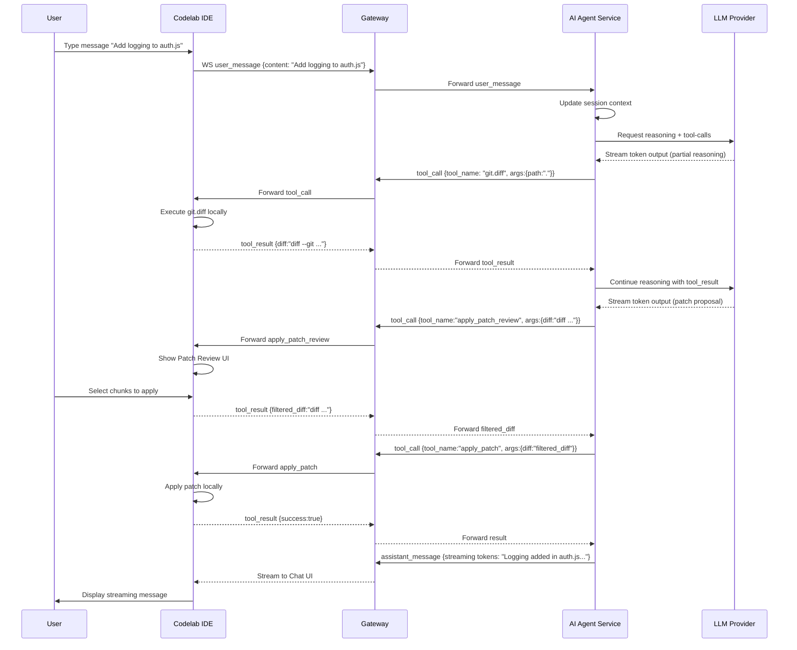

# 🟥 **Sequence Diagram — POC Codelab IDE → Gateway → AI Agent**

---

# 🟦 **Пояснение шагов**

1. **User → IDE:** пользователь пишет запрос в чат
2. **IDE → Gateway → Agent:** сообщение отправляется на сервер
3. **Agent → LLM:** агент формирует reasoning запрос с возможными tool-calls
4. **Tool-call git.diff:** LLM предлагает инструмент, агент отправляет в IDE
5. **IDE выполняет git.diff локально** и возвращает результат
6. **Agent продолжает reasoning** с учётом tool-result
7. **Patch Review:** пользователь выбирает chunk-и через UI, IDE отправляет обратно
8. **Apply Patch:** выбранный diff применяется локально
9. **Final message:** агент завершает ответ, IDE отображает streaming результат

---

# 🟩 **Особенности POC**

* Все Git и file operations выполняются **локально** в IDE
* LLM streaming поддерживается через WebSocket
* Patch Review UI позволяет **интерактивный выбор chunk**
* User approval (`prompt_user`) может быть добавлен в отдельный tool-call
* Схема полностью совместима с микросервисной архитектурой AI Agent