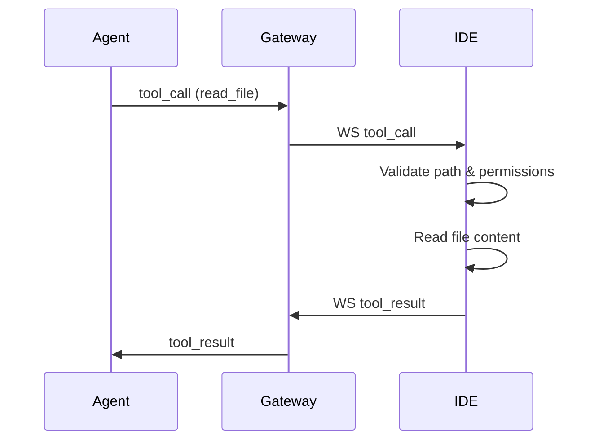
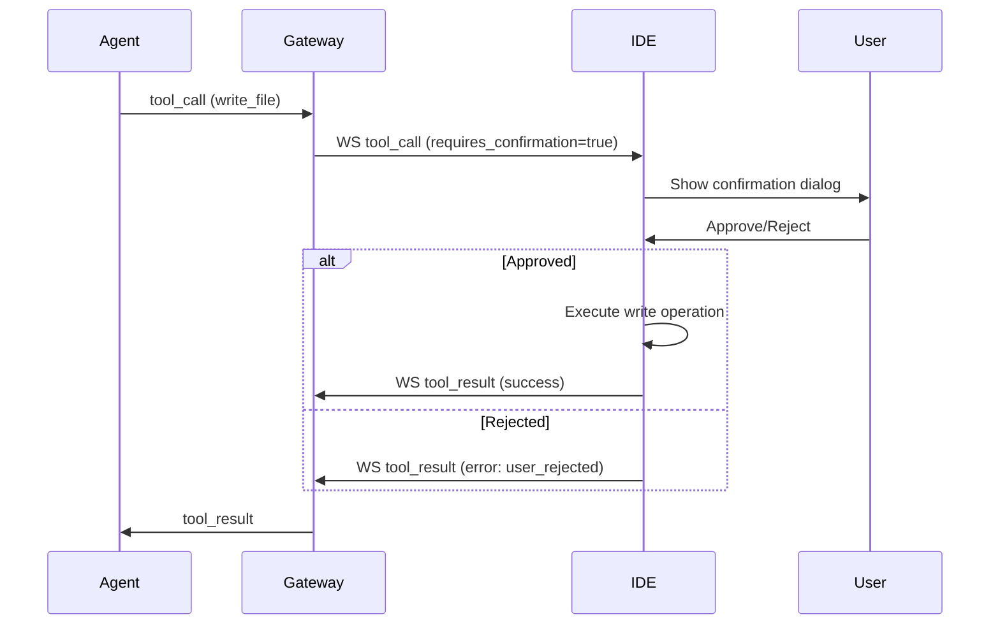

# Архитектура системы инструментов для работы с файлами

## Обзор

Система инструментов для работы с файлами включает два основных инструмента: `read_file` и `write_file`. Эти инструменты интегрируются в существующую инфраструктуру agent-runtime и gateway, используя WebSocket для коммуникации между IDE и Gateway. Tool execution происходит на стороне IDE с использованием Future-based паттернов для ожидания результатов.

## 1. Спецификация инструментов

### read_file

**Описание**: Чтение содержимого файла с диска.

**Параметры**:
- `path` (string, required): Путь к файлу относительно рабочего каталога проекта. Должен быть безопасным (без `..`, абсолютных путей и т.д.)
- `encoding` (string, optional): Кодировка файла (по умолчанию 'utf-8')
- `start_line` (integer, optional): Начальная строка для чтения (1-based)
- `end_line` (integer, optional): Конечная строка для чтения (1-based)

**JSON Schema**:
```json
{
  "type": "function",
  "function": {
    "name": "read_file",
    "description": "Read content from a file on disk. Supports partial reading by line numbers.",
    "parameters": {
      "type": "object",
      "properties": {
        "path": {
          "type": "string",
          "description": "Path to the file relative to project workspace"
        },
        "encoding": {
          "type": "string",
          "description": "File encoding (default: utf-8)",
          "default": "utf-8"
        },
        "start_line": {
          "type": "integer",
          "description": "Starting line number (1-based, inclusive)",
          "minimum": 1
        },
        "end_line": {
          "type": "integer",
          "description": "Ending line number (1-based, inclusive)",
          "minimum": 1
        }
      },
      "required": ["path"]
    }
  }
}
```

**Примеры использования**:
```json
// Простое чтение всего файла
{
  "tool_name": "read_file",
  "arguments": {
    "path": "src/main.py"
  }
}

// Чтение части файла (строки 10-20)
{
  "tool_name": "read_file",
  "arguments": {
    "path": "src/main.py",
    "start_line": 10,
    "end_line": 20
  }
}
```

### write_file

**Описание**: Запись содержимого в файл. Требует подтверждения от пользователя (HITL - Human-in-the-Loop) перед выполнением.

**Параметры**:
- `path` (string, required): Путь к файлу относительно рабочего каталога проекта
- `content` (string, required): Содержимое для записи
- `encoding` (string, optional): Кодировка файла (по умолчанию 'utf-8')
- `create_dirs` (boolean, optional): Создавать ли директории, если они не существуют (по умолчанию false)
- `backup` (boolean, optional): Создавать ли резервную копию перед перезаписью (по умолчанию true)

**JSON Schema**:
```json
{
  "type": "function",
  "function": {
    "name": "write_file",
    "description": "Write content to a file. Requires user confirmation before execution.",
    "parameters": {
      "type": "object",
      "properties": {
        "path": {
          "type": "string",
          "description": "Path to the file relative to project workspace"
        },
        "content": {
          "type": "string",
          "description": "Content to write to the file"
        },
        "encoding": {
          "type": "string",
          "description": "File encoding (default: utf-8)",
          "default": "utf-8"
        },
        "create_dirs": {
          "type": "boolean",
          "description": "Create parent directories if they don't exist",
          "default": false
        },
        "backup": {
          "type": "boolean",
          "description": "Create backup before overwriting existing file",
          "default": true
        }
      },
      "required": ["path", "content"]
    }
  }
}
```

**Примеры использования**:
```json
// Запись в новый файл
{
  "tool_name": "write_file",
  "arguments": {
    "path": "new_file.txt",
    "content": "Hello, world!"
  }
}

// Перезапись существующего файла с бэкапом
{
  "tool_name": "write_file",
  "arguments": {
    "path": "config.json",
    "content": "{\"key\": \"value\"}",
    "backup": true
  }
}
```

## 2. Модели данных

### Python (agent-runtime, gateway)

#### Расширения schemas.py

```python
class ReadFileArgs(BaseModel):
    path: str
    encoding: Optional[str] = "utf-8"
    start_line: Optional[int] = None
    end_line: Optional[int] = None

class WriteFileArgs(BaseModel):
    path: str
    content: str
    encoding: Optional[str] = "utf-8"
    create_dirs: Optional[bool] = False
    backup: Optional[bool] = True

class ToolArguments(BaseModel):
    read_file: Optional[ReadFileArgs] = None
    write_file: Optional[WriteFileArgs] = None

class FileOperationResult(BaseModel):
    success: bool
    content: Optional[str] = None
    lines_read: Optional[int] = None
    bytes_written: Optional[int] = None
    backup_path: Optional[str] = None
    error: Optional[str] = None
```

#### Расширения websocket.py

```python
class WSToolCall(BaseModel):
    type: Literal["tool_call"]
    call_id: str
    tool_name: str
    arguments: Dict[str, Any]
    requires_confirmation: Optional[bool] = False  # Для HITL операций

class WSToolResult(BaseModel):
    type: Literal["tool_result"]
    call_id: str
    result: Optional[FileOperationResult] = None
    error: Optional[str] = None
    needs_confirmation: Optional[bool] = False  # Для HITL операций
```

### Dart (IDE)

#### Структуры данных для IDE

```dart
class ReadFileArgs {
  final String path;
  final String? encoding;
  final int? startLine;
  final int? endLine;

  ReadFileArgs({
    required this.path,
    this.encoding = 'utf-8',
    this.startLine,
    this.endLine,
  });
}

class WriteFileArgs {
  final String path;
  final String content;
  final String? encoding;
  final bool? createDirs;
  final bool? backup;

  WriteFileArgs({
    required this.path,
    required this.content,
    this.encoding = 'utf-8',
    this.createDirs = false,
    this.backup = true,
  });
}

class FileOperationResult {
  final bool success;
  final String? content;
  final int? linesRead;
  final int? bytesWritten;
  final String? backupPath;
  final String? error;

  FileOperationResult({
    required this.success,
    this.content,
    this.linesRead,
    this.bytesWritten,
    this.backupPath,
    this.error,
  });
}
```

## 3. Протокол взаимодействия

### Sequence диаграммы

#### read_file flow



#### write_file flow (с HITL)



### Обработка ошибок и таймаутов

- **Таймауты**: Каждый tool call имеет timeout_seconds (по умолчанию 30 секунд)
- **Ошибки**: Ошибки возвращаются в поле `error` ToolResult
- **Коды ошибок**:
  - `file_not_found`: Файл не существует
  - `permission_denied`: Нет прав доступа
  - `invalid_path`: Несоответствующий путь
  - `encoding_error`: Проблема с кодировкой
  - `file_too_large`: Файл превышает лимит размера
  - `user_rejected`: Пользователь отклонил операцию write_file
  - `concurrent_modification`: Файл изменен другим процессом

### HITL (Human-in-the-Loop) flow

Для `write_file` операции:
1. IDE получает tool_call с `requires_confirmation=true`
2. IDE отображает диалог подтверждения пользователю с деталями операции
3. Диалог показывает: путь файла, размер контента, preview изменений (diff)
4. Пользователь может approve/reject/cancel
5. При approve - выполняется запись
6. При reject - возвращается ошибка `user_rejected`

## 4. Безопасность

### Валидация путей

- Запрещены абсолютные пути (начинающиеся с `/` или `\`)
- Запрещены пути с `..` (родительские директории)
- Запрещены символьные ссылки вне workspace
- Проверка на null bytes в пути
- Максимальная длина пути: 4096 символов

### Ограничения на размер файлов

- Максимальный размер читаемого файла: 10MB
- Максимальный размер записываемого файла: 5MB
- Для больших файлов: поддержка chunked reading/writing
- Rate limiting: максимум 100 операций в минуту на сессию

### Sandbox для выполнения операций

- Все операции выполняются в изолированном контексте IDE
- Нет доступа к системным командам через инструменты
- Логирование всех операций с файлами
- Аудит логов для подозрительной активности
- Откат изменений при обнаружении нарушений

## 5. Обработка edge cases

### Большие файлы

- **Chunked reading**: Для файлов > 1MB использовать построчное чтение
- **Streaming**: Поддержка streaming для read_file с большими файлами
- **Memory limits**: Ограничение на использование памяти при обработке

### Несуществующие файлы

- **read_file**: Возврат ошибки `file_not_found`
- **write_file**: Создание файла если `create_dirs=true`, иначе ошибка
- **Директории**: Валидация существования родительских директорий

### Проблемы с правами доступа

- **Read**: Проверка прав чтения перед операцией
- **Write**: Проверка прав записи и создание директорий при необходимости
- **Executable files**: Запрет на модификацию исполняемых файлов без подтверждения
- **System files**: Блокировка доступа к системным файлам

### Конкурентные операции

- **File locking**: Advisory locking для предотвращения одновременной модификации
- **Version conflicts**: Проверка модификации файла между read и write
- **Retry logic**: Автоматический retry при transient ошибках
- **Conflict resolution**: Merge conflict handling для write_file

## 6. Интеграция с существующими компонентами

### Изменения в tool_registry.py

```python
TOOLS_SPEC = [
    # ... существующие инструменты
    
    {
        "type": "function",
        "function": {
            "name": "read_file",
            "description": "Read content from a file on disk. Supports partial reading by line numbers.",
            "parameters": {
                "type": "object",
                "properties": {
                    "path": {"type": "string", "description": "Path to the file relative to project workspace"},
                    "encoding": {"type": "string", "description": "File encoding (default: utf-8)", "default": "utf-8"},
                    "start_line": {"type": "integer", "description": "Starting line number (1-based, inclusive)", "minimum": 1},
                    "end_line": {"type": "integer", "description": "Ending line number (1-based, inclusive)", "minimum": 1}
                },
                "required": ["path"]
            }
        }
    },
    {
        "type": "function",
        "function": {
            "name": "write_file",
            "description": "Write content to a file. Requires user confirmation before execution.",
            "parameters": {
                "type": "object",
                "properties": {
                    "path": {"type": "string", "description": "Path to the file relative to project workspace"},
                    "content": {"type": "string", "description": "Content to write to the file"},
                    "encoding": {"type": "string", "description": "File encoding (default: utf-8)", "default": "utf-8"},
                    "create_dirs": {"type": "boolean", "description": "Create parent directories if they don't exist", "default": false},
                    "backup": {"type": "boolean", "description": "Create backup before overwriting existing file", "default": true}
                },
                "required": ["path", "content"]
            }
        }
    }
]
```

### Изменения в schemas.py

- Добавить `WriteFileArgs` класс
- Расширить `ToolArguments` для поддержки `write_file`
- Добавить `FileOperationResult` для унифицированного результата

### Новые компоненты для IDE

1. **FileToolService**: Сервис для выполнения операций с файлами в IDE
2. **FileSecurityValidator**: Компонент для валидации безопасности путей
3. **HITLConfirmationDialog**: Диалог подтверждения для write операций
4. **FileOperationLogger**: Логгер для аудита операций
5. **FileChunkReader**: Для чтения больших файлов по частям