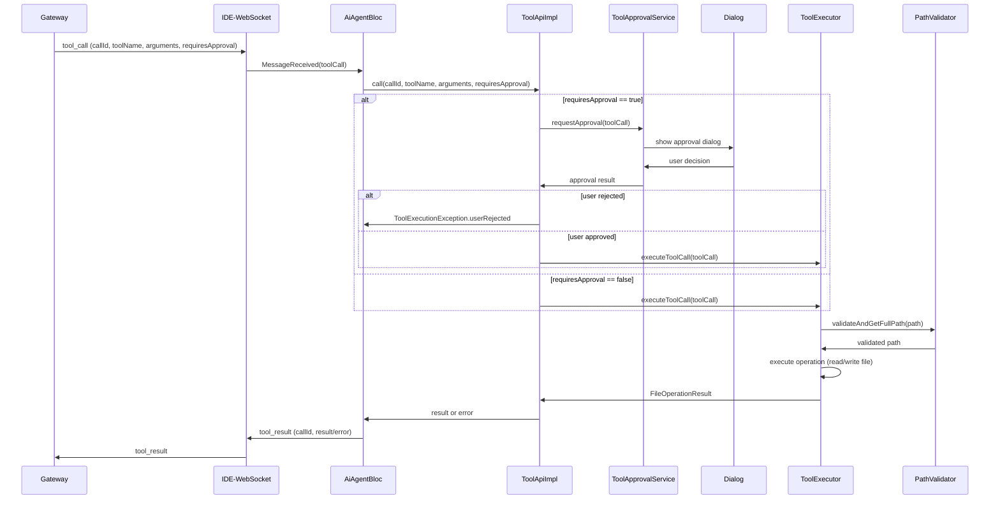
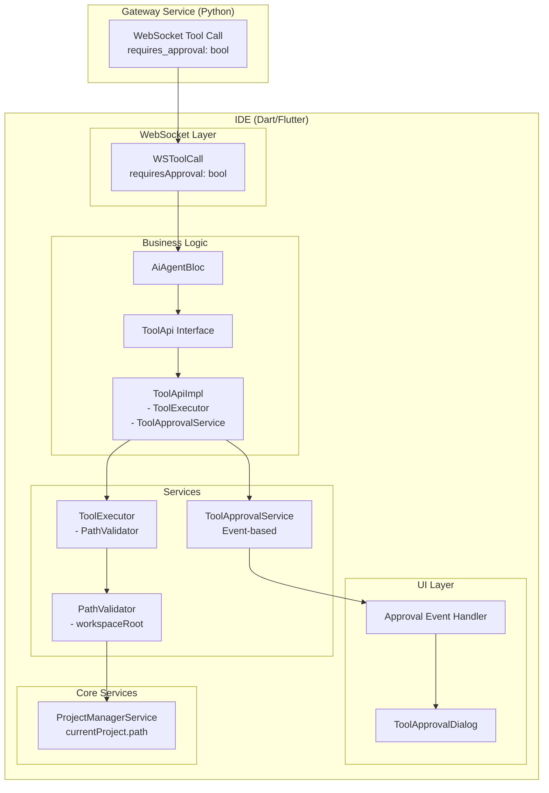
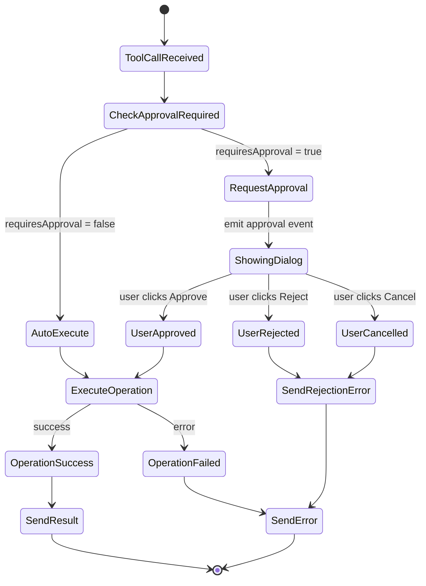

# Архитектурное решение интеграции ToolExecutor с WebSocket handler

## Executive Summary

Текущая реализация имеет [`ToolApiImpl`](codelab_ide/packages/codelab_ai_assistant/lib/src/integration/tool_api.dart:11-19) как заглушку, которая не вызывает реальный [`ToolExecutor`](codelab_ide/packages/codelab_ai_assistant/lib/src/services/tool_executor.dart). Необходимо интегрировать ToolExecutor с WebSocket протоколом, обеспечив совместимость с Gateway, поддержку HITL операций и type-safety.

### Ключевые проблемы
1. **Несоответствие моделей данных** - `requires_approval` (Python) vs `requiresConfirmation` (Dart) vs отсутствие поля в WS модели
2. **Отсутствие callId в ToolApi** - интерфейс не передает идентификатор вызова
3. **Проблема BuildContext** - BLoC не имеет доступа к контексту для показа диалогов
4. **Отсутствие DI настройки** - ToolExecutor требует PathValidator с workspace root
5. **Обработка ошибок** - необходимо маппинг ToolExecutionException в WebSocket формат

## Архитектурные решения

### 1. Обновление моделей данных

**Проблема**: Несоответствие полей между Python Gateway (`requires_approval`) и Dart моделями.

**Решение**: Стандартизировать на `requiresApproval` в Dart моделях для совместимости с Python.

```dart
// Обновленная модель WSToolCall
@Freezed(unionKey: 'type', unionValueCase: FreezedUnionCase.snake)
sealed class WSMessage with _$WSMessage {
  // ... существующие поля
  const factory WSMessage.toolCall({
    required String callId,
    required String toolName,
    required Map<String, dynamic> arguments,
    @Default(false) bool requiresApproval,  // новое поле
  }) = WSToolCall;
}
```

**Маппинг полей**:
- `requires_approval` (Python) ↔ `requiresApproval` (Dart)
- Обеспечить backward compatibility с `requires_confirmation` через JsonKey fallback

### 2. Рефакторинг ToolApi

**Проблема**: Интерфейс ToolApi не передает callId, что необходимо для результатов.

**Решение**: Расширить интерфейс для передачи callId и поддержки HITL операций.

```dart
abstract class ToolApi {
  Future<FileOperationResult> call({
    required String callId,
    required String toolName,
    required Map<String, dynamic> arguments,
    required bool requiresApproval,
  });
}
```

Новая реализация `ToolApiImpl` будет:
- Конвертировать ToolCall из arguments в ToolCall объект
- Вызывать ToolExecutor для выполнения
- Обрабатывать HITL через callback/dialog механизм
- Возвращать FileOperationResult вместо Map

### 3. Решение проблемы с BuildContext

**Рекомендация**: Event-based подход с GlobalKey<NavigatorState>

**Обоснование**:
- **GlobalKey**: Простой, но нарушает separation of concerns
- **Event-based**: Лучший баланс - BLoC эмитирует событие, UI слой обрабатывает показ диалога
- **Callback через DI**: Переусложняет DI граф

**Реализация**:
```dart
// В DI модуле
bind<ToolApprovalService>().toProvide(() => ToolApprovalServiceImpl()).singleton();

// ToolApprovalService
abstract class ToolApprovalService {
  Future<ToolApprovalResult> requestApproval(ToolCall call);
}

// Реализация через event bus или stream
class ToolApprovalServiceImpl implements ToolApprovalService {
  final _approvalController = StreamController<ToolApprovalRequest>.broadcast();

  Stream<ToolApprovalRequest> get approvalRequests => _approvalController.stream;

  Future<ToolApprovalResult> requestApproval(ToolCall call) async {
    final completer = Completer<ToolApprovalResult>();
    _approvalController.add(ToolApprovalRequest(call, completer));
    return completer.future;
  }
}
```

### 4. Настройка DI

**Граф зависимостей**:
```
ProjectManagerService -> workspaceRoot
  ↓
PathValidator(workspaceRoot)
  ↓
ToolExecutor(PathValidator)
  ↓
ToolApiImpl(ToolExecutor, ToolApprovalService)
```

**Реализация в AiAssistantModule**:
```dart
@override
void builder(Scope currentScope) {
  // Получить ProjectManagerService из engine модуля
  final projectManager = currentScope.resolve<ProjectManagerService>();

  bind<PathValidator>().toProvide(() {
    final project = projectManager.currentProject;
    if (project == null) throw StateError('No active project');
    return PathValidator(workspaceRoot: project.path);
  }).singleton();

  bind<ToolExecutor>().toProvide(() =>
    ToolExecutor(pathValidator: currentScope.resolve<PathValidator>())
  ).singleton();

  bind<ToolApprovalService>().toProvide(() => ToolApprovalServiceImpl()).singleton();

  bind<ToolApi>().toProvide(() =>
    ToolApiImpl(
      toolExecutor: currentScope.resolve<ToolExecutor>(),
      approvalService: currentScope.resolve<ToolApprovalService>(),
    )
  ).singleton();
}
```

### 5. Обработка ошибок

**Маппинг исключений**:
```dart
class WebSocketErrorMapper {
  static String mapToolExecutionException(ToolExecutionException e) {
    return switch (e.code) {
      'file_not_found' => 'File not found: ${e.message}',
      'permission_denied' => 'Access denied: ${e.message}',
      'invalid_path' => 'Invalid path: ${e.message}',
      'file_too_large' => 'File too large: ${e.message}',
      'user_rejected' => 'Operation rejected by user',
      _ => 'Tool execution failed: ${e.message}',
    };
  }
}
```

**Стратегия обработки**:
- **Validation errors**: Возвращать error сразу
- **IO errors**: Логгировать и возвращать error
- **User rejection**: Специальный код для HITL отклонения
- **Unexpected errors**: Обобщенное сообщение с логированием stack trace

## Диаграммы

### Sequence Diagram



### Component Diagram



### State Diagram для HITL операций



## API спецификации

### Обновленный ToolApi интерфейс
```dart
abstract class ToolApi {
  Future<FileOperationResult> call({
    required String callId,
    required String toolName,
    required Map<String, dynamic> arguments,
    required bool requiresApproval,
  });
}
```

### ToolApprovalService интерфейс
```dart
abstract class ToolApprovalService {
  Future<ToolApprovalResult> requestApproval(ToolCall call);
}

enum ToolApprovalResult {
  approved,
  rejected,
  cancelled,
}
```

### Обновленный AiAgentBloc обработчик
```dart
Future<void> _onMessageReceived(MessageReceived event, Emitter<AiAgentState> emit) async {
  await event.message.maybeWhen(
    toolCall: (callId, toolName, arguments, requiresApproval) async {
      try {
        final result = await toolApi.call(
          callId: callId,
          toolName: toolName,
          arguments: arguments,
          requiresApproval: requiresApproval,
        );
        protocol.sendToolResult(callId: callId, result: result.toJson());
      } on ToolExecutionException catch (e) {
        protocol.sendToolResult(callId: callId, error: WebSocketErrorMapper.mapToolExecutionException(e));
      } catch (e) {
        protocol.sendToolResult(callId: callId, error: 'Unexpected error: $e');
      }
    },
    orElse: () {},
  );
}
```

## План реализации

### Этап 1: Обновление моделей данных
1. Добавить поле `requiresApproval` в `WSToolCall`
2. Обновить `ToolCall` на `requiresApproval` (breaking change в API)
3. Создать миграцию для backward compatibility

### Этап 2: Рефакторинг ToolApi
1. Изменить интерфейс `ToolApi`
2. Создать новую реализацию `ToolApiImpl` с ToolExecutor
3. Обновить AiAgentBloc для использования нового интерфейса

### Этап 3: Реализация HITL механизма
1. Создать `ToolApprovalService` и его реализацию
2. Интегрировать event-based механизм в UI слой
3. Обновить `ToolApiImpl` для использования approval service

### Этап 4: Настройка DI
1. Обновить `AiAssistantModule` для injection зависимостей
2. Добавить cross-module dependency на ProjectManagerService
3. Проверить корректность графа зависимостей

### Этап 5: Обработка ошибок и тестирование
1. Реализовать `WebSocketErrorMapper`
2. Написать unit tests для всех компонентов
3. Интеграционное тестирование полного flow

### Этап 6: Миграция и деплой
1. Обновить mock реализации для тестов
2. Провести регрессионное тестирование
3. Деплой с feature flag для постепенного rollout

## Риски и митигации

### Риск: Breaking changes в API
**Митигация**: Feature flag для постепенной миграции, backward compatibility в моделях

### Риск: Потеря BuildContext в BLoC архитектуре
**Митигация**: Event-based подход вместо прямого доступа к context, тестирование UI integration

### Риск: Производительность при больших файлах
**Митигация**: Ограничения размера файлов в ToolExecutor, асинхронная обработка с прогрессом

### Риск: Race conditions в HITL операциях
**Митигация**: Immutable state management, proper error handling для отмененных операций

### Риск: Security vulnerabilities в path validation
**Митигация**: Комплексное тестирование PathValidator, audit безопасности

## Критерии приемки

### Функциональные
- ✅ Tool calls обрабатываются через ToolExecutor
- ✅ HITL диалоги показываются для операций с requiresApproval=true
- ✅ Результаты корректно возвращаются в Gateway
- ✅ Ошибки правильно маппируются в WebSocket формат

### Нефункциональные
- ✅ Type-safety на всех уровнях
- ✅ Производительность не деградирует >10%
- ✅ Memory leaks отсутствуют
- ✅ Backward compatibility с существующими клиентами

### Тестирование
- ✅ Unit coverage >90% для новых компонентов
- ✅ Integration tests для полного flow
- ✅ Security tests для path validation
- ✅ UI tests для HITL диалогов