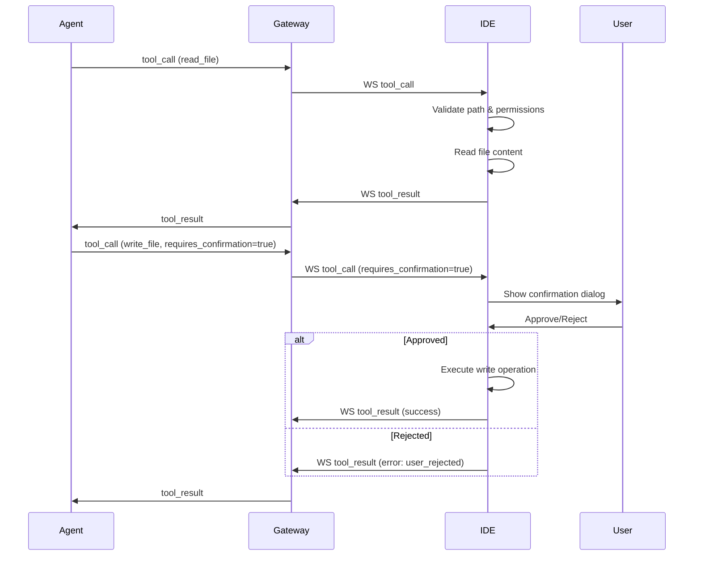

# Руководство по интеграции и тестированию системы toolings

## 1. Обзор реализованных компонентов

### Архитектура системы

Система toolings включает два основных инструмента: `read_file` и `write_file`, интегрированных в существующую инфраструктуру agent-runtime и gateway. Tool execution происходит на стороне IDE с использованием WebSocket для коммуникации между Gateway и IDE.

### Реализованные компоненты

#### Agent Runtime (`codelab-ai-service/agent-runtime/`)
- **Модели данных** (`app/models/schemas.py`):
  - `WSToolCall` - для отправки tool calls через WebSocket
  - `ReadFileArgs`, `WriteFileArgs` - аргументы инструментов
  - `ToolArguments` - унифицированная модель аргументов
  - `ToolCall`, `ToolResult` - модели для обработки вызовов

- **Сервисы** (`app/services/`):
  - `tool_registry.py` - реестр инструментов с спецификациями для LLM
  - `tool_call_handler.py` - обработчик вызовов инструментов через Gateway

#### Gateway (`codelab-ai-service/gateway/`)
- **Модели данных** (`app/models/websocket.py`):
  - `WSToolCall` - WebSocket сообщение для tool calls
  - `WSToolResult` - WebSocket сообщение для результатов

- **Сервисы** (`app/services/`):
  - `tool_result_manager.py` - менеджер результатов инструментов
  - `stream_service.py` - потоковая обработка сообщений

#### IDE (`codelab_ide/packages/`)

##### codelab_ai_assistant (`packages/codelab_ai_assistant/`)
- **Модели данных** (`lib/src/models/tool_models.dart`):
  - `ToolCall` - входящие tool calls от Gateway
  - `ToolResult` - результаты выполнения для отправки обратно
  - `FileOperationResult` - результат файловых операций
  - `ReadFileArgs`, `WriteFileArgs` - аргументы инструментов
  - `ToolExecutionException` - исключения выполнения

- **Сервисы** (`lib/src/services/tool_executor.dart`):
  - `ToolExecutor` - сервис выполнения tool calls
  - Поддержка read_file и write_file операций
  - Валидация путей и безопасности

##### codelab_core (`packages/codelab_core/`)
- **Утилиты** (`lib/src/utils/path_validator.dart`):
  - `PathValidator` - валидатор безопасности путей
  - Проверка на path traversal, системные директории, символьные ссылки

##### codelab_uikit (`packages/codelab_uikit/`)
- **Диалоги** (`lib/widgets/dialogs/tool_approval_dialog.dart`):
  - `ToolApprovalDialog` - диалог подтверждения write операций
  - Показ превью контента и деталей файла

### Диаграмма взаимодействия



## 2. Руководство по интеграции

### Интеграция ToolExecutor с WebSocket handler в IDE

#### Настройка зависимостей в pubspec.yaml

```yaml
dependencies:
  codelab_core:
    path: ../codelab_core
  codelab_ai_assistant:
    path: ../codelab_ai_assistant
  codelab_uikit:
    path: ../codelab_uikit
```

#### Инициализация сервисов

```dart
// В DI модуле или основном приложении
final pathValidator = PathValidator(workspaceRoot: '/path/to/workspace');
final toolExecutor = ToolExecutor(pathValidator: pathValidator);

// Интеграция с WebSocket handler
class WebSocketToolHandler {
  final ToolExecutor _toolExecutor;
  final WebSocketChannel _channel;

  WebSocketToolHandler(this._toolExecutor, this._channel) {
    _channel.stream.listen(_handleMessage);
  }

  void _handleMessage(dynamic message) async {
    final data = jsonDecode(message);
    if (data['type'] == 'tool_call') {
      await _handleToolCall(ToolCall.fromJson(data));
    }
  }
}
```

### Обработка tool_call сообщений

```dart
Future<void> _handleToolCall(ToolCall toolCall) async {
  try {
    FileOperationResult result;

    if (toolCall.requiresConfirmation && toolCall.toolName == 'write_file') {
      // Показать диалог подтверждения
      final approval = await _showApprovalDialog(toolCall);
      if (approval != ToolApprovalResult.approved) {
        result = FileOperationResult.failure(
          error: 'user_rejected',
        );
      } else {
        result = await _toolExecutor.executeToolCall(toolCall);
      }
    } else {
      result = await _toolExecutor.executeToolCall(toolCall);
    }

    // Отправить результат обратно
    final toolResult = ToolResult.success(
      callId: toolCall.callId,
      result: result,
    );
    _sendToolResult(toolResult);

  } on ToolExecutionException catch (e) {
    final toolResult = ToolResult.error(
      callId: toolCall.callId,
      error: e.code,
    );
    _sendToolResult(toolResult);
  }
}

Future<ToolApprovalResult> _showApprovalDialog(ToolCall toolCall) async {
  final args = WriteFileArgs.fromJson(toolCall.arguments);
  final fileExists = await File(args.path).exists();

  return await ToolApprovalDialog.show(
    context: context,
    filePath: args.path,
    content: args.content,
    fileExists: fileExists,
    willCreateBackup: args.backup,
  );
}

void _sendToolResult(ToolResult result) {
  final message = {
    'type': 'tool_result',
    'call_id': result.callId,
    'result': result.result?.toJson(),
    'error': result.error,
  };
  _channel.sink.add(jsonEncode(message));
}
```

### Пример полной интеграции в WebSocket handler

```dart
class AiAssistantWebSocketHandler extends WebSocketHandler {
  late final ToolExecutor _toolExecutor;
  late final PathValidator _pathValidator;

  @override
  Future<void> onConnect(WebSocketChannel channel, String sessionId) async {
    // Инициализация сервисов
    _pathValidator = PathValidator(workspaceRoot: getWorkspaceRoot());
    _toolExecutor = ToolExecutor(pathValidator: _pathValidator);

    // Настройка обработчика сообщений
    channel.stream.listen((message) => _handleMessage(channel, message));
  }

  Future<void> _handleMessage(WebSocketChannel channel, dynamic message) async {
    final data = jsonDecode(message);

    switch (data['type']) {
      case 'tool_call':
        await _handleToolCall(channel, ToolCall.fromJson(data));
        break;
      // Другие типы сообщений...
    }
  }

  Future<void> _handleToolCall(WebSocketChannel channel, ToolCall toolCall) async {
    try {
      // Обработка с HITL для write_file
      if (toolCall.requiresConfirmation) {
        final approved = await _requestUserApproval(toolCall);
        if (!approved) {
          _sendError(channel, toolCall.callId, 'user_rejected');
          return;
        }
      }

      // Выполнение инструмента
      final result = await _toolExecutor.executeToolCall(toolCall);

      // Отправка результата
      _sendResult(channel, toolCall.callId, result);

    } catch (e) {
      _sendError(channel, toolCall.callId, e.toString());
    }
  }

  Future<bool> _requestUserApproval(ToolCall toolCall) async {
    // Показ диалога и ожидание ответа пользователя
    // Реализация зависит от UI фреймворка
    return await showToolApprovalDialog(toolCall);
  }

  void _sendResult(WebSocketChannel channel, String callId, FileOperationResult result) {
    final message = {
      'type': 'tool_result',
      'call_id': callId,
      'result': result.toJson(),
    };
    channel.sink.add(jsonEncode(message));
  }

  void _sendError(WebSocketChannel channel, String callId, String error) {
    final message = {
      'type': 'tool_result',
      'call_id': callId,
      'error': error,
    };
    channel.sink.add(jsonEncode(message));
  }
}
```

## 3. Примеры использования

### Пример полного flow для read_file

```dart
// 1. Получение tool_call от Gateway через WebSocket
final toolCall = ToolCall(
  callId: 'call_123',
  toolName: 'read_file',
  arguments: {
    'path': 'src/main.dart',
    'start_line': 10,
    'end_line': 20,
  },
  requiresConfirmation: false,
);

// 2. Выполнение через ToolExecutor
final result = await toolExecutor.executeToolCall(toolCall);

// 3. Результат
FileOperationResult(
  success: true,
  content: 'lines 10-20 of main.dart',
  linesRead: 11,
);

// 4. Отправка обратно через WebSocket
final toolResult = ToolResult.success(
  callId: 'call_123',
  result: result,
);
// Отправка в Gateway
```

### Пример полного flow для write_file с HITL

```dart
// 1. Получение tool_call с requires_confirmation=true
final toolCall = ToolCall(
  callId: 'call_456',
  toolName: 'write_file',
  arguments: {
    'path': 'lib/new_file.dart',
    'content': 'void main() {\n  print("Hello");\n}',
    'create_dirs': true,
    'backup': true,
  },
  requiresConfirmation: true,
);

// 2. Показ диалога подтверждения
final approved = await ToolApprovalDialog.show(
  context: context,
  filePath: 'lib/new_file.dart',
  content: 'void main() {\n  print("Hello");\n}',
  fileExists: false,
  willCreateBackup: true,
);

if (approved == ToolApprovalResult.approved) {
  // 3. Выполнение операции
  final result = await toolExecutor.executeToolCall(toolCall);

  // 4. Отправка результата
  final toolResult = ToolResult.success(
    callId: 'call_456',
    result: result,
  );
} else {
  // Пользователь отклонил
  final toolResult = ToolResult.error(
    callId: 'call_456',
    error: 'user_rejected',
  );
}
```

### Обработка ошибок

```dart
// Пример обработки различных ошибок
try {
  final result = await toolExecutor.executeToolCall(toolCall);

  if (result.success) {
    // Успешное выполнение
    _sendResult(channel, toolCall.callId, result);
  } else {
    // Ошибка выполнения
    _sendError(channel, toolCall.callId, result.error!);
  }

} on ToolExecutionException catch (e) {
  switch (e.code) {
    case 'file_not_found':
      // Файл не существует
      _sendError(channel, toolCall.callId, 'File not found: ${e.details?['path']}');
      break;
    case 'permission_denied':
      // Нет прав доступа
      _sendError(channel, toolCall.callId, 'Permission denied');
      break;
    case 'invalid_path':
      // Небезопасный путь
      _sendError(channel, toolCall.callId, 'Invalid path: ${e.message}');
      break;
    case 'file_too_large':
      // Файл слишком большой
      _sendError(channel, toolCall.callId, 'File too large');
      break;
    case 'user_rejected':
      // Пользователь отклонил операцию
      _sendError(channel, toolCall.callId, 'Operation rejected by user');
      break;
    default:
      // Общая ошибка
      _sendError(channel, toolCall.callId, 'Tool execution failed: ${e.message}');
  }
}
```

## 4. План тестирования

### Unit тесты для каждого компонента

#### Тесты PathValidator (`codelab_core/test/`)
```dart
void main() {
  group('PathValidator', () {
    late PathValidator validator;

    setUp(() {
      validator = PathValidator(workspaceRoot: '/tmp/workspace');
    });

    test('validates safe relative paths', () {
      final result = validator.isPathSafe('src/main.dart');
      expect(result.isValid, true);
    });

    test('rejects absolute paths', () {
      final result = validator.isPathSafe('/etc/passwd');
      expect(result.isValid, false);
      expect(result.error, contains('Absolute paths are not allowed'));
    });

    test('rejects path traversal', () {
      final result = validator.isPathSafe('../../../etc/passwd');
      expect(result.isValid, false);
      expect(result.error, contains('Path traversal'));
    });

    test('rejects system directories', () {
      final result = validator.isPathSafe('/System/Library/Keychains');
      expect(result.isValid, false);
    });
  });
}
```

#### Тесты ToolExecutor (`codelab_ai_assistant/test/`)
```dart
void main() {
  group('ToolExecutor', () {
    late ToolExecutor executor;
    late PathValidator pathValidator;

    setUp(() {
      pathValidator = PathValidator(workspaceRoot: Directory.systemTemp.path);
      executor = ToolExecutor(pathValidator: pathValidator);
    });

    test('executes read_file successfully', () async {
      // Создать тестовый файл
      final testFile = File('${Directory.systemTemp.path}/test.txt');
      await testFile.writeAsString('Hello, World!');

      final toolCall = ToolCall(
        callId: 'test_123',
        toolName: 'read_file',
        arguments: {'path': 'test.txt'},
      );

      final result = await executor.executeToolCall(toolCall);
      expect(result.success, true);
      expect(result.content, 'Hello, World!');
    });

    test('handles file not found', () async {
      final toolCall = ToolCall(
        callId: 'test_456',
        toolName: 'read_file',
        arguments: {'path': 'nonexistent.txt'},
      );

      expect(
        () => executor.executeToolCall(toolCall),
        throwsA(isA<ToolExecutionException>().having(
          (e) => e.code,
          'code',
          'file_not_found',
        )),
      );
    });

    test('validates file size limits', () async {
      // Создать файл больше максимального размера
      final largeFile = File('${Directory.systemTemp.path}/large.txt');
      final largeContent = 'x' * (10 * 1024 * 1024 + 1); // > 10MB
      await largeFile.writeAsString(largeContent);

      final toolCall = ToolCall(
        callId: 'test_789',
        toolName: 'read_file',
        arguments: {'path': 'large.txt'},
      );

      expect(
        () => executor.executeToolCall(toolCall),
        throwsA(isA<ToolExecutionException>().having(
          (e) => e.code,
          'code',
          'file_too_large',
        )),
      );
    });
  });
}
```

#### Тесты ToolApprovalDialog (`codelab_uikit/test/`)
```dart
void main() {
  testWidgets('shows approval dialog correctly', (tester) async {
    await tester.pumpWidget(
      MaterialApp(
        home: Scaffold(
          body: Builder(
            builder: (context) => ElevatedButton(
              onPressed: () async {
                final result = await ToolApprovalDialog.show(
                  context: context,
                  filePath: 'test.txt',
                  content: 'Hello',
                  fileExists: true,
                  willCreateBackup: true,
                );
                // Проверка результата
              },
              child: Text('Show Dialog'),
            ),
          ),
        ),
      ),
    );

    // Нажать кнопку
    await tester.tap(find.text('Show Dialog'));
    await tester.pumpAndSettle();

    // Проверить отображение диалога
    expect(find.text('Confirm File Modification'), findsOneWidget);
    expect(find.text('test.txt'), findsOneWidget);
    expect(find.text('Hello'), findsOneWidget);
  });
}
```

### Integration тесты для end-to-end flow

#### WebSocket Integration Test
```dart
void main() {
  IntegrationTestWidgetsFlutterBinding.ensureInitialized();

  group('WebSocket Tool Integration', () {
    late MockWebSocketServer server;
    late WebSocketChannel channel;

    setUp(() async {
      server = MockWebSocketServer();
      await server.start();
      channel = IOWebSocketChannel.connect('ws://localhost:8080');
    });

    tearDown(() async {
      await channel.sink.close();
      await server.stop();
    });

    testWidgets('complete read_file flow', (tester) async {
      // Настройка тестового файла
      final testFile = File('${Directory.systemTemp.path}/integration_test.txt');
      await testFile.writeAsString('Integration test content');

      // Подключение к WebSocket
      final handler = AiAssistantWebSocketHandler(channel);

      // Отправка tool_call
      final toolCall = {
        'type': 'tool_call',
        'call_id': 'integration_123',
        'tool_name': 'read_file',
        'arguments': {'path': 'integration_test.txt'},
        'requires_confirmation': false,
      };

      channel.sink.add(jsonEncode(toolCall));

      // Ожидание результата
      final result = await channel.stream.firstWhere(
        (message) {
          final data = jsonDecode(message);
          return data['type'] == 'tool_result' && data['call_id'] == 'integration_123';
        },
      );

      final resultData = jsonDecode(result);
      expect(resultData['result']['success'], true);
      expect(resultData['result']['content'], 'Integration test content');
    });

    testWidgets('write_file with user approval', (tester) async {
      await tester.pumpWidget(
        MaterialApp(
          home: Scaffold(
            body: WebSocketToolWidget(channel: channel),
          ),
        ),
      );

      // Отправка tool_call для write_file
      final toolCall = {
        'type': 'tool_call',
        'call_id': 'write_integration_123',
        'tool_name': 'write_file',
        'arguments': {
          'path': 'new_file.txt',
          'content': 'New file content',
        },
        'requires_confirmation': true,
      };

      channel.sink.add(jsonEncode(toolCall));
      await tester.pumpAndSettle();

      // Проверить появление диалога
      expect(find.text('Confirm File Creation'), findsOneWidget);

      // Нажать Approve
      await tester.tap(find.text('Approve'));
      await tester.pumpAndSettle();

      // Проверить результат
      final result = await channel.stream.first;
      final resultData = jsonDecode(result);
      expect(resultData['type'], 'tool_result');
      expect(resultData['result']['success'], true);
    });
  });
}
```

### Тестовые сценарии для edge cases

1. **Файловые операции с edge cases:**
   - Пустые файлы
   - Файлы с различными кодировками (UTF-8, UTF-16, Latin-1)
   - Бинарные файлы (изображения, исполняемые файлы)
   - Файлы с очень длинными строками
   - Файлы с null байтами

2. **Проблемы с путями:**
   - Пути с пробелами и специальными символами
   - Пути с unicode символами
   - Символьные ссылки (на Linux/macOS)
   - Junction points (на Windows)
   - Пути с длиной > 4096 символов

3. **Конкурентный доступ:**
   - Одновременное чтение одного файла
   - Чтение файла во время его записи
   - Запись в файл во время чтения
   - Множественные операции записи в один файл

4. **Сетевые проблемы:**
   - Разрыв WebSocket соединения во время операции
   - Таймауты операций
   - Повторные отправки сообщений
   - Порядок доставки сообщений

5. **UI/UX edge cases:**
   - Диалог подтверждения для очень больших файлов
   - Диалог с очень длинными путями
   - Множественные одновременные диалоги
   - Закрытие диалога без выбора

### Чек-лист для ручного тестирования

#### Функциональное тестирование
- [ ] Чтение текстовых файлов различных размеров
- [ ] Запись в новые файлы
- [ ] Перезапись существующих файлов
- [ ] Создание директорий при записи (create_dirs=true)
- [ ] Создание резервных копий (backup=true)
- [ ] Частичное чтение файлов (start_line/end_line)
- [ ] Подтверждение операций write_file

#### Безопасность
- [ ] Попытка доступа к системным файлам (/etc/passwd, /System/Library)
- [ ] Path traversal атаки (../../../etc/passwd)
- [ ] Абсолютные пути
- [ ] Символьные ссылки вне workspace
- [ ] Файлы с null байтами в пути

#### Обработка ошибок
- [ ] Чтение несуществующего файла
- [ ] Запись в директорию без прав
- [ ] Превышение лимитов размера файла
- [ ] Ошибки кодировки
- [ ] Сетевые проблемы (разрыв соединения)

#### Производительность
- [ ] Чтение больших файлов (5MB+)
- [ ] Множественные одновременные операции
- [ ] Длительные операции с таймаутами
- [ ] Память и CPU использование

## 5. Следующие шаги

### Что нужно сделать для полной интеграции

1. **Завершение WebSocket интеграции:**
   - Интеграция `AiAssistantWebSocketHandler` в основной WebSocket код IDE
   - Настройка маршрутизации сообщений tool_call/tool_result
   - Обработка ошибок соединения и переподключения

2. **UI интеграция:**
   - Интеграция `ToolApprovalDialog` в основной UI поток
   - Обработка асинхронных диалогов в состоянии приложения
   - Показ уведомлений о результатах операций

3. **Конфигурация и развертывание:**
   - Настройка workspace root в IDE
   - Конфигурация лимитов (размеры файлов, таймауты)
   - Логирование операций для аудита

4. **Тестирование в production:**
   - End-to-end тестирование с реальными файлами
   - Тестирование с различными ОС (macOS, Windows, Linux)
   - Нагрузочное тестирование

### Рекомендации по улучшению

1. **Производительность:**
   - Кэширование часто читаемых файлов
   - Потоковое чтение для очень больших файлов
   - Оптимизация UI для больших превью

2. **Безопасность:**
   - Дополнительные проверки на типы файлов
   - Rate limiting для защиты от DoS
   - Аудит логов с алертами

3. **UX:**
   - Более информативные диалоги подтверждения
   - Прогресс бары для длительных операций
   - История операций с возможностью отмены

4. **Надежность:**
   - Retry логика для сетевых ошибок
   - Graceful degradation при проблемах
   - Backup и recovery механизмы

### Потенциальные проблемы и их решения

1. **Проблема:** Конфликты одновременного доступа к файлам
   - **Решение:** File locking на уровне ОС, optimistic locking с версиями

2. **Проблема:** Большие файлы замедляют UI
   - **Решение:** Ограничение превью, потоковая загрузка, виртуализация

3. **Проблема:** Разные поведение на разных ОС
   - **Решение:** Абстракция над файловой системой, кросс-платформенные тесты

4. **Проблема:** Сложность отладки распределенной системы
   - **Решение:** Структурированное логирование, correlation IDs, distributed tracing

5. **Проблема:** Пользователь может случайно одобрить опасные операции
   - **Решение:** Дополнительные предупреждения для системных файлов, syntax highlighting в превью