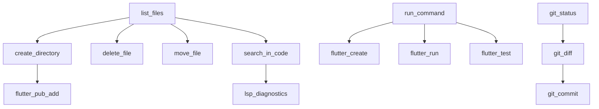

# План реализации инструментов для AI агента в Flutter разработке

## Обзор

На основе анализа существующих инструментов и требований Flutter разработки, данный документ содержит детальный план реализации критически важных (P0) инструментов для эффективной работы AI агента.

### Контекст проекта

- **Backend**: Python (agent-runtime, gateway) - спецификации инструментов и маршрутизация
- **Frontend**: Dart/Flutter (codelab_ide) - реализация инструментов
- **Архитектура**: Все инструменты выполняются на стороне IDE (клиент)
- **Существующие инструменты**: read_file, write_file с HITL
- **Инфраструктура**: PathValidator, FileService, ProjectManagerService, LSP

---

## 1. Roadmap реализации

### Этап 1: Критические инструменты (P0) - 2 недели

**Итерация 1.1: Базовые файловые операции (3 дня)**
- `list_files` - просмотр структуры директорий
- `create_directory` - создание папок

**Итерация 1.2: Управление файлами (3 дня)**
- `delete_file` - удаление файлов/директорий
- `move_file` - перемещение/переименование

**Итерация 1.3: Выполнение команд (3 дня)**
- `run_command` - выполнение команд ОС/Flutter CLI

**Итерация 1.4: Поиск по коду (3 дня)**
- `search_in_code` - grep поиск по файлам

### Этап 2: Приоритетные инструменты (P1) - 3 недели

**Итерация 2.1: LSP интеграция (1 неделя)**
- Расширение LSP клиента для diagnostics, completions, hover
- Интеграция результатов в UI

**Итерация 2.2: Git операции (1 неделя)**
- `git_status`, `git_diff`, `git_commit`

**Итерация 2.3: Code formatting (3 дня)**
- `dart_format`, `flutter_analyze`

### Этап 3: Flutter-специфичные возможности (1 неделя)

**Итерация 3.1: Управление зависимостями**
- `flutter_pub_add`, `flutter_pub_get`

**Итерация 3.2: Hot reload и debugging**
- Интеграция с dev server

### Зависимости между инструментами



### Оценка сложности

- **Низкая**: list_files, create_directory, delete_file (использование Directory/File API)
- **Средняя**: run_command (обработка Process, timeout), search_in_code (grep)
- **Высокая**: LSP интеграция (расширение протокола), Flutter CLI интеграция

---

## 2. Технические спецификации P0 инструментов

### 2.1. run_command

#### Backend (Python) - спецификация

**TOOLS_SPEC:**
```json
{
  "type": "function",
  "function": {
    "name": "run_command",
    "description": "Execute shell command in workspace directory",
    "parameters": {
      "type": "object",
      "properties": {
        "command": {
          "type": "string",
          "description": "Command to execute"
        },
        "cwd": {
          "type": "string",
          "description": "Working directory relative to workspace"
        },
        "timeout": {
          "type": "integer",
          "description": "Command timeout in seconds",
          "default": 30,
          "minimum": 1,
          "maximum": 300
        },
        "shell": {
          "type": "boolean",
          "description": "Execute command in shell",
          "default": false
        }
      },
      "required": ["command"]
    }
  }
}
```

#### Frontend (Dart) - реализация

**Модели данных:**
```dart
@JsonSerializable()
class RunCommandArgs {
  final String command;
  final String? cwd;
  final int? timeout;
  final bool? shell;

  RunCommandArgs({
    required this.command,
    this.cwd,
    this.timeout,
    this.shell,
  });

  factory RunCommandArgs.fromJson(Map<String, dynamic> json) =>
      _$RunCommandArgsFromJson(json);
}

@JsonSerializable()
class CommandResult {
  final String stdout;
  final String stderr;
  final int returnCode;
  final bool timedOut;

  CommandResult({
    required this.stdout,
    required this.stderr,
    required this.returnCode,
    required this.timedOut,
  });

  factory CommandResult.fromJson(Map<String, dynamic> json) =>
      _$CommandResultFromJson(json);
}
```

**Реализация в ToolExecutor:**
```dart
Future<FileOperationResult> _runCommand(Map<String, dynamic> arguments) async {
  try {
    final args = RunCommandArgs.fromJson(arguments);

    // Валидация пути
    final pathValidator = _getPathValidator();
    final fullCwd = args.cwd != null
        ? pathValidator.validateAndGetFullPath(args.cwd!)
        : pathValidator.workspaceRoot;

    // Проверка безопасности команды
    if (_isDangerousCommand(args.command)) {
      throw ToolExecutionException(
        code: 'dangerous_command',
        message: 'Command contains potentially dangerous operations',
      );
    }

    // Выполнение команды
    final process = await Process.start(
      args.shell == true ? '/bin/bash' : '/bin/sh',
      args.shell == true ? ['-c', args.command] : args.command.split(' '),
      workingDirectory: fullCwd,
      runInShell: args.shell ?? false,
    );

    // Таймаут
    final timeout = args.timeout ?? 30;
    final completer = Completer<ProcessResult>();

    // Ждем завершения с таймаутом
    final timer = Timer(Duration(seconds: timeout), () {
      process.kill();
      completer.completeError(TimeoutException('Command timed out'));
    });

    // Читаем вывод
    final stdout = StringBuffer();
    final stderr = StringBuffer();

    process.stdout.transform(utf8.decoder).listen((data) {
      stdout.write(data);
    });

    process.stderr.transform(utf8.decoder).listen((data) {
      stderr.write(data);
    });

    final exitCode = await process.exitCode;
    timer.cancel();

    return FileOperationResult.success(
      result: CommandResult(
        stdout: stdout.toString(),
        stderr: stderr.toString(),
        returnCode: exitCode,
        timedOut: false,
      ),
    );
  } on TimeoutException {
    return FileOperationResult.success(
      result: CommandResult(
        stdout: '',
        stderr: 'Command timed out',
        returnCode: -1,
        timedOut: true,
      ),
    );
  } catch (e) {
    throw ToolExecutionException.general(
      'Failed to execute command: $e',
    );
  }
}

bool _isDangerousCommand(String command) {
  final dangerous = ['rm -rf /', 'sudo', 'su', 'chmod 777', 'mkfs'];
  return dangerous.any((pattern) => command.contains(pattern));
}
```

**Интеграция с сервисами:**
- PathValidator для валидации cwd
- Обработка исключений через ToolExecutionException
- Логирование через существующий механизм

#### Протокол

**Формат сообщений:**
```typescript
// Запрос
{
  "type": "tool_call",
  "call_id": "call_123",
  "tool_name": "run_command",
  "arguments": {
    "command": "flutter --version",
    "cwd": ".",
    "timeout": 10
  },
  "requires_approval": false
}

// Результат
{
  "type": "tool_result",
  "call_id": "call_123",
  "tool_name": "run_command",
  "result": {
    "stdout": "Flutter 3.16.0 • channel stable",
    "stderr": "",
    "returnCode": 0,
    "timedOut": false
  }
}
```

**HITL требования:** Команды с высоким риском требуют подтверждения пользователя.

---

### 2.2. list_files

#### Backend (Python) - спецификация

**TOOLS_SPEC:**
```json
{
  "type": "function",
  "function": {
    "name": "list_files",
    "description": "List files and directories in workspace",
    "parameters": {
      "type": "object",
      "properties": {
        "path": {
          "type": "string",
          "description": "Path to list relative to workspace",
          "default": "."
        },
        "recursive": {
          "type": "boolean",
          "description": "List recursively",
          "default": false
        },
        "pattern": {
          "type": "string",
          "description": "File pattern filter (glob)",
          "examples": ["*.dart", "**/*.yaml"]
        },
        "include_hidden": {
          "type": "boolean",
          "description": "Include hidden files",
          "default": false
        }
      }
    }
  }
}
```

#### Frontend (Dart) - реализация

**Модели данных:**
```dart
@JsonSerializable()
class ListFilesArgs {
  final String path;
  final bool recursive;
  final String? pattern;
  final bool includeHidden;

  ListFilesArgs({
    this.path = ".",
    this.recursive = false,
    this.pattern,
    this.includeHidden = false,
  });

  factory ListFilesArgs.fromJson(Map<String, dynamic> json) =>
      _$ListFilesArgsFromJson(json);
}

@JsonSerializable()
class FileItem {
  final String name;
  final String type; // 'file' | 'directory'
  final int size;

  FileItem({
    required this.name,
    required this.type,
    required this.size,
  });

  factory FileItem.fromJson(Map<String, dynamic> json) =>
      _$FileItemFromJson(json);
}

@JsonSerializable()
class ListFilesResult {
  final List<FileItem> items;

  ListFilesResult({required this.items});

  factory ListFilesResult.fromJson(Map<String, dynamic> json) =>
      _$ListFilesResultFromJson(json);
}
```

**Реализация в ToolExecutor:**
```dart
Future<FileOperationResult> _listFiles(Map<String, dynamic> arguments) async {
  try {
    final args = ListFilesArgs.fromJson(arguments);

    final pathValidator = _getPathValidator();
    final fullPath = pathValidator.validateAndGetFullPath(args.path);

    final dir = Directory(fullPath);
    if (!await dir.exists()) {
      throw ToolExecutionException.fileNotFound(args.path);
    }

    final items = <FileItem>[];

    if (args.recursive) {
      await for (final entity in dir.list(recursive: true)) {
        if (!args.includeHidden && p.basename(entity.path).startsWith('.')) {
          continue;
        }

        if (args.pattern != null && !matchesGlob(entity.path, args.pattern!)) {
          continue;
        }

        final stat = await entity.stat();
        items.add(FileItem(
          name: p.relative(entity.path, from: pathValidator.workspaceRoot),
          type: entity is Directory ? 'directory' : 'file',
          size: stat.size,
        ));
      }
    } else {
      await for (final entity in dir.list()) {
        final basename = p.basename(entity.path);
        if (!args.includeHidden && basename.startsWith('.')) {
          continue;
        }

        if (args.pattern != null && !matchesGlob(basename, args.pattern!)) {
          continue;
        }

        final stat = await entity.stat();
        items.add(FileItem(
          name: basename,
          type: entity is Directory ? 'directory' : 'file',
          size: stat.size,
        ));
      }
    }

    return FileOperationResult.success(
      result: ListFilesResult(items: items),
    );
  } catch (e) {
    throw ToolExecutionException.general('Failed to list files: $e');
  }
}

bool matchesGlob(String path, String pattern) {
  // Простая реализация glob matching
  // Для продакшена использовать пакет типа glob
  return path.contains(pattern.replaceAll('*', ''));
}
```

---

### 2.3. search_in_code (grep)

#### Backend (Python) - спецификация

**TOOLS_SPEC:**
```json
{
  "type": "function",
  "function": {
    "name": "search_in_code",
    "description": "Search for text patterns in code files",
    "parameters": {
      "type": "object",
      "properties": {
        "query": {
          "type": "string",
          "description": "Text to search for"
        },
        "path": {
          "type": "string",
          "description": "Directory to search in",
          "default": "."
        },
        "file_pattern": {
          "type": "string",
          "description": "File pattern filter (*.dart, *.py)",
          "examples": ["*.dart", "*.py"]
        },
        "case_sensitive": {
          "type": "boolean",
          "description": "Case sensitive search",
          "default": false
        },
        "max_results": {
          "type": "integer",
          "description": "Maximum results to return",
          "default": 100,
          "minimum": 1,
          "maximum": 1000
        }
      },
      "required": ["query"]
    }
  }
}
```

#### Frontend (Dart) - реализация

**Модели данных:**
```dart
class SearchResult {
  final String file;
  final int line;
  final int column;
  final String content;
  final String context; // несколько строк вокруг

  SearchResult({
    required this.file,
    required this.line,
    required this.column,
    required this.content,
    required this.context,
  });
}

class SearchInCodeResult {
  final List<SearchResult> results;
  final int totalMatches;

  SearchInCodeResult({
    required this.results,
    required this.totalMatches,
  });
}
```

**Реализация через Process.run:**
```dart
Future<FileOperationResult> _searchInCode(Map<String, dynamic> arguments) async {
  final query = arguments['query'] as String;
  final path = arguments['path'] as String? ?? '.';
  final filePattern = arguments['file_pattern'] as String?;
  final caseSensitive = arguments['case_sensitive'] as bool? ?? false;
  final maxResults = arguments['max_results'] as int? ?? 100;

  final pathValidator = _getPathValidator();
  final fullPath = pathValidator.validateAndGetFullPath(path);

  // Используем grep или ripgrep если доступен
  final grepCmd = await _findGrepCommand();
  final args = <String>[];

  if (grepCmd == 'grep') {
    args.addAll(['-rn', '--include=${filePattern ?? "*"}']);
    if (!caseSensitive) args.add('-i');
    args.add(query);
    args.add('.');
  } else if (grepCmd == 'rg') {
    args.addAll(['--line-number', '--column']);
    if (!caseSensitive) args.add('--ignore-case');
    if (filePattern != null) args.addAll(['--type', filePattern.split('.').last]);
    args.add(query);
    args.add('.');
  }

  final result = await Process.run(
    grepCmd,
    args,
    workingDirectory: fullPath,
    timeout: Duration(seconds: 30),
  );

  final lines = result.stdout.toString().split('\n');
  final searchResults = <SearchResult>[];

  for (final line in lines.take(maxResults)) {
    if (line.isEmpty) continue;

    // Парсинг вывода grep (file:line:content)
    final parts = line.split(':');
    if (parts.length >= 3) {
      final file = parts[0];
      final lineNum = int.tryParse(parts[1]) ?? 0;
      final content = parts.sublist(2).join(':');

      searchResults.add(SearchResult(
        file: file,
        line: lineNum,
        column: 0, // rg дает column, grep нет
        content: content,
        context: content,
      ));
    }
  }

  return FileOperationResult.success(
    result: SearchInCodeResult(
      results: searchResults,
      totalMatches: searchResults.length,
    ),
  );
}

Future<String> _findGrepCommand() async {
  // Проверяем ripgrep сначала (быстрее)
  try {
    await Process.run('rg', ['--version']);
    return 'rg';
  } catch (_) {}

  // Fallback to grep
  try {
    await Process.run('grep', ['--version']);
    return 'grep';
  } catch (_) {}

  throw ToolExecutionException(
    code: 'grep_not_found',
    message: 'No grep tool found (tried rg, grep)',
  );
}
```

---

### 2.4. create_directory

#### Backend (Python) - спецификация

**TOOLS_SPEC:**
```json
{
  "type": "function",
  "function": {
    "name": "create_directory",
    "description": "Create directory in workspace",
    "parameters": {
      "type": "object",
      "properties": {
        "path": {
          "type": "string",
          "description": "Directory path to create"
        },
        "parents": {
          "type": "boolean",
          "description": "Create parent directories",
          "default": true
        }
      },
      "required": ["path"]
    }
  }
}
```

#### Frontend (Dart) - реализация

**Реализация в ToolExecutor:**
```dart
Future<FileOperationResult> _createDirectory(Map<String, dynamic> arguments) async {
  try {
    final path = arguments['path'] as String;
    final parents = arguments['parents'] as bool? ?? true;

    final pathValidator = _getPathValidator();
    final fullPath = pathValidator.validateAndGetFullPath(path);

    final dir = Directory(fullPath);

    if (await dir.exists()) {
      throw ToolExecutionException(
        code: 'directory_exists',
        message: 'Directory already exists: $path',
      );
    }

    await dir.create(recursive: parents);

    return FileOperationResult.success(result: {'created': true});
  } catch (e) {
    throw ToolExecutionException.general('Failed to create directory: $e');
  }
}
```

---

### 2.5. delete_file

#### Backend (Python) - спецификация

**TOOLS_SPEC:**
```json
{
  "type": "function",
  "function": {
    "name": "delete_file",
    "description": "Delete file or directory",
    "parameters": {
      "type": "object",
      "properties": {
        "path": {
          "type": "string",
          "description": "Path to delete"
        },
        "recursive": {
          "type": "boolean",
          "description": "Delete directories recursively",
          "default": false
        }
      },
      "required": ["path"]
    }
  }
}
```

#### Frontend (Dart) - реализация

**Реализация с HITL:**
```dart
Future<FileOperationResult> _deleteFile(Map<String, dynamic> arguments) async {
  try {
    final path = arguments['path'] as String;
    final recursive = arguments['recursive'] as bool? ?? false;

    final pathValidator = _getPathValidator();
    final fullPath = pathValidator.validateAndGetFullPath(path);

    final file = File(fullPath);
    final dir = Directory(fullPath);

    final existsAsFile = await file.exists();
    final existsAsDir = await dir.exists();

    if (!existsAsFile && !existsAsDir) {
      throw ToolExecutionException.fileNotFound(path);
    }

    // Проверка на опасные пути
    if (_isCriticalPath(path)) {
      throw ToolExecutionException(
        code: 'critical_path',
        message: 'Cannot delete critical system files',
      );
    }

    if (existsAsDir && !recursive) {
      // Проверяем, пустая ли директория
      final contents = await dir.list().toList();
      if (contents.isNotEmpty) {
        throw ToolExecutionException(
          code: 'directory_not_empty',
          message: 'Directory is not empty, use recursive=true',
        );
      }
    }

    if (existsAsFile) {
      await file.delete();
    } else if (existsAsDir) {
      await dir.delete(recursive: recursive);
    }

    return FileOperationResult.success(result: {'deleted': true});
  } catch (e) {
    throw ToolExecutionException.general('Failed to delete: $e');
  }
}

bool _isCriticalPath(String path) {
  final critical = ['.git', 'pubspec.yaml', 'android', 'ios', 'lib/main.dart'];
  return critical.any((criticalPath) => path.contains(criticalPath));
}
```

**HITL интеграция:** Операции удаления требуют подтверждения пользователя.

---

## 3. Интеграция с существующей инфраструктурой

### 3.1. LSP интеграция

**Текущий статус:**
- LSP клиент инициализирован в LspService
- Поддержка базовых операций

**План расширения:**
1. Расширение LspService для дополнительных методов:
   - textDocument/completion
   - textDocument/hover
   - textDocument/diagnostics
   - textDocument/definition

2. Интеграция с результатами поиска (search_in_code)

3. Кэширование LSP результатов в FileService

### 3.2. Flutter CLI интеграция

**Через run_command:**
- Автоматическое определение Flutter SDK
- Управление pubspec.yaml через run_command + read_file/write_file
- Интеграция с существующими Flutter командами

### 3.3. Git операции

**Использование Git через run_command:**
- git status, diff, commit через run_command
- Парсинг вывода для структурированных результатов
- Интеграция с UI для diff review

---

## 4. Архитектурные решения

### 4.1. Расширяемость системы инструментов

**Плагинная архитектура в ToolExecutor:**
- Регистрация новых инструментов через switch case
- Автоматическая генерация моделей данных с json_serializable
- Middleware для валидации и безопасности

### 4.2. Тестирование инструментов

**Unit тесты:**
- Моки для Process.run, Directory, File
- Тесты безопасности и валидации
- Интеграционные тесты с реальными командами

### 4.3. Безопасность выполнения

**Многоуровневая защита:**
- Валидация путей через PathValidator
- Списки разрешенных/запрещенных команд
- Проверка на критические системные файлы
- HITL для опасных операций

### 4.4. Логирование и мониторинг

**Структурированное логирование:**
- Уровни: DEBUG (аргументы), INFO (результаты), WARN (ошибки)
- Метрики выполнения (время, ресурсы)
- Аудит действий пользователя

---

## 5. Примеры использования

### 5.1. Создание нового Flutter проекта

```dart
// Агент получает задачу: "Создать новый Flutter проект с названием my_app"

await run_command("flutter create my_app")
await list_files("my_app")  // показать структуру
await run_command("cd my_app && flutter pub get")
```

### 5.2. Добавление нового виджета

```dart
// Найти существующие виджеты
results = await search_in_code("class.*Widget", file_pattern: "*.dart")

// Создать новый файл виджета
await write_file("lib/widgets/my_widget.dart", """
class MyWidget extends StatelessWidget {
  @override
  Widget build(BuildContext context) {
    return Container();
  }
}
""")

// Проверить код через analyze
await run_command("flutter analyze")
```

### 5.3. Исправление ошибки компиляции

```dart
// Получить ошибки компиляции
result = await run_command("flutter build apk")

// Найти проблемные места
if (result.stderr.contains("error")) {
    // Анализ ошибок и исправление...
    await search_in_code("undefined", file_pattern: "*.dart")
}
```

### 5.4. Рефакторинг кода

```dart
// Найти все использования класса
usages = await search_in_code("OldClassName")

// Переименовать (с LSP поддержкой)
await lsp_rename("OldClassName", "NewClassName")

// Проверить результат
await run_command("flutter test")
```

---

## Заключение

Реализация P0 инструментов обеспечит базовую функциональность для AI агента в Flutter разработке. Архитектура построена на принципах безопасности, расширяемости и интеграции с существующей инфраструктурой.

**Следующие шаги:**
1. Начать с list_files и create_directory (низкая сложность)
2. Добавить run_command для Flutter CLI интеграции
3. Реализовать search_in_code для анализа кода
4. Добавить HITL для опасных операций

**Ожидаемые результаты:**
- Полная поддержка цикла Flutter разработки
- Безопасное выполнение команд
- Эффективный анализ и модификация кода
- Хорошая интеграция с LSP и Git